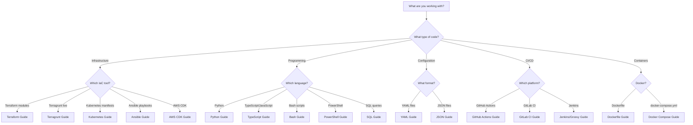
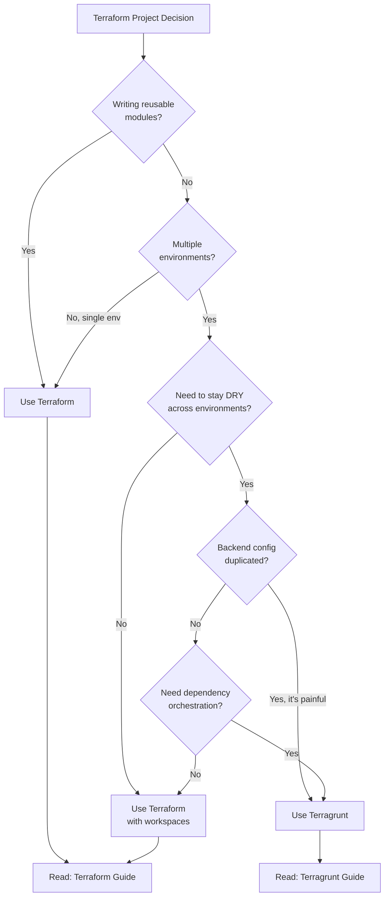
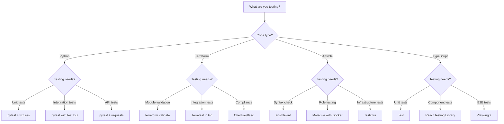
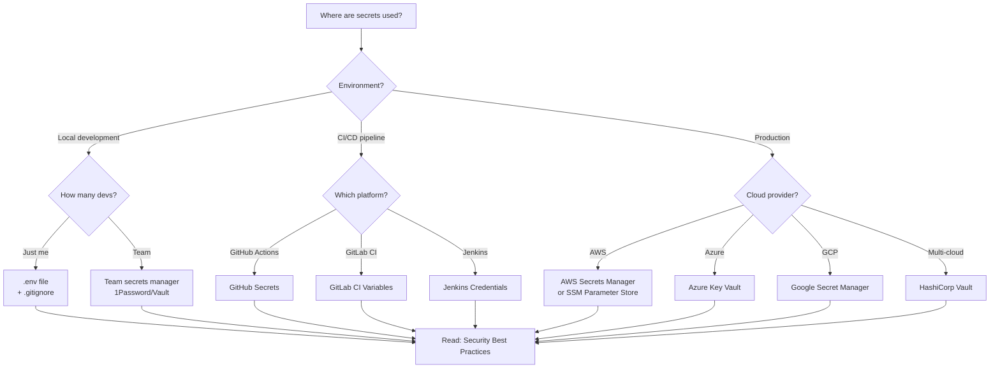
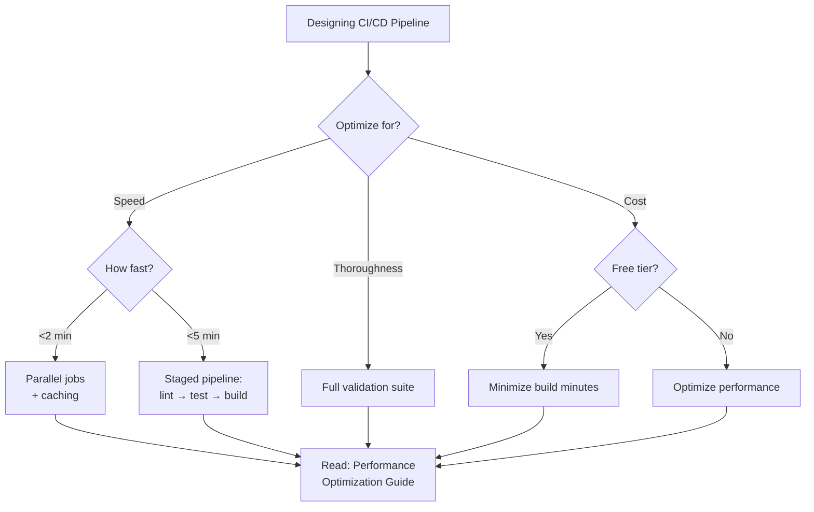
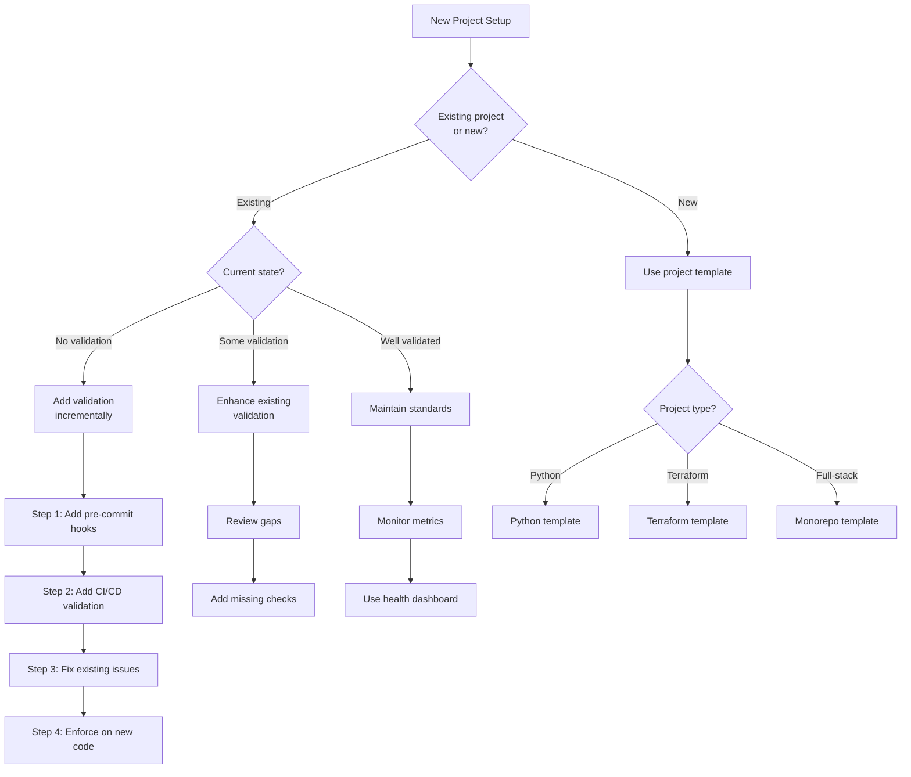

Need help finding the right guide or making a decision? Use these interactive
flowcharts to quickly navigate to the documentation you need.

## Quick Navigation

- [Which Language Guide Should I Use?](#which-language-guide-should-i-use)
- [Terraform vs Terragrunt: Which Should I Use?](#terraform-vs-terragrunt-which-should-i-use)
- [What Testing Strategy Should I Use?](#what-testing-strategy-should-i-use)
- [How Should I Handle Secrets?](#how-should-i-handle-secrets)
- [CI/CD Pipeline Design Decision](#cicd-pipeline-design-decision)
- [Project Setup Decision Tree](#project-setup-decision-tree)

---

## Which Language Guide Should I Use?

Use this flowchart to determine which language guide applies to your current work.

### Language Guide Resources

- [Terraform Style Guide](../02_language_guides/terraform.md)
- [Terragrunt Style Guide](../02_language_guides/terragrunt.md)
- [Python Style Guide](../02_language_guides/python.md)
- [TypeScript Style Guide](../02_language_guides/typescript.md)
- [Bash Style Guide](../02_language_guides/bash.md)
- [Comparison Matrix](../02_language_guides/comparison_matrix.md)

---

## Terraform vs Terragrunt: Which Should I Use?

Confused about when to use Terraform vs Terragrunt? This flowchart helps you
decide based on your project requirements.

### Key Principles

**Use Terraform when:**

- Writing reusable modules for shared infrastructure components
- Managing a single environment or simple multi-environment setup
- Backend configuration is minimal and not duplicated

**Use Terragrunt when:**

- Managing multiple environments (dev, staging, prod) with similar infrastructure
- Backend configuration is duplicated across environments
- You need dependency orchestration between infrastructure components
- DRY (Don't Repeat Yourself) is a priority

### IaC Resources

- [Terraform Style Guide](../02_language_guides/terraform.md)
- [Terragrunt Style Guide](../02_language_guides/terragrunt.md)
- [IaC Testing Standards](../05_ci_cd/iac_testing_standards.md)

---

## What Testing Strategy Should I Use?

Choose the right testing approach based on your language and testing requirements.

### Testing Best Practices

**Python:**

- Use `pytest` for all Python testing
- Structure tests with fixtures for reusability
- Use `pytest-cov` for coverage reporting
- Mock external dependencies with `pytest-mock`

**Terraform:**

- Always run `terraform validate` in CI/CD
- Use Terratest for integration testing real infrastructure
- Use Checkov or tfsec for security and compliance scanning
- Test modules in isolation before using in live environments

**Ansible:**

- Use `ansible-lint` for syntax and best practice checks
- Use Molecule for role testing with Docker containers
- Use Testinfra for infrastructure validation after deployment
- Test playbooks in a non-production environment first

**TypeScript:**

- Use Jest for unit and integration tests
- Use React Testing Library for component testing
- Use Playwright for E2E tests
- Maintain >80% code coverage for critical paths

### Testing Resources

- [IaC Testing Standards](../05_ci_cd/iac_testing_standards.md)
- [Testing Documentation Template](../04_templates/testing_docs_template.md)
- [Testing Strategies](../05_ci_cd/testing_strategies.md)

---

## How Should I Handle Secrets?

Determine the appropriate secrets management solution based on your environment.

### Secrets Management Best Practices

**Local Development:**

- **Individual developers:** Use `.env` files with `.gitignore` to prevent committing secrets
- **Team environments:** Use a shared secrets manager like 1Password, HashiCorp Vault, or AWS Secrets Manager

**CI/CD Pipelines:**

- **GitHub Actions:** Use GitHub Secrets (encrypted environment variables)
- **GitLab CI:** Use GitLab CI/CD Variables with masking enabled
- **Jenkins:** Use Jenkins Credentials Plugin with appropriate credential types

**Production:**

- **AWS:** AWS Secrets Manager for automatic rotation, SSM Parameter Store for simpler use cases
- **Azure:** Azure Key Vault with managed identities
- **GCP:** Google Secret Manager with service accounts
- **Multi-cloud:** HashiCorp Vault for centralized secrets management

### Never Do This

- Hardcode secrets in source code
- Commit `.env` files to version control
- Store secrets in CI/CD logs
- Use the same secrets across environments
- Share secrets via email or chat

### Security Resources

- [Security Best Practices](../01_overview/principles.md)
- [GitHub Actions Guide](../02_language_guides/github_actions.md)
- [Terraform Secrets Management](../02_language_guides/terraform.md)

---

## CI/CD Pipeline Design Decision

Optimize your CI/CD pipeline based on your primary constraint.

### Pipeline Optimization Strategies

**Speed Optimization (<2 minutes):**

- Run jobs in parallel (linting, testing, building)
- Use aggressive caching (dependencies, build artifacts)
- Only run affected tests (monorepo tools)
- Use matrix builds for multi-platform testing

**Speed Optimization (<5 minutes):**

- Use staged pipeline with fail-fast
- Stage 1: Lint and format checks
- Stage 2: Unit tests
- Stage 3: Integration tests and build

**Thoroughness:**

- Run full test suite on every commit
- Include security scanning, compliance checks
- Run E2E tests before deployment
- Generate comprehensive reports

**Cost Optimization (Free Tier):**

- Minimize build minutes (skip redundant builds)
- Use self-hosted runners for heavy workloads
- Cache aggressively
- Only run full suite on main branch

### CI/CD Resources

- [GitHub Actions Guide](../05_ci_cd/github_actions_guide.md)
- [GitLab CI Guide](../05_ci_cd/gitlab_ci_guide.md)
- [Jenkins Pipeline Guide](../05_ci_cd/jenkins_pipeline_guide.md)

---

## Project Setup Decision Tree

Determine the best approach for setting up validation in your project.

### Incremental Validation Strategy

**For Existing Projects with No Validation:**

1. **Add pre-commit hooks** - Start with formatting and basic linting
2. **Add CI/CD validation** - Run checks in pipeline (non-blocking initially)
3. **Fix existing issues** - Gradually address technical debt
4. **Enforce on new code** - Make checks blocking for new changes only

**For Projects with Some Validation:**

1. **Review current gaps** - Identify missing checks (security, testing, etc.)
2. **Add missing checks** - Incrementally add new validation
3. **Improve coverage** - Increase test coverage over time

**For Well-Validated Projects:**

1. **Monitor metrics** - Track code quality, coverage, build times
2. **Use health dashboard** - Visualize project health
3. **Continuous improvement** - Regularly review and update standards

### New Project Templates

**Python Project:**

- Pre-configured: pytest, black, flake8, mypy
- CI/CD with GitHub Actions
- Pre-commit hooks

**Terraform Project:**

- Module structure with examples
- Terratest for integration testing
- Validation and formatting in CI/CD

**Full-Stack Monorepo:**

- Turborepo or Nx for build orchestration
- Shared linting and formatting config
- Coordinated CI/CD across packages

### Project Setup Resources

- [IDE Settings Template](../04_templates/ide_settings_template.md)
- [Integration Guide](../07_integration/integration_prompt.md)
- [Pre-commit Hooks Guide](../05_ci_cd/precommit_hooks_guide.md)

---

## Additional Resources

### Quick Links

- [Comparison Matrix](../02_language_guides/comparison_matrix.md)
- [Terraform Module Template](../04_templates/terraform_module_template.md)
- [Python Package Example](../05_examples/python_package_example.md)
- [Principles and Governance](principles.md)

### Need More Help?

- [Getting Started Guide](getting_started.md)
- [Repository Structure](structure.md)
- [Glossary](../glossary.md)
- [Changelog](../changelog.md)

---

**Last Updated:** 2025-12-27
