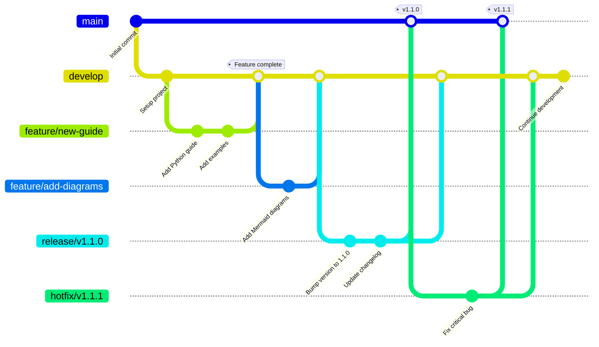

This document defines how the Dukes Engineering Style Guide is governed, including branching strategies, pull request
requirements, release processes, and change management procedures. These governance rules ensure consistent quality,
maintainability, and collaborative development.

## GitFlow Branching Model

This repository follows **GitFlow**, a strict branching model that separates development work from stable releases.



### Branch Types

#### Main Branch (`main`)

- **Purpose**: Production-ready code only
- **Protection**: Fully protected, no direct commits
- **Deployment**: Automatically deploys documentation to GitHub Pages
- **Merges**: Only from release branches or hotfix branches
- **Tags**: All releases tagged with semantic versions (e.g., `v1.2.0`)

**Protection Rules**:

- Require pull request reviews (minimum 1 approval)
- Require status checks to pass (CI, linting, tests)
- Require branches to be up to date before merging
- Require signed commits (optional but recommended)
- Restrict who can push (maintainers only)

#### Development Branch (`develop`)

- **Purpose**: Integration branch for ongoing development
- **Protection**: Protected, no direct commits
- **Merges**: Feature branches merge here first
- **Testing**: All features tested together before release
- **Stability**: Should always be in a deployable state

**Protection Rules**:

- Require pull request reviews
- Require status checks to pass
- Allow only maintainers to merge

#### Feature Branches (`feature/*`)

- **Purpose**: New features, enhancements, documentation additions
- **Created from**: `develop` (or `main` if no develop branch exists)
- **Merged to**: `develop` (or `main`)
- **Naming**: `feature/<issue-number>-<short-description>`
- **Lifetime**: Deleted after merge

**Examples**:

```bash
feature/13-expand-principles-doc
feature/add-powershell-guide
feature/improve-metadata-schema
```

**Workflow**:

```bash
## Create feature branch
git checkout develop
git pull origin develop
git checkout -b feature/13-expand-principles-doc

## Make changes, commit
git add .
git commit -m "feat: expand principles documentation"

## Push and create PR
git push -u origin feature/13-expand-principles-doc
gh pr create --base develop
```

#### Fix Branches (`fix/*`)

- **Purpose**: Bug fixes for non-critical issues
- **Created from**: `develop`
- **Merged to**: `develop`
- **Naming**: `fix/<issue-number>-<short-description>`

**Examples**:

```bash
fix/42-correct-typo-in-terraform-guide
fix/broken-mkdocs-link
```

#### Hotfix Branches (`hotfix/*`)

- **Purpose**: Critical bug fixes for production
- **Created from**: `main`
- **Merged to**: `main` AND `develop`
- **Naming**: `hotfix/<version>-<description>`
- **Urgency**: Bypass normal development cycle

**Examples**:

```bash
hotfix/v1.2.2-critical-security-fix
hotfix/v1.0.1-container-build-failure
```

**Workflow**:

```bash
## Create hotfix from main
git checkout main
git pull origin main
git checkout -b hotfix/v1.2.2-security-fix

## Fix the issue, commit
git add .
git commit -m "fix: critical security vulnerability in metadata parser"

## Merge to main
git checkout main
git merge --no-ff hotfix/v1.2.2-security-fix
git tag v1.2.2
git push origin main --tags

## Merge to develop
git checkout develop
git merge --no-ff hotfix/v1.2.2-security-fix
git push origin develop

## Delete hotfix branch
git branch -d hotfix/v1.2.2-security-fix
```

#### Release Branches (`release/*`)

- **Purpose**: Prepare new production release
- **Created from**: `develop`
- **Merged to**: `main` AND `develop`
- **Naming**: `release/v<version>`
- **Activities**: Version bumps, changelog updates, final testing

**Workflow**:

```bash
## Create release branch
git checkout develop
git pull origin develop
git checkout -b release/v1.3.0

## Update version, changelog
## Run final tests
## Fix any last-minute issues

## Merge to main
git checkout main
git merge --no-ff release/v1.3.0
git tag v1.3.0
git push origin main --tags

## Merge back to develop
git checkout develop
git merge --no-ff release/v1.3.0
git push origin develop

## Delete release branch
git branch -d release/v1.3.0
```

### Branch Naming Conventions

**Format**: `<type>/<scope>`

**Type Prefixes**:

- `feature/` - New features, enhancements
- `fix/` - Bug fixes
- `hotfix/` - Critical production fixes
- `release/` - Release preparation
- `docs/` - Documentation-only changes
- `chore/` - Maintenance, dependency updates

**Scope Guidelines**:

- Use issue number when applicable: `feature/42-add-sql-guide`
- Use kebab-case for descriptions: `feature/improve-error-handling`
- Keep concise (max 50 characters)

## Pull Request Process

All changes to `main` and `develop` branches must go through pull requests.

### PR Requirements

#### Required Checks

All PRs must pass these automated checks before merge:

1. **Linters**:
   - markdownlint (documentation)
   - yamllint (YAML files)
   - shellcheck (shell scripts)
   - Black, Flake8 (Python)
   - Prettier (TypeScript, JSON)

2. **Build Tests**:
   - MkDocs build (`mkdocs build --strict`)
   - Container build (Dockerfile validation)

3. **Pre-commit Hooks**:
   - Trailing whitespace removal
   - End-of-file fixes
   - Large file check
   - Merge conflict detection
   - Private key detection

4. **Metadata Validation**:
   - All documentation files have valid frontmatter
   - Metadata schema compliance

#### Code Review Requirements

- **Minimum Reviews**: 1 approval required
- **Review Focus**:
  - Accuracy of technical content
  - Consistency with existing style guide
  - Completeness of documentation
  - Grammar and clarity
  - Examples are correct and tested

#### PR Description Template

```markdown
## Summary
Brief description of changes

## Changes
- Bullet list of specific changes
- Include file changes, additions, deletions

## Testing
- [ ] MkDocs builds successfully
- [ ] Pre-commit hooks pass
- [ ] Manual testing performed (if applicable)

## Related Issues
Closes #<issue-number>
```

### PR Workflow

**1. Create Branch**:

```bash
git checkout -b feature/add-kubernetes-guide
```

**2. Make Changes & Commit**:

```bash
git add .
git commit -m "feat: add Kubernetes and Helm style guide"
```

**3. Push & Create PR**:

```bash
git push -u origin feature/add-kubernetes-guide
gh pr create --base main --title "feat: add Kubernetes guide" --body "..."
```

**4. Address Review Feedback**:

```bash
## Make requested changes
git add .
git commit -m "fix: address review feedback on Kubernetes guide"
git push
```

**5. Merge (after approval)**:

```bash
## Squash and merge via GitHub UI or CLI
gh pr merge 123 --squash --delete-branch
```

### Merge Strategies

**Squash Merge (Default)**:

- Combines all commits into one
- Keeps main branch history clean
- Use for feature branches

**Merge Commit**:

- Preserves all individual commits
- Use for release branches
- Use for hotfix branches

**Rebase (Not Recommended)**:

- Rewrites commit history
- Avoid to maintain traceability

## Release Management

### Versioning Strategy

This project follows **Semantic Versioning 2.0.0**:

**Format**: `MAJOR.MINOR.PATCH`

- **MAJOR**: Incompatible API changes, breaking changes to validation rules or container interface
- **MINOR**: New features, language guides, or significant documentation additions (backward-compatible)
- **PATCH**: Bug fixes, documentation improvements, dependency updates (backward-compatible)

**Examples**:

- `v1.0.0` → `v2.0.0`: Changed required metadata fields (breaking)
- `v1.0.0` → `v1.1.0`: Added PowerShell language guide (new feature)
- `v1.0.0` → `v1.0.1`: Fixed typo in Python guide (bug fix)

### Release Process

**1. Prepare Release Branch**:

```bash
git checkout develop
git pull origin develop
git checkout -b release/v1.3.0
```

**2. Update Version and Changelog**:

- Update version in `mkdocs.yml`, `pyproject.toml`
- Add release section to `docs/changelog.md`
- Update any version references in documentation

**3. Final Testing**:

```bash
## Build and test documentation
uv run mkdocs build --strict

## Run all pre-commit hooks
pre-commit run --all-files

## Test container build
docker build -t coding-style-guide:v1.3.0 .
```

**4. Create PR to Main**:

```bash
git push -u origin release/v1.3.0
gh pr create --base main --title "Release v1.3.0"
```

**5. Merge and Tag**:

```bash
## Merge PR (via GitHub UI or CLI)
gh pr merge <pr-number> --merge --delete-branch

## Tag the release
git checkout main
git pull origin main
git tag v1.3.0
git push origin v1.3.0
```

**6. Merge Back to Develop**:

```bash
git checkout develop
git merge main
git push origin develop
```

**7. Publish Release Notes**:

```bash
## Create GitHub Release
gh release create v1.3.0 --title "Release v1.3.0" --notes-file CHANGELOG.md
```

### Pre-release Versions

For testing before official release:

- **Release Candidates**: `v1.3.0-rc.1`, `v1.3.0-rc.2`
- **Beta**: `v1.3.0-beta.1`
- **Alpha**: `v1.3.0-alpha.1`

## Change Management

### Proposing Changes

**1. Create GitHub Issue**:

- Use issue templates (feature request, bug report, documentation)
- Clearly describe the problem or enhancement
- Provide examples and use cases

**2. Discussion**:

- Maintainers review and provide feedback
- Community members can comment and vote
- Decision made within 7 days for features, 48 hours for bugs

**3. Approval**:

- Issue labeled as `approved` or `wontfix`
- Assigned to milestone (if approved)

### Breaking Changes

**Definition**: Changes that require users to modify their code or workflows.

**Examples**:

- Removing or renaming metadata fields
- Changing validation rules that fail existing code
- Removing support for a language version

**Process**:

1. **Proposal**: Create RFC (Request for Comments) issue
2. **Discussion**: Minimum 14-day community feedback period
3. **Vote**: Maintainers vote on approval
4. **Deprecation**: Announce in changelog, provide migration guide
5. **Implementation**: MAJOR version bump required

### Deprecation Policy

**Timeline**:

- **Announce**: Deprecation announced in MINOR release
- **Warning Period**: Minimum 3 months (or 2 MINOR releases, whichever is longer)
- **Removal**: Removed in next MAJOR release

**Communication**:

- Changelog entry with deprecation notice
- Migration guide in documentation
- Warning messages in validation tools (if applicable)

## Access Control

### Repository Roles

**Maintainers** (Write Access):

- Approve and merge pull requests
- Create releases
- Manage issues and milestones
- Push to `develop` branch (via PR only)

**Contributors** (Read Access):

- Fork repository
- Create pull requests
- Comment on issues and PRs
- No direct push access

### Becoming a Maintainer

**Requirements**:

- Consistent, high-quality contributions (minimum 10 merged PRs)
- Deep understanding of style guide principles
- Active participation in reviews and discussions
- Demonstrated commitment to project goals

**Process**:

- Nominated by existing maintainer
- Approved by majority vote of maintainers
- Added to CODEOWNERS and granted write access

## Code of Conduct

All contributors must follow the [Code of Conduct](https://github.com/tydukes/coding-style-guide/blob/main/CODE_OF_CONDUCT.md):

- Be respectful and inclusive
- Assume good intent
- Focus on what's best for the community
- Accept constructive criticism gracefully
- Show empathy toward other community members

## Decision-Making Process

**Minor Decisions** (documentation fixes, dependency updates):

- Single maintainer approval sufficient
- Merged within 48 hours if no objections

**Major Decisions** (new language guides, breaking changes):

- Require 2+ maintainer approvals
- Minimum 7-day discussion period
- Majority vote of active maintainers

**Urgent Decisions** (security fixes, critical bugs):

- Single maintainer can expedite
- Post-facto review within 24 hours

## Continuous Improvement

This governance model evolves based on:

- **Team feedback**: Regular retrospectives on process effectiveness
- **Growth**: Adapt as contributor base and repository complexity grow
- **Best practices**: Incorporate learnings from other open-source projects

**Proposing Governance Changes**:

1. Open issue with `governance` label
2. Minimum 14-day discussion period
3. Requires 75% maintainer approval
4. Document change in this file and announce in changelog

## References

- [GitFlow Workflow](https://nvie.com/posts/a-successful-git-branching-model/)
- [Semantic Versioning](https://semver.org/spec/v2.0.0.html)
- [Conventional Commits](https://www.conventionalcommits.org/)
- [GitHub Flow](https://guides.github.com/introduction/flow/)
- [CONTRIBUTING.md](https://github.com/tydukes/coding-style-guide/blob/main/CONTRIBUTING.md)
