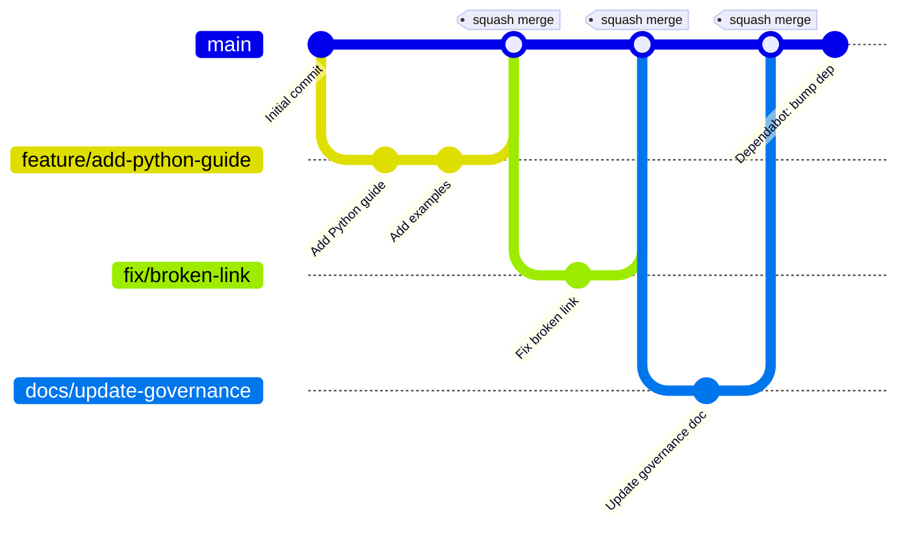

This document defines how the Dukes Engineering Style Guide is governed, including the branching
strategy, pull request requirements, release processes, and change management procedures.

## Branching Strategy

This repository uses a **simplified main-first workflow**: all changes flow through short-lived branches
directly into `main`. There is no long-lived `develop` branch.



### Branch Types

#### Main Branch (`main`)

- **Purpose**: Production-ready code and documentation at all times
- **Protection**: Fully protected, no direct commits
- **Deployment**: Automatically deploys documentation to GitHub Pages on every merge
- **Tags**: All releases tagged with semantic versions (e.g., `v1.8.0`)

**Protection rules:**

- Require pull request reviews (minimum 1 approval)
- Require status checks to pass (CI, linting, docs build)
- Require branches to be up to date before merging
- No force pushes

#### Feature Branches (`feature/*`)

- **Purpose**: New features, new language guides, significant additions
- **Created from**: `main`
- **Merged to**: `main` via squash merge
- **Naming**: `feature/<issue-number>-<short-description>` or `feature/<short-description>`
- **Lifetime**: Deleted after merge

```bash
# Create feature branch
git checkout main
git pull origin main
git checkout -b feature/42-add-sql-guide

# Make changes, commit using conventional commits
git add .
git commit -m "feat(docs): add SQL style guide with examples"

# Push and open PR against main
git push -u origin feature/42-add-sql-guide
gh pr create --base main --title "feat(docs): add SQL style guide"
```

#### Fix Branches (`fix/*`)

- **Purpose**: Bug fixes, broken links, incorrect content
- **Created from**: `main`
- **Merged to**: `main` via squash merge
- **Naming**: `fix/<issue-number>-<short-description>`

```bash
fix/350-resolve-broken-links
fix/correct-terraform-example
```

#### Documentation Branches (`docs/*`)

- **Purpose**: Documentation-only changes (no code changes)
- **Created from**: `main`
- **Merged to**: `main` via squash merge

```bash
docs/359-site-audit-overview-refresh
docs/update-getting-started
```

#### Maintenance Branches (`chore/*`)

- **Purpose**: Dependency updates, CI configuration, tooling changes
- **Created from**: `main`
- **Merged to**: `main` via squash merge

```bash
chore/bump-mkdocs-material
chore/update-pre-commit-hooks
```

### Branch Naming Conventions

**Format**: `<type>/<scope>`

| Type | Use for |
|------|---------|
| `feature/` | New features, guides, or significant additions |
| `fix/` | Bug fixes, broken links, incorrect content |
| `docs/` | Documentation-only changes |
| `chore/` | Maintenance, dependency updates, tooling |

**Scope guidelines:**

- Include issue number when applicable: `feature/42-add-sql-guide`
- Use kebab-case: `fix/improve-error-handling`
- Keep concise (max 50 characters)

---

## Pull Request Process

All changes to `main` must go through a pull request.

### Required Checks

All PRs must pass these automated checks before merge:

1. **Linters**:
   - `markdownlint` (documentation)
   - `yamllint` (YAML files)
   - `shellcheck` (shell scripts)
   - `black`, `flake8` (Python)

2. **Build tests**:
   - MkDocs build (`mkdocs build --strict`)

3. **Pre-commit hooks**:
   - Trailing whitespace, end-of-file fixes
   - Large file check, merge conflict detection
   - Private key detection

4. **Quality gates**:
   - Spell checker (blocks merge on errors)
   - Commit message lint (conventional commits required)

### Code Review Requirements

- **Minimum**: 1 approval required
- **Focus areas**: Technical accuracy, consistency with existing guide, completeness, grammar, correct examples

### PR Description Template

```markdown
## Summary
Brief description of changes

## Changes
- Specific change 1
- Specific change 2

## Testing
- [ ] MkDocs builds successfully (`mkdocs build --strict`)
- [ ] Pre-commit hooks pass (`pre-commit run --all-files`)

## Related Issues
Closes #<issue-number>
```

### PR Workflow

```bash
# 1. Create branch
git checkout -b feature/add-kubernetes-guide

# 2. Make changes and commit (conventional commits required)
git add .
git commit -m "feat(docs): add Kubernetes and Helm style guide"

# 3. Push and create PR targeting main
git push -u origin feature/add-kubernetes-guide
gh pr create --base main \
  --title "feat(docs): add Kubernetes guide" \
  --body "Closes #123"

# 4. Address review feedback
git add .
git commit -m "fix: address review feedback on Kubernetes guide"
git push

# 5. Merge (squash merge, auto-deletes branch)
gh pr merge 123 --squash --delete-branch
```

### Merge Strategy

**Squash merge** is the default for all branch types:

- Combines all commits on the branch into a single clean commit on `main`
- Keeps main branch history readable and linear
- The squash commit message should follow conventional commit format

### Auto-Merge

PRs from `dependabot[bot]` and `tydukes` are automatically merged after CI passes using squash strategy.

---

## Release Management

### Versioning Strategy

This project follows **Semantic Versioning 2.0.0** (`MAJOR.MINOR.PATCH`):

- **MAJOR**: Breaking changes to validation rules, container interface, or metadata schema
- **MINOR**: New language guides, features, or significant documentation additions (backward-compatible)
- **PATCH**: Bug fixes, documentation improvements, dependency updates (backward-compatible)

**Examples:**

- `v1.7.0` → `v2.0.0`: Changed required metadata fields (breaking)
- `v1.7.0` → `v1.8.0`: Added tutorial series and maturity model (new features)
- `v1.7.0` → `v1.7.1`: Fixed broken link in Python guide (bug fix)

### Automated Release Process (Preferred)

The project uses an **automated release workflow** that analyzes conventional commits to determine the
version bump:

```bash
# Trigger via GitHub Actions UI:
# Actions → Automated Release → Run workflow
# Select: auto (recommended), major, minor, or patch
```

**Version bump rules (from commit messages):**

- `BREAKING CHANGE` or `type!:` → MAJOR
- `feat:` → MINOR
- `fix:`, `docs:`, `chore:`, etc. → PATCH

### Manual Release (Emergency Only)

```bash
# If automated workflow fails
gh release create v1.9.0 \
  --title "v1.9.0 - Description" \
  --generate-notes
```

### Pre-release Versions

For testing before official release:

```bash
v1.9.0-rc.1   # Release candidate
v1.9.0-beta.1 # Beta
v1.9.0-alpha.1 # Alpha
```

---

## Change Management

### Proposing Changes

1. **Open a GitHub Issue** using the appropriate template
2. **Discussion**: Maintainers review within 7 days for features, 48 hours for bugs
3. **Approval**: Issue labeled `approved` or `wontfix`

### Breaking Changes

**Definition**: Changes requiring users to modify their code or workflows.

**Process:**

1. Create RFC (Request for Comments) issue
2. Minimum 14-day community feedback period
3. Maintainer vote on approval
4. Deprecation notice in changelog with migration guide
5. MAJOR version bump

### Deprecation Policy

| Stage | Timeline |
|-------|---------|
| Announce | In a MINOR release |
| Warning period | Minimum 3 months (or 2 MINOR releases) |
| Removal | Next MAJOR release |

---

## Access Control

### Repository Roles

**Maintainers** (write access):

- Approve and merge pull requests
- Create releases
- Manage issues and milestones

**Contributors** (read access):

- Fork repository and create pull requests
- Comment on issues and PRs
- No direct push access

### Becoming a Maintainer

- Consistent high-quality contributions (minimum 10 merged PRs)
- Active participation in reviews and discussions
- Nominated by existing maintainer, approved by majority vote

---

## Decision-Making Process

| Decision Type | Requirements |
|---|---|
| Minor (doc fixes, dependency updates) | Single maintainer approval, merged within 48 hours |
| Major (new language guides, breaking changes) | 2+ approvals, 7-day discussion period |
| Urgent (security fixes, critical bugs) | Single maintainer can expedite, post-facto review within 24 hours |

---

## Code of Conduct

All contributors must follow the
[Code of Conduct](https://github.com/tydukes/coding-style-guide/blob/main/CODE_OF_CONDUCT.md).

---

## References

- [Semantic Versioning](https://semver.org/spec/v2.0.0.html)
- [Conventional Commits](https://www.conventionalcommits.org/)
- [CONTRIBUTING.md](https://github.com/tydukes/coding-style-guide/blob/main/CONTRIBUTING.md)
