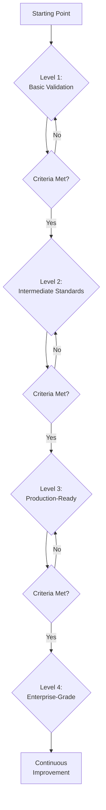

This guide defines a progressive enhancement roadmap that teams can follow to gradually improve their
code quality and validation practices. Each maturity level builds on the previous one with specific,
achievable goals and clear success criteria.

## Roadmap Overview



| Level | Name | Goal | Estimated Time |
|-------|------|------|----------------|
| 1 | Basic Validation | Get started with minimal validation | 1-2 weeks |
| 2 | Intermediate Standards | Enforce consistency across the codebase | 3-4 weeks |
| 3 | Production-Ready | Production-grade code quality and reliability | 6-8 weeks |
| 4 | Enterprise-Grade | Industry-leading standards and continuous improvement | 12+ weeks |

---

## Level 1: Basic Validation (Foundation)

**Goal**: Get started with minimal validation

**Estimated Time**: 1-2 weeks

### Level 1 Requirements

- Run validation once manually
- Fix critical formatting issues
- Add basic pre-commit hooks
- At least 1 language guide followed

### Quick Wins

- Auto-format Python with black
- Run shellcheck on bash scripts
- Add yamllint to CI

### Getting Started

#### Prerequisites

```bash
# Install pre-commit
pip install pre-commit

# Install uv (Python package manager)
curl -LsSf https://astral.sh/uv/install.sh | sh
```

#### Pre-commit Configuration

```yaml
# .pre-commit-config.yaml (Level 1)
repos:
  - repo: https://github.com/pre-commit/pre-commit-hooks
    rev: v5.0.0
    hooks:
      - id: trailing-whitespace
      - id: end-of-file-fixer
      - id: check-yaml
      - id: check-json
      - id: check-merge-conflict

  - repo: https://github.com/psf/black
    rev: 25.1.0
    hooks:
      - id: black

  - repo: https://github.com/shellcheck-py/shellcheck-py
    rev: v0.10.0.1
    hooks:
      - id: shellcheck
```

#### Install and Run

```bash
# Install hooks
pre-commit install

# Run against all files
pre-commit run --all-files
```

#### Quick Start with the Container

```bash
# Run validation without installing anything locally
docker run --rm -v $(pwd):/workspace \
  ghcr.io/tydukes/coding-style-guide:latest lint
```

### Level 1 Pitfalls

```text
Pitfall                          Solution
-------------------------------------------------------------------
Skipping pre-commit install      Add to onboarding documentation
Ignoring linter errors           Fix errors before committing
Not formatting before commit     Enable format-on-save in IDE
Running validation inconsistently Use pre-commit hooks for automation
```

### Level 1 Success Criteria

```markdown
- [ ] Validation runs locally before commits
- [ ] Team understands basic linting errors
- [ ] No more obvious formatting inconsistencies
- [ ] Pre-commit hooks installed in all developer environments
```

---

## Level 2: Intermediate Standards (Consistency)

**Goal**: Enforce consistency across the codebase

**Estimated Time**: 3-4 weeks

### Level 2 Requirements

- All Level 1 requirements met
- CI/CD validation on all PRs
- At least 3 language guides followed
- Documentation standards enforced
- Basic security checks (detect-private-key, check for hardcoded secrets)

### Added Validation

```yaml
# .pre-commit-config.yaml (Level 2 additions)
repos:
  # Everything from Level 1, plus:

  - repo: https://github.com/pre-commit/pre-commit-hooks
    rev: v5.0.0
    hooks:
      - id: trailing-whitespace
      - id: end-of-file-fixer
      - id: check-yaml
        args: ["--unsafe"]
      - id: check-json
      - id: check-added-large-files
        args: ["--maxkb=1000"]
      - id: check-merge-conflict
      - id: check-case-conflict
      - id: mixed-line-ending
      - id: detect-private-key

  - repo: https://github.com/psf/black
    rev: 25.1.0
    hooks:
      - id: black
        args: ["--line-length=100"]

  - repo: https://github.com/PyCQA/flake8
    rev: 7.1.2
    hooks:
      - id: flake8
        args: ["--max-line-length=100", "--extend-ignore=E203,W503"]

  - repo: https://github.com/adrienverge/yamllint
    rev: v1.37.0
    hooks:
      - id: yamllint
        args: ["-d", "{extends: default, rules: {line-length: {max: 120}}}"]

  - repo: https://github.com/igorshubovych/markdownlint-cli
    rev: v0.44.0
    hooks:
      - id: markdownlint
        args: ["--fix"]

  - repo: https://github.com/antonbabenko/pre-commit-terraform
    rev: v1.99.1
    hooks:
      - id: terraform_fmt
      - id: terraform_validate
```

### Level 2 CI/CD Pipeline

```yaml
# .github/workflows/ci.yml (Level 2)
name: CI

on:
  push:
    branches: [main]
  pull_request:
    branches: [main]

jobs:
  validate:
    runs-on: ubuntu-latest
    steps:
      - uses: actions/checkout@v4

      - name: Set up Python
        uses: actions/setup-python@v5
        with:
          python-version: "3.11"

      - name: Install pre-commit
        run: pip install pre-commit

      - name: Run pre-commit hooks
        run: pre-commit run --all-files

  docs:
    runs-on: ubuntu-latest
    needs: validate
    steps:
      - uses: actions/checkout@v4

      - name: Set up Python
        uses: actions/setup-python@v5
        with:
          python-version: "3.11"

      - name: Install dependencies
        run: pip install mkdocs-material

      - name: Build documentation
        run: mkdocs build --strict
```

### EditorConfig

```ini
# .editorconfig (Level 2)
root = true

[*]
indent_style = space
indent_size = 4
end_of_line = lf
charset = utf-8
trim_trailing_whitespace = true
insert_final_newline = true

[*.{yml,yaml}]
indent_size = 2

[*.{tf,tfvars}]
indent_size = 2

[*.md]
trim_trailing_whitespace = false

[Makefile]
indent_style = tab
```

### Level 2 Pitfalls

```text
Pitfall                          Solution
-------------------------------------------------------------------
CI not blocking merges           Set branch protection rules
Inconsistent IDE settings        Use .editorconfig and shared configs
Missing security checks          Add detect-private-key hook
Documentation drift              Enforce docs build in CI
```

### Level 2 Success Criteria

```markdown
- [ ] All PRs pass validation before merge
- [ ] Consistent formatting across all code
- [ ] Documentation is well-formatted and up-to-date
- [ ] No secrets in repository
- [ ] Branch protection rules enforced
- [ ] At least 3 language guides adopted
```

---

## Level 3: Production-Ready (Quality)

**Goal**: Production-grade code quality and reliability

**Estimated Time**: 6-8 weeks

### Level 3 Requirements

- All Level 2 requirements met
- Comprehensive test coverage (unit + integration)
- Security scanning (bandit, checkov, trivy)
- Performance testing for critical paths
- All applicable language guides followed
- CONTRACT.md for reusable modules
- Automated dependency updates

### Advanced Checks

```yaml
# Additional tools for Level 3
tools:
  type_checking:
    python: mypy --strict
    typescript: tsc --noEmit --strict

  complexity_analysis:
    python: radon cc --min C src/
    generic: lizard --CCN 15 src/

  test_coverage:
    python: pytest --cov=src --cov-report=xml --cov-fail-under=80
    typescript: jest --coverage --coverageThreshold='{"global":{"branches":80}}'

  security_scanning:
    python: bandit -r src/ -f json
    terraform: checkov -d infrastructure/
    containers: trivy image myapp:latest
    secrets: gitleaks detect --source .
```

### Level 3 CI/CD Pipeline

```yaml
# .github/workflows/ci.yml (Level 3)
name: CI

on:
  push:
    branches: [main]
  pull_request:
    branches: [main]

jobs:
  lint-and-format:
    runs-on: ubuntu-latest
    steps:
      - uses: actions/checkout@v4

      - name: Set up Python
        uses: actions/setup-python@v5
        with:
          python-version: "3.11"

      - name: Install pre-commit
        run: pip install pre-commit

      - name: Run all hooks
        run: pre-commit run --all-files

  test:
    runs-on: ubuntu-latest
    needs: lint-and-format
    steps:
      - uses: actions/checkout@v4

      - name: Set up Python
        uses: actions/setup-python@v5
        with:
          python-version: "3.11"

      - name: Install dependencies
        run: pip install -e ".[test]"

      - name: Run tests with coverage
        run: pytest --cov=src --cov-report=xml --cov-report=term

      - name: Upload coverage
        uses: codecov/codecov-action@v4
        with:
          file: coverage.xml

      - name: Enforce coverage threshold
        run: |
          coverage report --fail-under=80

  security-scan:
    runs-on: ubuntu-latest
    needs: lint-and-format
    steps:
      - uses: actions/checkout@v4

      - name: Run Bandit
        run: |
          pip install bandit
          bandit -r src/ -f json -o bandit-report.json

      - name: Run Trivy
        uses: aquasecurity/trivy-action@v0.34.1
        with:
          scan-type: fs
          security-checks: vuln,config

      - name: Run Gitleaks
        uses: gitleaks/gitleaks-action@v2
        env:
          GITHUB_TOKEN: ${{ secrets.GITHUB_TOKEN }}

  type-check:
    runs-on: ubuntu-latest
    needs: lint-and-format
    steps:
      - uses: actions/checkout@v4

      - name: Set up Python
        uses: actions/setup-python@v5
        with:
          python-version: "3.11"

      - name: Run mypy
        run: |
          pip install mypy
          mypy src/ --strict
```

### CONTRACT.md for Modules

```markdown
# CONTRACT.md

## Purpose

This module creates a VPC with public and private subnets.

## Guarantees

- **G1**: Creates exactly 1 VPC with DNS hostnames enabled
- **G2**: Creates N public subnets distributed across at least 2 AZs
- **G3**: Creates N private subnets with NAT gateway access
- **G4**: All security groups deny all inbound by default

## Inputs

| Name | Type | Required | Validation |
|------|------|----------|------------|
| vpc_cidr | string | yes | Must be valid CIDR, /16 to /24 |
| environment | string | yes | Must be: dev, staging, prod |
| az_count | number | no | Default: 2, min: 2, max: 4 |

## Test Mapping

| Guarantee | Test File | Test Function |
|-----------|-----------|---------------|
| G1 | test_vpc.go | TestVpcCreation |
| G2 | test_vpc.go | TestPublicSubnets |
| G3 | test_vpc.go | TestPrivateSubnets |
| G4 | test_vpc.go | TestSecurityGroups |
```

### Dependency Automation

```yaml
# .github/dependabot.yml (Level 3)
version: 2
updates:
  - package-ecosystem: pip
    directory: "/"
    schedule:
      interval: weekly
    labels:
      - "scope:dependencies"
      - "type:maintenance"

  - package-ecosystem: github-actions
    directory: "/"
    schedule:
      interval: weekly
    labels:
      - "scope:dependencies"
      - "scope:automation"

  - package-ecosystem: docker
    directory: "/"
    schedule:
      interval: weekly
    labels:
      - "scope:dependencies"
      - "scope:container"
```

### Level 3 Pitfalls

```text
Pitfall                          Solution
-------------------------------------------------------------------
Low test coverage                Set --cov-fail-under in CI
Ignoring security findings       Triage and track all findings
Missing CONTRACT.md              Add to PR checklist for new modules
Stale dependencies               Enable Dependabot with auto-merge
Flaky tests                      Quarantine and fix within 1 sprint
```

### Level 3 Success Criteria

```markdown
- [ ] Test coverage above 80%
- [ ] No high/critical security vulnerabilities
- [ ] All modules have CONTRACT.md
- [ ] Automated dependency updates working
- [ ] Performance benchmarks established
- [ ] Type checking enabled for Python and TypeScript
- [ ] All applicable language guides followed
```

---

## Level 4: Enterprise-Grade (Excellence)

**Goal**: Industry-leading standards and continuous improvement

**Estimated Time**: 12+ weeks (ongoing)

### Level 4 Requirements

- All Level 3 requirements met
- Custom validation rules for domain-specific patterns
- Automated compliance reporting (SOC 2, ISO 27001, etc.)
- Advanced monitoring and metrics
- Chaos engineering / resilience testing
- Multi-region / multi-cloud considerations
- Zero-trust security model
- Continuous improvement process

### Enterprise Features

```yaml
# Enterprise validation capabilities
enterprise:
  policy_as_code:
    - OPA (Open Policy Agent)
    - HashiCorp Sentinel
    - AWS Config Rules
    - Azure Policy

  observability:
    tracing: OpenTelemetry
    metrics: Prometheus + Grafana
    logs: ELK Stack or Loki
    dashboards: Grafana

  cost_optimization:
    - Infracost for IaC cost estimates
    - Cloud provider cost APIs
    - Budget alerts and thresholds
    - Right-sizing recommendations

  compliance:
    - SOC 2 Type II controls
    - ISO 27001 evidence collection
    - HIPAA safeguards (if applicable)
    - PCI DSS requirements (if applicable)
```

### Level 4 CI/CD Pipeline

```yaml
# .github/workflows/enterprise.yml (Level 4)
name: Enterprise Validation

on:
  push:
    branches: [main]
  pull_request:
    branches: [main]

jobs:
  compliance-check:
    runs-on: ubuntu-latest
    steps:
      - uses: actions/checkout@v4

      - name: Run OPA policy checks
        run: |
          opa eval --data policies/ --input input.json "data.main.deny"

      - name: Run Checkov compliance
        run: |
          checkov -d infrastructure/ \
            --framework terraform \
            --check CIS_AWS \
            --output json

      - name: Generate compliance report
        run: python scripts/generate_compliance_report.py

  performance-benchmarks:
    runs-on: ubuntu-latest
    steps:
      - uses: actions/checkout@v4

      - name: Run performance tests
        run: pytest tests/performance/ --benchmark-json=benchmark.json

      - name: Compare against baseline
        run: |
          python scripts/compare_benchmarks.py \
            --baseline benchmarks/baseline.json \
            --current benchmark.json \
            --threshold 10

  cost-analysis:
    runs-on: ubuntu-latest
    steps:
      - uses: actions/checkout@v4

      - name: Estimate infrastructure costs
        uses: infracost/actions/setup@v3

      - name: Generate cost breakdown
        run: |
          infracost breakdown \
            --path infrastructure/ \
            --format json \
            --out-file infracost.json

      - name: Post cost comment on PR
        if: github.event_name == 'pull_request'
        run: |
          infracost comment github \
            --path infracost.json \
            --repo ${{ github.repository }} \
            --pull-request ${{ github.event.pull_request.number }} \
            --github-token ${{ secrets.GITHUB_TOKEN }}

  chaos-testing:
    runs-on: ubuntu-latest
    if: github.ref == 'refs/heads/main'
    needs: [compliance-check, performance-benchmarks]
    steps:
      - uses: actions/checkout@v4

      - name: Run chaos experiments
        run: |
          chaos run experiments/network-latency.yaml
          chaos run experiments/service-failure.yaml

      - name: Verify recovery
        run: python scripts/verify_recovery.py
```

### Continuous Improvement Metrics

```yaml
# metrics.yml - Track improvement over time
metrics:
  code_quality:
    - name: test_coverage
      target: ">= 90%"
      frequency: per-commit

    - name: cyclomatic_complexity
      target: "<= 10 per function"
      frequency: per-commit

    - name: tech_debt_ratio
      target: "<= 5%"
      frequency: weekly

  security:
    - name: vulnerability_count
      target: "0 high/critical"
      frequency: daily

    - name: mean_time_to_remediate
      target: "<= 48 hours for critical"
      frequency: per-incident

    - name: dependency_freshness
      target: "all within 1 minor version"
      frequency: weekly

  operations:
    - name: deployment_frequency
      target: ">= 1 per day"
      frequency: weekly

    - name: change_failure_rate
      target: "<= 5%"
      frequency: monthly

    - name: mean_time_to_recovery
      target: "<= 1 hour"
      frequency: per-incident

  cost:
    - name: infrastructure_cost_delta
      target: "<= 5% month-over-month"
      frequency: monthly

    - name: cost_per_deployment
      target: "decreasing trend"
      frequency: monthly
```

### Level 4 Pitfalls

```text
Pitfall                          Solution
-------------------------------------------------------------------
Over-engineering compliance      Start with highest-risk areas first
Ignoring cost optimization       Set budget alerts from day one
No chaos testing runbooks        Document every experiment
Alert fatigue                    Tune thresholds, use escalation
Compliance drift                 Automate evidence collection
```

### Level 4 Success Criteria

```markdown
- [ ] Automated compliance reporting
- [ ] Performance SLAs tracked and met
- [ ] Cost optimization automated
- [ ] Continuous improvement metrics tracked
- [ ] Industry certifications achieved
- [ ] Chaos engineering experiments documented
- [ ] Zero-trust security model implemented
- [ ] Multi-region disaster recovery tested
```

---

## Self-Assessment Checklist

Use this checklist to determine your team's current maturity level and identify the next steps.

### Current Maturity Assessment

```markdown
### Level 1: Basic Validation
- [ ] Manual validation runs successfully
- [ ] Pre-commit hooks installed
- [ ] At least 1 language guide followed
- [ ] Critical formatting issues fixed
- [ ] Team understands basic linting errors

### Level 2: Intermediate Standards
- [ ] CI/CD validation on all PRs
- [ ] 3+ language guides followed
- [ ] Documentation standards enforced
- [ ] Basic security checks enabled
- [ ] Branch protection rules configured
- [ ] EditorConfig shared across team

### Level 3: Production-Ready
- [ ] Test coverage >= 80%
- [ ] Security scanning automated
- [ ] CONTRACT.md for all modules
- [ ] Dependency updates automated
- [ ] Type checking enabled
- [ ] Performance benchmarks established

### Level 4: Enterprise-Grade
- [ ] Compliance reporting automated
- [ ] Performance SLAs tracked
- [ ] Cost optimization enabled
- [ ] Continuous improvement metrics
- [ ] Chaos engineering practiced
- [ ] Disaster recovery tested

Your Current Level: ___
```

## Migration Between Levels

### Migrating from Level 1 to Level 2

```bash
# Step 1: Expand pre-commit hooks
cp .pre-commit-config.yaml .pre-commit-config.yaml.bak
# Update with Level 2 configuration above

# Step 2: Add CI pipeline
mkdir -p .github/workflows
# Create ci.yml with Level 2 configuration above

# Step 3: Add EditorConfig
# Create .editorconfig with Level 2 configuration above

# Step 4: Enable branch protection
gh api repos/{owner}/{repo}/branches/main/protection \
  --method PUT \
  --field required_status_checks='{"strict":true,"contexts":["validate"]}' \
  --field enforce_admins=true \
  --field required_pull_request_reviews='{"required_approving_review_count":1}'

# Step 5: Adopt additional language guides
# Review docs at https://tydukes.github.io/coding-style-guide/
# Select 2 more guides relevant to your stack
```

### Migrating from Level 2 to Level 3

```bash
# Step 1: Add test framework
pip install pytest pytest-cov

# Step 2: Create initial tests
mkdir -p tests/
# Write tests targeting 80% coverage

# Step 3: Add security scanning
pip install bandit
bandit -r src/ -f json -o bandit-report.json

# Step 4: Create CONTRACT.md for each module
# Use template from docs/04_templates/contract_template.md

# Step 5: Enable Dependabot
# Create .github/dependabot.yml with Level 3 configuration above

# Step 6: Add type checking
pip install mypy
mypy src/ --strict
```

### Migrating from Level 3 to Level 4

```bash
# Step 1: Set up policy-as-code
mkdir -p policies/
# Write OPA policies for your domain

# Step 2: Configure observability
# Set up OpenTelemetry, Prometheus, Grafana

# Step 3: Enable cost tracking
# Install and configure Infracost

# Step 4: Create chaos experiments
mkdir -p experiments/
# Define failure scenarios and recovery expectations

# Step 5: Implement compliance automation
# Map controls to automated checks
# Set up evidence collection pipeline

# Step 6: Define and track DORA metrics
# Deployment frequency, lead time, MTTR, change failure rate
```

## Recommended Training by Level

```text
Level   Topic                                Duration   Format
------  -----------------------------------  ---------  --------
1       Pre-commit hooks basics              1 hour     Workshop
1       IDE setup and configuration          30 min     Self-paced
2       CI/CD pipeline fundamentals          2 hours    Workshop
2       Documentation-as-code practices      1 hour     Self-paced
3       Test-driven development              4 hours    Workshop
3       Security scanning and remediation    2 hours    Workshop
3       Contract-based development           1 hour     Self-paced
4       Policy-as-code with OPA              4 hours    Workshop
4       Chaos engineering principles         2 hours    Workshop
4       DORA metrics and improvement         2 hours    Workshop
```

## References

- [Getting Started Guide](getting_started.md) - Initial setup and configuration
- [Pre-commit Hooks Guide](../05_ci_cd/precommit_hooks_guide.md) - Detailed hook configuration
- [Testing Strategies](../05_ci_cd/testing_strategies.md) - Comprehensive testing approaches
- [Security Scanning Guide](../05_ci_cd/security_scanning_guide.md) - Security tooling setup
- [CONTRACT.md Template](../04_templates/contract_template.md) - Module contract template
- [Chaos Engineering Guide](../05_ci_cd/chaos_engineering_guide.md) - Resilience testing
- [Observability Guide](../05_ci_cd/observability_guide.md) - Monitoring and metrics
- [IDE Integration Guide](../05_ci_cd/ide_integration_guide.md) - Editor configuration
