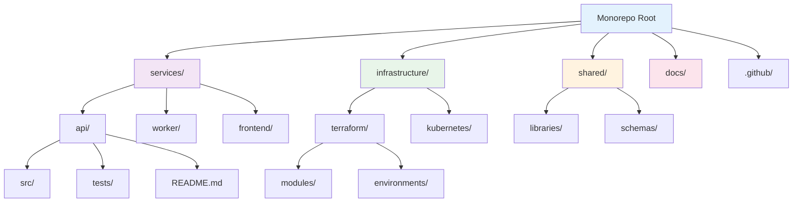
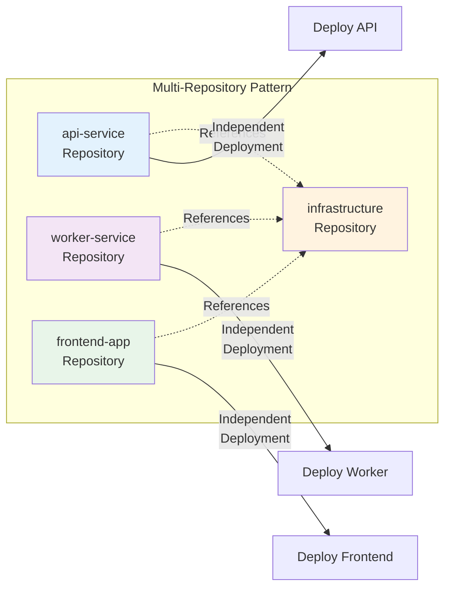

## This Style Guide's Structure (Monorepo)

This style guide itself is organized as a **monorepo** containing all language guides, templates, schemas, and tooling
in a single repository. This approach enables:

- **Centralized versioning**: All guides evolve together with unified semantic versioning
- **Shared tooling**: Validation scripts, CI/CD pipelines, and container images are reused
- **Consistency**: Cross-references between guides remain in-sync
- **Single source of truth**: Documentation portal builds from one repository

### Directory Layout

```text
coding-style-guide/
├── docs/                           # MkDocs documentation source
│   ├── 00_standards/              # Documentation standards
│   │   ├── code_block_language_tags.md
│   │   └── heading_structure.md
│   ├── 01_overview/               # Principles, governance, and structure
│   │   ├── getting_started.md     # Quickstart guide
│   │   ├── principles.md          # Core principles
│   │   ├── governance.md          # Branching strategy and versioning
│   │   ├── structure.md           # This file
│   │   ├── decision_trees.md      # Decision trees for common choices
│   │   └── maturity_model.md      # Progressive adoption roadmap
│   ├── 02_language_guides/        # Language-specific style guides (35+)
│   │   ├── python.md
│   │   ├── terraform.md
│   │   ├── bash.md
│   │   ├── typescript.md
│   │   └── ...
│   ├── 03_metadata_schema/        # Universal @module annotation schema
│   │   └── schema_reference.md
│   ├── 04_templates/              # Ready-to-use document templates
│   │   ├── README_template.md
│   │   ├── contract_template.md
│   │   └── ...
│   ├── 05_ci_cd/                  # CI/CD patterns and guides
│   │   ├── github_actions_guide.md
│   │   ├── testing_strategies.md
│   │   └── ...
│   ├── 05_examples/               # Full reference implementations
│   │   ├── python_package_example.md
│   │   └── ...
│   ├── 06_container/              # Container usage documentation
│   │   └── usage.md
│   ├── 07_integration/            # Integration guides
│   │   ├── integration_prompt.md
│   │   ├── ai_code_review.md
│   │   └── cli_tool.md
│   ├── 08_anti_patterns/          # Common anti-patterns and code smells
│   │   ├── index.md
│   │   └── code_smell_catalog.md
│   ├── 09_refactoring/            # Before/after refactoring examples
│   │   ├── index.md
│   │   └── ...
│   ├── 10_migration_guides/       # Migrating from other style guides
│   │   ├── from_pep8.md
│   │   ├── from_google.md
│   │   └── from_airbnb.md
│   ├── 11_cloud_providers/        # Cloud provider-specific guidance
│   │   ├── azure.md
│   │   └── gcp.md
│   ├── 12_tutorials/              # Hands-on step-by-step tutorials
│   │   ├── index.md
│   │   ├── python_project.md
│   │   ├── terraform_migration.md
│   │   ├── fullstack_app.md
│   │   ├── team_onboarding.md
│   │   └── manual_to_automated.md
│   ├── changelog.md               # Project changelog
│   ├── faq.md                     # Frequently asked questions
│   ├── glossary.md                # Terminology and definitions
│   ├── index.md                   # Documentation home
│   ├── project_status.md          # Health dashboard and metrics
│   └── topic_index.md             # Comprehensive topic index
├── .github/                        # GitHub workflows and actions
│   ├── workflows/                 # CI/CD workflows
│   │   ├── ci.yml                 # Main CI pipeline
│   │   ├── deploy.yml             # Documentation deployment
│   │   ├── container.yml          # Container build/publish
│   │   ├── release.yml            # Automated release
│   │   └── spell-checker.yml      # Spelling quality gate
│   └── actions/                   # Custom GitHub actions
│       └── validate/              # Validation action
├── scripts/                        # Validation and automation scripts
│   ├── validate_metadata.py       # Metadata validation
│   ├── analyze_code_ratio.py      # 3:1 code-to-text enforcement
│   ├── generate_changelog.py      # Changelog generation
│   └── ...
├── Dockerfile                      # Multi-stage container definition
├── docker-compose.yml             # Local development services
├── docker-entrypoint.sh           # Container entry point
├── mkdocs.yml                     # Documentation configuration
├── pyproject.toml                 # Python project config (version source of truth)
└── README.md                      # Repository overview
```

### Visual Repository Structure

```mermaid
graph TD
    Root[coding-style-guide/] --> Docs[docs/]
    Root --> GitHub[.github/]
    Root --> Scripts[scripts/]
    Root --> Config[Configuration Files]

    Docs --> Standards[00_standards/]
    Docs --> Overview[01_overview/]
    Docs --> Languages[02_language_guides/<br/>35+ guides]
    Docs --> Schema[03_metadata_schema/]
    Docs --> Templates[04_templates/]
    Docs --> CICD[05_ci_cd/]
    Docs --> Examples[05_examples/]
    Docs --> Container[06_container/]
    Docs --> Integration[07_integration/]
    Docs --> AntiPatterns[08_anti_patterns/]
    Docs --> Refactoring[09_refactoring/]
    Docs --> Migration[10_migration_guides/]
    Docs --> Cloud[11_cloud_providers/]
    Docs --> Tutorials[12_tutorials/]
    Docs --> TopLevel[index.md / faq.md<br/>glossary.md / topic_index.md]

    Overview --> GettingStarted[getting_started.md]
    Overview --> Principles[principles.md]
    Overview --> Governance[governance.md]
    Overview --> Structure[structure.md]
    Overview --> DecisionTrees[decision_trees.md]
    Overview --> Maturity[maturity_model.md]

    GitHub --> Workflows[workflows/]
    GitHub --> Actions[actions/]

    Config --> MkDocs[mkdocs.yml]
    Config --> PyProject[pyproject.toml]
    Config --> Docker[Dockerfile]

    style Root fill:#e3f2fd
    style Docs fill:#f3e5f5
    style GitHub fill:#e8f5e9
    style Scripts fill:#fff3e0
    style Config fill:#fce4ec
    style Migration fill:#e8f5e9
    style Cloud fill:#e8f5e9
    style Tutorials fill:#e8f5e9
```



### Why Monorepo for This Project?

The monorepo structure is ideal for this style guide because:

1. **Unified releases**: All guides release together with consistent versioning (`v1.0.0`)
2. **Cross-language consistency**: Python, Terraform, and Bash guides reference common metadata schemas
3. **Shared validation**: All languages use the same metadata validation scripts
4. **Simplified CI/CD**: One pipeline validates all content
5. **Single documentation site**: MkDocs builds all guides into one portal

## Recommended Repository Structures

When implementing these standards in your projects, choose the organizational pattern that fits your team and project needs.

### Pattern 1: Monorepo (Recommended for Multi-Service Projects)

**Use when:**

- Managing multiple related services (microservices)
- Sharing common libraries or infrastructure code
- Team needs atomic cross-service changes
- Unified deployment pipelines are valuable

**Structure:**

```text
project-name/
├── services/
│   ├── api/
│   │   ├── src/
│   │   ├── tests/
│   │   ├── README.md
│   │   └── pyproject.toml
│   ├── worker/
│   │   ├── src/
│   │   ├── tests/
│   │   └── README.md
│   └── frontend/
│       ├── src/
│       ├── tests/
│       └── package.json
├── infrastructure/
│   ├── terraform/
│   │   ├── modules/
│   │   └── environments/
│   └── kubernetes/
│       ├── base/
│       └── overlays/
├── shared/
│   ├── libraries/
│   └── schemas/
├── docs/
│   ├── architecture/
│   ├── runbooks/
│   └── index.md
├── .github/
│   └── workflows/
├── Makefile
└── README.md
```

**Visual Structure:**



**Benefits:**

- Atomic commits across services
- Shared dependency management
- Single source of truth
- Easier refactoring

**Trade-offs:**

- Larger repository size
- CI/CD must handle selective builds
- Access control is all-or-nothing

### Pattern 2: Multi-Repo (Recommended for Independent Services)

**Use when:**

- Services are independently deployed
- Different teams own different services
- Fine-grained access control needed
- Services have different release cadences

**Structure (per repository):**

```text
service-name/
├── src/
│   ├── main/
│   └── test/
├── docs/
│   ├── api/
│   ├── deployment/
│   └── README.md
├── infrastructure/
│   └── terraform/
├── .github/
│   └── workflows/
├── scripts/
├── Dockerfile
├── Makefile
└── README.md
```

**Visual Comparison:**



**Benefits:**

- Clear ownership boundaries
- Independent release cycles
- Smaller, focused repositories
- Granular access control

**Trade-offs:**

- Cross-service changes require multiple PRs
- Dependency version mismatches possible
- Duplicated CI/CD configuration

### Pattern 3: Hybrid (Infrastructure Monorepo + Service Multi-Repo)

**Use when:**

- Infrastructure is shared across services
- Services are independently owned
- Centralized infrastructure governance needed

**Infrastructure Repository:**

```text
infrastructure/
├── terraform/
│   ├── modules/
│   │   ├── networking/
│   │   ├── compute/
│   │   └── database/
│   └── environments/
│       ├── dev/
│       ├── staging/
│       └── prod/
├── kubernetes/
│   ├── clusters/
│   └── shared-manifests/
├── ansible/
│   └── playbooks/
├── docs/
└── README.md
```

**Service Repositories:**

- Each service in its own repository
- Services reference infrastructure modules via Git tags
- Terraform modules versioned and published

**Benefits:**

- Centralized infrastructure governance
- Service independence
- Reusable infrastructure modules

**Trade-offs:**

- Coordination needed for infrastructure changes
- Module versioning overhead

## Directory Standards

Regardless of organizational pattern, follow these directory conventions:

### Required Top-Level Directories

```text
project/
├── src/           # Source code (or services/ for monorepo)
├── tests/         # Tests (mirror src/ structure)
├── docs/          # Documentation (MkDocs recommended)
├── scripts/       # Automation scripts
└── infrastructure/ # IaC code (Terraform, K8s manifests)
```

### Optional Directories

```text
├── .github/       # GitHub-specific (workflows, CODEOWNERS)
├── templates/     # Project templates
├── examples/      # Usage examples
├── tools/         # Development tools
└── config/        # Configuration files
```

### Naming Conventions

- **Lowercase with hyphens**: `my-service/`, `api-gateway/`
- **Descriptive names**: `user-authentication-service/` not `service-1/`
- **Consistent plurals**: `services/`, `modules/`, `scripts/`

## File Organization Best Practices

### 1. Colocate Related Files

Keep related files together:

```text
src/
└── user-authentication/
    ├── service.py          # Core implementation
    ├── service_test.py     # Tests
    ├── README.md           # Module documentation
    └── schema.json         # Data schema
```

### 2. Separate Source from Configuration

```text
project/
├── src/                    # Application code
├── config/                 # Configuration files
│   ├── development.yaml
│   ├── staging.yaml
│   └── production.yaml
└── infrastructure/         # Infrastructure as Code
```

### 3. Use Clear Test Directories

**Option A: Mirrored Structure** (Recommended for Python, TypeScript)

```text
src/
├── api/
│   ├── users.py
│   └── posts.py
tests/
├── api/
│   ├── test_users.py
│   └── test_posts.py
```

**Option B: Colocated Tests** (Recommended for Go, Rust)

```text
src/
├── api/
│   ├── users.go
│   ├── users_test.go
│   ├── posts.go
│   └── posts_test.go
```

### 4. Documentation Structure

Use MkDocs-compatible structure:

```text
docs/
├── index.md               # Home page
├── getting-started/
│   ├── installation.md
│   └── quickstart.md
├── guides/
│   ├── deployment.md
│   └── configuration.md
├── api/
│   └── reference.md
└── architecture/
    ├── overview.md
    └── decisions/         # ADRs (Architecture Decision Records)
```

## Infrastructure as Code Organization

### Terraform/Terragrunt

```text
infrastructure/
├── terraform/
│   ├── modules/           # Reusable modules
│   │   ├── vpc/
│   │   ├── ecs-service/
│   │   └── rds/
│   └── environments/      # Environment-specific configs
│       ├── dev/
│       │   ├── terragrunt.hcl
│       │   └── terraform.tfvars
│       ├── staging/
│       └── prod/
└── docs/
    └── infrastructure.md
```

### Kubernetes

```text
infrastructure/
├── kubernetes/
│   ├── base/              # Kustomize base
│   │   ├── deployment.yaml
│   │   └── service.yaml
│   └── overlays/          # Environment overlays
│       ├── dev/
│       ├── staging/
│       └── prod/
└── helm/                  # Helm charts
    └── app-chart/
```

## CI/CD Organization

### GitHub Actions

```text
.github/
├── workflows/
│   ├── ci.yml             # Continuous integration
│   ├── cd-dev.yml         # Deploy to dev
│   ├── cd-prod.yml        # Deploy to production
│   └── validate.yml       # Pre-commit validation
├── actions/               # Custom actions
│   └── validate-style/
└── CODEOWNERS            # Code ownership
```

### GitLab CI

```text
.gitlab/
├── ci/
│   ├── lint.yml
│   ├── test.yml
│   └── deploy.yml
└── .gitlab-ci.yml         # Main pipeline config
```

## Version Control Patterns

### Branch Structure (GitFlow)

```text
main                       # Production-ready code
├── develop                # Integration branch
├── feature/               # Feature branches
│   ├── add-user-auth
│   └── improve-logging
├── fix/                   # Bug fix branches
│   └── fix-login-error
└── release/               # Release preparation
    └── v1.2.0
```

### Tagging Convention

- **Releases**: `v1.0.0`, `v1.1.0`, `v2.0.0` (semantic versioning)
- **Pre-releases**: `v1.0.0-rc.1`, `v1.0.0-beta.2`
- **Module versions**: `terraform/vpc/v1.0.0`

## Makefile Organization

Centralize common tasks in a `Makefile`:

```makefile
.PHONY: help lint test build deploy clean

help:
 @echo "Available targets:"
 @echo "  lint      - Run linters"
 @echo "  test      - Run tests"
 @echo "  build     - Build container"
 @echo "  deploy    - Deploy to environment"

lint:
 @pre-commit run --all-files

test:
 @pytest tests/

build:
 @docker build -t myapp:latest .

deploy:
 @./scripts/deploy.sh $(ENV)
```

## Migration Strategies

### From Multi-Repo to Monorepo

1. Create new monorepo structure
2. Import each repository as subdirectory preserving history:

   ```bash
   git subtree add --prefix services/api api-repo main
   ```

3. Update CI/CD for monorepo patterns (selective builds)
4. Migrate documentation to unified MkDocs

### From Monorepo to Multi-Repo

1. Extract each service with history:

   ```bash
   git subtree split --prefix services/api -b api-split
   ```

2. Create new repository from split branch
3. Update cross-repo references to use Git tags
4. Set up cross-repo CI/CD coordination

## Examples and Templates

The style guide provides examples and templates under:

- **Templates**: `docs/04_templates/` — README, Terraform, Helm, Dockerfile, ADR, and more
- **Examples**: `docs/05_examples/` — Python package, Flask API, Terraform module, React app, monorepo
- **Tutorials**: `docs/12_tutorials/` — Hands-on step-by-step guides for common scenarios

## References

- [Monorepo vs Multi-Repo Patterns](https://en.wikipedia.org/wiki/Monorepo)
- [MkDocs Material Documentation](https://squidfunk.github.io/mkdocs-material/)
- [GitFlow Workflow](https://nvie.com/posts/a-successful-git-branching-model/)
- [Semantic Versioning](https://semver.org/)
