## Language Overview

**Diagram as Code** is an approach to creating technical diagrams using text-based declarative languages rather than
graphical tools. This enables version control, collaboration through code reviews, automation in CI/CD pipelines, and
consistency across documentation.

### Key Characteristics

- **Paradigm**: Declarative, text-based diagram definition
- **Typing**: Schema-based validation (tool-specific)
- **Runtime**: Various (JavaScript, Java, Python, Go-based renderers)
- **Primary Use Cases**:
  - Architecture documentation (AWS, Azure, GCP, Kubernetes)
  - Sequence and flow diagrams for API documentation
  - Entity-relationship diagrams for database schemas
  - CI/CD pipeline visualization
  - Infrastructure topology mapping
  - C4 model software architecture

### This Style Guide Covers

- Mermaid (flowcharts, sequence diagrams, ER diagrams)
- PlantUML (UML diagrams, deployment diagrams)
- Python Diagrams library (cloud architecture)
- D2 (modern declarative diagrams)
- Graphviz/DOT (dependency graphs, state machines)
- Structurizr DSL (C4 model architecture)

## Tool Comparison Matrix

| Feature | Mermaid | PlantUML | Python Diagrams | D2 | Graphviz | Structurizr |
|---------|---------|----------|-----------------|----|---------:|-------------|
| **Rendering** | Browser/JS | Java/Server | Python/Graphviz | Go CLI | C CLI | Cloud/CLI |
| **GitHub Native** | ✅ Yes | ❌ No | ❌ No | ❌ No | ❌ No | ❌ No |
| **GitLab Native** | ✅ Yes | ✅ Yes | ❌ No | ❌ No | ❌ No | ❌ No |
| **MkDocs Support** | ✅ Yes | ✅ Plugin | ❌ No | ❌ No | ❌ No | ❌ No |
| **Cloud Icons** | ❌ Limited | ✅ Yes | ✅ Excellent | ✅ Yes | ❌ No | ❌ No |
| **C4 Model** | ✅ Yes | ✅ Yes | ❌ No | ❌ No | ❌ No | ✅ Native |
| **Learning Curve** | Low | Medium | Medium | Low | High | Medium |
| **Best For** | Docs | UML | Cloud Arch | Modern | Graphs | C4 |

## Quick Reference

| **Category** | **Convention** | **Example** | **Notes** |
|-------------|----------------|-------------|-----------|
| **File Naming** | | | |
| Mermaid | `kebab-case.mmd` | `user-flow.mmd` | Or inline in Markdown |
| PlantUML | `kebab-case.puml` | `deployment-diagram.puml` | Also `.plantuml`, `.pu` |
| Python Diagrams | `snake_case.py` | `aws_architecture.py` | Standard Python naming |
| D2 | `kebab-case.d2` | `service-mesh.d2` | |
| Graphviz | `kebab-case.dot` | `dependency-graph.dot` | Also `.gv` |
| Structurizr | `kebab-case.dsl` | `system-context.dsl` | |
| **Node Naming** | | | |
| Short IDs | `lowercase` | `db`, `api`, `web` | Graph node identifiers |
| Display Labels | `Title Case` | `"Web Server"` | Human-readable labels |
| **Direction** | | | |
| Left-to-Right | `LR` / `direction: right` | Architecture flows | Default for system diagrams |
| Top-to-Bottom | `TB` / `direction: down` | Hierarchies, flows | Default for org charts |
| **Colors** | | | |
| Success/Healthy | `#28a745` / `green` | Active services | |
| Warning | `#ffc107` / `yellow` | Degraded services | |
| Error/Critical | `#dc3545` / `red` | Failed services | |
| Info/Neutral | `#007bff` / `blue` | Informational | |
| **Line Length** | | | |
| Labels | Max 40 chars | `"Process payment"` | Wrap longer text |
| Node Names | Max 30 chars | `"Authentication Service"` | Use abbreviations if needed |

---

## Mermaid

### Overview

Mermaid is a JavaScript-based diagramming tool that renders diagrams from text definitions. It has native support in
GitHub, GitLab, and MkDocs, making it ideal for documentation that lives alongside code.

### Supported Diagram Types

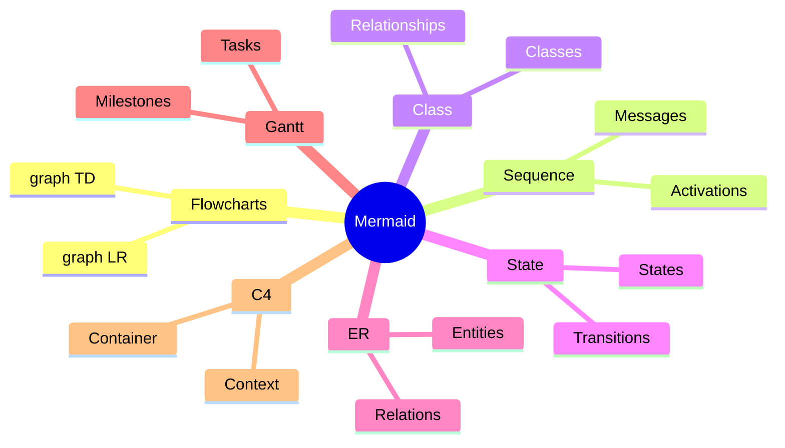

### Naming Conventions

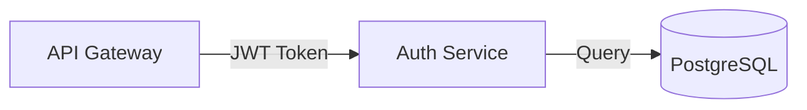

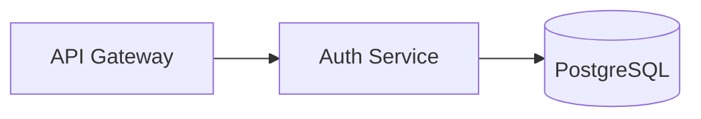

### Direction Standards

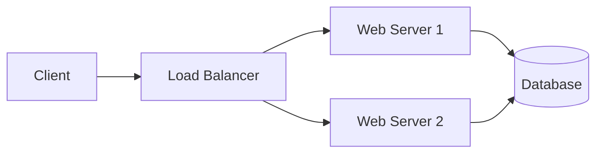

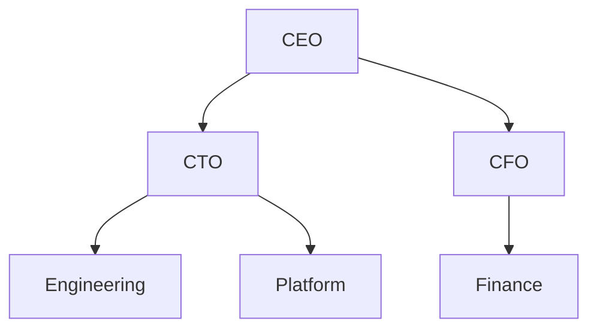

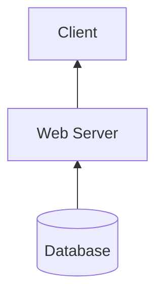

### Flowchart Patterns

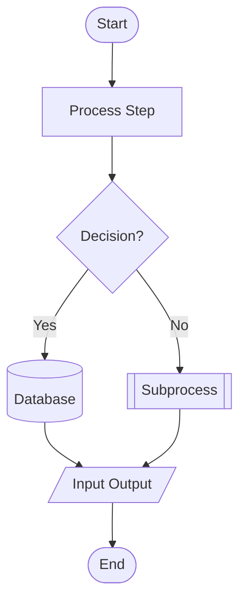

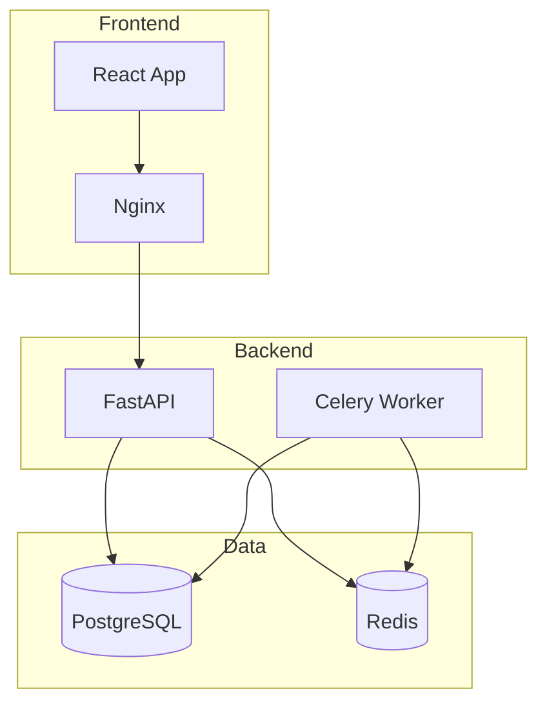

### Sequence Diagram Standards

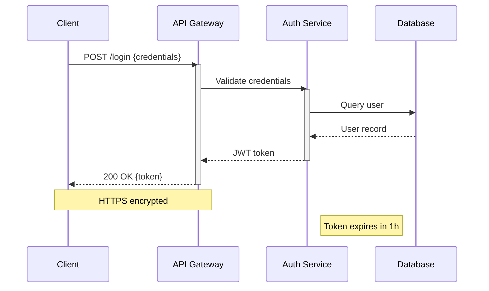

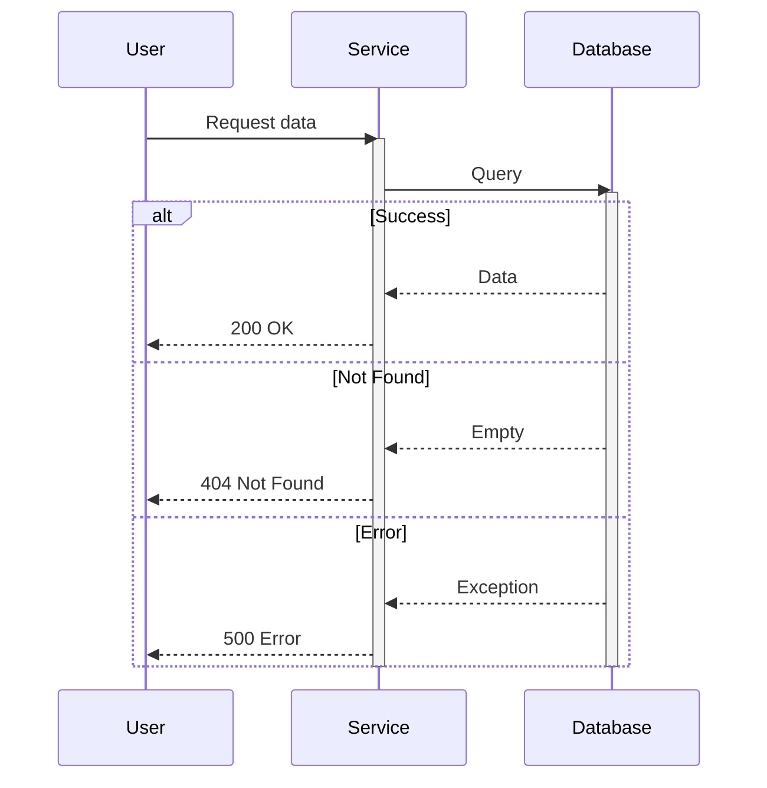

### Entity-Relationship Diagrams

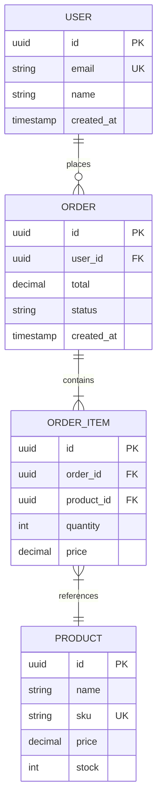

### C4 Diagrams in Mermaid

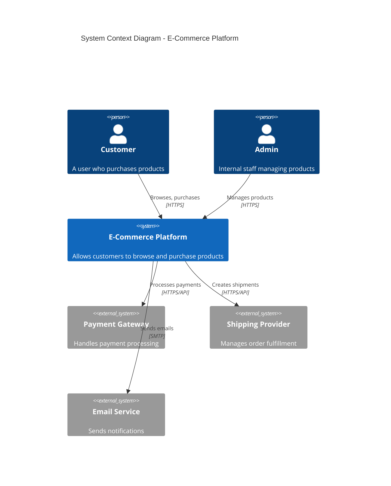

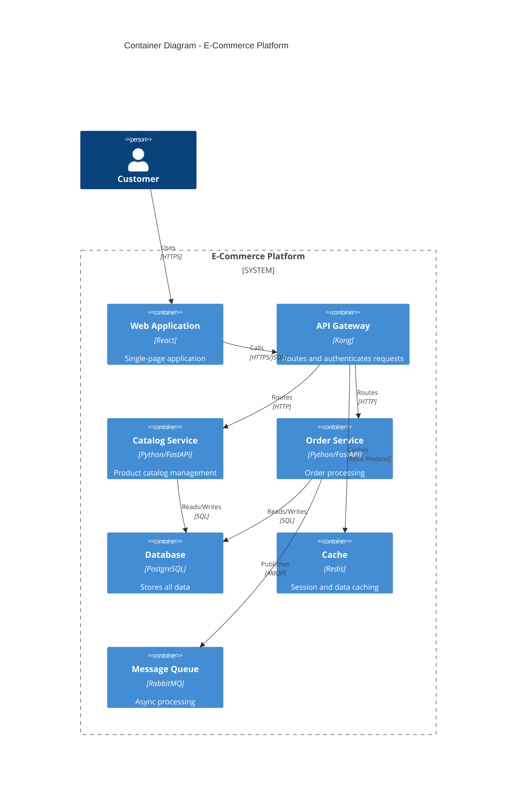

### Gantt Charts

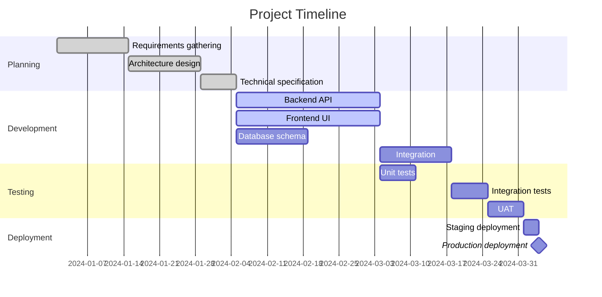

### Styling Guidelines

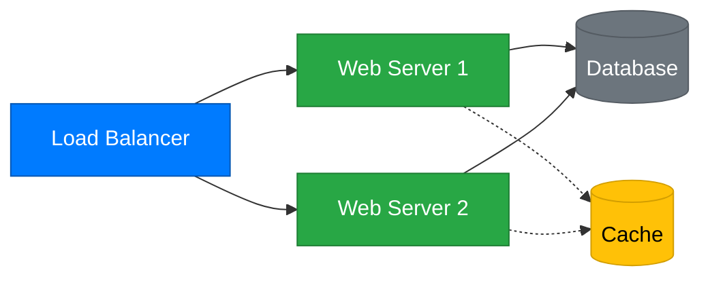

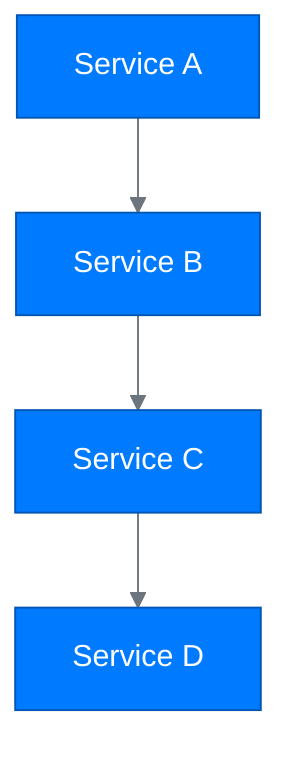

### Complexity Limits

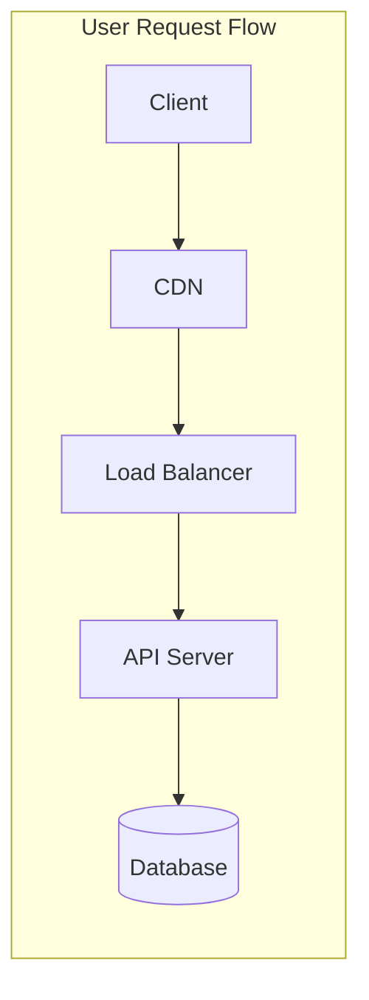

```text
## Bad: Overly complex diagram (avoid this)
## - More than 15-20 nodes becomes hard to read
## - Multiple crossing lines create visual noise
## - Too many subgraphs obscure the main message

## Instead:
## - Split into multiple focused diagrams
## - Use different C4 levels (Context, Container, Component)
## - Link diagrams together in documentation
```

### Mermaid Configuration

```yaml
# mkdocs.yml - Enable Mermaid support
markdown_extensions:
  - pymdownx.superfences:
      custom_fences:
        - name: mermaid
          class: mermaid
          format: !!python/name:pymdownx.superfences.fence_code_format
```

```json
{
  "mermaid.theme": "default",
  "mermaid.backgroundColor": "transparent",
  "mermaid.maxTextSize": 50000
}
```

---

## PlantUML

### PlantUML Overview

PlantUML is a Java-based tool that creates UML diagrams from text descriptions. It excels at detailed UML diagrams,
deployment diagrams, and has extensive icon libraries for cloud architecture.

### PlantUML Diagram Types

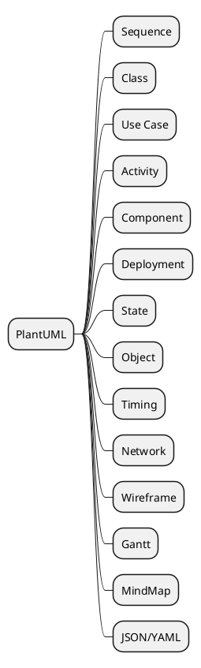

### PlantUML Naming Conventions

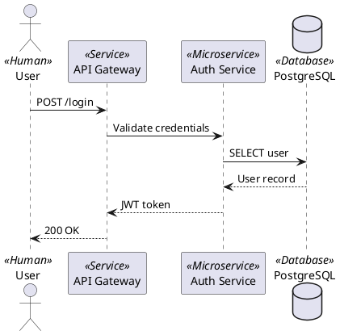

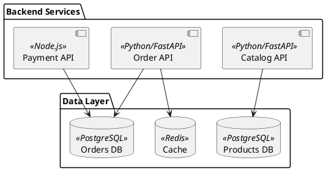

### Sequence Diagrams

```plantuml
@startuml
title Order Processing Sequence

' Participants with clear naming
actor Customer
participant "Web App" as web
participant "API Gateway" as gateway
participant "Order Service" as order
participant "Inventory Service" as inventory
participant "Payment Service" as payment
queue "Message Queue" as queue
database "Database" as db

' Main flow
Customer -> web: Place order
activate web

web -> gateway: POST /orders
activate gateway

gateway -> order: Create order
activate order

' Parallel processing
order -> inventory: Check stock
activate inventory
inventory --> order: Stock available
deactivate inventory

order -> payment: Process payment
activate payment
payment --> order: Payment confirmed
deactivate payment

' Async notification
order ->> queue: Publish OrderCreated
order --> gateway: Order confirmed
deactivate order

gateway --> web: 201 Created
deactivate gateway

web --> Customer: Order confirmation
deactivate web

' Background processing
queue -> inventory: Reserve stock
queue -> payment: Capture payment

note right of queue
  Async processing
  ensures reliability
end note
@enduml
```

### Class Diagrams

```plantuml
@startuml
' Good: Clean class diagram with relationships
skinparam classAttributeIconSize 0

abstract class BaseModel {
    +id: UUID
    +created_at: datetime
    +updated_at: datetime
    --
    +save(): void
    +delete(): void
}

class User extends BaseModel {
    +email: str
    +name: str
    +password_hash: str
    --
    +verify_password(password: str): bool
    +generate_token(): str
}

class Order extends BaseModel {
    +user_id: UUID
    +status: OrderStatus
    +total: Decimal
    --
    +add_item(product: Product, qty: int): void
    +calculate_total(): Decimal
    +submit(): void
}

class OrderItem {
    +order_id: UUID
    +product_id: UUID
    +quantity: int
    +price: Decimal
}

class Product extends BaseModel {
    +name: str
    +sku: str
    +price: Decimal
    +stock: int
    --
    +reserve(qty: int): bool
    +release(qty: int): void
}

enum OrderStatus {
    PENDING
    CONFIRMED
    SHIPPED
    DELIVERED
    CANCELLED
}

User "1" -- "0..*" Order: places >
Order "1" *-- "1..*" OrderItem: contains
OrderItem "0..*" -- "1" Product: references >
Order -- OrderStatus
@enduml
```

### Deployment Diagrams

```plantuml
@startuml
!include <awslib/AWSCommon>
!include <awslib/AWSSimplified>
!include <awslib/Compute/EC2>
!include <awslib/Compute/Lambda>
!include <awslib/Database/RDS>
!include <awslib/Database/ElastiCache>
!include <awslib/NetworkingContentDelivery/CloudFront>
!include <awslib/NetworkingContentDelivery/ELB>
!include <awslib/Storage/S3>

title AWS Production Architecture

CloudFront(cdn, "CloudFront CDN", "Content delivery")
S3(static, "S3 Static Assets", "Web assets")

package "VPC - Production" {
    ELB(alb, "Application Load Balancer", "HTTPS termination")

    package "Public Subnets" {
        EC2(bastion, "Bastion Host", "SSH access")
    }

    package "Private Subnets - App Tier" {
        EC2(app1, "App Server 1", "t3.medium")
        EC2(app2, "App Server 2", "t3.medium")
    }

    package "Private Subnets - Data Tier" {
        RDS(db, "PostgreSQL", "db.r5.large")
        ElastiCache(cache, "Redis Cluster", "cache.r5.large")
    }
}

Lambda(processor, "Event Processor", "Async tasks")

cdn --> static
cdn --> alb
alb --> app1
alb --> app2
app1 --> db
app2 --> db
app1 --> cache
app2 --> cache
app1 --> processor
@enduml
```

### Component Diagrams

```plantuml
@startuml
title Microservices Architecture

package "API Layer" {
    [API Gateway] as gateway
    [GraphQL Server] as graphql
}

package "Core Services" {
    [User Service] as user <<gRPC>>
    [Product Service] as product <<gRPC>>
    [Order Service] as order <<gRPC>>
    [Payment Service] as payment <<gRPC>>
}

package "Infrastructure" {
    [Service Mesh] as mesh <<Istio>>
    queue "Event Bus" as events <<Kafka>>
    [Config Server] as config <<Consul>>
}

package "Data Stores" {
    database "User DB" as userdb <<PostgreSQL>>
    database "Product DB" as productdb <<PostgreSQL>>
    database "Order DB" as orderdb <<PostgreSQL>>
    database "Cache" as cache <<Redis>>
}

gateway --> mesh
graphql --> mesh
mesh --> user
mesh --> product
mesh --> order
mesh --> payment

user --> userdb
product --> productdb
order --> orderdb
payment --> events

user --> config
product --> config
order --> config

user --> cache
product --> cache
@enduml
```

### PlantUML Styling

```plantuml
@startuml
' Consistent color palette
!define PRIMARY_COLOR #007bff
!define SUCCESS_COLOR #28a745
!define WARNING_COLOR #ffc107
!define DANGER_COLOR #dc3545
!define NEUTRAL_COLOR #6c757d

skinparam backgroundColor #ffffff
skinparam shadowing false

skinparam component {
    BackgroundColor PRIMARY_COLOR
    FontColor #ffffff
    BorderColor #0056b3
}

skinparam database {
    BackgroundColor NEUTRAL_COLOR
    FontColor #ffffff
    BorderColor #545b62
}

skinparam queue {
    BackgroundColor WARNING_COLOR
    FontColor #000000
    BorderColor #d39e00
}

skinparam actor {
    BackgroundColor SUCCESS_COLOR
    FontColor #ffffff
    BorderColor #1e7e34
}

actor User
component "Web App" as web
component "API" as api
database "Database" as db
queue "Queue" as q

User --> web
web --> api
api --> db
api --> q
@enduml
```

### PlantUML Configuration

```text
# .plantuml configuration
# Server-side rendering (recommended for CI)
PLANTUML_SERVER=https://www.plantuml.com/plantuml

# Local rendering (requires Java)
java -jar plantuml.jar -tsvg diagram.puml
```

```yaml
# Pre-commit hook for PlantUML
- repo: local
  hooks:
    - id: plantuml-syntax
      name: Validate PlantUML syntax
      entry: java -jar plantuml.jar -checkonly
      language: system
      files: \.(puml|plantuml)$
```

---

## Python Diagrams Library

### Python Diagrams Overview

The Python Diagrams library creates cloud architecture diagrams programmatically. It has excellent support for AWS,
Azure, GCP, Kubernetes, and other cloud providers with official icons.

### Python Diagrams Installation

```bash
# Install with pip
pip install diagrams

# Install with uv
uv add diagrams

# Install with graphviz dependency (required)
# macOS
brew install graphviz

# Ubuntu/Debian
apt-get install graphviz

# Windows
choco install graphviz
```

### Basic Architecture Diagram

```python
"""
@module aws_web_architecture
@description AWS three-tier web architecture diagram
@version 1.0.0
@author Tyler Dukes
@last_updated 2024-01-15
"""

from diagrams import Diagram, Cluster, Edge
from diagrams.aws.compute import EC2, ECS, Lambda
from diagrams.aws.database import RDS, ElastiCache
from diagrams.aws.network import ELB, CloudFront, Route53
from diagrams.aws.storage import S3


def create_architecture_diagram() -> None:
    """Generate AWS web architecture diagram."""
    graph_attr = {
        "fontsize": "14",
        "bgcolor": "white",
        "pad": "0.5",
        "splines": "spline",
    }

    with Diagram(
        "AWS Web Architecture",
        show=False,
        filename="aws_web_architecture",
        outformat="png",
        graph_attr=graph_attr,
        direction="LR",
    ):
        # DNS and CDN
        dns = Route53("Route 53")
        cdn = CloudFront("CloudFront")
        static = S3("Static Assets")

        # Load balancer
        lb = ELB("Application LB")

        # Application tier
        with Cluster("Application Tier"):
            app_servers = [
                ECS("App Server 1"),
                ECS("App Server 2"),
                ECS("App Server 3"),
            ]

        # Data tier
        with Cluster("Data Tier"):
            db_primary = RDS("PostgreSQL Primary")
            db_replica = RDS("PostgreSQL Replica")
            cache = ElastiCache("Redis Cache")

        # Serverless
        processor = Lambda("Event Processor")

        # Connections
        dns >> cdn >> lb
        cdn >> static
        lb >> app_servers

        for server in app_servers:
            server >> db_primary
            server >> cache
            server >> processor

        db_primary >> Edge(style="dashed") >> db_replica


if __name__ == "__main__":
    create_architecture_diagram()
```

### Kubernetes Architecture

```python
"""
@module kubernetes_architecture
@description Kubernetes microservices deployment diagram
@version 1.0.0
"""

from diagrams import Diagram, Cluster
from diagrams.k8s.clusterconfig import HPA
from diagrams.k8s.compute import Deployment, Pod, ReplicaSet
from diagrams.k8s.network import Ingress, Service
from diagrams.k8s.storage import PV, PVC, StorageClass
from diagrams.k8s.podconfig import ConfigMap, Secret


def create_k8s_diagram() -> None:
    """Generate Kubernetes architecture diagram."""
    with Diagram(
        "Kubernetes Microservices",
        show=False,
        filename="k8s_architecture",
        direction="TB",
    ):
        ingress = Ingress("ingress-nginx")

        with Cluster("API Namespace"):
            api_svc = Service("api-service")
            api_hpa = HPA("api-hpa")

            with Cluster("API Deployment"):
                api_deploy = Deployment("api-deployment")
                api_pods = [Pod("api-pod-1"), Pod("api-pod-2"), Pod("api-pod-3")]

            api_config = ConfigMap("api-config")
            api_secret = Secret("api-secrets")

        with Cluster("Database Namespace"):
            db_svc = Service("postgres-service")

            with Cluster("StatefulSet"):
                db_pods = [Pod("postgres-0"), Pod("postgres-1")]

            with Cluster("Storage"):
                sc = StorageClass("fast-storage")
                pvc = PVC("postgres-pvc")
                pv = PV("postgres-pv")

        # Connections
        ingress >> api_svc >> api_deploy >> api_pods
        api_hpa >> api_deploy
        api_config >> api_pods[0]
        api_secret >> api_pods[0]

        api_pods >> db_svc >> db_pods
        sc >> pvc >> pv


if __name__ == "__main__":
    create_k8s_diagram()
```

### Multi-Cloud Architecture

```python
"""
@module multi_cloud_architecture
@description Multi-cloud deployment with AWS, Azure, and GCP
@version 1.0.0
"""

from diagrams import Diagram, Cluster
from diagrams.aws.compute import EKS
from diagrams.aws.database import RDS
from diagrams.aws.network import Route53
from diagrams.azure.compute import AKS
from diagrams.azure.database import CosmosDb
from diagrams.gcp.compute import GKE
from diagrams.gcp.database import Spanner
from diagrams.onprem.network import Traefik


def create_multi_cloud_diagram() -> None:
    """Generate multi-cloud architecture diagram."""
    with Diagram(
        "Multi-Cloud Architecture",
        show=False,
        filename="multi_cloud",
        direction="TB",
    ):
        dns = Route53("Global DNS")
        lb = Traefik("Global Load Balancer")

        with Cluster("AWS - US East"):
            aws_k8s = EKS("EKS Cluster")
            aws_db = RDS("PostgreSQL")
            aws_k8s >> aws_db

        with Cluster("Azure - Europe"):
            azure_k8s = AKS("AKS Cluster")
            azure_db = CosmosDb("CosmosDB")
            azure_k8s >> azure_db

        with Cluster("GCP - Asia"):
            gcp_k8s = GKE("GKE Cluster")
            gcp_db = Spanner("Cloud Spanner")
            gcp_k8s >> gcp_db

        dns >> lb
        lb >> aws_k8s
        lb >> azure_k8s
        lb >> gcp_k8s


if __name__ == "__main__":
    create_multi_cloud_diagram()
```

### CI/CD Pipeline Diagram

```python
"""
@module cicd_pipeline
@description CI/CD pipeline architecture diagram
@version 1.0.0
"""

from diagrams import Diagram, Cluster, Edge
from diagrams.onprem.vcs import Github
from diagrams.onprem.ci import GithubActions, Jenkins
from diagrams.onprem.container import Docker
from diagrams.onprem.registry import Harbor
from diagrams.aws.compute import EKS
from diagrams.aws.devtools import Codebuild
from diagrams.onprem.security import Trivy, Vault


def create_cicd_diagram() -> None:
    """Generate CI/CD pipeline diagram."""
    with Diagram(
        "CI/CD Pipeline",
        show=False,
        filename="cicd_pipeline",
        direction="LR",
    ):
        # Source
        github = Github("GitHub Repository")

        with Cluster("CI Pipeline"):
            actions = GithubActions("GitHub Actions")

            with Cluster("Build Stage"):
                lint = Codebuild("Lint & Test")
                build = Docker("Build Image")
                scan = Trivy("Security Scan")

        with Cluster("Artifact Storage"):
            registry = Harbor("Container Registry")
            secrets = Vault("Secrets Manager")

        with Cluster("CD Pipeline"):
            deploy_dev = EKS("Dev Cluster")
            deploy_staging = EKS("Staging Cluster")
            deploy_prod = EKS("Prod Cluster")

        # Flow
        github >> actions
        actions >> lint >> build >> scan
        scan >> registry
        secrets >> Edge(style="dashed") >> build

        registry >> deploy_dev
        registry >> Edge(label="approval") >> deploy_staging
        registry >> Edge(label="approval") >> deploy_prod


if __name__ == "__main__":
    create_cicd_diagram()
```

### Naming and Style Conventions

```python
"""
@module diagram_conventions
@description Examples of naming and style conventions
@version 1.0.0
"""

from diagrams import Diagram, Cluster, Edge
from diagrams.aws.compute import EC2
from diagrams.aws.database import RDS


def create_conventions_example() -> None:
    """Demonstrate naming and style conventions."""
    # Good: Descriptive diagram name
    with Diagram(
        "Payment Processing System",  # Clear, specific name
        show=False,
        filename="payment_system",  # snake_case filename
        outformat=["png", "svg"],  # Multiple output formats
        direction="LR",  # Explicit direction
        graph_attr={
            "fontsize": "12",
            "bgcolor": "white",
            "pad": "0.5",
            "splines": "spline",  # Curved lines
            "nodesep": "0.8",  # Node spacing
            "ranksep": "1.0",  # Rank spacing
        },
    ):
        # Good: Descriptive labels
        with Cluster("Payment Gateway"):
            gateway = EC2("API Gateway")

        # Good: Edge labels for relationship context
        gateway >> Edge(
            label="HTTPS",
            color="green",
            style="bold",
        ) >> RDS("Transactions DB")


# Bad examples (don't do these):
# - Diagram("diagram1")  # Non-descriptive name
# - filename="DIAGRAM"   # Uppercase filename
# - No direction specified (defaults may not be intuitive)
# - No graph_attr (default spacing may be cramped)
```

### Python Diagrams File Organization

```text
diagrams/
├── __init__.py
├── README.md
├── requirements.txt
│
├── architecture/
│   ├── __init__.py
│   ├── aws_production.py
│   ├── kubernetes_cluster.py
│   └── multi_cloud.py
│
├── infrastructure/
│   ├── __init__.py
│   ├── network_topology.py
│   ├── security_architecture.py
│   └── disaster_recovery.py
│
├── pipelines/
│   ├── __init__.py
│   ├── cicd_pipeline.py
│   └── data_pipeline.py
│
└── output/
    ├── aws_production.png
    ├── aws_production.svg
    └── ...
```

### Configuration

```python
# diagrams/config.py
"""
@module diagram_config
@description Shared configuration for diagram generation
@version 1.0.0
"""

from typing import Dict, Any

# Standard graph attributes
GRAPH_ATTRS: Dict[str, str] = {
    "fontsize": "14",
    "bgcolor": "white",
    "pad": "0.5",
    "splines": "spline",
    "nodesep": "0.8",
    "ranksep": "1.0",
}

# Standard node attributes
NODE_ATTRS: Dict[str, str] = {
    "fontsize": "12",
    "fontname": "Sans-Serif",
}

# Standard edge attributes
EDGE_ATTRS: Dict[str, str] = {
    "fontsize": "10",
    "fontname": "Sans-Serif",
}

# Output formats
OUTPUT_FORMATS = ["png", "svg"]

# Color palette
COLORS = {
    "primary": "#007bff",
    "success": "#28a745",
    "warning": "#ffc107",
    "danger": "#dc3545",
    "neutral": "#6c757d",
}
```

---

## D2

### D2 Overview

D2 is a modern diagram scripting language that turns text into diagrams. It has a clean, intuitive syntax and produces
aesthetically pleasing output with minimal configuration.

### Installation

```bash
# macOS
brew install d2

# Linux
curl -fsSL https://d2lang.com/install.sh | sh -s --

# Windows
choco install d2

# Verify installation
d2 --version
```

### D2 Basic Syntax

```d2
# Simple connection
client -> server: HTTP Request

# Multiple connections
client -> server
server -> database
server -> cache

# Bidirectional
client <-> server: WebSocket
```

```d2
# Containers (grouping)
aws: AWS Cloud {
    vpc: VPC {
        public: Public Subnet {
            lb: Load Balancer
            bastion: Bastion Host
        }
        private: Private Subnet {
            app: Application Server
            db: Database Server
        }
    }
}

# Connections across containers
aws.vpc.public.lb -> aws.vpc.private.app
aws.vpc.private.app -> aws.vpc.private.db
```

### Shape Types

```d2
# Rectangle (default)
service: Web Service

# Oval
user: User {shape: oval}

# Circle
status: Status {shape: circle}

# Cylinder (database)
database: PostgreSQL {shape: cylinder}

# Queue
queue: Message Queue {shape: queue}

# Package
package: npm Package {shape: package}

# Cloud
cloud: AWS {shape: cloud}

# Person
actor: Customer {shape: person}

# Hexagon
lb: Load Balancer {shape: hexagon}

# Diamond (decision)
decision: Approved? {shape: diamond}

# Document
doc: Report {shape: document}

# Page
page: Dashboard {shape: page}
```

### Architecture Diagram

```d2
direction: right

# Title
title: E-Commerce Platform Architecture {
    shape: text
    near: top-center
    style: {
        font-size: 24
        bold: true
    }
}

# External actors
customer: Customer {
    shape: person
    style: {
        fill: "#e1f5fe"
    }
}

admin: Admin {
    shape: person
    style: {
        fill: "#fff3e0"
    }
}

# CDN and DNS
dns: Route 53 {
    shape: cloud
}

cdn: CloudFront {
    shape: hexagon
}

# Application tier
app: Application Tier {
    style: {
        fill: "#e8f5e9"
    }

    lb: ALB {
        shape: hexagon
    }

    web: Web Servers {
        server1: Server 1
        server2: Server 2
        server3: Server 3
    }

    api: API Gateway
}

# Services tier
services: Microservices {
    style: {
        fill: "#fff8e1"
    }

    catalog: Catalog Service
    orders: Order Service
    payments: Payment Service
    notifications: Notification Service
}

# Data tier
data: Data Tier {
    style: {
        fill: "#fce4ec"
    }

    postgres: PostgreSQL {
        shape: cylinder
    }

    redis: Redis Cache {
        shape: cylinder
    }

    s3: S3 Storage {
        shape: cylinder
    }

    queue: SQS Queue {
        shape: queue
    }
}

# Connections
customer -> dns: HTTPS
admin -> dns: HTTPS
dns -> cdn
cdn -> app.lb

app.lb -> app.web.server1
app.lb -> app.web.server2
app.lb -> app.web.server3

app.web.server1 -> app.api
app.web.server2 -> app.api
app.web.server3 -> app.api

app.api -> services.catalog
app.api -> services.orders
app.api -> services.payments

services.catalog -> data.postgres
services.orders -> data.postgres
services.payments -> data.postgres

services.orders -> data.queue
services.notifications <- data.queue

services.catalog -> data.redis
services.orders -> data.redis

cdn -> data.s3: Static assets
```

### Sequence Diagram

```d2
shape: sequence_diagram

customer: Customer
web: Web App
api: API Gateway
auth: Auth Service
db: Database

customer -> web: 1. Login request
web -> api: 2. POST /auth/login
api -> auth: 3. Validate credentials
auth -> db: 4. Query user
db -> auth: 5. User record
auth -> api: 6. Generate JWT
api -> web: 7. Return token
web -> customer: 8. Login success
```

### Class Diagram

```d2
User: User {
    shape: class

    +id: UUID
    +email: string
    +name: string
    -password_hash: string
    +created_at: datetime

    +verify_password(pwd): bool
    +generate_token(): string
    +update_profile(data): void
}

Order: Order {
    shape: class

    +id: UUID
    +user_id: UUID
    +status: OrderStatus
    +total: decimal
    +created_at: datetime

    +add_item(product, qty): void
    +calculate_total(): decimal
    +submit(): void
    +cancel(): void
}

Product: Product {
    shape: class

    +id: UUID
    +name: string
    +sku: string
    +price: decimal
    +stock: int

    +reserve(qty): bool
    +release(qty): void
}

OrderItem: OrderItem {
    shape: class

    +id: UUID
    +order_id: UUID
    +product_id: UUID
    +quantity: int
    +price: decimal
}

# Relationships
User -> Order: places {
    source-arrowhead: 1
    target-arrowhead: * {
        shape: arrow
    }
}

Order -> OrderItem: contains {
    source-arrowhead: 1
    target-arrowhead: * {
        shape: diamond
        style.filled: true
    }
}

OrderItem -> Product: references {
    source-arrowhead: *
    target-arrowhead: 1
}
```

### Styling

```d2
# Global styles
style: {
    fill: transparent
    stroke: "#333"
}

# Container with custom style
services: Services {
    style: {
        fill: "#e3f2fd"
        stroke: "#1976d2"
        stroke-width: 2
        border-radius: 8
        shadow: true
    }

    api: API {
        style: {
            fill: "#4caf50"
            font-color: white
            bold: true
        }
    }

    db: Database {
        shape: cylinder
        style: {
            fill: "#ff9800"
            font-color: white
        }
    }
}

# Connection styles
services.api -> services.db: Query {
    style: {
        stroke: "#2196f3"
        stroke-width: 2
        stroke-dash: 5
    }
}
```

### D2 Configuration

```bash
# Generate PNG
d2 diagram.d2 diagram.png

# Generate SVG
d2 diagram.d2 diagram.svg

# Watch mode for development
d2 --watch diagram.d2 diagram.svg

# Custom theme
d2 --theme 200 diagram.d2 diagram.svg

# Sketch mode
d2 --sketch diagram.d2 diagram.svg

# Layout engine
d2 --layout elk diagram.d2 diagram.svg
```

```yaml
# d2.yaml configuration file
layout: elk
theme: 200
sketch: false
pad: 100
```

---

## Graphviz/DOT

### Graphviz Overview

Graphviz is a graph visualization software that uses the DOT language. It's particularly powerful for dependency graphs,
state machines, and complex network topologies where automatic layout is essential.

### Graphviz Basic Syntax

```dot
digraph G {
    // Graph attributes
    rankdir=LR;
    node [shape=box, style=rounded];
    edge [color=gray];

    // Nodes
    A [label="Start"];
    B [label="Process"];
    C [label="End"];

    // Edges
    A -> B;
    B -> C;
}
```

```dot
// Undirected graph
graph Network {
    layout=neato;
    node [shape=circle];

    A -- B;
    A -- C;
    B -- C;
    B -- D;
    C -- D;
}
```

### Dependency Graph

```dot
digraph Dependencies {
    rankdir=BT;
    node [shape=box, style="rounded,filled", fillcolor=lightblue];
    edge [color=gray];

    // Core packages
    subgraph cluster_core {
        label="Core";
        style=filled;
        fillcolor=lightyellow;

        core_utils [label="utils"];
        core_config [label="config"];
        core_logger [label="logger"];
    }

    // Data layer
    subgraph cluster_data {
        label="Data Layer";
        style=filled;
        fillcolor=lightgreen;

        data_models [label="models"];
        data_repos [label="repositories"];
        data_db [label="database"];
    }

    // Service layer
    subgraph cluster_services {
        label="Services";
        style=filled;
        fillcolor=lightpink;

        svc_user [label="user_service"];
        svc_order [label="order_service"];
        svc_payment [label="payment_service"];
    }

    // API layer
    subgraph cluster_api {
        label="API";
        style=filled;
        fillcolor=lavender;

        api_routes [label="routes"];
        api_middleware [label="middleware"];
        api_schemas [label="schemas"];
    }

    // Dependencies
    core_logger -> core_config;
    core_utils -> core_config;

    data_models -> core_utils;
    data_repos -> data_models;
    data_repos -> data_db;
    data_db -> core_config;
    data_db -> core_logger;

    svc_user -> data_repos;
    svc_user -> core_logger;
    svc_order -> data_repos;
    svc_order -> svc_user;
    svc_payment -> data_repos;
    svc_payment -> svc_order;

    api_routes -> svc_user;
    api_routes -> svc_order;
    api_routes -> svc_payment;
    api_routes -> api_middleware;
    api_middleware -> core_logger;
    api_schemas -> data_models;
}
```

### State Machine

```dot
digraph OrderStateMachine {
    rankdir=LR;
    node [shape=circle];

    // States
    start [shape=point, width=0.2];
    pending [label="Pending"];
    confirmed [label="Confirmed"];
    processing [label="Processing"];
    shipped [label="Shipped"];
    delivered [label="Delivered", peripheries=2];
    cancelled [label="Cancelled", peripheries=2];

    // Transitions
    start -> pending [label="create"];
    pending -> confirmed [label="confirm"];
    pending -> cancelled [label="cancel"];
    confirmed -> processing [label="process"];
    confirmed -> cancelled [label="cancel"];
    processing -> shipped [label="ship"];
    processing -> cancelled [label="cancel\n(refund)"];
    shipped -> delivered [label="deliver"];
}
```

### Network Topology

```dot
graph NetworkTopology {
    layout=fdp;
    overlap=false;
    splines=true;

    // Styling
    node [shape=box, style=filled];
    edge [len=2];

    // Internet
    internet [label="Internet", shape=cloud, fillcolor=lightblue];

    // DMZ
    subgraph cluster_dmz {
        label="DMZ";
        style=filled;
        fillcolor=lightyellow;

        fw_external [label="Firewall\n(External)", shape=hexagon, fillcolor=red, fontcolor=white];
        lb [label="Load Balancer", shape=hexagon, fillcolor=orange];
        waf [label="WAF", shape=hexagon, fillcolor=orange];
    }

    // Application Zone
    subgraph cluster_app {
        label="Application Zone";
        style=filled;
        fillcolor=lightgreen;

        fw_internal [label="Firewall\n(Internal)", shape=hexagon, fillcolor=red, fontcolor=white];
        web1 [label="Web Server 1", fillcolor=white];
        web2 [label="Web Server 2", fillcolor=white];
        app1 [label="App Server 1", fillcolor=white];
        app2 [label="App Server 2", fillcolor=white];
    }

    // Data Zone
    subgraph cluster_data {
        label="Data Zone";
        style=filled;
        fillcolor=lightpink;

        fw_data [label="Firewall\n(Data)", shape=hexagon, fillcolor=red, fontcolor=white];
        db_primary [label="DB Primary", shape=cylinder, fillcolor=white];
        db_replica [label="DB Replica", shape=cylinder, fillcolor=white];
        cache [label="Redis Cache", shape=cylinder, fillcolor=white];
    }

    // Connections
    internet -- fw_external;
    fw_external -- waf;
    waf -- lb;

    lb -- web1;
    lb -- web2;

    web1 -- fw_internal;
    web2 -- fw_internal;
    fw_internal -- app1;
    fw_internal -- app2;

    app1 -- fw_data;
    app2 -- fw_data;
    fw_data -- db_primary;
    fw_data -- cache;

    db_primary -- db_replica [style=dashed, label="replication"];
}
```

### Styling Conventions

```dot
digraph Styling {
    // Standard graph attributes
    rankdir=LR;
    bgcolor=white;
    fontname="Helvetica";
    fontsize=12;
    pad=0.5;
    nodesep=0.5;
    ranksep=1.0;
    splines=spline;

    // Standard node attributes
    node [
        shape=box,
        style="rounded,filled",
        fontname="Helvetica",
        fontsize=11,
        fillcolor="#e3f2fd",
        color="#1976d2",
        penwidth=1.5
    ];

    // Standard edge attributes
    edge [
        fontname="Helvetica",
        fontsize=10,
        color="#666666",
        penwidth=1.0
    ];

    // Color classes
    node [fillcolor="#4caf50", fontcolor=white] success;
    node [fillcolor="#f44336", fontcolor=white] error;
    node [fillcolor="#ff9800", fontcolor=white] warning;
    node [fillcolor="#2196f3", fontcolor=white] info;

    // Usage
    A [label="Success", fillcolor="#4caf50", fontcolor=white];
    B [label="Warning", fillcolor="#ff9800", fontcolor=black];
    C [label="Error", fillcolor="#f44336", fontcolor=white];
    D [label="Info", fillcolor="#2196f3", fontcolor=white];

    A -> B -> C -> D;
}
```

### Graphviz Configuration

```bash
# Generate PNG
dot -Tpng diagram.dot -o diagram.png

# Generate SVG
dot -Tsvg diagram.dot -o diagram.svg

# Generate PDF
dot -Tpdf diagram.dot -o diagram.pdf

# Different layout engines
neato -Tpng diagram.dot -o diagram.png  # Spring model
fdp -Tpng diagram.dot -o diagram.png    # Force-directed
circo -Tpng diagram.dot -o diagram.png  # Circular
twopi -Tpng diagram.dot -o diagram.png  # Radial
```

---

## Structurizr (C4 Model)

### Structurizr Overview

Structurizr is a DSL for creating software architecture diagrams following the C4 model (Context, Container, Component,
Code). It provides a structured approach to documenting software architecture at multiple levels of abstraction.

### C4 Model Levels

```text
Level 1: System Context
  └── Shows the system in context with users and external systems

Level 2: Container
  └── Shows the high-level technology choices (web apps, databases, etc.)

Level 3: Component
  └── Shows the internal components within each container

Level 4: Code
  └── Shows the implementation details (classes, interfaces)
```

### System Context Diagram

```text
workspace {
    name "E-Commerce Platform"
    description "Architecture documentation for the e-commerce platform"

    model {
        # People
        customer = person "Customer" "A user who browses and purchases products" {
            tags "External"
        }

        admin = person "Administrator" "Internal staff managing the platform" {
            tags "Internal"
        }

        support = person "Support Agent" "Customer support representative" {
            tags "Internal"
        }

        # Software Systems
        ecommerce = softwareSystem "E-Commerce Platform" "Allows customers to browse and purchase products" {
            tags "Primary"
        }

        # External Systems
        paymentGateway = softwareSystem "Payment Gateway" "Processes credit card payments" {
            tags "External System"
        }

        shippingProvider = softwareSystem "Shipping Provider" "Handles order fulfillment and delivery" {
            tags "External System"
        }

        emailService = softwareSystem "Email Service" "Sends transactional emails" {
            tags "External System"
        }

        analytics = softwareSystem "Analytics Platform" "Collects and analyzes user behavior" {
            tags "External System"
        }

        # Relationships
        customer -> ecommerce "Browses products, places orders" "HTTPS"
        admin -> ecommerce "Manages products, inventory, orders" "HTTPS"
        support -> ecommerce "Handles customer inquiries" "HTTPS"

        ecommerce -> paymentGateway "Processes payments" "HTTPS/REST"
        ecommerce -> shippingProvider "Creates shipments" "HTTPS/REST"
        ecommerce -> emailService "Sends emails" "SMTP"
        ecommerce -> analytics "Sends events" "HTTPS"
    }

    views {
        systemContext ecommerce "SystemContext" {
            include *
            autoLayout lr
        }

        styles {
            element "Person" {
                shape Person
                background #08427b
                color #ffffff
            }
            element "External" {
                background #999999
            }
            element "Internal" {
                background #08427b
            }
            element "Software System" {
                background #1168bd
                color #ffffff
            }
            element "Primary" {
                background #438dd5
            }
            element "External System" {
                background #999999
            }
        }
    }
}
```

### Container Diagram

```text
workspace extends "context.dsl" {
    model {
        ecommerce = softwareSystem "E-Commerce Platform" {
            # Web Applications
            webapp = container "Web Application" "Single-page application for customers" "React, TypeScript" {
                tags "Web Browser"
            }

            adminApp = container "Admin Portal" "Internal admin dashboard" "React, TypeScript" {
                tags "Web Browser"
            }

            # API Layer
            apiGateway = container "API Gateway" "Routes and authenticates API requests" "Kong" {
                tags "API"
            }

            # Microservices
            catalogService = container "Catalog Service" "Manages product catalog" "Python, FastAPI" {
                tags "Microservice"
            }

            orderService = container "Order Service" "Handles order processing" "Python, FastAPI" {
                tags "Microservice"
            }

            userService = container "User Service" "Manages user accounts" "Python, FastAPI" {
                tags "Microservice"
            }

            paymentService = container "Payment Service" "Processes payments" "Node.js, Express" {
                tags "Microservice"
            }

            notificationService = container "Notification Service" "Sends notifications" "Python, FastAPI" {
                tags "Microservice"
            }

            # Data Stores
            catalogDb = container "Catalog Database" "Stores product information" "PostgreSQL" {
                tags "Database"
            }

            orderDb = container "Order Database" "Stores order information" "PostgreSQL" {
                tags "Database"
            }

            userDb = container "User Database" "Stores user accounts" "PostgreSQL" {
                tags "Database"
            }

            cache = container "Cache" "Caches frequently accessed data" "Redis" {
                tags "Cache"
            }

            messageQueue = container "Message Queue" "Async message processing" "RabbitMQ" {
                tags "Queue"
            }

            # Relationships
            customer -> webapp "Uses" "HTTPS"
            admin -> adminApp "Uses" "HTTPS"

            webapp -> apiGateway "Calls" "HTTPS/JSON"
            adminApp -> apiGateway "Calls" "HTTPS/JSON"

            apiGateway -> catalogService "Routes" "HTTP/JSON"
            apiGateway -> orderService "Routes" "HTTP/JSON"
            apiGateway -> userService "Routes" "HTTP/JSON"

            catalogService -> catalogDb "Reads/Writes" "SQL"
            catalogService -> cache "Caches" "Redis Protocol"

            orderService -> orderDb "Reads/Writes" "SQL"
            orderService -> paymentService "Calls" "HTTP/JSON"
            orderService -> messageQueue "Publishes" "AMQP"

            userService -> userDb "Reads/Writes" "SQL"
            userService -> cache "Caches" "Redis Protocol"

            paymentService -> paymentGateway "Processes" "HTTPS"

            notificationService -> messageQueue "Consumes" "AMQP"
            notificationService -> emailService "Sends" "SMTP"
        }
    }

    views {
        container ecommerce "Containers" {
            include *
            autoLayout lr
        }

        styles {
            element "Web Browser" {
                shape WebBrowser
                background #438dd5
                color #ffffff
            }
            element "Microservice" {
                shape Hexagon
                background #85bbf0
            }
            element "Database" {
                shape Cylinder
                background #438dd5
                color #ffffff
            }
            element "Cache" {
                shape Cylinder
                background #85bbf0
            }
            element "Queue" {
                shape Pipe
                background #85bbf0
            }
            element "API" {
                shape RoundedBox
                background #438dd5
                color #ffffff
            }
        }
    }
}
```

### Component Diagram

```text
workspace extends "containers.dsl" {
    model {
        orderService = container "Order Service" {
            # API Layer
            orderController = component "Order Controller" "REST API endpoints for orders" "FastAPI Router"
            orderSchemas = component "Order Schemas" "Request/response validation" "Pydantic"

            # Service Layer
            orderServiceLayer = component "Order Service" "Business logic for orders" "Python"
            paymentClient = component "Payment Client" "Client for payment service" "httpx"
            inventoryClient = component "Inventory Client" "Client for inventory checks" "httpx"

            # Repository Layer
            orderRepository = component "Order Repository" "Data access for orders" "SQLAlchemy"
            orderItemRepository = component "Order Item Repository" "Data access for order items" "SQLAlchemy"

            # Domain Layer
            orderModel = component "Order Model" "Order domain entity" "SQLAlchemy Model"
            orderItemModel = component "Order Item Model" "Order item entity" "SQLAlchemy Model"

            # Events
            orderEventPublisher = component "Order Event Publisher" "Publishes order events" "Pika"

            # Relationships
            orderController -> orderSchemas "Validates with"
            orderController -> orderServiceLayer "Uses"

            orderServiceLayer -> paymentClient "Processes payments"
            orderServiceLayer -> inventoryClient "Checks inventory"
            orderServiceLayer -> orderRepository "Persists orders"
            orderServiceLayer -> orderEventPublisher "Publishes events"

            orderRepository -> orderModel "Maps"
            orderRepository -> orderItemRepository "Uses"
            orderItemRepository -> orderItemModel "Maps"
        }

        # External relationships
        apiGateway -> orderController "Routes requests"
        orderRepository -> orderDb "Queries"
        orderEventPublisher -> messageQueue "Publishes to"
        paymentClient -> paymentService "Calls"
    }

    views {
        component orderService "OrderServiceComponents" {
            include *
            autoLayout tb
        }

        styles {
            element "Component" {
                background #85bbf0
                color #000000
            }
        }
    }
}
```

### Deployment Diagram

```text
workspace extends "containers.dsl" {
    model {
        production = deploymentEnvironment "Production" {
            deploymentNode "AWS" {
                tags "Cloud Provider"

                deploymentNode "us-east-1" {
                    tags "Region"

                    deploymentNode "VPC" {
                        deploymentNode "Public Subnets" {
                            deploymentNode "ALB" {
                                loadBalancer = infrastructureNode "Application Load Balancer" {
                                    technology "AWS ALB"
                                }
                            }
                        }

                        deploymentNode "Private Subnets - App" {
                            deploymentNode "EKS Cluster" {
                                deploymentNode "API Gateway Pod" {
                                    containerInstance apiGateway
                                }
                                deploymentNode "Catalog Service Pod" {
                                    containerInstance catalogService
                                }
                                deploymentNode "Order Service Pod" {
                                    containerInstance orderService
                                }
                                deploymentNode "User Service Pod" {
                                    containerInstance userService
                                }
                            }
                        }

                        deploymentNode "Private Subnets - Data" {
                            deploymentNode "RDS" {
                                containerInstance catalogDb
                                containerInstance orderDb
                                containerInstance userDb
                            }
                            deploymentNode "ElastiCache" {
                                containerInstance cache
                            }
                            deploymentNode "Amazon MQ" {
                                containerInstance messageQueue
                            }
                        }
                    }
                }
            }

            deploymentNode "CloudFlare" {
                cdn = infrastructureNode "CDN" {
                    technology "CloudFlare CDN"
                }
            }
        }
    }

    views {
        deployment ecommerce "Production" "ProductionDeployment" {
            include *
            autoLayout lr
        }

        styles {
            element "Cloud Provider" {
                background #232f3e
                color #ffffff
            }
            element "Region" {
                background #147eba
                color #ffffff
            }
        }
    }
}
```

### Structurizr Configuration

```bash
# Install Structurizr CLI
# Download from https://github.com/structurizr/cli

# Validate DSL
structurizr-cli validate -workspace workspace.dsl

# Export to PlantUML
structurizr-cli export -workspace workspace.dsl -format plantuml

# Export to Mermaid
structurizr-cli export -workspace workspace.dsl -format mermaid

# Push to Structurizr Cloud
structurizr-cli push -workspace workspace.dsl -id WORKSPACE_ID -key API_KEY -secret API_SECRET
```

---

## CI/CD Integration

### GitHub Actions Workflow

```yaml
# .github/workflows/diagrams.yml
name: Validate and Generate Diagrams

on:
  push:
    paths:
      - 'docs/**/*.md'
      - 'diagrams/**'
      - '.github/workflows/diagrams.yml'
  pull_request:
    paths:
      - 'docs/**/*.md'
      - 'diagrams/**'

jobs:
  validate-mermaid:
    name: Validate Mermaid Diagrams
    runs-on: ubuntu-latest
    steps:
      - uses: actions/checkout@v4

      - name: Setup Node.js
        uses: actions/setup-node@v4
        with:
          node-version: '20'

      - name: Install Mermaid CLI
        run: npm install -g @mermaid-js/mermaid-cli

      - name: Validate Mermaid in Markdown
        run: |
          find docs -name '*.md' -exec grep -l '```mermaid' {} \; | while read file; do
            echo "Validating Mermaid in $file"
            mmdc -i "$file" -o /dev/null 2>&1 || exit 1
          done

  validate-plantuml:
    name: Validate PlantUML Diagrams
    runs-on: ubuntu-latest
    steps:
      - uses: actions/checkout@v4

      - name: Validate PlantUML files
        uses: docker://plantuml/plantuml:latest
        with:
          args: -checkonly diagrams/**/*.puml

  generate-python-diagrams:
    name: Generate Python Diagrams
    runs-on: ubuntu-latest
    steps:
      - uses: actions/checkout@v4

      - name: Setup Python
        uses: actions/setup-python@v5
        with:
          python-version: '3.11'

      - name: Install dependencies
        run: |
          sudo apt-get update
          sudo apt-get install -y graphviz
          pip install diagrams

      - name: Generate diagrams
        run: |
          for file in diagrams/**/*.py; do
            echo "Generating diagram from $file"
            python "$file"
          done

      - name: Upload generated diagrams
        uses: actions/upload-artifact@v4
        with:
          name: generated-diagrams
          path: diagrams/output/

  validate-d2:
    name: Validate D2 Diagrams
    runs-on: ubuntu-latest
    steps:
      - uses: actions/checkout@v4

      - name: Install D2
        run: |
          curl -fsSL https://d2lang.com/install.sh | sh -s --

      - name: Validate D2 files
        run: |
          for file in diagrams/**/*.d2; do
            echo "Validating $file"
            d2 fmt --check "$file"
          done

  validate-graphviz:
    name: Validate Graphviz Diagrams
    runs-on: ubuntu-latest
    steps:
      - uses: actions/checkout@v4

      - name: Install Graphviz
        run: sudo apt-get install -y graphviz

      - name: Validate DOT files
        run: |
          for file in diagrams/**/*.dot; do
            echo "Validating $file"
            dot -Tsvg "$file" -o /dev/null
          done
```

### Pre-commit Hooks

```yaml
# .pre-commit-config.yaml additions for diagram validation
repos:
  # Mermaid validation (requires Node.js)
  - repo: local
    hooks:
      - id: mermaid-lint
        name: Validate Mermaid diagrams
        entry: bash -c 'npx -y @mermaid-js/mermaid-cli -i "$@" -o /dev/null'
        language: system
        files: \.mmd$
        pass_filenames: true

  # PlantUML validation (requires Java)
  - repo: local
    hooks:
      - id: plantuml-lint
        name: Validate PlantUML diagrams
        entry: java -jar /path/to/plantuml.jar -checkonly
        language: system
        files: \.(puml|plantuml)$
        pass_filenames: true

  # D2 formatting check
  - repo: local
    hooks:
      - id: d2-fmt
        name: Check D2 formatting
        entry: d2 fmt --check
        language: system
        files: \.d2$
        pass_filenames: true

  # Graphviz validation
  - repo: local
    hooks:
      - id: graphviz-lint
        name: Validate Graphviz DOT files
        entry: bash -c 'dot -Tsvg "$@" -o /dev/null'
        language: system
        files: \.(dot|gv)$
        pass_filenames: true

  # Python diagrams syntax check
  - repo: local
    hooks:
      - id: python-diagrams-check
        name: Check Python diagrams syntax
        entry: python -m py_compile
        language: system
        files: diagrams/.*\.py$
        pass_filenames: true
```

---

## IDE Configuration

### VS Code Extensions

```json
{
  "recommendations": [
    "bierner.markdown-mermaid",
    "jebbs.plantuml",
    "terrastruct.d2",
    "joaompinto.vscode-graphviz",
    "tintinweb.graphviz-interactive-preview",
    "systemticks.c4-dsl-extension"
  ]
}
```

### VS Code Settings

```json
{
  "[mermaid]": {
    "editor.formatOnSave": true,
    "editor.tabSize": 2,
    "editor.insertSpaces": true
  },
  "[plantuml]": {
    "editor.formatOnSave": false,
    "editor.tabSize": 2,
    "editor.insertSpaces": true
  },
  "[d2]": {
    "editor.formatOnSave": true,
    "editor.tabSize": 2,
    "editor.insertSpaces": true
  },
  "[dot]": {
    "editor.formatOnSave": false,
    "editor.tabSize": 2,
    "editor.insertSpaces": true
  },
  "plantuml.server": "https://www.plantuml.com/plantuml",
  "plantuml.render": "PlantUMLServer",
  "plantuml.exportFormat": "svg",
  "graphviz-interactive-preview.renderEngine": "dot",
  "d2.execPath": "/usr/local/bin/d2",
  "files.associations": {
    "*.mmd": "mermaid",
    "*.puml": "plantuml",
    "*.plantuml": "plantuml",
    "*.d2": "d2",
    "*.dot": "dot",
    "*.gv": "dot",
    "*.dsl": "structurizr"
  }
}
```

---

## Project File Organization

```text
project/
├── docs/
│   ├── architecture/
│   │   ├── system-context.md       # Mermaid C4 context
│   │   ├── containers.md           # Mermaid C4 containers
│   │   └── deployment.md           # Mermaid deployment
│   │
│   └── api/
│       └── sequences/
│           ├── authentication.md    # Mermaid sequence
│           └── order-flow.md        # Mermaid sequence
│
├── diagrams/
│   ├── README.md
│   │
│   ├── architecture/               # Python Diagrams
│   │   ├── __init__.py
│   │   ├── aws_production.py
│   │   ├── kubernetes.py
│   │   └── multi_cloud.py
│   │
│   ├── uml/                        # PlantUML
│   │   ├── class-diagram.puml
│   │   ├── deployment.puml
│   │   └── components.puml
│   │
│   ├── flows/                      # D2
│   │   ├── user-journey.d2
│   │   └── data-flow.d2
│   │
│   ├── dependencies/               # Graphviz
│   │   ├── module-deps.dot
│   │   └── package-deps.dot
│   │
│   ├── c4/                         # Structurizr
│   │   ├── workspace.dsl
│   │   └── views/
│   │
│   └── output/                     # Generated images
│       ├── aws_production.png
│       ├── aws_production.svg
│       └── ...
│
└── .github/
    └── workflows/
        └── diagrams.yml            # CI validation
```

---

## Anti-Patterns

### Overly Complex Diagrams

```mermaid
%% Bad: Too many nodes and connections
%% This diagram is hard to read and understand
graph TD
    A --> B --> C --> D --> E --> F
    A --> C
    A --> D
    B --> D
    B --> E
    C --> F
    D --> F
    E --> F
    A --> F
    %% ... imagine 20 more nodes
```

```mermaid
%% Good: Split into focused diagrams
%% Diagram 1: High-level overview
graph LR
    subgraph "System Overview"
        Client --> Gateway --> Services --> Database
    end
```

### Inconsistent Styling

```d2
# Bad: Inconsistent colors and styles
service1: Service 1 {
    style.fill: red
}
service2: Service 2 {
    style.fill: "#00ff00"
}
service3: Service 3 {
    style.fill: blue
}
# No pattern, just random colors
```

```d2
# Good: Consistent color scheme
vars: {
    d2-config: {
        theme-id: 200
    }
}

# Use semantic colors
healthy: Healthy Service {
    style.fill: "#28a745"
}
degraded: Degraded Service {
    style.fill: "#ffc107"
}
failed: Failed Service {
    style.fill: "#dc3545"
}
```

### Missing Labels

```plantuml
@startuml
' Bad: No context about relationships
A -> B
B -> C
C -> D
@enduml
```

```plantuml
@startuml
' Good: Clear labels explain the flow
actor User
User -> WebApp: HTTP Request
WebApp -> API: REST Call
API -> Database: SQL Query
@enduml
```

### Wrong Tool for the Job

```text
# Bad: Using Mermaid for complex UML class diagrams
# Mermaid's class diagram support is limited

# Good: Use PlantUML for detailed UML
# Use Mermaid for quick documentation diagrams
# Use Python Diagrams for cloud architecture
# Use D2 for modern, aesthetic diagrams
# Use Graphviz for complex dependency graphs
# Use Structurizr for formal C4 architecture
```

---

## Accessibility Guidelines

### Alt Text for Diagrams

```markdown
<!-- Good: Descriptive alt text -->


<!-- Bad: Non-descriptive -->

```

### Color Accessibility

```mermaid
%% Good: Use patterns and labels, not just color
graph LR
    classDef success fill:#28a745,stroke:#1e7e34,stroke-width:2px
    classDef warning fill:#ffc107,stroke:#d39e00,stroke-width:2px,stroke-dasharray: 5 5
    classDef error fill:#dc3545,stroke:#bd2130,stroke-width:3px

    A[Service A]:::success
    B[Service B]:::warning
    C[Service C]:::error

    A -->|OK| B
    B -->|Degraded| C
```

### Text Descriptions

```markdown
## System Architecture

The following diagram illustrates our three-tier architecture:

1. **Presentation Layer**: React SPA served via CloudFront CDN
2. **Application Layer**: Kubernetes-hosted microservices behind ALB
3. **Data Layer**: PostgreSQL primary with read replica, Redis cache

```mermaid
graph LR
    CDN --> ALB --> Services --> Database
```

Key characteristics:

- All traffic encrypted with TLS 1.3
- Services communicate via gRPC
- Database connections pooled via PgBouncer

---

## References

### Official Documentation

- [Mermaid Documentation](https://mermaid.js.org/intro/)
- [PlantUML Language Reference](https://plantuml.com/guide)
- [Python Diagrams Library](https://diagrams.mingrammer.com/)
- [D2 Language Documentation](https://d2lang.com/tour/intro/)
- [Graphviz Documentation](https://graphviz.org/documentation/)
- [Structurizr DSL Reference](https://docs.structurizr.com/dsl/language)
- [C4 Model](https://c4model.com/)

### Tools and Utilities

- [Mermaid Live Editor](https://mermaid.live/)
- [PlantUML Online Server](https://www.plantuml.com/plantuml/uml/)
- [D2 Playground](https://play.d2lang.com/)
- [Graphviz Online](https://dreampuf.github.io/GraphvizOnline/)
- [Structurizr Lite](https://structurizr.com/help/lite)

### Related Guides

- [YAML Style Guide](./yaml.md)
- [Markdown Standards](../00_standards/code_block_language_tags.md)
- [GitHub Actions Guide](./github_actions.md)
- [MkDocs Documentation](https://www.mkdocs.org/)

---

**Maintainer**: Tyler Dukes
