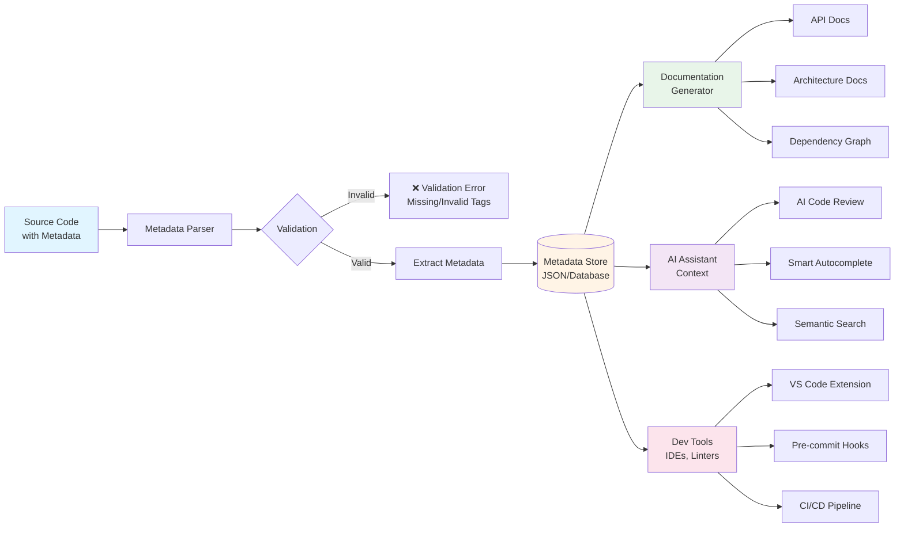

## Overview

The Dukes Engineering Style Guide uses structured metadata tags embedded as inline comments to provide context about
code modules, functions, and infrastructure components. This metadata serves three critical purposes:

1. **AI Assistant Integration**: Helps AI understand code intent, dependencies, and usage patterns
2. **Automated Documentation**: Enables automatic generation of comprehensive documentation
3. **Validation and Tooling**: Powers automated validation, dependency tracking, and code analysis

### Key Principles

- **Language-Agnostic**: Same metadata structure across all languages
- **Comment-Based**: Uses language-appropriate comment syntax
- **Structured Format**: Consistent tag format for parsing and validation
- **Extensible**: New tags can be added as needed
- **Human-Readable**: Clear and understandable without tooling

### Metadata Flow

This diagram shows how metadata flows from source code through validation, documentation, and AI integration:



## Core Metadata Tags

All code modules should include a metadata block at the file header with these core tags:

### Required Tags

| Tag | Description | Format | Example |
|-----|-------------|--------|---------|
| `@module` | Module identifier | `@module <name>` | `@module user_authentication` |
| `@description` | Brief purpose description | `@description <text>` | `@description Handles user login and session management` |
| `@version` | Semantic version | `@version <semver>` | `@version 1.2.0` |

### Recommended Tags

| Tag | Description | Format | Example |
|-----|-------------|--------|---------|
| `@author` | Module creator | `@author <name>` | `@author Tyler Dukes` |
| `@last_updated` | Last modification date | `@last_updated <YYYY-MM-DD>` | `@last_updated 2025-10-27` |
| `@dependencies` | External dependencies | `@dependencies <list>` | `@dependencies fastapi, pyjwt, redis` |

### Optional Tags

| Tag | Description | Format | Example |
|-----|-------------|--------|---------|
| `@status` | Development status | `@status <state>` | `@status stable` |
| `@security_classification` | Security level | `@security_classification <level>` | `@security_classification internal` |
| `@api_endpoints` | API routes exposed | `@api_endpoints <list>` | `@api_endpoints POST /auth/login, GET /auth/status` |
| `@env` | Target environments | `@env <list>` | `@env prod, staging, dev` |
| `@depends_on` | Module dependencies | `@depends_on <paths>` | `@depends_on ../database, ../cache` |
| `@terraform_version` | Terraform version | `@terraform_version <constraint>` | `@terraform_version >= 1.0` |
| `@python_version` | Python version | `@python_version <constraint>` | `@python_version >= 3.9` |
| `@license` | Code license | `@license <type>` | `@license MIT` |

## Language-Specific Syntax

The metadata block must use the appropriate comment syntax for each language.

### Python

**Docstring Format** (Recommended):

```python
"""
@module user_authentication
@description Handles user authentication, session management, and JWT token generation
@dependencies fastapi, pyjwt, passlib, python-dotenv
@version 1.2.0
@author Tyler Dukes
@last_updated 2025-10-27
@status stable
@security_classification internal
@api_endpoints POST /auth/login, POST /auth/logout, POST /auth/refresh
@python_version >= 3.9
"""

import jwt
from fastapi import APIRouter, HTTPException
```

**Comment Format** (Alternative):

```python
## @module user_authentication
## @description Handles user authentication and session management
## @version 1.2.0

import jwt
```

### Terraform/Terragrunt

**Block Comment Format**:

```hcl
/**
 * @module vpc
 * @description Creates VPC with public/private subnets, NAT gateways, and route tables
 * @dependencies aws_vpc, aws_subnet, aws_nat_gateway
 * @version 2.1.0
 * @author Tyler Dukes
 * @last_updated 2025-10-27
 * @terraform_version >= 1.0
 * @env prod, staging, dev
 */

resource "aws_vpc" "main" {
  cidr_block = var.vpc_cidr

  tags = {
    Name = var.vpc_name
  }
}
```

**Inline Comment Format**:

```hcl
## @module vpc
## @description Creates VPC infrastructure
## @version 2.1.0

resource "aws_vpc" "main" {
  cidr_block = var.vpc_cidr
}
```

### TypeScript/JavaScript

**JSDoc Format** (Recommended):

```typescript
/**
 * @module payment-processor
 * @description Processes credit card payments via Stripe API
 * @dependencies stripe, express, redis
 * @version 1.5.2
 * @author Tyler Dukes
 * @last_updated 2025-10-27
 * @status stable
 * @api_endpoints POST /payments/charge, POST /payments/refund
 */

import Stripe from 'stripe';
import { Router } from 'express';
```

### Bash

**Comment Block**:

```bash
#!/usr/bin/env bash
#
## @module deploy_script
## @description Automated deployment script for staging environment
## @dependencies aws-cli, jq, docker
## @version 1.3.0
## @author Tyler Dukes
## @last_updated 2025-10-27
## @env staging
## @status stable
#

set -euo pipefail
```

### YAML (Ansible, GitHub Actions)

```yaml
---
## @module user_provisioning
## @description Ansible playbook for user account creation and permissions
## @dependencies ansible >= 2.9
## @version 1.1.0
## @author Tyler Dukes
## @last_updated 2025-10-27
## @env prod, staging

- name: Create user accounts
  hosts: all
  tasks:
    - name: Add users
      user:
        name: "{{ item }}"
        state: present
```

### SQL

```sql
/*
 * @module user_schema
 * @description Database schema for user accounts and authentication
 * @dependencies postgresql >= 13
 * @version 2.0.0
 * @author Tyler Dukes
 * @last_updated 2025-10-27
 * @status stable
 */

CREATE TABLE users (
    id UUID PRIMARY KEY DEFAULT gen_random_uuid(),
    email VARCHAR(255) UNIQUE NOT NULL,
    password_hash VARCHAR(255) NOT NULL,
    created_at TIMESTAMP DEFAULT CURRENT_TIMESTAMP
);
```

## Field Definitions

### @module

**Purpose**: Unique identifier for the module or file.

**Format**: Lowercase with underscores or kebab-case.

**Rules**:

- Must be unique within the project
- Should describe the module's primary purpose
- Avoid generic names like `utils` or `helpers`

**Examples**:

```text
@module user_authentication
@module vpc_networking
@module payment-processor
@module database-migrations
```

### @description

**Purpose**: Clear, concise explanation of what the module does.

**Format**: Single sentence or short paragraph.

**Rules**:

- Start with a verb (Handles, Creates, Processes, Manages)
- Be specific about what the module does
- Avoid implementation details
- Maximum 200 characters recommended

**Examples**:

```text
@description Handles user authentication, session management, and JWT token generation
@description Creates AWS VPC with public/private subnets and NAT gateways
@description Processes credit card payments and manages refund workflows
```

### @version

**Purpose**: Semantic version of the module.

**Format**: `MAJOR.MINOR.PATCH` or `MAJOR.MINOR.PATCH-prerelease`

**Rules**:

- Follow [Semantic Versioning 2.0.0](https://semver.org/)
- Increment MAJOR for breaking changes
- Increment MINOR for new features
- Increment PATCH for bug fixes

**Examples**:

```text
@version 1.0.0
@version 2.3.1
@version 1.0.0-beta.1
@version 0.1.0-alpha
```

### @author

**Purpose**: Original creator or primary maintainer.

**Format**: Full name or username.

**Examples**:

```text
@author Tyler Dukes
@author Jane Smith
@author DevOps Team
```

### @last_updated

**Purpose**: Date of last significant update.

**Format**: `YYYY-MM-DD` (ISO 8601)

**Rules**:

- Update when making functional changes
- Don't update for minor typo fixes
- Can be automated in CI/CD

**Examples**:

```text
@last_updated 2025-10-27
@last_updated 2024-12-15
```

### @dependencies

**Purpose**: External libraries, packages, or modules required.

**Format**: Comma-separated list, optionally with version constraints.

**Examples**:

```text
@dependencies fastapi, pyjwt, redis
@dependencies stripe >= 8.0.0, express ^4.17.1
@dependencies aws_vpc, aws_subnet, aws_nat_gateway
```

### @status

**Purpose**: Current development or deployment status.

**Format**: Single keyword from predefined set.

**Valid Values**:

- `draft` - Initial development, not ready for review
- `in-progress` - Active development
- `review` - Ready for code review
- `stable` - Production-ready, actively maintained
- `deprecated` - Marked for removal, use alternative
- `archived` - No longer maintained

**Examples**:

```text
@status stable
@status deprecated
@status in-progress
```

### @security_classification

**Purpose**: Data sensitivity and access control level.

**Format**: Single keyword from organizational security levels.

**Common Values**:

- `public` - No sensitive data, can be open-sourced
- `internal` - Internal use only, not customer-facing
- `confidential` - Contains business-sensitive information
- `restricted` - Highly sensitive, limited access

**Examples**:

```text
@security_classification internal
@security_classification confidential
@security_classification public
```

### @api_endpoints

**Purpose**: HTTP API routes or endpoints exposed by this module.

**Format**: Comma-separated list of `METHOD /path` pairs.

**Examples**:

```text
@api_endpoints POST /auth/login, GET /auth/status
@api_endpoints GET /users/{id}, PUT /users/{id}, DELETE /users/{id}
@api_endpoints POST /payments/charge, POST /payments/refund, GET /payments/{id}
```

### @env

**Purpose**: Target deployment environments.

**Format**: Comma-separated list of environment names.

**Common Values**: `prod`, `production`, `staging`, `dev`, `development`, `test`, `qa`

**Examples**:

```text
@env prod, staging
@env development, test
@env all
```

### @depends_on

**Purpose**: Internal module or file dependencies (relative paths).

**Format**: Comma-separated relative paths.

**Examples**:

```text
@depends_on ../database/connection, ../cache/redis_client
@depends_on ./utils/validators, ./models/user
@depends_on ../../shared/logging
```

## Validation Rules

### Schema Validation

Modules are validated for:

1. **Required Tags**: `@module`, `@description`, `@version` must be present
2. **Format Compliance**: Each tag follows its specified format
3. **Version Format**: Follows semantic versioning
4. **Date Format**: ISO 8601 (YYYY-MM-DD)
5. **Unique Module Names**: No duplicate `@module` names in project

### Automated Validation

Use the validation script to check metadata:

```bash
## Validate all Python files
python scripts/validate_metadata.py --language python src/

## Validate specific file
python scripts/validate_metadata.py api/auth.py

## Validate all Terraform modules
python scripts/validate_metadata.py --language terraform infrastructure/
```

### Pre-commit Hook

Add to `.pre-commit-config.yaml`:

```yaml
repos:
  - repo: local
    hooks:
      - id: validate-metadata
        name: Validate Metadata Tags
        entry: python scripts/validate_metadata.py
        language: python
        files: \.(py|tf|hcl|js|ts|sh|sql)$
```

## Best Practices

### DO: Keep Metadata Up-to-Date

```python
## Good - version and date updated together
"""
@module user_service
@version 2.1.0
@last_updated 2025-10-27
"""
```

### DON'T: Leave Stale Metadata

```python
## Bad - version updated but date is old
"""
@module user_service
@version 2.1.0
@last_updated 2023-01-15  # Stale date!
"""
```

### DO: Be Specific in Descriptions

```python
## Good - specific about what it does
"""
@description Validates user input for email format, length constraints, and prohibited characters
"""
```

### DON'T: Use Vague Descriptions

```python
## Bad - too generic
"""
@description Handles validation
"""
```

### DO: List All Dependencies

```python
## Good - comprehensive dependency list
"""
@dependencies fastapi, pyjwt, passlib[bcrypt], python-dotenv, redis
"""
```

### DON'T: Omit Dependencies

```python
## Bad - missing implicit dependencies
"""
@dependencies fastapi
## Missing: pyjwt (used in code)
"""
```

### DO: Use Semantic Versioning Correctly

```hcl
## Good - breaking change bumps major version
/**
 * @version 2.0.0
 * Breaking: Changed input variable names
 */
```

### DON'T: Misuse Version Numbers

```hcl
## Bad - breaking change but only bumped patch
/**
 * @version 1.0.1
 * Changed input variable names (this is breaking!)
 */
```

## Integration with AI Assistants

Metadata tags help AI assistants:

### Understand Context

```python
"""
@module payment_processor
@description Processes credit card payments via Stripe API
@security_classification confidential
"""
```

AI knows:

- This handles payments (sensitive operation)
- Uses Stripe (specific payment provider)
- Contains confidential data (requires extra care)

### Suggest Compatible Dependencies

```python
"""
@dependencies fastapi >= 0.100.0, pydantic >= 2.0
@python_version >= 3.9
"""
```

AI knows:

- Must use FastAPI 0.100.0 or higher
- Requires Python 3.9 minimum
- Can suggest compatible libraries

### Detect Version Conflicts

```hcl
/**
 * @terraform_version >= 1.5
 * @dependencies aws >= 5.0
 */
```

AI can warn:

- If you use Terraform < 1.5
- If AWS provider < 5.0
- About breaking changes between versions

### Generate Accurate Documentation

Metadata enables automatic generation of:

- README files
- API documentation
- Dependency graphs
- Module indexes

## Complete Examples

### Python FastAPI Module

```python
"""
@module user_authentication_api
@description RESTful API for user authentication with JWT tokens and refresh token support
@dependencies fastapi, pyjwt, passlib[bcrypt], python-dotenv, redis, sqlalchemy
@version 1.3.0
@author Tyler Dukes
@last_updated 2025-10-27
@status stable
@security_classification internal
@api_endpoints POST /auth/login, POST /auth/logout, POST /auth/refresh, GET /auth/verify
@python_version >= 3.9
@depends_on ./models/user, ./database/connection, ./cache/redis_client
"""

from fastapi import APIRouter, Depends, HTTPException, status
from fastapi.security import OAuth2PasswordBearer
import jwt
from passlib.context import CryptContext
from datetime import datetime, timedelta

router = APIRouter(prefix="/auth", tags=["authentication"])
pwd_context = CryptContext(schemes=["bcrypt"], deprecated="auto")
```

### Terraform VPC Module

```hcl
/**
 * @module aws_vpc_networking
 * @description Creates AWS VPC with public/private subnets across 3 AZs, NAT gateways, and route tables
 * @dependencies aws_vpc, aws_subnet, aws_internet_gateway, aws_nat_gateway, aws_route_table
 * @version 2.3.1
 * @author Tyler Dukes
 * @last_updated 2025-10-27
 * @status stable
 * @terraform_version >= 1.0
 * @env prod, staging, dev
 * @security_classification internal
 */

variable "vpc_cidr" {
  description = "CIDR block for VPC"
  type        = string
  default     = "10.0.0.0/16"
}

variable "environment" {
  description = "Environment name (prod, staging, dev)"
  type        = string
}

resource "aws_vpc" "main" {
  cidr_block           = var.vpc_cidr
  enable_dns_hostnames = true
  enable_dns_support   = true

  tags = {
    Name        = "${var.environment}-vpc"
    Environment = var.environment
    ManagedBy   = "Terraform"
  }
}
```

### Bash Deployment Script

```bash
#!/usr/bin/env bash
#
## @module deploy_to_staging
## @description Deploys application to staging environment with health checks and rollback capability
## @dependencies aws-cli >= 2.0, jq, docker >= 20.10
## @version 1.4.2
## @author Tyler Dukes
## @last_updated 2025-10-27
## @status stable
## @env staging
## @security_classification internal
## @depends_on ./scripts/health_check.sh, ./scripts/rollback.sh
#

set -euo pipefail

readonly SCRIPT_DIR="$(cd "$(dirname "${BASH_SOURCE[0]}")" && pwd)"
readonly APP_NAME="${APP_NAME:-myapp}"
readonly ENVIRONMENT="staging"
```

## Migration Guide

### Adding Metadata to Existing Code

**Step 1**: Identify all modules without metadata

```bash
## Find Python files without @module tag
find . -name "*.py" -exec grep -L "@module" {} \;
```

**Step 2**: Add minimal metadata block

```python
"""
@module [infer_from_filename]
@description [TODO: Add description]
@version 0.1.0
"""
```

**Step 3**: Progressively enhance

- Add `@author` and `@last_updated`
- Document `@dependencies` from imports
- Add `@api_endpoints` for API modules
- Specify `@env` and `@status`

**Step 4**: Validate

```bash
python scripts/validate_metadata.py --fix .
```

## References

- [Semantic Versioning 2.0.0](https://semver.org/)
- [JSDoc Tag Reference](https://jsdoc.app/)
- [Python Docstring Conventions (PEP 257)](https://peps.python.org/pep-0257/)
- [Terraform Module Structure](https://developer.hashicorp.com/terraform/language/modules/develop/structure)
