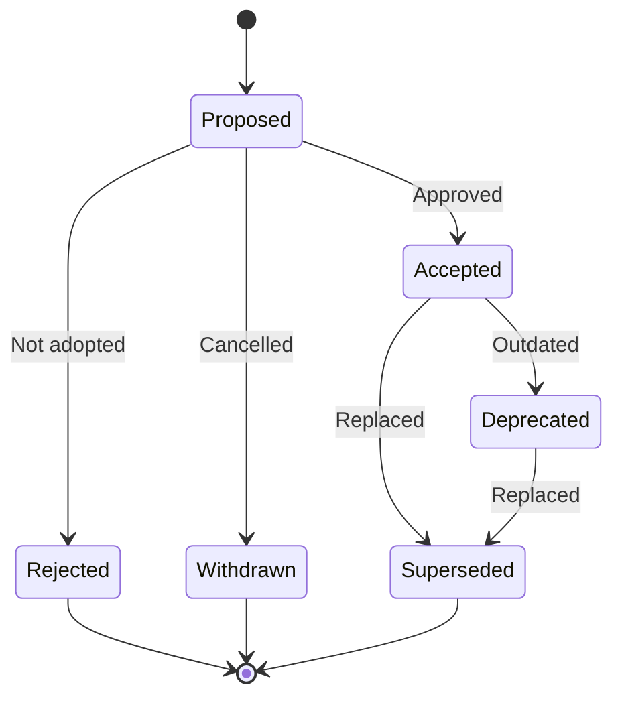

This document provides a standardized template and organizational guidelines for Architecture Decision
Records (ADRs). ADRs capture important architectural decisions along with their context and consequences,
creating a historical record of technical choices.

## Purpose

ADRs serve as a living documentation system that:

- Records the reasoning behind significant architectural decisions
- Provides context for future developers who need to understand why decisions were made
- Enables teams to revisit and re-evaluate decisions as requirements evolve
- Creates an audit trail of technical choices for compliance and governance

## When to Create an ADR

Create an ADR for decisions that:

- **Affect system structure**: Database selection, service architecture, API design patterns
- **Have long-term implications**: Technology choices that are difficult to reverse
- **Impact multiple teams**: Cross-cutting concerns affecting multiple services or teams
- **Involve trade-offs**: Decisions where alternatives were seriously considered
- **Require buy-in**: Changes needing stakeholder approval or team consensus

---

## ADR Standards

### File Naming Convention

```text
# Format: NNNN-kebab-case-title.md
# NNNN = Zero-padded sequential number

0001-use-microservices-architecture.md
0002-adopt-kubernetes-for-orchestration.md
0003-use-postgresql-for-primary-database.md
0004-implement-event-driven-communication.md
0005-adopt-trunk-based-development.md
```

### Directory Structure

```text
docs/
└── architecture/
    └── decisions/
        ├── README.md                              # ADR index and guidelines
        ├── 0001-use-microservices-architecture.md
        ├── 0002-adopt-kubernetes-for-orchestration.md
        ├── 0003-use-postgresql-for-primary-database.md
        ├── 0004-implement-event-driven-communication.md
        └── templates/
            └── adr-template.md                    # Blank template for new ADRs
```

### Status Definitions

```yaml
# ADR Status Workflow
statuses:
  proposed:
    description: "ADR is under discussion, not yet accepted"
    next_states: [accepted, rejected, withdrawn]
    color: "yellow"

  accepted:
    description: "Decision has been approved and is in effect"
    next_states: [deprecated, superseded]
    color: "green"

  rejected:
    description: "Decision was considered but not adopted"
    next_states: []
    color: "red"

  deprecated:
    description: "Decision is no longer recommended but still in use"
    next_states: [superseded]
    color: "orange"

  superseded:
    description: "Decision has been replaced by a newer ADR"
    requires: "Link to superseding ADR"
    next_states: []
    color: "gray"

  withdrawn:
    description: "Proposal was withdrawn before decision"
    next_states: []
    color: "gray"
```



### Numbering Guidelines

```yaml
# ADR Numbering Best Practices
numbering:
  format: "4-digit zero-padded (0001, 0002, ...)"
  assignment: "Sequential, never reused"
  gaps_allowed: true  # Numbers can be skipped if ADR withdrawn before merge

  examples:
    correct:
      - "0001-initial-architecture.md"
      - "0042-add-caching-layer.md"
      - "0100-migrate-to-cloud.md"

    incorrect:
      - "1-initial-architecture.md"      # Not zero-padded
      - "ADR-001-initial-architecture.md" # Redundant prefix
      - "initial-architecture.md"         # Missing number
```

---

## ADR Template

````markdown
# ADR-{NNNN}: {Title}

**Status**: {Proposed | Accepted | Deprecated | Superseded by [ADR-XXXX](link)}
**Date**: YYYY-MM-DD
**Deciders**: {List of people involved in the decision}
**Technical Story**: {Link to issue, epic, or RFC}

## Context and Problem Statement

{Describe the context and problem statement in 2-4 sentences. What is the issue
that motivates this decision? What are the forces at play?}

## Decision Drivers

* {Decision driver 1, e.g., "Need to support 10x traffic growth"}
* {Decision driver 2, e.g., "Team expertise in specific technology"}
* {Decision driver 3, e.g., "Budget constraints"}
* {Decision driver 4, e.g., "Time-to-market requirements"}

## Considered Options

* **Option 1**: {Brief description}
* **Option 2**: {Brief description}
* **Option 3**: {Brief description}

## Decision Outcome

**Chosen option**: "{Option X}", because {one-sentence justification that
addresses the key decision drivers}.

### Consequences

**Positive**:

* {Positive consequence 1}
* {Positive consequence 2}
* {Positive consequence 3}

**Negative**:

* {Negative consequence 1, with mitigation if applicable}
* {Negative consequence 2, with mitigation if applicable}

**Neutral**:

* {Neutral observation or trade-off}

## Validation

{How will we know if this decision is successful? Include metrics or criteria.}

* {Validation criterion 1, e.g., "System handles 1000 RPS with p99 < 100ms"}
* {Validation criterion 2, e.g., "Development velocity maintained or improved"}

## Pros and Cons of the Options

### Option 1: {Name}

{Brief description of the option}

* **Good**, because {argument}
* **Good**, because {argument}
* **Bad**, because {argument}
* **Bad**, because {argument}

### Option 2: {Name}

{Brief description of the option}

* **Good**, because {argument}
* **Bad**, because {argument}

### Option 3: {Name}

{Brief description of the option}

* **Good**, because {argument}
* **Bad**, because {argument}

## Links

* {Link to related ADR}: {Relationship description}
* {Link to RFC or design document}
* {Link to relevant documentation}

## Notes

{Optional section for additional context, meeting notes, or implementation details
discovered after the decision was made.}
````

---

## Example ADR

````markdown
# ADR-0003: Use PostgreSQL for Primary Database

**Status**: Accepted
**Date**: 2025-01-10
**Deciders**: Backend Team, DevOps Team, Data Engineering
**Technical Story**: [PROJ-245](https://jira.example.com/browse/PROJ-245)

## Context and Problem Statement

We need to choose a primary database for our new microservices architecture. The
database must support ACID transactions, handle complex relational queries, and
scale to support our projected growth of 10x over the next 3 years. Our current
MySQL 5.7 instance is reaching its limits and requires a migration regardless.

## Decision Drivers

* Need for strong ACID compliance for financial transactions
* Complex relational data model with many joins
* Team has 5+ years of PostgreSQL expertise
* Requirement for open-source to avoid vendor lock-in
* Strong ecosystem for extensions (PostGIS, timescale)
* Cloud-provider agnostic deployment requirement

## Considered Options

* **Option 1**: PostgreSQL 15+
* **Option 2**: MySQL 8.0
* **Option 3**: CockroachDB
* **Option 4**: Amazon Aurora

## Decision Outcome

**Chosen option**: "PostgreSQL 15+", because it provides the best balance of
ACID compliance, query performance, team expertise, and open-source flexibility
while meeting all our technical requirements.

### Consequences

**Positive**:

* Team already has deep PostgreSQL expertise (no training required)
* Excellent JSON/JSONB support enables flexible schemas where needed
* Rich extension ecosystem (PostGIS for geo, pg_stat_statements for monitoring)
* Strong cloud provider support (AWS RDS, GCP Cloud SQL, Azure Database)
* Active community with regular security updates
* Native support for advanced features (CTEs, window functions, partial indexes)

**Negative**:

* Vertical scaling limits compared to distributed databases (mitigated by read
  replicas and Citus extension if needed)
* Requires careful sharding strategy for multi-tenant workloads (mitigated by
  planning tenant isolation at application layer)
* Connection pooling required for high-concurrency workloads (mitigated by
  PgBouncer deployment)

**Neutral**:

* Similar operational complexity to MySQL
* Comparable managed service costs across cloud providers

## Validation

* System handles 1000 transactions per second with p99 latency < 50ms
* Query performance for reporting dashboards < 2 seconds
* Successful DR failover tested quarterly with RTO < 5 minutes
* Zero data loss during planned maintenance windows

## Pros and Cons of the Options

### Option 1: PostgreSQL 15+

The most advanced open-source relational database with strong ACID compliance
and extensive feature set.

* **Good**, because team has 5+ years of production PostgreSQL experience
* **Good**, because excellent JSON support allows schema flexibility
* **Good**, because rich extension ecosystem (PostGIS, pg_cron, pgvector)
* **Good**, because strong community support and regular releases
* **Good**, because cloud-agnostic with managed options on all major providers
* **Bad**, because single-node write scaling limits (~10K TPS practical max)
* **Bad**, because requires connection pooler for high connection counts

### Option 2: MySQL 8.0

Widely-used open-source database with improved features in version 8.

* **Good**, because familiar to many developers
* **Good**, because strong cloud provider support
* **Good**, because good read scaling with replicas
* **Bad**, because JSON support less mature than PostgreSQL
* **Bad**, because fewer advanced SQL features (limited CTE support)
* **Bad**, because team would need retraining from PostgreSQL
* **Bad**, because optimizer less sophisticated for complex queries

### Option 3: CockroachDB

Distributed SQL database with strong consistency and horizontal scaling.

* **Good**, because native horizontal scaling
* **Good**, because PostgreSQL wire protocol compatible
* **Good**, because built-in multi-region support
* **Bad**, because higher operational complexity
* **Bad**, because higher latency for single-region workloads
* **Bad**, because team has no operational experience
* **Bad**, because commercial license for advanced features

### Option 4: Amazon Aurora

AWS proprietary MySQL/PostgreSQL-compatible database.

* **Good**, because managed service reduces operational burden
* **Good**, because fast failover and read scaling
* **Good**, because integrated with AWS ecosystem
* **Bad**, because vendor lock-in to AWS
* **Bad**, because higher cost than self-managed PostgreSQL
* **Bad**, because some PostgreSQL extensions not supported
* **Bad**, because conflicts with multi-cloud strategy requirement

## Links

* Supersedes [ADR-0001: Use MySQL for Primary Database](0001-use-mysql-for-primary-database.md)
* Related to [ADR-0004: Implement Read Replicas for Scaling](0004-implement-read-replicas.md)
* Related to [ADR-0007: Use PgBouncer for Connection Pooling](0007-use-pgbouncer.md)
* [PostgreSQL 15 Release Notes](https://www.postgresql.org/docs/15/release-15.html)
* [Database Selection RFC](https://confluence.example.com/display/ARCH/RFC-2025-001)

## Notes

**2025-01-15**: Initial migration plan approved. Starting with read replicas in
us-east-1, expanding to eu-west-1 in Q2.

**2025-02-01**: PgBouncer configuration finalized. Using transaction pooling mode
with max 100 connections per pool.
````

---

## Specialized ADR Templates

### Lightweight ADR (Y-Statement)

For smaller decisions that don't warrant a full ADR:

````markdown
# ADR-{NNNN}: {Title}

**Status**: Accepted
**Date**: YYYY-MM-DD

In the context of {context},
facing {concern},
we decided for {option},
and against {alternatives},
to achieve {outcome},
accepting {trade-off}.
````

```markdown
# Example: Lightweight ADR

# ADR-0015: Use UUID v7 for Primary Keys

**Status**: Accepted
**Date**: 2025-01-20

In the context of designing database schemas for new services,
facing the need for distributed ID generation without coordination,
we decided for UUID v7 (time-ordered),
and against auto-increment integers and UUID v4,
to achieve sortable, collision-free IDs that work across services,
accepting slightly larger storage requirements (16 bytes vs 8 bytes).
```

### Security Decision Record

For security-focused architectural decisions:

````markdown
# ADR-{NNNN}: {Security Decision Title}

**Status**: {Proposed | Accepted | Deprecated | Superseded}
**Date**: YYYY-MM-DD
**Deciders**: {Security Team, Architecture Team}
**Security Classification**: {Public | Internal | Confidential}
**Compliance Requirements**: {SOC2, HIPAA, PCI-DSS, GDPR, etc.}

## Threat Context

{Describe the security threat or risk being addressed}

### Threat Model

* **Asset**: {What are we protecting?}
* **Threat Actor**: {Who might attack?}
* **Attack Vector**: {How might they attack?}
* **Impact**: {What's the potential damage?}

## Security Requirements

* {Requirement 1, e.g., "Data encrypted at rest using AES-256"}
* {Requirement 2, e.g., "All API calls authenticated and authorized"}
* {Requirement 3, e.g., "Audit logs retained for 7 years"}

## Decision Outcome

{Standard decision section}

## Security Validation

* {Penetration testing requirement}
* {Security review sign-off}
* {Compliance audit checklist}

## Residual Risk

{Document any remaining risk after implementing the decision}

| Risk | Likelihood | Impact | Mitigation |
|------|------------|--------|------------|
| {Risk 1} | Low/Med/High | Low/Med/High | {Mitigation strategy} |
````

### Technology Adoption ADR

For decisions about adopting new technologies or frameworks:

````markdown
# ADR-{NNNN}: Adopt {Technology} for {Purpose}

**Status**: {Proposed | Accepted | Deprecated | Superseded}
**Date**: YYYY-MM-DD
**Deciders**: {Team leads involved}
**Evaluation Period**: {Start date} - {End date}

## Technology Overview

* **Name**: {Technology name and version}
* **Category**: {Database, Framework, Library, Tool, etc.}
* **License**: {MIT, Apache 2.0, Commercial, etc.}
* **Maturity**: {Experimental, Stable, Mature, Legacy}
* **Vendor**: {Company or community}

## Evaluation Criteria

| Criterion | Weight | Score (1-5) | Notes |
|-----------|--------|-------------|-------|
| Performance |  | {score} | {notes} |
| Maintainability |  | {score} | {notes} |
| Learning Curve |  | {score} | {notes} |
| **Total** | 100% | {weighted} | |

## Proof of Concept Results

{Summary of any PoC conducted during evaluation}

```bash
# PoC metrics
Throughput: X requests/second
Latency p99: Y ms
Memory usage: Z MB
```

## Adoption Plan

1. {Phase 1: Pilot with single service}
2. {Phase 2: Expand to team}
3. {Phase 3: Organization-wide adoption}

## Rollback Plan

{How to revert if the adoption doesn't work out}
````

---

## ADR Index Template

Create a `README.md` in your decisions directory to serve as an index:

````markdown
# Architecture Decision Records

This directory contains Architecture Decision Records (ADRs) for {Project Name}.

## What is an ADR?

An Architecture Decision Record captures an important architectural decision made
along with its context and consequences. ADRs are immutable once accepted—if a
decision changes, a new ADR supersedes the old one.

## ADR Index

| ID | Title | Status | Date |
|----|-------|--------|------|
| [ADR-0001](0001-use-microservices-architecture.md) | Use Microservices Architecture | Accepted | 2024-06-15 |
| [ADR-0002](0002-adopt-kubernetes-for-orchestration.md) | Adopt Kubernetes for Orchestration | Accepted | 2024-07-01 |
| [ADR-0003](0003-use-postgresql-for-primary-database.md) | Use PostgreSQL for Primary Database | Accepted | 2025-01-10 |
| [ADR-0004](0004-implement-event-driven-communication.md) | Implement Event-Driven Communication | Proposed | 2025-01-20 |

## Status Legend

| Status | Description |
|--------|-------------|
| **Proposed** | Under discussion, not yet accepted |
| **Accepted** | Approved and in effect |
| **Deprecated** | No longer recommended, still in use |
| **Superseded** | Replaced by a newer ADR |
| **Rejected** | Considered but not adopted |

## Creating a New ADR

1. Copy the template: `cp templates/adr-template.md NNNN-title.md`
2. Use the next available number (check the index above)
3. Fill in all required sections
4. Submit a pull request for review
5. Update this index after the ADR is accepted

## Review Process

1. Author creates ADR and opens PR
2. Relevant stakeholders review (minimum 2 approvals)
3. Discussion and refinement in PR comments
4. Final approval from Architecture Board (for significant decisions)
5. Merge and update status to "Accepted"

## Tools

We use [adr-tools](https://github.com/npryce/adr-tools) for managing ADRs:

```bash
# Install adr-tools
brew install adr-tools

# Create new ADR
adr new "Use PostgreSQL for Primary Database"

# List all ADRs
adr list

# Generate table of contents
adr generate toc > README.md
```

## Further Reading

* [ADR GitHub Organization](https://adr.github.io/)
* [Michael Nygard's ADR Article](https://cognitect.com/blog/2011/11/15/documenting-architecture-decisions)
* [MADR Template](https://adr.github.io/madr/)
````

---

## Tooling Integration

### adr-tools CLI

Install and configure `adr-tools` for streamlined ADR management:

```bash
# Installation
# macOS
brew install adr-tools

# Linux (manual installation)
git clone https://github.com/npryce/adr-tools.git
cd adr-tools
make install prefix=/usr/local

# Initialize ADR directory
adr init docs/architecture/decisions

# Create new ADR
adr new "Use PostgreSQL for Primary Database"
# Creates: docs/architecture/decisions/0003-use-postgresql-for-primary-database.md

# Supersede an existing ADR
adr new -s 1 "Use Event Sourcing Instead of CRUD"
# Creates new ADR that supersedes ADR-0001

# Link ADRs
adr link 3 "Implements" 1 "Is implemented by"
# Links ADR-0003 to ADR-0001

# Generate table of contents
adr generate toc > docs/architecture/decisions/README.md

# Generate dependency graph
adr generate graph | dot -Tpng > adr-graph.png
```

### Configuration File

Create `.adr-dir` in your repository root:

```text
docs/architecture/decisions
```

### Custom adr-tools Template

Create a custom template at `docs/architecture/decisions/templates/template.md`:

````markdown
# ADR-{NUMBER}: {TITLE}

**Status**: Proposed
**Date**: {DATE}
**Deciders**: {List deciders}
**Technical Story**: {Link to ticket}

## Context and Problem Statement

{Describe the context}

## Decision Drivers

* {Driver 1}
* {Driver 2}

## Considered Options

* **Option 1**: {Description}
* **Option 2**: {Description}

## Decision Outcome

**Chosen option**: "{Option}", because {justification}.

### Consequences

**Positive**:

* {Consequence}

**Negative**:

* {Consequence}

## Links

* {Related ADR or document}
````

### GitHub Template for New ADRs

Create `.github/ISSUE_TEMPLATE/adr-proposal.yml`:

```yaml
name: ADR Proposal
description: Propose a new Architecture Decision Record
title: "[ADR] "
labels: ["adr", "architecture"]
body:
  - type: markdown
    attributes:
      value: |
        ## Architecture Decision Record Proposal

        Use this template to propose a new ADR for team discussion.

  - type: input
    id: title
    attributes:
      label: ADR Title
      description: Short, descriptive title for the decision
      placeholder: "Use PostgreSQL for Primary Database"
    validations:
      required: true

  - type: textarea
    id: context
    attributes:
      label: Context and Problem Statement
      description: What is the issue that motivates this decision?
      placeholder: |
        We need to choose a primary database for our new microservices
        architecture. The database must support ACID transactions and
        handle complex relational queries.
    validations:
      required: true

  - type: textarea
    id: drivers
    attributes:
      label: Decision Drivers
      description: What factors are influencing this decision?
      placeholder: |
        - Need for ACID compliance
        - Team expertise
        - Budget constraints
    validations:
      required: true

  - type: textarea
    id: options
    attributes:
      label: Options Considered
      description: What alternatives are being evaluated?
      placeholder: |
        1. PostgreSQL - Open source, strong ACID
        2. MySQL - Familiar to team
        3. CockroachDB - Distributed SQL
    validations:
      required: true

  - type: input
    id: story
    attributes:
      label: Technical Story
      description: Link to related issue, epic, or RFC
      placeholder: "PROJ-245"

  - type: checkboxes
    id: checklist
    attributes:
      label: Pre-submission Checklist
      options:
        - label: I have searched existing ADRs for similar decisions
          required: true
        - label: I have identified the key stakeholders
          required: true
        - label: I have considered at least 2 alternative options
          required: true
```

### Pre-commit Hook for ADR Validation

Add to `.pre-commit-config.yaml`:

```yaml
repos:
  - repo: local
    hooks:
      - id: validate-adr-format
        name: Validate ADR Format
        entry: python scripts/validate_adr.py
        language: python
        files: ^docs/architecture/decisions/\d{4}-.+\.md$
        types: [markdown]
```

Validation script (`scripts/validate_adr.py`):

```python
#!/usr/bin/env python3
"""Validate ADR format and required sections."""

import re
import sys
from pathlib import Path


REQUIRED_SECTIONS = [
    "Context and Problem Statement",
    "Decision Drivers",
    "Considered Options",
    "Decision Outcome",
]

VALID_STATUSES = [
    "Proposed",
    "Accepted",
    "Deprecated",
    "Superseded",
    "Rejected",
    "Withdrawn",
]


def validate_adr(filepath: Path) -> list[str]:
    """Validate an ADR file and return list of errors."""
    errors = []
    content = filepath.read_text()

    # Check filename format
    if not re.match(r"^\d{4}-.+\.md$", filepath.name):
        errors.append(f"Invalid filename format: {filepath.name}")

    # Check for status field
    status_match = re.search(r"\*\*Status\*\*:\s*(.+)", content)
    if not status_match:
        errors.append("Missing Status field")
    else:
        status = status_match.group(1).strip()
        # Handle "Superseded by [ADR-XXXX](link)" format
        status_value = status.split()[0]
        if status_value not in VALID_STATUSES:
            errors.append(f"Invalid status: {status_value}")

    # Check for date field
    if not re.search(r"\*\*Date\*\*:\s*\d{4}-\d{2}-\d{2}", content):
        errors.append("Missing or invalid Date field (expected YYYY-MM-DD)")

    # Check for required sections
    for section in REQUIRED_SECTIONS:
        if f"## {section}" not in content:
            errors.append(f"Missing required section: {section}")

    # Check for decision outcome
    if "**Chosen option**" not in content and "Chosen option" not in content:
        errors.append("Missing 'Chosen option' in Decision Outcome section")

    return errors


def main() -> int:
    """Validate all ADR files passed as arguments."""
    exit_code = 0

    for filepath in sys.argv[1:]:
        path = Path(filepath)
        errors = validate_adr(path)

        if errors:
            print(f"\n{filepath}:")
            for error in errors:
                print(f"  - {error}")
            exit_code = 1

    return exit_code


if __name__ == "__main__":
    sys.exit(main())
```

### MkDocs Integration

Add ADRs to your MkDocs navigation in `mkdocs.yml`:

```yaml
nav:
  - Architecture:
      - Overview: architecture/overview.md
      - Decisions:
          - Index: architecture/decisions/README.md
          - ADR-0001 Microservices: architecture/decisions/0001-use-microservices-architecture.md
          - ADR-0002 Kubernetes: architecture/decisions/0002-adopt-kubernetes-for-orchestration.md
          - ADR-0003 PostgreSQL: architecture/decisions/0003-use-postgresql-for-primary-database.md
```

Or use the `awesome-pages` plugin for automatic navigation:

```yaml
# mkdocs.yml
plugins:
  - awesome-pages

# docs/architecture/decisions/.pages
title: Architecture Decisions
arrange:
  - README.md
  - ...
```

### Automated ADR Index Generation

Script to auto-generate the ADR index (`scripts/generate_adr_index.py`):

```python
#!/usr/bin/env python3
"""Generate ADR index from decision files."""

import re
from pathlib import Path


def extract_metadata(filepath: Path) -> dict:
    """Extract title, status, and date from ADR file."""
    content = filepath.read_text()

    title_match = re.search(r"^# ADR-\d+:\s*(.+)$", content, re.MULTILINE)
    status_match = re.search(r"\*\*Status\*\*:\s*(.+)", content)
    date_match = re.search(r"\*\*Date\*\*:\s*(\d{4}-\d{2}-\d{2})", content)

    return {
        "number": filepath.stem.split("-")[0],
        "filename": filepath.name,
        "title": title_match.group(1) if title_match else "Unknown",
        "status": status_match.group(1).strip() if status_match else "Unknown",
        "date": date_match.group(1) if date_match else "Unknown",
    }


def generate_index(decisions_dir: Path) -> str:
    """Generate markdown index table."""
    adrs = []

    for filepath in sorted(decisions_dir.glob("[0-9][0-9][0-9][0-9]-*.md")):
        adrs.append(extract_metadata(filepath))

    lines = [
        "| ID | Title | Status | Date |",
        "|----|-------|--------|------|",
    ]

    for adr in adrs:
        lines.append(
            f"| [ADR-{adr['number']}]({adr['filename']}) "
            f"| {adr['title']} "
            f"| {adr['status']} "
            f"| {adr['date']} |"
        )

    return "\n".join(lines)


if __name__ == "__main__":
    decisions_dir = Path("docs/architecture/decisions")
    print(generate_index(decisions_dir))
```

---

## Review and Approval Process

### Review Checklist

```markdown
## ADR Review Checklist

### Content Quality
- [ ] Problem statement is clear and well-defined
- [ ] Decision drivers are relevant and prioritized
- [ ] At least 2-3 alternatives were seriously considered
- [ ] Pros and cons are balanced and honest
- [ ] Consequences (positive and negative) are documented
- [ ] Decision is justified with reference to drivers

### Format Compliance
- [ ] Follows standard ADR template
- [ ] Status is set correctly (Proposed for new ADRs)
- [ ] Date is accurate
- [ ] Deciders are listed
- [ ] Links to related documents/issues included

### Technical Accuracy
- [ ] Technical claims are accurate
- [ ] Performance/scalability assertions are backed by data
- [ ] Security implications are addressed
- [ ] Cost implications are considered

### Stakeholder Input
- [ ] Relevant teams have been consulted
- [ ] Security team reviewed (if applicable)
- [ ] Operations team reviewed (if applicable)
- [ ] Product/business stakeholders aware
```

### Approval Matrix

```yaml
# ADR Approval Requirements by Impact Level

approval_matrix:
  low_impact:
    description: "Single service, easily reversible"
    examples:
      - "Library selection within a service"
      - "Internal API design choices"
    approvers:
      required: 2
      from: ["team-leads"]

  medium_impact:
    description: "Multiple services, moderate effort to change"
    examples:
      - "New database for a domain"
      - "Authentication approach"
    approvers:
      required: 3
      from: ["team-leads", "staff-engineers"]

  high_impact:
    description: "Organization-wide, significant investment"
    examples:
      - "Cloud provider selection"
      - "Primary programming language"
      - "Core infrastructure decisions"
    approvers:
      required: 5
      from: ["architecture-board", "engineering-leadership"]
      includes: ["security-review", "cost-analysis"]
```

---

## Best Practices

### Writing Effective ADRs

```yaml
# ADR Writing Guidelines

do:
  - Keep the problem statement focused and specific
  - Include concrete data to support claims
  - Document the decision drivers upfront
  - Be honest about trade-offs and limitations
  - Link to related ADRs and external resources
  - Update the ADR if significant new information emerges
  - Include validation criteria for success

avoid:
  - Vague or overly broad problem statements
  - Documenting decisions after implementation is complete
  - Skipping the alternatives analysis
  - Being defensive about the chosen option
  - Omitting negative consequences
  - Using ADRs for operational procedures (use runbooks instead)
```

### When to Update vs. Supersede

```yaml
# ADR Modification Guidelines

update_existing:
  - Fixing typos or clarifying language
  - Adding implementation notes after decision
  - Updating links to moved documents
  - Adding validation results

create_new_superseding:
  - Fundamental change to the decision
  - Choosing a different option than originally decided
  - Significant change in context invalidates original reasoning
  - New requirements make original decision inappropriate
```

---

## Additional Resources

- [ADR GitHub Organization](https://adr.github.io/)
- [Michael Nygard's Original ADR Article](https://cognitect.com/blog/2011/11/15/documenting-architecture-decisions)
- [MADR - Markdown ADR Template](https://adr.github.io/madr/)
- [adr-tools GitHub Repository](https://github.com/npryce/adr-tools)
- [Log4brains - ADR Management Tool](https://github.com/thomvaill/log4brains)
- [Documenting Architecture Decisions (ThoughtWorks)](https://www.thoughtworks.com/radar/techniques/lightweight-architecture-decision-records)

---
