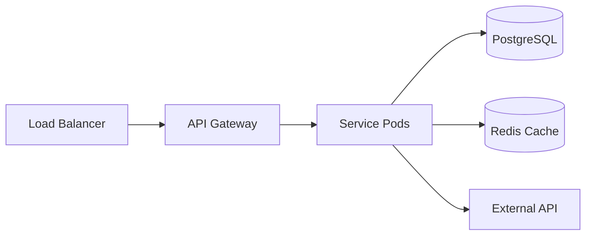
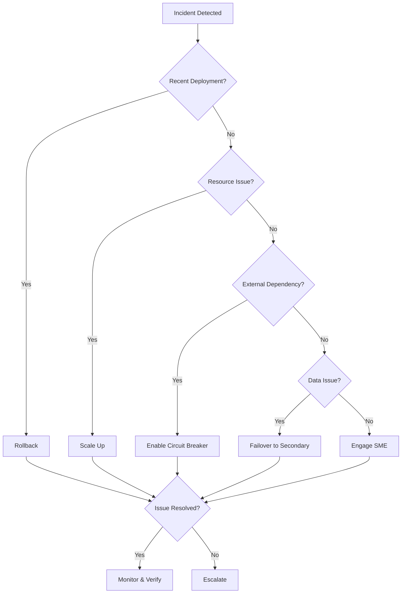

This document provides standardized templates for operational documentation: service runbooks, incident
response playbooks, and blameless postmortems. These templates help teams respond to incidents
effectively and learn from failures.

## Purpose

Operational documentation serves three critical functions:

1. **Runbooks** - Enable on-call engineers to diagnose and resolve issues quickly
2. **Playbooks** - Standardize incident response processes across the organization
3. **Postmortems** - Facilitate blameless learning from incidents

## When to Use These Templates

| Template | Use Case |
|----------|----------|
| **Runbook** | Every production service should have a runbook |
| **Playbook** | Define for each incident type (outage, security, data loss) |
| **Postmortem** | After every SEV-1 or SEV-2 incident |

---

## Service Runbook Template

A runbook is service-specific documentation that helps on-call engineers understand, monitor, and
troubleshoot a service.

### How to Use This Template

1. Copy the template below to your service repository as `RUNBOOK.md`
2. Fill in all sections relevant to your service
3. Keep the runbook updated with each service change
4. Link the runbook in your alerting system for quick access
5. Review and update quarterly

---

### Template Content

````markdown
# {Service Name} Runbook

**Owner**: {Team/Squad Name}
**On-Call**: {PagerDuty/Opsgenie Rotation Link}
**Last Updated**: YYYY-MM-DD
**Runbook Version**: X.Y.Z

---

## Service Overview

{Brief description of service purpose, criticality, and business impact}

**Criticality**: {Tier 1 - Business Critical | Tier 2 - Important | Tier 3 - Supporting}

### Service Level Objectives (SLOs)

| Metric | Target | Measurement Window |
|--------|--------|--------------------|
| Availability | 99.9% | 30-day rolling |
| Latency (p99) | < 500ms | 5-minute window |
| Error Rate | < 0.1% | 5-minute window |
| Throughput | > 1000 RPS | 1-minute window |

### Service Level Indicators (SLIs)

```promql
# Availability SLI
sum(rate(http_requests_total{service="my-service", status!~"5.."}[5m])) /
sum(rate(http_requests_total{service="my-service"}[5m]))

# Latency SLI (p99)
histogram_quantile(0.99, sum(rate(http_request_duration_seconds_bucket{service="my-service"}[5m])) by (le))

# Error Rate SLI
sum(rate(http_requests_total{service="my-service", status=~"5.."}[5m])) /
sum(rate(http_requests_total{service="my-service"}[5m]))
```

---

## Architecture

{Include architecture diagram or link to diagram}



### Key Components

| Component | Purpose | Technology |
|-----------|---------|------------|
| API Gateway | Request routing, auth | Kong/Nginx |
| Service Pods | Business logic | Python/FastAPI |
| Database | Persistent storage | PostgreSQL 15 |
| Cache | Session/query cache | Redis 7 |
| Message Queue | Async processing | RabbitMQ |

### Dependencies

**Internal Dependencies**:

| Service | Purpose | Criticality | Fallback |
|---------|---------|-------------|----------|
| auth-service | Authentication | Critical | Cached tokens |
| user-service | User data | High | Degraded mode |
| notification-service | Alerts | Low | Queue and retry |

**External Dependencies**:

| Service | Purpose | SLA | Fallback |
|---------|---------|-----|----------|
| Stripe API | Payment processing | 99.99% | Queue transactions |
| SendGrid | Email delivery | 99.9% | Backup SMTP |
| AWS S3 | File storage | 99.99% | None |

---

## Monitoring and Alerts

### Dashboards

| Dashboard | Purpose | Link |
|-----------|---------|------|
| Production Overview | High-level health | [Grafana](https://grafana.example.com/d/prod-overview) |
| Service Deep Dive | Detailed metrics | [Grafana](https://grafana.example.com/d/service-detail) |
| Database Performance | Query latency, connections | [Grafana](https://grafana.example.com/d/db-perf) |
| Error Tracking | Exception details | [Sentry](https://sentry.io/organizations/example) |

### Key Metrics

```yaml
# metrics.yaml - Key metrics to monitor
metrics:
  - name: http_request_duration_seconds
    type: histogram
    description: HTTP request latency
    labels: [method, endpoint, status]
    buckets: [0.01, 0.05, 0.1, 0.25, 0.5, 1, 2.5, 5, 10]

  - name: http_requests_total
    type: counter
    description: Total HTTP requests
    labels: [method, endpoint, status]

  - name: database_connection_pool_size
    type: gauge
    description: Current DB connection pool size
    labels: [state]  # active, idle, waiting

  - name: cache_hit_ratio
    type: gauge
    description: Cache hit ratio
    labels: [cache_name]

  - name: business_transactions_total
    type: counter
    description: Business transaction count
    labels: [type, status]
```

### Alert Definitions

```yaml
# alerts.yaml - Prometheus alerting rules
groups:
  - name: service-alerts
    rules:
      - alert: HighErrorRate
        expr: |
          sum(rate(http_requests_total{service="my-service", status=~"5.."}[5m])) /
          sum(rate(http_requests_total{service="my-service"}[5m])) > 0.01
        for: 2m
        labels:
          severity: critical
          runbook: "#high-error-rate"
        annotations:
          summary: "High error rate on {{ $labels.service }}"
          description: "Error rate is {{ $value | humanizePercentage }}"

      - alert: HighLatency
        expr: |
          histogram_quantile(0.99, sum(rate(http_request_duration_seconds_bucket{service="my-service"}[5m])) by (le)) > 0.5
        for: 5m
        labels:
          severity: warning
          runbook: "#high-latency"
        annotations:
          summary: "High latency on {{ $labels.service }}"
          description: "p99 latency is {{ $value | humanizeDuration }}"

      - alert: DatabaseConnectionPoolExhausted
        expr: |
          database_connection_pool_size{state="waiting"} > 0
        for: 1m
        labels:
          severity: critical
          runbook: "#db-connection-pool"
        annotations:
          summary: "Database connection pool exhausted"
          description: "{{ $value }} connections waiting"

      - alert: PodCrashLooping
        expr: |
          increase(kube_pod_container_status_restarts_total{namespace="production", container="my-service"}[1h]) > 3
        for: 5m
        labels:
          severity: critical
          runbook: "#pod-crash-loop"
        annotations:
          summary: "Pod crash looping"
          description: "{{ $value }} restarts in the last hour"
```

---

## Common Issues and Solutions

### High Error Rate

**Alert**: `HighErrorRate`
**Symptoms**:

- Error rate > 1%
- 5xx status codes increasing
- Increased latency

**Diagnosis**:

```bash
# Check error logs (last 100 lines)
kubectl logs -n production deployment/my-service --tail=100 | grep -E "ERROR|CRITICAL"

# Check error breakdown by type
kubectl logs -n production deployment/my-service --tail=1000 | \
  grep ERROR | \
  awk '{print $NF}' | \
  sort | uniq -c | sort -rn

# Check if errors correlate with specific endpoint
kubectl exec -n production deployment/my-service -- \
  curl -s localhost:8080/metrics | grep http_requests_total | grep 'status="5'

# Check database connectivity
kubectl exec -n production deployment/my-service -- \
  nc -zv postgres-host.production.svc.cluster.local 5432

# Check external service health
kubectl exec -n production deployment/my-service -- \
  curl -s -o /dev/null -w "%{http_code}" https://api.stripe.com/v1/health
```

**Resolution Steps**:

```bash
# 1. Check if recent deployment caused the issue
kubectl rollout history deployment/my-service -n production

# 2. If deployment-related, rollback
kubectl rollout undo deployment/my-service -n production
kubectl rollout status deployment/my-service -n production

# 3. If database-related, check connection pool
kubectl exec -n production deployment/my-service -- \
  curl -s localhost:8080/health/db

# 4. If external service issue, enable circuit breaker
kubectl set env deployment/my-service -n production \
  CIRCUIT_BREAKER_ENABLED=true

# 5. If resource-constrained, scale up
kubectl scale deployment/my-service -n production --replicas=10
```

**Escalation**: If error rate persists > 15 minutes, page secondary on-call.

---

### High Latency

**Alert**: `HighLatency`
**Symptoms**:

- p99 latency > 500ms
- Requests timing out
- User complaints about slow response

**Diagnosis**:

```bash
# Check current latency distribution
kubectl exec -n production deployment/my-service -- \
  curl -s localhost:8080/metrics | \
  grep http_request_duration_seconds

# Check slow query logs
kubectl exec -n production deployment/postgres -- \
  psql -U app -d mydb -c "SELECT * FROM pg_stat_activity WHERE state = 'active' ORDER BY query_start;"

# Check for N+1 query patterns
kubectl logs -n production deployment/my-service --tail=500 | \
  grep "SELECT" | \
  awk '{print $NF}' | sort | uniq -c | sort -rn | head -20

# Check CPU/memory pressure
kubectl top pods -n production -l app=my-service

# Check for GC pauses (if applicable)
kubectl logs -n production deployment/my-service --tail=1000 | grep -i "gc pause"
```

**Resolution Steps**:

```bash
# 1. If database query is slow, check for missing indexes
kubectl exec -n production deployment/postgres -- \
  psql -U app -d mydb -c "EXPLAIN ANALYZE SELECT ..."

# 2. If cache miss rate high, warm the cache
kubectl exec -n production deployment/my-service -- \
  curl -X POST localhost:8080/admin/cache/warm

# 3. If CPU-bound, scale horizontally
kubectl scale deployment/my-service -n production --replicas=15

# 4. If memory-bound, increase limits
kubectl patch deployment my-service -n production -p \
  '{"spec":{"template":{"spec":{"containers":[{"name":"my-service","resources":{"limits":{"memory":"2Gi"}}}]}}}}'

# 5. Enable response caching
kubectl set env deployment/my-service -n production \
  CACHE_RESPONSES=true CACHE_TTL=60
```

---

### Database Connection Pool Exhausted

**Alert**: `DatabaseConnectionPoolExhausted`
**Symptoms**:

- Connection timeout errors
- Increased error rate
- Slow response times

**Diagnosis**:

```bash
# Check current connection usage
kubectl exec -n production deployment/postgres -- \
  psql -U postgres -c "SELECT count(*) as total, state FROM pg_stat_activity GROUP BY state;"

# Check max connections setting
kubectl exec -n production deployment/postgres -- \
  psql -U postgres -c "SHOW max_connections;"

# Check connection pool metrics
kubectl exec -n production deployment/my-service -- \
  curl -s localhost:8080/metrics | grep database_connection

# Identify long-running queries
kubectl exec -n production deployment/postgres -- \
  psql -U postgres -c "SELECT pid, now() - pg_stat_activity.query_start AS duration, query, state
    FROM pg_stat_activity
    WHERE (now() - pg_stat_activity.query_start) > interval '5 minutes'
    ORDER BY duration DESC;"
```

**Resolution Steps**:

```bash
# 1. Kill long-running queries (with caution)
kubectl exec -n production deployment/postgres -- \
  psql -U postgres -c "SELECT pg_terminate_backend(pid) FROM pg_stat_activity WHERE duration > interval '10 minutes' AND state != 'idle';"

# 2. Increase connection pool size (temporary)
kubectl set env deployment/my-service -n production \
  DB_POOL_SIZE=50 DB_POOL_OVERFLOW=10

# 3. Scale down consumers to reduce connection pressure
kubectl scale deployment/my-service -n production --replicas=5

# 4. Enable connection pooler (PgBouncer)
kubectl apply -f k8s/production/pgbouncer.yaml

# 5. Restart pods to reset connections
kubectl rollout restart deployment/my-service -n production
```

---

### Pod Crash Looping

**Alert**: `PodCrashLooping`
**Symptoms**:

- Pods restarting frequently
- Service intermittently unavailable
- OOMKilled or Error states

**Diagnosis**:

```bash
# Check pod status and restart count
kubectl get pods -n production -l app=my-service -o wide

# Check why pod terminated
kubectl describe pod -n production -l app=my-service | grep -A 20 "Last State"

# Check for OOM kills
kubectl describe pod -n production -l app=my-service | grep -i "oom"
kubectl get events -n production --field-selector reason=OOMKilled

# Check container logs before crash
kubectl logs -n production -l app=my-service --previous --tail=100

# Check resource usage
kubectl top pods -n production -l app=my-service
```

**Resolution Steps**:

```bash
# 1. If OOMKilled, increase memory limits
kubectl patch deployment my-service -n production -p \
  '{"spec":{"template":{"spec":{"containers":[{"name":"my-service","resources":{"limits":{"memory":"4Gi"},"requests":{"memory":"2Gi"}}}]}}}}'

# 2. If configuration error, check configmap
kubectl get configmap my-service-config -n production -o yaml

# 3. If dependency failure, check dependent services
kubectl get pods -n production
kubectl logs -n production deployment/auth-service --tail=50

# 4. If image issue, rollback
kubectl rollout undo deployment/my-service -n production

# 5. Force pod recreation
kubectl delete pods -n production -l app=my-service
```

---

## Operational Procedures

### Deployment

```bash
# Standard deployment workflow
# 1. Check current state
kubectl get deployment my-service -n production
kubectl get pods -n production -l app=my-service

# 2. Apply deployment
kubectl apply -f k8s/production/deployment.yaml

# 3. Monitor rollout
kubectl rollout status deployment/my-service -n production --timeout=5m

# 4. Verify new pods are healthy
kubectl get pods -n production -l app=my-service
kubectl logs -n production -l app=my-service --tail=20

# 5. Run smoke tests
pytest tests/smoke/ -v --env=production

# 6. Check metrics
kubectl exec -n production deployment/my-service -- \
  curl -s localhost:8080/metrics | head -50
```

### Rollback

```bash
# Immediate rollback
kubectl rollout undo deployment/my-service -n production

# Rollback to specific revision
kubectl rollout history deployment/my-service -n production
kubectl rollout undo deployment/my-service -n production --to-revision=42

# Verify rollback
kubectl rollout status deployment/my-service -n production
kubectl get pods -n production -l app=my-service
```

### Scaling

```bash
# Manual horizontal scaling
kubectl scale deployment/my-service -n production --replicas=10

# Check current HPA status
kubectl get hpa -n production my-service-hpa

# Temporarily disable HPA for manual control
kubectl patch hpa my-service-hpa -n production -p \
  '{"spec":{"minReplicas":10,"maxReplicas":10}}'

# Re-enable HPA
kubectl patch hpa my-service-hpa -n production -p \
  '{"spec":{"minReplicas":3,"maxReplicas":20}}'

# Vertical scaling (requires restart)
kubectl patch deployment my-service -n production -p \
  '{"spec":{"template":{"spec":{"containers":[{"name":"my-service","resources":{"requests":{"cpu":"500m","memory":"1Gi"},"limits":{"cpu":"2","memory":"4Gi"}}}]}}}}'
```

### Log Access

```bash
# Stream logs from all pods
kubectl logs -n production -l app=my-service --follow --all-containers

# Get logs from specific time range
kubectl logs -n production deployment/my-service --since=1h

# Get logs from specific pod
kubectl logs -n production my-service-abc123-xyz

# Get previous container logs (after crash)
kubectl logs -n production my-service-abc123-xyz --previous

# Search logs for specific pattern
kubectl logs -n production -l app=my-service --tail=10000 | grep -E "ERROR|WARN"

# Export logs to file
kubectl logs -n production -l app=my-service --since=24h > service-logs-$(date +%Y%m%d).log
```

### Database Operations

```bash
# Connect to database
kubectl exec -it -n production deployment/postgres -- psql -U app -d mydb

# Run read-only query
kubectl exec -n production deployment/postgres -- \
  psql -U app -d mydb -c "SELECT count(*) FROM users;"

# Check database size
kubectl exec -n production deployment/postgres -- \
  psql -U postgres -c "SELECT pg_database.datname, pg_size_pretty(pg_database_size(pg_database.datname)) FROM pg_database ORDER BY pg_database_size(pg_database.datname) DESC;"

# Backup database
kubectl exec -n production deployment/postgres -- \
  pg_dump -U app mydb | gzip > backup-$(date +%Y%m%d).sql.gz

# Check replication status (if applicable)
kubectl exec -n production deployment/postgres -- \
  psql -U postgres -c "SELECT * FROM pg_stat_replication;"
```

### Cache Operations

```bash
# Connect to Redis
kubectl exec -it -n production deployment/redis -- redis-cli

# Check cache stats
kubectl exec -n production deployment/redis -- redis-cli INFO stats

# Check memory usage
kubectl exec -n production deployment/redis -- redis-cli INFO memory

# Flush specific cache namespace (with caution)
kubectl exec -n production deployment/redis -- redis-cli KEYS "session:*" | xargs redis-cli DEL

# Monitor cache operations in real-time
kubectl exec -n production deployment/redis -- redis-cli MONITOR
```

---

## Emergency Contacts

| Role | Name | Contact | Escalation Time |
|------|------|---------|-----------------|
| Primary On-Call | [Rotation] | [PagerDuty Schedule](https://example.pagerduty.com/schedules/xxx) | Immediate |
| Secondary On-Call | [Rotation] | [PagerDuty Schedule](https://example.pagerduty.com/schedules/yyy) | +15 min |
| Team Lead | {Name} | Slack: @handle, Phone: +1-xxx-xxx-xxxx | +30 min |
| Engineering Manager | {Name} | Slack: @handle, Phone: +1-xxx-xxx-xxxx | +1 hour |
| VP Engineering | {Name} | Phone: +1-xxx-xxx-xxxx | SEV-1 only |

### Escalation Matrix

| Severity | Response Time | Escalation Path |
|----------|---------------|-----------------|
| SEV-1 | Immediate | Primary -> Secondary -> Lead -> Manager -> VP |
| SEV-2 | 15 min | Primary -> Secondary -> Lead |
| SEV-3 | 4 hours | Primary -> Lead |
| SEV-4 | Next business day | Ticket |

---

## Maintenance Windows

| Type | Schedule | Duration | Notification |
|------|----------|----------|--------------|
| Planned maintenance | Saturdays 02:00-06:00 UTC | 4 hours max | 7 days advance |
| Emergency maintenance | As needed | Minimize | 1 hour advance |
| Database maintenance | First Sunday of month | 2 hours | 14 days advance |

### Maintenance Checklist

```bash
# Pre-maintenance
- [ ] Announce maintenance in #engineering Slack channel
- [ ] Update status page to "Scheduled Maintenance"
- [ ] Notify stakeholders via email
- [ ] Verify rollback plan
- [ ] Confirm on-call coverage

# During maintenance
- [ ] Enable maintenance mode: kubectl apply -f k8s/production/maintenance.yaml
- [ ] Perform maintenance tasks
- [ ] Verify service health
- [ ] Run smoke tests

# Post-maintenance
- [ ] Disable maintenance mode: kubectl delete -f k8s/production/maintenance.yaml
- [ ] Update status page to "Operational"
- [ ] Notify stakeholders of completion
- [ ] Document any issues encountered
```
````

---

## Incident Response Playbook Template

An incident response playbook standardizes how teams detect, respond to, and resolve incidents.

### Playbook Usage Guidelines

1. Customize severity levels for your organization
2. Define roles and responsibilities for your team
3. Integrate with your alerting and communication tools
4. Train all team members on the playbook
5. Conduct tabletop exercises quarterly

---

### Playbook Template

````markdown
# Incident Response Playbook

**Owner**: {SRE Team / Platform Team}
**Last Updated**: YYYY-MM-DD
**Version**: X.Y.Z

---

## Severity Definitions

### SEV-1: Critical

**Impact**: Complete service outage affecting all users

**Examples**:

- Production database unavailable
- Authentication service down
- Data breach or security incident
- Complete loss of customer-facing functionality

**Response Requirements**:

| Requirement | Target |
|-------------|--------|
| Time to Acknowledge | 5 minutes |
| Time to Assemble Team | 15 minutes |
| Status Update Frequency | Every 15 minutes |
| Postmortem Required | Yes, within 48 hours |

---

### SEV-2: Major

**Impact**: Significant degradation affecting many users

**Examples**:

- Partial service outage (> 10% of users)
- SLO breach (availability < target)
- Payment processing failures
- Data inconsistency issues

**Response Requirements**:

| Requirement | Target |
|-------------|--------|
| Time to Acknowledge | 15 minutes |
| Time to Assemble Team | 30 minutes |
| Status Update Frequency | Every 30 minutes |
| Postmortem Required | Yes, within 1 week |

---

### SEV-3: Minor

**Impact**: Limited impact with workaround available

**Examples**:

- Single feature degraded
- Performance degradation (< 10% of users)
- Non-critical service unavailable
- Intermittent errors with retry success

**Response Requirements**:

| Requirement | Target |
|-------------|--------|
| Time to Acknowledge | 1 hour |
| Time to Investigate | 4 hours |
| Status Update Frequency | Daily |
| Postmortem Required | Optional |

---

### SEV-4: Low

**Impact**: Minimal impact, no immediate action needed

**Examples**:

- Cosmetic issues
- Documentation errors
- Non-blocking warnings
- Scheduled maintenance follow-ups

**Response Requirements**:

| Requirement | Target |
|-------------|--------|
| Time to Acknowledge | 24 hours |
| Resolution Time | Next sprint |
| Postmortem Required | No |

---

## Incident Roles

### Incident Commander (IC)

**Responsibilities**:

- Overall incident coordination
- Decision making authority
- Communication with stakeholders
- Resource allocation

**Checklist**:

```markdown
- [ ] Confirm incident severity
- [ ] Establish communication channels
- [ ] Assign roles (Scribe, Comms Lead, Technical Lead)
- [ ] Coordinate investigation efforts
- [ ] Make mitigation decisions
- [ ] Authorize escalations
- [ ] Declare incident resolved
- [ ] Schedule postmortem
```

---

### Technical Lead

**Responsibilities**:

- Lead technical investigation
- Coordinate debugging efforts
- Implement fixes
- Validate resolution

**Checklist**:

```markdown
- [ ] Review monitoring and logs
- [ ] Identify potential root causes
- [ ] Coordinate with subject matter experts
- [ ] Implement and test fixes
- [ ] Verify service recovery
- [ ] Document technical findings
```

---

### Communications Lead

**Responsibilities**:

- External and internal communications
- Status page updates
- Stakeholder notifications
- Customer communications

**Checklist**:

```markdown
- [ ] Post initial status update
- [ ] Notify stakeholders (Slack, email)
- [ ] Update status page
- [ ] Draft customer communications (if needed)
- [ ] Provide regular updates at defined intervals
- [ ] Post resolution notice
```

---

### Scribe

**Responsibilities**:

- Document timeline
- Record actions taken
- Capture decisions
- Prepare postmortem notes

**Checklist**:

```markdown
- [ ] Create incident document
- [ ] Record all significant events with timestamps
- [ ] Document hypotheses and investigation paths
- [ ] Capture decisions and rationale
- [ ] Note action items identified during incident
- [ ] Prepare initial postmortem draft
```

---

## Incident Response Process

### Phase 1: Detection and Triage (0-5 minutes)

```yaml
# Detection sources
detection_sources:
  automated:
    - Prometheus/Alertmanager alerts
    - PagerDuty incidents
    - Synthetic monitoring failures
    - Log anomaly detection
  manual:
    - Customer reports
    - Internal user reports
    - Social media mentions
    - Support tickets

# Triage checklist
triage_checklist:
  - step: Acknowledge alert
    tool: PagerDuty
    command: "Click 'Acknowledge' or use mobile app"

  - step: Assess scope and impact
    questions:
      - "How many users affected?"
      - "Which services are impacted?"
      - "Is there data loss or corruption?"
      - "Is this a security incident?"

  - step: Determine severity
    reference: "See Severity Definitions above"

  - step: Create incident record
    tool: Jira/PagerDuty
    template: |
      Title: [SEV-X] Brief description
      Impact: Description of user impact
      Detection: How was it detected
      Status: Investigating
```

**Quick Severity Assessment**:

```bash
#!/bin/bash
# severity_check.sh - Quick impact assessment

echo "=== Service Health Check ==="

# Check error rate
ERROR_RATE=$(curl -s "http://prometheus:9090/api/v1/query?query=sum(rate(http_requests_total{status=~\"5..\"}[5m]))/sum(rate(http_requests_total[5m]))" | jq -r '.data.result[0].value[1]')
echo "Current error rate: $(echo "$ERROR_RATE * 100" | bc)%"

# Check affected users (example)
AFFECTED_USERS=$(curl -s "http://prometheus:9090/api/v1/query?query=count(rate(http_requests_total{status=~\"5..\"}[5m])by(user_id))" | jq -r '.data.result[0].value[1]')
echo "Affected users: $AFFECTED_USERS"

# Check service availability
for service in api-gateway auth-service user-service payment-service; do
  STATUS=$(kubectl get deployment $service -n production -o jsonpath='{.status.availableReplicas}')
  echo "$service: $STATUS replicas available"
done
```

---

### Phase 2: Investigation (5-30 minutes)

```yaml
# Investigation workflow
investigation_steps:
  - name: Check monitoring dashboards
    actions:
      - Open service dashboard in Grafana
      - Look for anomalies in key metrics
      - Check dependent service health
    links:
      - "https://grafana.example.com/d/prod-overview"
      - "https://grafana.example.com/d/service-detail"

  - name: Review recent changes
    actions:
      - Check deployment history
      - Review recent config changes
      - Check infrastructure changes
    commands:
      - "kubectl rollout history deployment/my-service -n production"
      - "git log --oneline -10"
      - "terraform show | grep -A5 'recent_changes'"

  - name: Analyze logs
    actions:
      - Search for error patterns
      - Identify first occurrence
      - Correlate with events
    commands:
      - "kubectl logs -n production -l app=my-service --since=30m | grep ERROR"
      - "Query Elasticsearch/Loki for detailed logs"

  - name: Check dependencies
    actions:
      - Verify database connectivity
      - Check external API status
      - Verify message queue health
    commands:
      - "kubectl exec -n production deployment/my-service -- nc -zv postgres 5432"
      - "curl -s https://status.stripe.com/api/v2/status.json"
```

**Investigation Commands**:

```bash
# Comprehensive investigation script
#!/bin/bash

NAMESPACE="production"
SERVICE="my-service"

echo "=== Deployment Status ==="
kubectl get deployment $SERVICE -n $NAMESPACE -o wide
kubectl rollout history deployment/$SERVICE -n $NAMESPACE | tail -5

echo -e "\n=== Pod Status ==="
kubectl get pods -n $NAMESPACE -l app=$SERVICE -o wide

echo -e "\n=== Recent Events ==="
kubectl get events -n $NAMESPACE --sort-by='.lastTimestamp' | tail -20

echo -e "\n=== Resource Usage ==="
kubectl top pods -n $NAMESPACE -l app=$SERVICE

echo -e "\n=== Recent Errors ==="
kubectl logs -n $NAMESPACE -l app=$SERVICE --since=10m | grep -i error | tail -20

echo -e "\n=== Network Connectivity ==="
kubectl exec -n $NAMESPACE deployment/$SERVICE -- curl -s -o /dev/null -w "%{http_code}" http://auth-service/health

echo -e "\n=== Database Connections ==="
kubectl exec -n $NAMESPACE deployment/postgres -- psql -U postgres -c "SELECT count(*) FROM pg_stat_activity;"
```

---

### Phase 3: Communication (Ongoing)

```yaml
# Communication templates
templates:
  initial_notice:
    channel: "#incidents"
    template: |
      :rotating_light: **INCIDENT DECLARED**
      **Severity**: SEV-{X}
      **Impact**: {Brief description of user impact}
      **Status**: Investigating
      **IC**: @{incident_commander}
      **War Room**: {Zoom/Slack huddle link}

  status_update:
    channel: "#incidents"
    template: |
      :information_source: **STATUS UPDATE** - {HH:MM UTC}
      **Current Status**: {Investigating|Identified|Mitigating|Resolved}
      **Progress**: {What we've learned/done}
      **Next Steps**: {What we're doing next}
      **ETA**: {Estimated time to resolution if known}

  resolution_notice:
    channel: "#incidents"
    template: |
      :white_check_mark: **INCIDENT RESOLVED**
      **Duration**: {X hours Y minutes}
      **Resolution**: {Brief description of fix}
      **Postmortem**: Scheduled for {date/time}
      **Action Items**: {Number} items identified

  customer_notice:
    channel: "status_page"
    investigating: |
      We are currently investigating reports of {issue description}.
      Some users may experience {symptoms}. We will provide updates as we learn more.

    identified: |
      We have identified the cause of {issue description}.
      Our team is working on a fix. We expect to have this resolved by {ETA}.

    resolved: |
      The issue affecting {service} has been resolved.
      All systems are now operating normally.
      We apologize for any inconvenience caused.
```

**Status Page Update Script**:

```bash
#!/bin/bash
# update_status.sh - Update status page via API

STATUS_API="https://api.statuspage.io/v1"
PAGE_ID="your-page-id"
COMPONENT_ID="your-component-id"

update_status() {
  local status=$1
  local body=$2

  curl -X PATCH "$STATUS_API/pages/$PAGE_ID/components/$COMPONENT_ID" \
    -H "Authorization: OAuth $STATUSPAGE_API_KEY" \
    -H "Content-Type: application/json" \
    -d "{\"component\": {\"status\": \"$status\"}}"

  curl -X POST "$STATUS_API/pages/$PAGE_ID/incidents" \
    -H "Authorization: OAuth $STATUSPAGE_API_KEY" \
    -H "Content-Type: application/json" \
    -d "{
      \"incident\": {
        \"name\": \"Service Degradation\",
        \"status\": \"investigating\",
        \"body\": \"$body\",
        \"component_ids\": [\"$COMPONENT_ID\"]
      }
    }"
}

# Usage
update_status "degraded_performance" "We are investigating elevated error rates."
```

---

### Phase 4: Mitigation (15-60 minutes)

```yaml
# Mitigation strategies
mitigation_options:
  - name: Rollback deployment
    when: "Issue started after recent deployment"
    risk: "Low - returns to known-good state"
    commands:
      - "kubectl rollout undo deployment/my-service -n production"
    verification:
      - "kubectl rollout status deployment/my-service -n production"
      - "Check error rate in Grafana"

  - name: Scale up resources
    when: "Resource exhaustion (CPU, memory, connections)"
    risk: "Low - increases capacity"
    commands:
      - "kubectl scale deployment/my-service -n production --replicas=20"
    verification:
      - "kubectl get pods -n production -l app=my-service"
      - "Check response times"

  - name: Enable circuit breaker
    when: "Downstream dependency failure"
    risk: "Medium - may cause degraded functionality"
    commands:
      - "kubectl set env deployment/my-service -n production CIRCUIT_BREAKER_ENABLED=true"
    verification:
      - "Check error rate decreases"
      - "Verify fallback behavior"

  - name: Failover to secondary
    when: "Primary region/database unavailable"
    risk: "Medium - may have data lag"
    commands:
      - "kubectl apply -f k8s/disaster-recovery/failover.yaml"
      - "Update DNS to point to secondary"
    verification:
      - "Verify secondary is serving traffic"
      - "Check data consistency"

  - name: Traffic shedding
    when: "Overload causing cascading failures"
    risk: "High - intentionally drops traffic"
    commands:
      - "kubectl apply -f k8s/production/rate-limit-emergency.yaml"
    verification:
      - "Check healthy traffic is succeeding"
      - "Monitor queue depth"
```

**Mitigation Decision Tree**:



---

### Phase 5: Resolution

```yaml
# Resolution checklist
resolution_checklist:
  verification:
    - step: Confirm fix is deployed
      command: "kubectl rollout status deployment/my-service -n production"

    - step: Verify metrics returning to normal
      checks:
        - "Error rate < 0.1%"
        - "Latency p99 < 500ms"
        - "No new alerts firing"

    - step: Run smoke tests
      command: "pytest tests/smoke/ -v --env=production"

    - step: Verify customer impact resolved
      checks:
        - "Status page showing operational"
        - "No new support tickets"
        - "Synthetic monitors passing"

  communication:
    - step: Post resolution notice to #incidents
    - step: Update status page to "Operational"
    - step: Send resolution email to stakeholders
    - step: Update incident record with resolution details

  documentation:
    - step: Ensure all timeline entries captured
    - step: Document root cause (preliminary)
    - step: List action items identified
    - step: Schedule postmortem meeting
```

**Resolution Verification Script**:

```bash
#!/bin/bash
# verify_resolution.sh

echo "=== Resolution Verification ==="

# Check error rate
ERROR_RATE=$(curl -s "http://prometheus:9090/api/v1/query?query=sum(rate(http_requests_total{status=~\"5..\"}[5m]))/sum(rate(http_requests_total[5m]))" | jq -r '.data.result[0].value[1]')
if (( $(echo "$ERROR_RATE < 0.001" | bc -l) )); then
  echo "✅ Error rate: $(echo "$ERROR_RATE * 100" | bc)% (< 0.1%)"
else
  echo "❌ Error rate: $(echo "$ERROR_RATE * 100" | bc)% (>= 0.1%)"
fi

# Check latency
LATENCY=$(curl -s "http://prometheus:9090/api/v1/query?query=histogram_quantile(0.99,sum(rate(http_request_duration_seconds_bucket[5m]))by(le))" | jq -r '.data.result[0].value[1]')
if (( $(echo "$LATENCY < 0.5" | bc -l) )); then
  echo "✅ p99 Latency: ${LATENCY}s (< 500ms)"
else
  echo "❌ p99 Latency: ${LATENCY}s (>= 500ms)"
fi

# Check all pods running
READY_PODS=$(kubectl get deployment my-service -n production -o jsonpath='{.status.readyReplicas}')
DESIRED_PODS=$(kubectl get deployment my-service -n production -o jsonpath='{.spec.replicas}')
if [ "$READY_PODS" == "$DESIRED_PODS" ]; then
  echo "✅ Pods: $READY_PODS/$DESIRED_PODS ready"
else
  echo "❌ Pods: $READY_PODS/$DESIRED_PODS ready"
fi

# Run smoke tests
echo -e "\n=== Running Smoke Tests ==="
pytest tests/smoke/ -v --env=production -q
```

---

### Phase 6: Post-Incident (24-48 hours)

```yaml
# Post-incident activities
post_incident:
  immediate:
    - action: Close incident record
      owner: IC
      deadline: "Within 1 hour of resolution"

    - action: Send summary to stakeholders
      owner: Comms Lead
      deadline: "Within 2 hours of resolution"

    - action: Create postmortem document
      owner: Scribe
      deadline: "Within 4 hours of resolution"

  within_48_hours:
    - action: Conduct postmortem meeting
      attendees: "All incident responders + stakeholders"
      duration: "60-90 minutes"

    - action: Finalize postmortem document
      owner: IC
      includes:
        - Timeline
        - Root cause analysis
        - Impact assessment
        - Action items with owners and due dates

    - action: Create action item tickets
      owner: IC
      tracking: "Jira/Linear/GitHub Issues"

  within_1_week:
    - action: Share postmortem summary
      audience: "Engineering organization"
      format: "Email + Slack post"

    - action: Review action item progress
      owner: "Engineering Manager"
      frequency: "Weekly until all items closed"
```
````

---

## Blameless Postmortem Template

A postmortem is a structured analysis of an incident focused on learning and improvement, not blame.

### Blameless Culture Principles

1. **Focus on systems, not people** - Ask "what" and "how", not "who"
2. **Assume good intentions** - Everyone was trying to do their best
3. **Learn from failure** - Incidents are opportunities to improve
4. **Share openly** - Transparency builds trust and prevents repeat incidents
5. **Follow through** - Action items must be tracked to completion

### Postmortem Usage Guidelines

1. Create the postmortem document within 4 hours of incident resolution
2. Hold the postmortem meeting within 48 hours (SEV-1/2) or 1 week (SEV-3)
3. Include all incident responders and relevant stakeholders
4. Focus discussion on systems and processes, not individuals
5. Assign owners and due dates for all action items
6. Share the completed postmortem with the broader organization

---

### Postmortem Template

````markdown
# Incident Postmortem: {Incident Title}

**Incident ID**: INC-XXXX
**Date**: YYYY-MM-DD
**Duration**: X hours Y minutes
**Severity**: SEV-X
**Status**: {Draft | In Review | Final}

---

## Incident Team

| Role | Name |
|------|------|
| Incident Commander | @name |
| Technical Lead | @name |
| Communications Lead | @name |
| Scribe | @name |
| Postmortem Owner | @name |

**Meeting Attendees**: @name1, @name2, @name3, ...

---

## Executive Summary

{2-3 sentence summary of what happened, the impact, and the resolution.
Write this for an audience that may not be technical.}

**Example**:
> On January 15, 2025, our payment processing service experienced a 45-minute outage
> affecting approximately 12,000 customers. The root cause was a database connection
> pool exhaustion triggered by a sudden traffic spike. Service was restored by scaling
> the connection pool and adding additional database read replicas.

---

## Impact Assessment

### User Impact

| Metric | Value |
|--------|-------|
| Users Affected | X,XXX |
| Percentage of Total Users | X.X% |
| Failed Transactions | X,XXX |
| Support Tickets Created | XXX |

### Business Impact

| Metric | Value |
|--------|-------|
| Revenue Impact | $X,XXX estimated |
| SLA Breach | Yes/No |
| Contractual Penalties | $X,XXX (if applicable) |
| Brand/Reputation | Low/Medium/High |

### Technical Impact

| Metric | Value |
|--------|-------|
| Services Affected | service-a, service-b |
| Regions Affected | us-east-1, eu-west-1 |
| Data Loss | None / X records |
| Recovery Actions Required | None / Describe |

### SLO Impact

| SLO | Target | Actual (Incident Window) | Monthly Budget Remaining |
|-----|--------|--------------------------|--------------------------|
| Availability | 99.9% | 98.5% | 45 minutes |
| Latency p99 | 500ms | 2,500ms | N/A |
| Error Rate | 0.1% | 15% | N/A |

---

## Timeline

{All times in UTC. Include all significant events, actions, and decisions.}

| Time (UTC) | Event |
|------------|-------|
| 14:00 | Traffic spike begins (3x normal) |
| 14:15 | Database connection pool reaches capacity |
| 14:18 | First customer-facing errors appear |
| 14:20 | `HighErrorRate` alert fires |
| 14:22 | On-call engineer acknowledges alert |
| 14:25 | Incident declared, war room opened |
| 14:30 | IC assigned: @engineer |
| 14:35 | Root cause identified: connection pool exhaustion |
| 14:40 | Mitigation started: scaling connection pool |
| 14:50 | Connection pool scaled, errors decreasing |
| 14:55 | Added 2 read replicas to distribute load |
| 15:05 | Error rate returns to normal |
| 15:10 | Smoke tests passing |
| 15:15 | Incident resolved |
| 15:30 | Status page updated to Operational |

### Timeline Visualization

```mermaid
gantt
    title Incident Timeline
    dateFormat HH:mm
    axisFormat %H:%M

    section Detection
    Traffic spike             :14:00, 15m
    Alert fired               :milestone, 14:20, 0m

    section Response
    Acknowledge               :14:22, 3m
    War room opened           :14:25, 5m
    Root cause identified     :14:35, 5m

    section Mitigation
    Scale connection pool     :14:40, 10m
    Add read replicas         :14:55, 10m

    section Recovery
    Verification              :15:05, 10m
    Incident resolved         :milestone, 15:15, 0m
```



---

## Root Cause Analysis

### What Happened

{Technical explanation of the failure chain. Use specific details and data.}

**Example**:

1. **Trigger**: Marketing campaign launched at 14:00 UTC, driving 3x normal traffic
2. **Proximate Cause**: Database connection pool (max: 100) exhausted within 15 minutes
3. **Contributing Factor**: No connection pool monitoring alert configured
4. **Contributing Factor**: Read replicas not automatically scaled
5. **Failure Mode**: Application threads blocked waiting for connections
6. **User Impact**: 5xx errors returned to users, transactions failed

### Why It Happened (5 Whys Analysis)

```text
Why did users see errors?
  → Because the application couldn't get database connections

Why couldn't the application get database connections?
  → Because the connection pool was exhausted

Why was the connection pool exhausted?
  → Because traffic was 3x higher than pool capacity

Why was traffic 3x higher?
  → Because a marketing campaign drove unexpected traffic

Why was this traffic unexpected?
  → Because there's no process for marketing to notify engineering of campaigns
```

### Root Causes

| Type | Description | Category |
|------|-------------|----------|
| Primary | Database connection pool undersized for traffic spike | Capacity |
| Contributing | No alerting on connection pool utilization | Monitoring |
| Contributing | No communication between marketing and engineering | Process |
| Contributing | Read replicas not in autoscaling group | Architecture |

---

## Detection

### How Was the Incident Detected?

| Method | Time to Detect | Details |
|--------|----------------|---------|
| Automated Alert | 18 minutes | `HighErrorRate` alert fired at 14:20 |
| Customer Report | N/A | First ticket at 14:25 (after alert) |
| Synthetic Monitor | 20 minutes | Failed at 14:20 |

### Detection Gap Analysis

| Question | Answer |
|----------|--------|
| Could we have detected earlier? | Yes, with connection pool monitoring |
| What alert should have fired first? | `DatabaseConnectionPoolHigh` at 80% |
| Why didn't it fire? | Alert not configured |

---

## Response

### What Went Well

- Alert fired within expected timeframe
- On-call responded within 5 minutes
- Root cause identified quickly (15 minutes)
- Clear communication in #incidents channel
- Rollback procedure was not needed (scaled instead)

### What Could Be Improved

| Issue | Impact | Improvement |
|-------|--------|-------------|
| No connection pool alert | Delayed detection by ~10 min | Add monitoring |
| Manual scaling process | Mitigation took 15 min | Automate pool scaling |
| No runbook for connection exhaustion | Had to debug from scratch | Create runbook |
| Status page updated late | Customer confusion | Automate status updates |

---

## Recovery

### Actions Taken to Restore Service

1. Increased database connection pool from 100 to 300 connections
2. Added 2 read replicas to distribute query load
3. Enabled connection pool warming on application startup
4. Verified all pods healthy and serving traffic
5. Ran smoke tests to confirm functionality
6. Monitored for 30 minutes before declaring resolved

### Verification Steps

```bash
# Verification commands run during recovery
kubectl exec -n production deployment/my-service -- \
  curl -s localhost:8080/health/db
# Output: {"status": "healthy", "pool": {"active": 45, "idle": 255, "max": 300}}

pytest tests/smoke/ -v --env=production
# Output: 24 passed in 45.23s

curl -s https://api.example.com/health
# Output: {"status": "ok", "version": "1.2.3"}
```

---

## Lessons Learned

### What We Learned

1. **Capacity Planning**: Connection pools need headroom for traffic spikes
2. **Monitoring Gaps**: Critical resources (connection pools) need dedicated alerts
3. **Cross-team Communication**: Marketing campaigns need engineering notification
4. **Automation**: Manual scaling is too slow for rapid traffic increases

### Surprising Findings

- Connection pool exhaustion doesn't trigger OOM or CPU alerts
- Our synthetic monitors only check endpoint availability, not error rates
- Marketing has launched 3 campaigns in the past month without notification

---

## Action Items

{Each action item must have an owner, due date, and tracking ticket.}

### Immediate (This Week)

| ID | Action | Owner | Due | Ticket | Priority |
|----|--------|-------|-----|--------|----------|
| AI-1 | Add connection pool utilization alert (80% threshold) | @sre-engineer | 2025-01-20 | OPS-1234 | P1 |
| AI-2 | Document connection pool troubleshooting in runbook | @oncall-engineer | 2025-01-22 | OPS-1235 | P1 |
| AI-3 | Increase production connection pool to 500 | @dba | 2025-01-19 | OPS-1236 | P1 |

### Short-term (This Sprint)

| ID | Action | Owner | Due | Ticket | Priority |
|----|--------|-------|-----|--------|----------|
| AI-4 | Implement connection pool autoscaling | @platform-engineer | 2025-01-31 | ENG-5678 | P2 |
| AI-5 | Add read replica autoscaling | @dba | 2025-02-07 | OPS-1237 | P2 |
| AI-6 | Create marketing → engineering notification process | @engineering-manager | 2025-01-25 | PROC-123 | P2 |

### Long-term (This Quarter)

| ID | Action | Owner | Due | Ticket | Priority |
|----|--------|-------|-----|--------|----------|
| AI-7 | Implement automatic status page updates | @sre-team | 2025-03-31 | OPS-1238 | P3 |
| AI-8 | Add synthetic monitors for error rate thresholds | @sre-team | 2025-02-28 | OPS-1239 | P3 |
| AI-9 | Conduct capacity planning review for all services | @platform-team | 2025-03-15 | ENG-5679 | P3 |

---

## Prevention

### How Do We Prevent This From Happening Again?

| Prevention Measure | Implementation | Timeline |
|--------------------|----------------|----------|
| Connection pool monitoring | Prometheus + Alertmanager | 1 week |
| Autoscaling connection pools | Application config change | 2 weeks |
| Marketing notification process | Slack workflow | 1 week |
| Capacity testing before campaigns | Load testing runbook | 2 weeks |

### Similar Incidents to Review

| Incident | Date | Similarity | Lessons Applied? |
|----------|------|------------|------------------|
| INC-0987 | 2024-10-15 | Redis connection exhaustion | Partially |
| INC-0876 | 2024-08-22 | Traffic spike from press coverage | No |

---

## Appendix

### Supporting Data

#### Error Rate During Incident

```text
Time        Error Rate
14:00       0.01%
14:10       0.05%
14:15       2.5%
14:20       15.2%
14:25       18.7%
14:30       16.3%
14:40       12.1%
14:50       5.2%
15:00       0.8%
15:10       0.03%
```

#### Connection Pool Metrics

```text
Time        Active    Idle    Waiting
14:00       45        55      0
14:10       78        22      0
14:15       98        2       15
14:20       100       0       89
14:30       100       0       156
14:40       145       155     0      # After scaling
14:50       120       180     0
```

### Related Documents

- [Service Runbook](./RUNBOOK.md)
- [Database Scaling Procedure](./docs/db-scaling.md)
- [Incident Response Playbook](./docs/incident-playbook.md)
- [Marketing Campaign Calendar](https://wiki.example.com/marketing/campaigns)

### Postmortem Meeting Notes

{Raw notes from the postmortem meeting can be included here for reference.}

---

## Sign-off

| Role | Name | Date |
|------|------|------|
| Postmortem Owner | @name | YYYY-MM-DD |
| Engineering Manager | @name | YYYY-MM-DD |
| Service Owner | @name | YYYY-MM-DD |

---

*This postmortem follows blameless principles. We focus on improving systems and processes,
not assigning blame to individuals. Everyone involved acted in good faith with the information
available at the time.*
````

---

## Quick Reference Checklists

### Runbook Creation Checklist

```markdown
- [ ] Service overview and criticality defined
- [ ] SLOs and SLIs documented
- [ ] Architecture diagram included
- [ ] All dependencies listed
- [ ] Monitoring dashboards linked
- [ ] Alert definitions included
- [ ] Common issues documented with resolution steps
- [ ] Operational procedures (deploy, rollback, scale) documented
- [ ] Emergency contacts updated
- [ ] Maintenance procedures defined
- [ ] Reviewed by on-call team
- [ ] Linked in alerting system
```

### Incident Response Checklist

```markdown
## Detection (0-5 min)
- [ ] Alert acknowledged
- [ ] Severity assessed
- [ ] Incident record created
- [ ] IC assigned

## Investigation (5-30 min)
- [ ] Dashboards checked
- [ ] Recent changes reviewed
- [ ] Logs analyzed
- [ ] Dependencies verified

## Communication (Ongoing)
- [ ] #incidents updated
- [ ] Status page updated
- [ ] Stakeholders notified

## Mitigation (15-60 min)
- [ ] Mitigation strategy selected
- [ ] Changes implemented
- [ ] Fix verified

## Resolution
- [ ] Service confirmed healthy
- [ ] Smoke tests passing
- [ ] Incident closed
- [ ] Postmortem scheduled
```

### Postmortem Checklist

```markdown
## Before Meeting
- [ ] Timeline drafted
- [ ] Impact data collected
- [ ] Participants invited
- [ ] Document shared for async input

## During Meeting
- [ ] Review timeline together
- [ ] Discuss root causes (5 whys)
- [ ] Identify what went well
- [ ] Identify improvements
- [ ] Assign action items

## After Meeting
- [ ] Document finalized
- [ ] Action items ticketed
- [ ] Summary shared with org
- [ ] Follow-up meeting scheduled (if needed)
```

---

## Additional Resources

- [Google SRE Book - Postmortem Culture](https://sre.google/sre-book/postmortem-culture/)
- [Atlassian Incident Management Handbook](https://www.atlassian.com/incident-management/handbook)
- [PagerDuty Incident Response Guide](https://response.pagerduty.com/)
- [Observability Guide](../05_ci_cd/observability_guide.md)
- [Testing Strategies](../05_ci_cd/testing_strategies.md)

---
