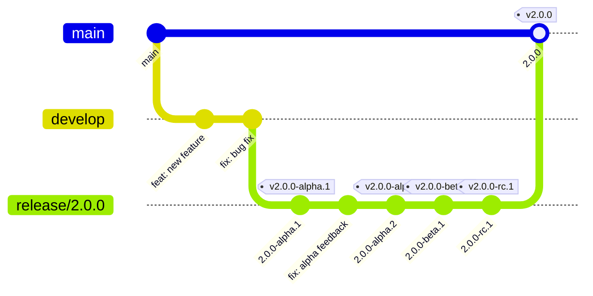
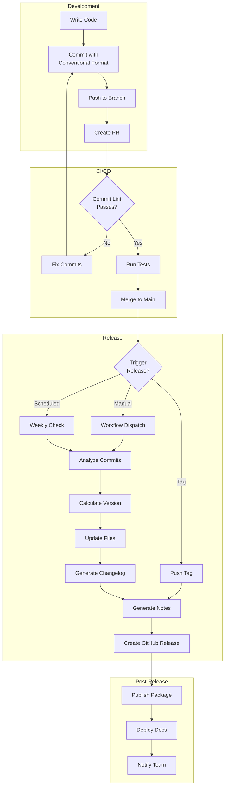

## Overview

Automated changelog generation reduces manual work and ensures consistent release documentation.
This guide defines standards for generating changelogs and release notes from conventional commits.

### What This Guide Covers

- Conventional commit message conventions
- Semantic versioning (SemVer) strategies
- Changelog format (Keep a Changelog)
- GitHub Release Notes configuration
- Automated release workflows
- Pre-release handling (alpha, beta, rc)
- Breaking change communication
- Deprecation notice patterns

## Conventional Commits

Conventional Commits provide a structured format for commit messages that enables automatic
changelog generation and semantic versioning.

### Commit Message Format

```text
<type>(<scope>): <subject>

<body>

<footer>
```

### Commit Types

```yaml
# Standard commit types with changelog mapping
types:
  # Features - triggers MINOR version bump
  feat: "A new feature"

  # Bug Fixes - triggers PATCH version bump
  fix: "A bug fix"

  # Documentation - no version bump
  docs: "Documentation only changes"

  # Styles - no version bump
  style: "Code style changes (formatting, semicolons)"

  # Refactoring - no version bump
  refactor: "Code refactoring without feature/fix"

  # Performance - triggers PATCH version bump
  perf: "Performance improvements"

  # Tests - no version bump
  test: "Adding or updating tests"

  # Build - no version bump
  build: "Build system or external dependencies"

  # CI - no version bump
  ci: "CI configuration changes"

  # Chores - no version bump
  chore: "Other changes (no src/test modification)"

  # Reverts - inherits from reverted commit
  revert: "Reverts a previous commit"
```

### Breaking Changes

```bash
# Method 1: Exclamation mark in type
feat!: remove deprecated authentication endpoint

# Method 2: BREAKING CHANGE in footer
feat(auth): add OAuth2 support

BREAKING CHANGE: The /auth/login endpoint has been removed.
Use /api/v2/auth/login instead.

# Method 3: Both for emphasis
feat(api)!: redesign user endpoints

BREAKING CHANGE: All user endpoints moved from /users to /api/v2/users.
Migration guide: https://docs.example.com/migration
```

### Example Commits

```bash
# Feature with scope
git commit -m "feat(auth): add OAuth2 login support"

# Bug fix with issue reference
git commit -m "fix(database): resolve connection pool memory leak

Fixes #125"

# Performance improvement
git commit -m "perf(queries): optimize user list with proper indexing

Reduces query time from 500ms to 50ms for 10k+ records"

# Breaking change with migration notes
git commit -m "feat(api)!: move endpoints to v2

BREAKING CHANGE: All API endpoints moved from /api to /api/v2.

Migration steps:
1. Update base URL in configuration
2. Review response format changes
3. Update client SDK to v2.x

Fixes #200"

# Documentation update
git commit -m "docs(readme): update installation instructions"

# Chore with multiple scopes
git commit -m "chore(deps): update dependencies

- Bump lodash from 4.17.20 to 4.17.21
- Bump axios from 0.21.1 to 0.21.4"
```

### Commitlint Configuration

```javascript
// commitlint.config.js
module.exports = {
  extends: ['@commitlint/config-conventional'],
  rules: {
    // Type must be one of the defined types
    'type-enum': [
      2,
      'always',
      [
        'feat',
        'fix',
        'docs',
        'style',
        'refactor',
        'perf',
        'test',
        'build',
        'ci',
        'chore',
        'revert',
      ],
    ],
    // Type must be lowercase
    'type-case': [2, 'always', 'lower-case'],
    // Subject must not be empty
    'subject-empty': [2, 'never'],
    // Subject must not end with period
    'subject-full-stop': [2, 'never', '.'],
    // Subject must be sentence case
    'subject-case': [2, 'always', 'sentence-case'],
    // Header max length 100 characters
    'header-max-length': [2, 'always', 100],
    // Body max line length 100 characters
    'body-max-line-length': [2, 'always', 100],
    // Footer max line length 100 characters
    'footer-max-line-length': [2, 'always', 100],
  },
};
```

### Pre-commit Hook for Commits

```yaml
# .pre-commit-config.yaml
repos:
  - repo: https://github.com/alessandrojcm/commitlint-pre-commit-hook
    rev: v9.5.0
    hooks:
      - id: commitlint
        stages: [commit-msg]
        additional_dependencies:
          - "@commitlint/config-conventional"
```

### GitHub Actions Commit Validation

```yaml
# .github/workflows/commit-lint.yml
name: Commit Lint

on:
  pull_request:
    types: [opened, edited, synchronize, reopened]

jobs:
  lint:
    runs-on: ubuntu-latest
    steps:
      - uses: actions/checkout@v4
        with:
          fetch-depth: 0

      - name: Setup Node.js
        uses: actions/setup-node@v4
        with:
          node-version: "20"

      - name: Install commitlint
        run: |
          npm install --save-dev @commitlint/cli @commitlint/config-conventional

      - name: Create commitlint config
        run: |
          cat > commitlint.config.js << 'EOF'
          module.exports = {
            extends: ['@commitlint/config-conventional'],
            rules: {
              'type-enum': [2, 'always', [
                'feat', 'fix', 'docs', 'style', 'refactor',
                'perf', 'test', 'build', 'ci', 'chore', 'revert'
              ]],
              'subject-case': [2, 'always', 'sentence-case'],
            },
          };
          EOF

      - name: Validate PR commits
        run: |
          npx commitlint --from ${{ github.event.pull_request.base.sha }} \
                         --to ${{ github.event.pull_request.head.sha }} \
                         --verbose
```

## Semantic Versioning

### Version Format

```text
MAJOR.MINOR.PATCH[-PRERELEASE][+BUILD]

Examples:
1.0.0           # Initial stable release
1.1.0           # Minor feature release
1.1.1           # Patch bug fix
2.0.0           # Major breaking change
2.0.0-alpha.1   # Alpha pre-release
2.0.0-beta.2    # Beta pre-release
2.0.0-rc.1      # Release candidate
2.0.0+build.123 # Build metadata
```

### Version Bump Rules

```yaml
# Version bump mapping from commit types
version_bumps:
  # MAJOR (X.0.0) - Breaking changes
  major:
    - "BREAKING CHANGE in footer"
    - "! after type (feat!, fix!)"
    - "Explicit major label"

  # MINOR (0.X.0) - New features
  minor:
    - "feat: new feature"
    - "feat(scope): scoped feature"

  # PATCH (0.0.X) - Bug fixes and improvements
  patch:
    - "fix: bug fix"
    - "perf: performance improvement"
    - "docs: documentation (optional)"
    - "refactor: code changes (optional)"

  # NO BUMP - Internal changes
  none:
    - "style: formatting"
    - "test: test changes"
    - "ci: CI changes"
    - "chore: maintenance"
    - "build: build system"
```

### Pre-release Versions

```yaml
# Pre-release version progression
prerelease_flow:
  # Development starts
  - "1.0.0"

  # Alpha releases (internal testing)
  - "2.0.0-alpha.1"
  - "2.0.0-alpha.2"
  - "2.0.0-alpha.3"

  # Beta releases (limited external testing)
  - "2.0.0-beta.1"
  - "2.0.0-beta.2"

  # Release candidates (final testing)
  - "2.0.0-rc.1"
  - "2.0.0-rc.2"

  # Stable release
  - "2.0.0"
```

## Changelog Format

### Keep a Changelog Standard

```markdown
# Changelog

All notable changes to this project will be documented in this file.

The format is based on [Keep a Changelog](https://keepachangelog.com/en/1.1.0/),
and this project adheres to [Semantic Versioning](https://semver.org/spec/v2.0.0.html).

## [Unreleased]

### Added

- New feature pending release

### Changed

- Updated behavior pending release

## [1.5.0] - 2025-01-10

### Added

- Add user authentication with OAuth2 ([#123](https://github.com/org/repo/pull/123))
- Implement caching layer with Redis ([#124](https://github.com/org/repo/pull/124))

### Changed

- Update API response format for consistency ([#130](https://github.com/org/repo/pull/130))

### Deprecated

- The `/auth/login` endpoint is deprecated, use `/api/v2/auth/login` instead

### Removed

- Remove legacy XML export feature ([#131](https://github.com/org/repo/pull/131))

### Fixed

- Fix memory leak in connection pool ([#125](https://github.com/org/repo/pull/125))
- Resolve race condition in user service ([#126](https://github.com/org/repo/pull/126))

### Security

- Update dependencies to patch CVE-2025-12345 ([#132](https://github.com/org/repo/pull/132))

## [1.4.0] - 2025-01-03

### Added

- Initial release features

## [1.3.0] - 2024-12-15

...

[Unreleased]: https://github.com/org/repo/compare/v1.5.0...HEAD
[1.5.0]: https://github.com/org/repo/compare/v1.4.0...v1.5.0
[1.4.0]: https://github.com/org/repo/compare/v1.3.0...v1.4.0
[1.3.0]: https://github.com/org/repo/releases/tag/v1.3.0
```

### Changelog Sections

```yaml
# Mapping conventional commits to changelog sections
changelog_sections:
  Added:
    - feat
  Changed:
    - refactor
    - perf
  Deprecated:
    - "Commits mentioning deprecation"
  Removed:
    - "Commits removing features"
  Fixed:
    - fix
  Security:
    - "Commits with security fixes"
    - "Dependency updates for CVEs"

# Hidden from changelog (internal changes)
hidden_sections:
  - style
  - test
  - ci
  - chore
  - build
  - docs  # Optional: include if valuable
```

## Conventional Changelog Configuration

### standard-version (Node.js)

```json
{
  "scripts": {
    "release": "standard-version",
    "release:minor": "standard-version --release-as minor",
    "release:major": "standard-version --release-as major",
    "release:patch": "standard-version --release-as patch",
    "release:alpha": "standard-version --prerelease alpha",
    "release:beta": "standard-version --prerelease beta",
    "release:rc": "standard-version --prerelease rc"
  },
  "standard-version": {
    "types": [
      { "type": "feat", "section": "Features" },
      { "type": "fix", "section": "Bug Fixes" },
      { "type": "perf", "section": "Performance Improvements" },
      { "type": "docs", "section": "Documentation" },
      { "type": "style", "hidden": true },
      { "type": "refactor", "section": "Code Refactoring" },
      { "type": "test", "hidden": true },
      { "type": "build", "hidden": true },
      { "type": "ci", "hidden": true },
      { "type": "chore", "hidden": true }
    ],
    "commitUrlFormat": "https://github.com/{{owner}}/{{repository}}/commit/{{hash}}",
    "compareUrlFormat": "https://github.com/{{owner}}/{{repository}}/compare/{{previousTag}}...{{currentTag}}",
    "issueUrlFormat": "https://github.com/{{owner}}/{{repository}}/issues/{{id}}",
    "userUrlFormat": "https://github.com/{{user}}",
    "releaseCommitMessageFormat": "chore(release): {{currentTag}}",
    "header": "# Changelog\n\nAll notable changes to this project will be documented in this file.\n\n",
    "skip": {
      "tag": false,
      "commit": false,
      "changelog": false
    }
  }
}
```

### .versionrc Configuration File

```json
{
  "types": [
    { "type": "feat", "section": "Features" },
    { "type": "fix", "section": "Bug Fixes" },
    { "type": "perf", "section": "Performance" },
    { "type": "docs", "section": "Documentation", "hidden": false },
    { "type": "style", "hidden": true },
    { "type": "refactor", "section": "Refactoring" },
    { "type": "test", "hidden": true },
    { "type": "build", "section": "Build System" },
    { "type": "ci", "hidden": true },
    { "type": "chore", "hidden": true },
    { "type": "revert", "section": "Reverts" }
  ],
  "preMajor": false,
  "commitUrlFormat": "{{host}}/{{owner}}/{{repository}}/commit/{{hash}}",
  "compareUrlFormat": "{{host}}/{{owner}}/{{repository}}/compare/{{previousTag}}...{{currentTag}}",
  "issueUrlFormat": "{{host}}/{{owner}}/{{repository}}/issues/{{id}}",
  "releaseCommitMessageFormat": "chore(release): {{currentTag}}\n\n{{changelog}}",
  "bumpFiles": [
    {
      "filename": "package.json",
      "type": "json"
    },
    {
      "filename": "pyproject.toml",
      "updater": "scripts/version-updater.js"
    },
    {
      "filename": "version.txt",
      "type": "plain-text"
    }
  ],
  "packageFiles": [
    {
      "filename": "package.json",
      "type": "json"
    }
  ]
}
```

### Python Version Updater

```javascript
// scripts/version-updater.js
// Custom updater for pyproject.toml
module.exports.readVersion = function (contents) {
  const match = contents.match(/version\s*=\s*"([^"]+)"/);
  return match ? match[1] : null;
};

module.exports.writeVersion = function (contents, version) {
  return contents.replace(
    /version\s*=\s*"[^"]+"/,
    `version = "${version}"`
  );
};
```

### Python Changelog Generation

```python
#!/usr/bin/env python3
"""
@module changelog_generator
@description Generate changelog from conventional commits
@version 1.0.0
@author Tyler Dukes
@last_updated 2025-01-25
@status stable
"""

import re
import subprocess
from dataclasses import dataclass
from datetime import datetime
from typing import Optional


@dataclass
class Commit:
    """Represents a parsed conventional commit."""

    hash: str
    type: str
    scope: Optional[str]
    subject: str
    body: Optional[str]
    breaking: bool
    references: list[str]


def parse_commit(message: str, hash: str) -> Optional[Commit]:
    """Parse a commit message into structured format."""
    pattern = r"^(\w+)(?:\(([^)]+)\))?(!)?:\s*(.+)$"
    match = re.match(pattern, message.split("\n")[0])

    if not match:
        return None

    type_, scope, breaking, subject = match.groups()

    body = "\n".join(message.split("\n")[1:]).strip() or None
    breaking = breaking == "!" or "BREAKING CHANGE" in message

    references = re.findall(r"#(\d+)", message)

    return Commit(
        hash=hash,
        type=type_,
        scope=scope,
        subject=subject,
        body=body,
        breaking=breaking,
        references=references,
    )


def get_commits_since_tag(tag: str) -> list[Commit]:
    """Get all commits since the specified tag."""
    result = subprocess.run(
        ["git", "log", f"{tag}..HEAD", "--format=%H|%B|END_COMMIT"],
        capture_output=True,
        text=True,
        check=True,
    )

    commits = []
    for entry in result.stdout.split("|END_COMMIT"):
        entry = entry.strip()
        if not entry:
            continue

        parts = entry.split("|", 1)
        if len(parts) == 2:
            commit = parse_commit(parts[1], parts[0])
            if commit:
                commits.append(commit)

    return commits


def generate_changelog(
    commits: list[Commit],
    version: str,
    date: Optional[str] = None,
) -> str:
    """Generate changelog markdown from commits."""
    if date is None:
        date = datetime.now().strftime("%Y-%m-%d")

    sections = {
        "Features": [],
        "Bug Fixes": [],
        "Performance": [],
        "Documentation": [],
        "Refactoring": [],
        "Breaking Changes": [],
    }

    type_mapping = {
        "feat": "Features",
        "fix": "Bug Fixes",
        "perf": "Performance",
        "docs": "Documentation",
        "refactor": "Refactoring",
    }

    for commit in commits:
        if commit.breaking:
            sections["Breaking Changes"].append(commit)

        section = type_mapping.get(commit.type)
        if section:
            sections[section].append(commit)

    output = [f"## [{version}] - {date}\n"]

    for section, section_commits in sections.items():
        if not section_commits:
            continue

        output.append(f"\n### {section}\n")
        for commit in section_commits:
            scope = f"**{commit.scope}**: " if commit.scope else ""
            refs = "".join(f" ([#{r}](issues/{r}))" for r in commit.references)
            output.append(f"- {scope}{commit.subject}{refs}")

    return "\n".join(output)


if __name__ == "__main__":
    import sys

    tag = sys.argv[1] if len(sys.argv) > 1 else "v0.0.0"
    version = sys.argv[2] if len(sys.argv) > 2 else "Unreleased"

    commits = get_commits_since_tag(tag)
    changelog = generate_changelog(commits, version)
    print(changelog)
```

## GitHub Release Notes

### Release Drafter Configuration

```yaml
# .github/release-drafter.yml
name-template: "v$RESOLVED_VERSION"
tag-template: "v$RESOLVED_VERSION"

template: |
  ## What's Changed

  $CHANGES

  **Full Changelog**: https://github.com/$OWNER/$REPOSITORY/compare/$PREVIOUS_TAG...v$RESOLVED_VERSION

categories:
  - title: "Breaking Changes"
    labels:
      - "breaking-change"
      - "major"
    collapse-after: 0

  - title: "Features"
    labels:
      - "feature"
      - "enhancement"
      - "type:feature"

  - title: "Bug Fixes"
    labels:
      - "bug"
      - "fix"
      - "type:bug"

  - title: "Security"
    labels:
      - "security"
      - "type:security"
    collapse-after: 0

  - title: "Performance"
    labels:
      - "performance"

  - title: "Documentation"
    labels:
      - "documentation"
      - "type:docs"

  - title: "Dependencies"
    labels:
      - "dependencies"
      - "scope:dependencies"
    collapse-after: 5

  - title: "Maintenance"
    labels:
      - "chore"
      - "maintenance"
      - "type:maintenance"
    collapse-after: 3

change-template: "- $TITLE @$AUTHOR (#$NUMBER)"
change-title-escapes: '\<*_&'

version-resolver:
  major:
    labels:
      - "major"
      - "breaking-change"
  minor:
    labels:
      - "minor"
      - "feature"
      - "enhancement"
  patch:
    labels:
      - "patch"
      - "bug"
      - "fix"
      - "documentation"
      - "maintenance"
  default: patch

autolabeler:
  - label: "feature"
    title:
      - "/^feat(\\(.+\\))?:/i"
  - label: "bug"
    title:
      - "/^fix(\\(.+\\))?:/i"
  - label: "documentation"
    title:
      - "/^docs(\\(.+\\))?:/i"
  - label: "maintenance"
    title:
      - "/^chore(\\(.+\\))?:/i"
      - "/^ci(\\(.+\\))?:/i"
  - label: "performance"
    title:
      - "/^perf(\\(.+\\))?:/i"
  - label: "breaking-change"
    title:
      - "/^\\w+!:/i"
    body:
      - "/BREAKING CHANGE/i"

exclude-labels:
  - "skip-changelog"
  - "wontfix"
  - "duplicate"

no-changes-template: "No notable changes in this release."

replacers:
  - search: '/\[skip ci\]/g'
    replace: ""
  - search: '/\[ci skip\]/g'
    replace: ""
```

### Release Drafter Workflow

```yaml
# .github/workflows/release-drafter.yml
name: Release Drafter

on:
  push:
    branches:
      - main
  pull_request:
    types:
      - opened
      - reopened
      - synchronize

permissions:
  contents: read
  pull-requests: write

jobs:
  update_release_draft:
    runs-on: ubuntu-latest
    steps:
      - name: Draft Release
        uses: release-drafter/release-drafter@v6
        with:
          config-name: release-drafter.yml
          disable-autolabeler: false
        env:
          GITHUB_TOKEN: ${{ secrets.GITHUB_TOKEN }}
```

### Manual Release Notes Template

````markdown
# Release v1.5.0

> Release date: 2025-01-10

## Highlights

Briefly describe the most important changes in this release.

## Features

- **Authentication**: Add OAuth2 login support (#123) @developer1
  - Users can now login with Google, GitHub, or Microsoft accounts
  - Includes automatic account linking for existing users

- **Caching**: Implement Redis caching layer (#124) @developer2
  - Reduces database load by 60%
  - Improves API response times by 40%

## Bug Fixes

- **Database**: Fix connection pool memory leak (#125) @developer3
- **Concurrency**: Resolve race condition in user service (#126) @developer4

## Performance

- **Queries**: Optimize database queries with proper indexing (#127)
  - User list endpoint now 10x faster

## Documentation

- Update API docs for v1.5 endpoints (#128)

## Breaking Changes

> **IMPORTANT**: This release contains breaking changes

### API Endpoint Migration

| Old Endpoint | New Endpoint | Notes |
|-------------|--------------|-------|
| `/auth/login` | `/api/v2/auth/login` | Response format changed |
| `/users/create` | `/api/v2/users` | Use POST method |

### Configuration Changes

```yaml
# Before (deprecated)
auth:
  endpoint: "/auth"

# After (required)
auth:
  endpoint: "/api/v2/auth"
  version: 2
```

## Deprecations

The following features are deprecated and will be removed in v2.0.0:

| Feature | Deprecated In | Removal Target | Replacement |
|---------|---------------|----------------|-------------|
| XML export | v1.5.0 | v2.0.0 | JSON export |
| Basic auth | v1.5.0 | v2.0.0 | OAuth2 |

## Migration Guide

See [MIGRATION_GUIDE.md](https://github.com/org/repo/blob/main/docs/MIGRATION_GUIDE.md)
for detailed upgrade instructions.

### Quick Migration

```bash
# Update configuration
sed -i 's|/auth|/api/v2/auth|g' config.yaml

# Update client SDK
npm install @company/sdk@2.0.0
```

## Security

- Update lodash to patch CVE-2025-12345 (#132)
- Add rate limiting to authentication endpoints

## Dependencies

<details>
<summary>Dependency updates</summary>

- Bump axios from 0.21.1 to 1.6.0
- Bump lodash from 4.17.20 to 4.17.21
- Bump webpack from 5.75.0 to 5.89.0

</details>

## Contributors

Thank you to all contributors:

- @developer1 - OAuth2 implementation
- @developer2 - Caching layer
- @developer3 - Database fixes
- @developer4 - Concurrency fixes

## Checksums

SHA256 (release-v1.5.0.tar.gz) = abc123...
SHA256 (release-v1.5.0.zip) = def456...

**Full Changelog**: <https://github.com/org/repo/compare/v1.4.0...v1.5.0>
````

## Automated Release Workflows

### Complete Release Workflow

```yaml
# .github/workflows/release.yml
name: Release

on:
  workflow_dispatch:
    inputs:
      version_bump:
        description: "Version bump type"
        required: true
        type: choice
        options:
          - auto
          - patch
          - minor
          - major
        default: auto
      prerelease:
        description: "Pre-release identifier (alpha, beta, rc, or empty)"
        required: false
        type: string
        default: ""
      dry_run:
        description: "Dry run (no actual release)"
        required: false
        type: boolean
        default: false

permissions:
  contents: write
  pull-requests: write

jobs:
  release:
    runs-on: ubuntu-latest
    outputs:
      version: ${{ steps.version.outputs.version }}
      tag: ${{ steps.version.outputs.tag }}
      changelog: ${{ steps.changelog.outputs.changelog }}

    steps:
      - name: Checkout
        uses: actions/checkout@v4
        with:
          fetch-depth: 0
          token: ${{ secrets.RELEASE_TOKEN }}

      - name: Setup Node.js
        uses: actions/setup-node@v4
        with:
          node-version: "20"

      - name: Get current version
        id: current
        run: |
          CURRENT=$(cat package.json | jq -r '.version')
          echo "version=$CURRENT" >> $GITHUB_OUTPUT
          echo "Current version: $CURRENT"

      - name: Determine version bump
        id: bump
        run: |
          if [ "${{ inputs.version_bump }}" = "auto" ]; then
            # Analyze commits since last tag
            LAST_TAG=$(git describe --tags --abbrev=0 2>/dev/null || echo "")

            if [ -z "$LAST_TAG" ]; then
              echo "type=minor" >> $GITHUB_OUTPUT
              exit 0
            fi

            # Check for breaking changes
            if git log $LAST_TAG..HEAD --format=%B | grep -qE "^(\w+)!:|BREAKING CHANGE"; then
              echo "type=major" >> $GITHUB_OUTPUT
            # Check for features
            elif git log $LAST_TAG..HEAD --format=%s | grep -qE "^feat(\(.+\))?:"; then
              echo "type=minor" >> $GITHUB_OUTPUT
            else
              echo "type=patch" >> $GITHUB_OUTPUT
            fi
          else
            echo "type=${{ inputs.version_bump }}" >> $GITHUB_OUTPUT
          fi

      - name: Calculate new version
        id: version
        run: |
          CURRENT="${{ steps.current.outputs.version }}"
          BUMP="${{ steps.bump.outputs.type }}"
          PRERELEASE="${{ inputs.prerelease }}"

          # Parse current version
          IFS='.-' read -r MAJOR MINOR PATCH PRE <<< "$CURRENT"

          # Calculate new version
          case $BUMP in
            major)
              NEW_VERSION="$((MAJOR + 1)).0.0"
              ;;
            minor)
              NEW_VERSION="$MAJOR.$((MINOR + 1)).0"
              ;;
            patch)
              NEW_VERSION="$MAJOR.$MINOR.$((PATCH + 1))"
              ;;
          esac

          # Add pre-release suffix
          if [ -n "$PRERELEASE" ]; then
            # Find next pre-release number
            EXISTING=$(git tag -l "v${NEW_VERSION}-${PRERELEASE}.*" | sort -V | tail -1)
            if [ -n "$EXISTING" ]; then
              PRE_NUM=$(echo "$EXISTING" | grep -oE '[0-9]+$')
              NEW_VERSION="${NEW_VERSION}-${PRERELEASE}.$((PRE_NUM + 1))"
            else
              NEW_VERSION="${NEW_VERSION}-${PRERELEASE}.1"
            fi
          fi

          echo "version=$NEW_VERSION" >> $GITHUB_OUTPUT
          echo "tag=v$NEW_VERSION" >> $GITHUB_OUTPUT
          echo "New version: $NEW_VERSION"

      - name: Generate changelog
        id: changelog
        run: |
          LAST_TAG=$(git describe --tags --abbrev=0 2>/dev/null || echo "")
          VERSION="${{ steps.version.outputs.version }}"

          if [ -z "$LAST_TAG" ]; then
            COMMITS=$(git log --format="- %s (%h)" | head -50)
          else
            COMMITS=$(git log $LAST_TAG..HEAD --format="- %s (%h)")
          fi

          # Generate structured changelog
          FEATURES=$(echo "$COMMITS" | grep -E "^- feat" || true)
          FIXES=$(echo "$COMMITS" | grep -E "^- fix" || true)
          PERF=$(echo "$COMMITS" | grep -E "^- perf" || true)
          DOCS=$(echo "$COMMITS" | grep -E "^- docs" || true)
          BREAKING=$(echo "$COMMITS" | grep -E "^- \w+!:" || true)

          CHANGELOG=""

          if [ -n "$BREAKING" ]; then
            CHANGELOG+="### Breaking Changes\n$BREAKING\n\n"
          fi

          if [ -n "$FEATURES" ]; then
            CHANGELOG+="### Features\n$FEATURES\n\n"
          fi

          if [ -n "$FIXES" ]; then
            CHANGELOG+="### Bug Fixes\n$FIXES\n\n"
          fi

          if [ -n "$PERF" ]; then
            CHANGELOG+="### Performance\n$PERF\n\n"
          fi

          # Save to file for artifact
          echo -e "$CHANGELOG" > changelog-$VERSION.md

          # Output for use in workflow
          echo "changelog<<EOF" >> $GITHUB_OUTPUT
          echo -e "$CHANGELOG" >> $GITHUB_OUTPUT
          echo "EOF" >> $GITHUB_OUTPUT

      - name: Update version files
        if: ${{ !inputs.dry_run }}
        run: |
          VERSION="${{ steps.version.outputs.version }}"

          # Update package.json
          jq ".version = \"$VERSION\"" package.json > tmp.json
          mv tmp.json package.json

          # Update pyproject.toml if exists
          if [ -f pyproject.toml ]; then
            sed -i "s/^version = .*/version = \"$VERSION\"/" pyproject.toml
          fi

          # Update version.txt if exists
          if [ -f version.txt ]; then
            echo "$VERSION" > version.txt
          fi

      - name: Update CHANGELOG.md
        if: ${{ !inputs.dry_run }}
        run: |
          VERSION="${{ steps.version.outputs.version }}"
          DATE=$(date +%Y-%m-%d)
          CHANGELOG="${{ steps.changelog.outputs.changelog }}"

          # Create new changelog entry
          NEW_ENTRY="## [$VERSION] - $DATE\n\n$CHANGELOG"

          # Insert after header
          if [ -f CHANGELOG.md ]; then
            sed -i "/^## \[Unreleased\]/a\\
          \\
          $NEW_ENTRY" CHANGELOG.md
          else
            cat > CHANGELOG.md << EOF
          # Changelog

          All notable changes to this project will be documented in this file.

          ## [Unreleased]

          $NEW_ENTRY
          EOF
          fi

      - name: Commit version bump
        if: ${{ !inputs.dry_run }}
        run: |
          git config user.name "github-actions[bot]"
          git config user.email "github-actions[bot]@users.noreply.github.com"

          git add -A
          git commit -m "chore(release): ${{ steps.version.outputs.tag }}"
          git push

      - name: Create tag
        if: ${{ !inputs.dry_run }}
        run: |
          git tag -a "${{ steps.version.outputs.tag }}" \
            -m "Release ${{ steps.version.outputs.tag }}"
          git push origin "${{ steps.version.outputs.tag }}"

      - name: Create GitHub Release
        if: ${{ !inputs.dry_run }}
        uses: softprops/action-gh-release@v2
        with:
          tag_name: ${{ steps.version.outputs.tag }}
          name: Release ${{ steps.version.outputs.tag }}
          body: ${{ steps.changelog.outputs.changelog }}
          draft: false
          prerelease: ${{ inputs.prerelease != '' }}
          generate_release_notes: true

      - name: Dry run summary
        if: ${{ inputs.dry_run }}
        run: |
          echo "## Dry Run Summary" >> $GITHUB_STEP_SUMMARY
          echo "" >> $GITHUB_STEP_SUMMARY
          echo "**Version**: ${{ steps.version.outputs.version }}" >> $GITHUB_STEP_SUMMARY
          echo "**Tag**: ${{ steps.version.outputs.tag }}" >> $GITHUB_STEP_SUMMARY
          echo "" >> $GITHUB_STEP_SUMMARY
          echo "### Changelog" >> $GITHUB_STEP_SUMMARY
          echo "${{ steps.changelog.outputs.changelog }}" >> $GITHUB_STEP_SUMMARY
```

### Tag-Based Release Workflow

```yaml
# .github/workflows/release-on-tag.yml
name: Release on Tag

on:
  push:
    tags:
      - "v*.*.*"

permissions:
  contents: write

jobs:
  release:
    runs-on: ubuntu-latest
    steps:
      - name: Checkout
        uses: actions/checkout@v4
        with:
          fetch-depth: 0

      - name: Get tag info
        id: tag
        run: |
          TAG=${GITHUB_REF#refs/tags/}
          VERSION=${TAG#v}
          echo "tag=$TAG" >> $GITHUB_OUTPUT
          echo "version=$VERSION" >> $GITHUB_OUTPUT

          # Check if pre-release
          if [[ "$VERSION" == *"-"* ]]; then
            echo "prerelease=true" >> $GITHUB_OUTPUT
          else
            echo "prerelease=false" >> $GITHUB_OUTPUT
          fi

      - name: Get previous tag
        id: previous
        run: |
          PREVIOUS=$(git describe --tags --abbrev=0 HEAD^ 2>/dev/null || echo "")
          echo "tag=$PREVIOUS" >> $GITHUB_OUTPUT

      - name: Generate release notes
        id: notes
        run: |
          TAG="${{ steps.tag.outputs.tag }}"
          PREVIOUS="${{ steps.previous.outputs.tag }}"

          if [ -z "$PREVIOUS" ]; then
            RANGE="HEAD"
          else
            RANGE="$PREVIOUS..HEAD"
          fi

          # Generate categorized notes
          cat > release-notes.md << 'EOF'
          ## What's Changed

          EOF

          # Breaking changes
          BREAKING=$(git log $RANGE --format="- %s (%h)" | grep -E "^- \w+!:" || true)
          if [ -n "$BREAKING" ]; then
            echo -e "### Breaking Changes\n\n$BREAKING\n" >> release-notes.md
          fi

          # Features
          FEATURES=$(git log $RANGE --format="- %s (%h)" | grep -E "^- feat" || true)
          if [ -n "$FEATURES" ]; then
            echo -e "### Features\n\n$FEATURES\n" >> release-notes.md
          fi

          # Bug fixes
          FIXES=$(git log $RANGE --format="- %s (%h)" | grep -E "^- fix" || true)
          if [ -n "$FIXES" ]; then
            echo -e "### Bug Fixes\n\n$FIXES\n" >> release-notes.md
          fi

          # Other changes
          OTHER=$(git log $RANGE --format="- %s (%h)" | grep -vE "^- (feat|fix|\w+!:)" || true)
          if [ -n "$OTHER" ]; then
            echo -e "### Other Changes\n\n$OTHER\n" >> release-notes.md
          fi

          cat release-notes.md

      - name: Create Release
        uses: softprops/action-gh-release@v2
        with:
          tag_name: ${{ steps.tag.outputs.tag }}
          name: Release ${{ steps.tag.outputs.tag }}
          body_path: release-notes.md
          draft: false
          prerelease: ${{ steps.tag.outputs.prerelease == 'true' }}
          generate_release_notes: true
```

### Scheduled Release Workflow

```yaml
# .github/workflows/scheduled-release.yml
name: Scheduled Release

on:
  schedule:
    # Every Monday at 9 AM UTC
    - cron: "0 9 * * 1"
  workflow_dispatch:

permissions:
  contents: write
  pull-requests: write

jobs:
  check-changes:
    runs-on: ubuntu-latest
    outputs:
      has_changes: ${{ steps.check.outputs.has_changes }}
      commits: ${{ steps.check.outputs.commits }}
    steps:
      - name: Checkout
        uses: actions/checkout@v4
        with:
          fetch-depth: 0

      - name: Check for unreleased changes
        id: check
        run: |
          LAST_TAG=$(git describe --tags --abbrev=0 2>/dev/null || echo "")

          if [ -z "$LAST_TAG" ]; then
            COMMITS=$(git log --oneline | wc -l)
          else
            COMMITS=$(git log $LAST_TAG..HEAD --oneline | wc -l)
          fi

          if [ "$COMMITS" -gt 0 ]; then
            echo "has_changes=true" >> $GITHUB_OUTPUT
            echo "commits=$COMMITS" >> $GITHUB_OUTPUT
            echo "Found $COMMITS unreleased commits"
          else
            echo "has_changes=false" >> $GITHUB_OUTPUT
            echo "commits=0" >> $GITHUB_OUTPUT
            echo "No unreleased changes"
          fi

  release:
    needs: check-changes
    if: needs.check-changes.outputs.has_changes == 'true'
    uses: ./.github/workflows/release.yml
    with:
      version_bump: auto
    secrets: inherit
```

## Pre-release Management

### Pre-release Workflow

```yaml
# .github/workflows/prerelease.yml
name: Pre-release

on:
  workflow_dispatch:
    inputs:
      type:
        description: "Pre-release type"
        required: true
        type: choice
        options:
          - alpha
          - beta
          - rc
        default: alpha

jobs:
  prerelease:
    runs-on: ubuntu-latest
    steps:
      - name: Checkout
        uses: actions/checkout@v4
        with:
          fetch-depth: 0

      - name: Calculate version
        id: version
        run: |
          # Get latest stable version
          STABLE=$(git tag -l "v*.*.*" | grep -v "-" | sort -V | tail -1)
          STABLE=${STABLE:-v0.0.0}
          VERSION=${STABLE#v}

          # Parse version
          IFS='.' read -r MAJOR MINOR PATCH <<< "$VERSION"

          # Increment minor for pre-release
          NEXT_VERSION="$MAJOR.$((MINOR + 1)).0"

          # Find next pre-release number
          TYPE="${{ inputs.type }}"
          EXISTING=$(git tag -l "v${NEXT_VERSION}-${TYPE}.*" | sort -V | tail -1)

          if [ -n "$EXISTING" ]; then
            NUM=$(echo "$EXISTING" | grep -oE '[0-9]+$')
            PRE_VERSION="${NEXT_VERSION}-${TYPE}.$((NUM + 1))"
          else
            PRE_VERSION="${NEXT_VERSION}-${TYPE}.1"
          fi

          echo "version=$PRE_VERSION" >> $GITHUB_OUTPUT
          echo "tag=v$PRE_VERSION" >> $GITHUB_OUTPUT

      - name: Create pre-release
        uses: softprops/action-gh-release@v2
        with:
          tag_name: ${{ steps.version.outputs.tag }}
          name: ${{ steps.version.outputs.tag }}
          prerelease: true
          generate_release_notes: true
```

### Pre-release Branch Strategy



## Breaking Change Communication

### Breaking Change Template

```markdown
## Breaking Changes in v2.0.0

### Summary

Brief description of what changed and why.

### Changes

#### 1. API Endpoint Migration

**Before (v1.x)**:

```bash
curl -X POST https://api.example.com/auth/login \
  -d '{"username": "user", "password": "pass"}'
```

**After (v2.x)**:

```bash
curl -X POST https://api.example.com/api/v2/auth/login \
  -H "Content-Type: application/json" \
  -d '{"email": "user@example.com", "password": "pass"}'
```

**Migration Steps**:

1. Update base URL from `/auth` to `/api/v2/auth`
2. Change `username` field to `email`
3. Add `Content-Type` header

#### 2. Configuration Schema Change

**Before (v1.x)**:

```yaml
database:
  host: localhost
  port: 5432
```

**After (v2.x)**:

```yaml
database:
  connection:
    host: localhost
    port: 5432
  pool:
    min: 5
    max: 20
```

### Deprecation Timeline

| Version | Date | Action |
|---------|------|--------|
| v1.5.0 | 2025-01-01 | Deprecation warning added |
| v1.6.0 | 2025-02-01 | Warning becomes error in strict mode |
| v2.0.0 | 2025-03-01 | Feature removed |

### Automated Migration

```bash
# Run migration script
npx @company/migrate-v2

# Or manually
sed -i 's|/auth|/api/v2/auth|g' config.yaml
```

### Support

For migration assistance:

- Documentation: [Migration Guide](https://docs.example.com/migration/v2)
- Issues: [GitHub Issues](https://github.com/org/repo/issues)
- Discussion: [GitHub Discussions](https://github.com/org/repo/discussions)

```text
# End of breaking change template
```

### Deprecation Notice Format

```python
import warnings
from functools import wraps
from typing import Callable


def deprecated(
    version: str,
    removal_version: str,
    replacement: str | None = None,
) -> Callable:
    """Mark a function as deprecated.

    Args:
        version: Version when deprecated
        removal_version: Version when will be removed
        replacement: Suggested replacement function

    Returns:
        Decorated function with deprecation warning
    """

    def decorator(func: Callable) -> Callable:
        @wraps(func)
        def wrapper(*args, **kwargs):
            message = (
                f"{func.__name__} is deprecated since v{version} "
                f"and will be removed in v{removal_version}."
            )
            if replacement:
                message += f" Use {replacement} instead."

            warnings.warn(message, DeprecationWarning, stacklevel=2)
            return func(*args, **kwargs)

        return wrapper

    return decorator


# Usage example
@deprecated(
    version="1.5.0",
    removal_version="2.0.0",
    replacement="authenticate_oauth",
)
def authenticate_basic(username: str, password: str) -> bool:
    """Legacy basic authentication (deprecated)."""
    # Implementation
    pass


def authenticate_oauth(token: str) -> bool:
    """Modern OAuth authentication."""
    # Implementation
    pass
```

### Deprecation in TypeScript

```typescript
/**
 * Mark a method as deprecated with automatic warning.
 */
function deprecated(
  version: string,
  removalVersion: string,
  replacement?: string
) {
  return function (
    target: any,
    propertyKey: string,
    descriptor: PropertyDescriptor
  ) {
    const originalMethod = descriptor.value;

    descriptor.value = function (...args: any[]) {
      let message =
        `${propertyKey} is deprecated since v${version} ` +
        `and will be removed in v${removalVersion}.`;

      if (replacement) {
        message += ` Use ${replacement} instead.`;
      }

      console.warn(`[DEPRECATION] ${message}`);
      return originalMethod.apply(this, args);
    };

    return descriptor;
  };
}

// Usage example
class AuthService {
  @deprecated("1.5.0", "2.0.0", "authenticateOAuth")
  authenticateBasic(username: string, password: string): boolean {
    // Legacy implementation
    return true;
  }

  authenticateOAuth(token: string): boolean {
    // Modern implementation
    return true;
  }
}
```

## Best Practices

### Changelog Maintenance

```yaml
# Changelog best practices
changelog_guidelines:
  # What to include
  include:
    - User-facing changes
    - API changes
    - Breaking changes
    - Security fixes
    - Performance improvements
    - Dependency updates (major only)

  # What to exclude
  exclude:
    - Internal refactoring
    - Code style changes
    - Test-only changes
    - CI/CD changes
    - Typo fixes

  # Writing style
  style:
    - Use imperative mood ("Add feature" not "Added feature")
    - Start with action verb
    - Include issue/PR references
    - Group related changes
    - Keep entries concise
```

### Release Checklist

```yaml
# Pre-release checklist
release_checklist:
  preparation:
    - [ ] All tests passing
    - [ ] Documentation updated
    - [ ] CHANGELOG.md updated
    - [ ] Breaking changes documented
    - [ ] Migration guide written (if applicable)
    - [ ] Dependencies up to date

  validation:
    - [ ] Version number correct
    - [ ] Pre-release tags accurate
    - [ ] Links in changelog work
    - [ ] Release notes reviewed

  post_release:
    - [ ] GitHub release created
    - [ ] Package published
    - [ ] Documentation deployed
    - [ ] Announcement posted
    - [ ] Monitoring alerts checked
```

### Automation Flow



## Related Documentation

- [GitHub Actions Guide](./github_actions_guide.md) - Complete CI/CD patterns
- [Pre-commit Hooks Guide](./precommit_hooks_guide.md) - Local validation
- [Dependabot Auto-Merge](./dependabot_auto_merge.md) - Automated dependency updates

## References

- [Conventional Commits Specification](https://www.conventionalcommits.org/)
- [Keep a Changelog](https://keepachangelog.com/)
- [Semantic Versioning](https://semver.org/)
- [Release Drafter](https://github.com/release-drafter/release-drafter)
- [standard-version](https://github.com/conventional-changelog/standard-version)
