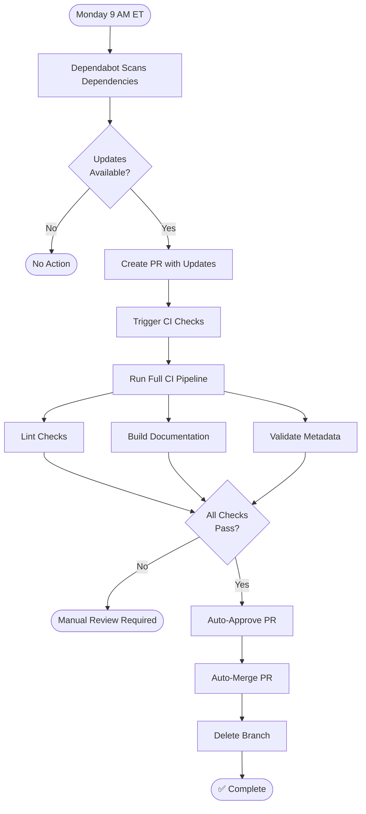

## Overview

This guide explains the Dependabot auto-merge configuration for this repository, enabling automatic
merging of dependency updates when all CI checks pass.

### What This Configuration Provides

- ✅ **Automated Dependency Updates**: Weekly checks for Python, GitHub Actions, and Docker updates
- ✅ **Auto-Merge for Safe Updates**: Automatic merging of patch/minor updates after checks pass
- ✅ **Maintainer Auto-Merge**: Auto-merge support for repository maintainer PRs
- ✅ **Grouped Updates**: Related dependencies updated together to reduce PR noise
- ✅ **Security-First**: All security checks must pass before auto-merge

## Configuration Files

### Dependabot Configuration

Located at `.github/dependabot.yml`:

```yaml
version: 2
updates:
  # Python dependencies
  - package-ecosystem: "pip"
    directory: "/"
    schedule:
      interval: "weekly"
      day: "monday"
      time: "09:00"
      timezone: "America/New_York"
    open-pull-requests-limit: 10
    labels:
      - "dependencies"
      - "python"
    groups:
      mkdocs:
        patterns:
          - "mkdocs*"
        update-types:
          - "minor"
          - "patch"

  # GitHub Actions
  - package-ecosystem: "github-actions"
    directory: "/"
    schedule:
      interval: "weekly"
    labels:
      - "dependencies"
      - "github-actions"

  # Docker
  - package-ecosystem: "docker"
    directory: "/"
    schedule:
      interval: "weekly"
    labels:
      - "dependencies"
      - "docker"
```

### Auto-Merge Workflow

Located at `.github/workflows/auto-merge.yml`:

```yaml
name: Auto-Merge

on:
  pull_request:
    types: [opened, synchronize, reopened]
  pull_request_review:
    types: [submitted]
  check_suite:
    types: [completed]
  status: {}

jobs:
  auto-merge:
    runs-on: ubuntu-latest
    if: |
      github.event.pull_request.user.login == 'dependabot[bot]' ||
      github.event.pull_request.user.login == 'tydukes'

    permissions:
      contents: write
      pull-requests: write

    steps:
      - name: Wait for status checks
        # Ensures all CI checks pass before merge

      - name: Auto-approve Dependabot PR
        # Automatically approves Dependabot PRs

      - name: Enable auto-merge
        # Merges PR using squash strategy

      - name: Delete branch after merge
        # Cleans up Dependabot branches
```

## How It Works

### Update Flow



### Trigger Conditions

The auto-merge workflow triggers on:

1. **PR Events**: When a PR is opened, synchronized, or reopened
2. **Review Events**: When a review is submitted
3. **Check Suite Events**: When CI checks complete
4. **Status Events**: When commit statuses update

### Merge Criteria

A PR is auto-merged when:

1. ✅ **Author Check**: PR is from `dependabot[bot]` or `tydukes`
2. ✅ **CI Checks**: All required checks pass
3. ✅ **Status Checks**: Combined status is "success"
4. ✅ **Mergeable State**: No merge conflicts

## Update Grouping Strategy

### Python Dependencies

**MkDocs Group**: All `mkdocs*` packages updated together

```yaml
groups:
  mkdocs:
    patterns:
      - "mkdocs*"
    update-types:
      - "minor"
      - "patch"
```

**Development Dependencies**: All dev dependencies grouped

```yaml
dev-dependencies:
  dependency-type: "development"
  update-types:
    - "minor"
    - "patch"
```

### Benefits of Grouping

- **Reduced PR Noise**: One PR instead of multiple for related updates
- **Compatibility Testing**: Related packages tested together
- **Faster Reviews**: Single review for related changes

## Security Considerations

### What Gets Auto-Merged

✅ **Safe for Auto-Merge**:

- Patch version updates (1.2.3 → 1.2.4)
- Minor version updates (1.2.0 → 1.3.0) for grouped dependencies
- GitHub Actions updates (specific version pins)
- Docker base image patches

❌ **Requires Manual Review**:

- Major version updates (1.x.x → 2.x.x)
- Security vulnerabilities (even if checks pass)
- Breaking changes noted in changelogs
- Failed CI checks

### CI Requirements

Before auto-merge, the following must pass:

1. **Lint Checks**: Markdown, YAML, Python formatting
2. **Build Process**: MkDocs documentation builds successfully
3. **Metadata Validation**: All frontmatter is valid
4. **No Merge Conflicts**: PR is mergeable

## Maintainer Auto-Merge

The workflow also supports auto-merge for repository maintainer (@tydukes):

```yaml
if: |
  github.event.pull_request.user.login == 'dependabot[bot]' ||
  github.event.pull_request.user.login == 'tydukes'
```

This enables fast iteration when:

- Making quick documentation fixes
- Updating configuration files
- Applying style guide updates

## Monitoring and Troubleshooting

### Check Workflow Status

View auto-merge workflow runs:

```bash
gh run list --workflow=auto-merge.yml
```

View specific run details:

```bash
gh run view <run-id>
```

### Common Issues

**Issue**: Auto-merge not triggering

- **Check**: Verify PR author is `dependabot[bot]` or `tydukes`
- **Check**: Ensure all CI checks have completed
- **Check**: Review workflow permissions in repository settings

**Issue**: Checks failing

- **Check**: Review CI workflow logs
- **Check**: Check for merge conflicts
- **Check**: Verify dependencies are compatible

**Issue**: Merge conflicts

- **Solution**: Dependabot automatically rebases, wait for update
- **Manual**: Close PR, Dependabot will recreate

### GitHub Permissions Required

The auto-merge workflow requires:

```yaml
permissions:
  contents: write        # To merge PRs
  pull-requests: write   # To approve and manage PRs
```

These are granted at the job level in the workflow.

## Best Practices

### Update Scheduling

- **Weekly Updates**: Monday 9 AM ET reduces weekend noise
- **Open PR Limit**: Cap at 10 for Python, 5 for Actions/Docker
- **Timezone**: Set to primary developer timezone

### Commit Messages

Dependabot PRs use consistent formatting:

```yaml
commit-message:
  prefix: "chore"              # chore(deps): update...
  prefix-development: "chore"  # Same for dev deps
  include: "scope"             # Include dependency scope
```

### Review and Assignment

```yaml
reviewers:
  - "tydukes"    # Notify maintainer
assignees:
  - "tydukes"    # Assign for visibility
```

Even with auto-merge, maintainer receives notifications for awareness.

## Customization

### Adding Package Ecosystems

To add more ecosystems (e.g., npm, cargo):

```yaml
- package-ecosystem: "npm"
  directory: "/"
  schedule:
    interval: "weekly"
  groups:
    production:
      dependency-type: "production"
      update-types:
        - "patch"
```

### Adjusting Merge Strategy

Change from squash to merge or rebase:

```javascript
merge_method: 'merge'    // Options: merge, squash, rebase
```

### Custom Approval Logic

Add additional checks before auto-approve:

```javascript
// Check changelog for breaking changes
const changelog = await fetchChangelog(dependency);
if (changelog.includes('BREAKING')) {
  core.setFailed('Breaking change detected');
}
```

## Related Documentation

- [GitHub Actions Guide](./github_actions_guide.md) - Complete CI/CD patterns
- [GitHub Actions Language Guide](../02_language_guides/github_actions.md) - YAML syntax
- [Pre-commit Hooks Guide](./precommit_hooks_guide.md) - Local validation

## References

- [Dependabot Documentation](https://docs.github.com/en/code-security/dependabot)
- [GitHub Actions Permissions](https://docs.github.com/en/actions/security-guides/automatic-token-authentication)
- [Auto-Merge Pull Requests](https://docs.github.com/en/pull-requests/collaborating-with-pull-requests/incorporating-changes-from-a-pull-request/automatically-merging-a-pull-request)

---

**Note**: This configuration is designed for a single-maintainer repository with trusted dependency
sources. Adjust security controls for multi-contributor projects.
