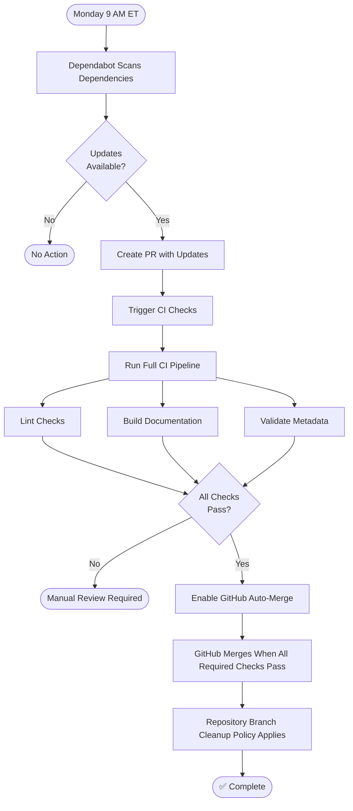

## Overview

This guide explains the Dependabot auto-merge configuration for this repository. The workflow enables
GitHub auto-merge for trusted same-repository pull requests after CI succeeds, while branch
protection and required checks still decide when the pull request can merge.

### What This Configuration Provides

- ✅ **Automated Dependency Updates**: Weekly checks for Python, GitHub Actions, and Docker updates
- ✅ **Auto-Merge for Safe Updates**: GitHub auto-merge enablement for patch/minor updates
- ✅ **Maintainer Auto-Merge**: Auto-merge enablement for trusted maintainer PRs
- ✅ **Grouped Updates**: Related dependencies updated together to reduce PR noise
- ✅ **Security-First**: All security checks must pass before auto-merge

## Configuration Files

### Dependabot Configuration

Located at `.github/dependabot.yml`:

```yaml
version: 2
updates:
  # Python dependencies
  - package-ecosystem: "pip"
    directory: "/"
    schedule:
      interval: "weekly"
      day: "monday"
      time: "09:00"
      timezone: "America/New_York"
    open-pull-requests-limit: 10
    labels:
      - "dependencies"
      - "python"
    groups:
      mkdocs:
        patterns:
          - "mkdocs*"
        update-types:
          - "minor"
          - "patch"

  # GitHub Actions
  - package-ecosystem: "github-actions"
    directory: "/"
    schedule:
      interval: "weekly"
    labels:
      - "dependencies"
      - "github-actions"

  # Docker
  - package-ecosystem: "docker"
    directory: "/"
    schedule:
      interval: "weekly"
    labels:
      - "dependencies"
      - "docker"
```

### Auto-Merge Workflow

Located at `.github/workflows/auto-merge.yml`:

```yaml
name: Auto-Merge

on:
  workflow_run:
    workflows: ["CI"]
    types: [completed]

jobs:
  auto-merge:
    runs-on: ubuntu-latest
    if: >
      github.event.workflow_run.conclusion == 'success' &&
      github.event.workflow_run.event == 'pull_request'

    permissions:
      contents: read
      pull-requests: write
      issues: write

    steps:
      - name: Check auto-merge eligibility
        # Allows dependabot[bot] and tydukes on same-repository branches only

      - name: Enable auto-merge
        # Uses GitHub auto-merge with squash strategy
```

## Setup Requirements

### Token Model

The workflow uses the default `GITHUB_TOKEN` for repository reads and pull request comments. It uses
`AUTO_MERGE_TOKEN` only for the GitHub auto-merge enablement mutation because GitHub rejected that
operation from the `workflow_run` event when attempted with `GITHUB_TOKEN`.

```yaml
permissions:
  contents: read
  pull-requests: write
  issues: write

secrets:
  AUTO_MERGE_TOKEN:
    use: enable GitHub auto-merge for trusted same-repository PRs
    permissions:
      - Pull requests: read and write
```

`AUTO_MERGE_TOKEN` must not approve reviews, merge pull requests directly, delete branches, push to
protected branches, or bypass branch protection.

## How It Works

### Update Flow


```mermaid
flowchart TD
    Start([Monday 9 AM ET]) --> Scan[Dependabot Scans Dependencies]
    Scan --> Updates{Updates<br/>Available?}

    Updates -->|No| End1([No Action])
    Updates -->|Yes| CreatePR[Create PR with Updates]

    CreatePR --> Trigger[Trigger CI Checks]
    Trigger --> CI[Run Full CI Pipeline]

    CI --> Lint[Lint Checks]
    CI --> Build[Build Documentation]
    CI --> Validate[Validate Metadata]

    Lint --> ChecksPass{All Checks<br/>Pass?}
    Build --> ChecksPass
    Validate --> ChecksPass

    ChecksPass -->|No| End2([Manual Review Required])
    ChecksPass -->|Yes| Enable[Enable GitHub Auto-Merge]

    Enable --> Merge[GitHub Merges When All Required Checks Pass]
    Merge --> Cleanup[Repository Branch Cleanup Policy Applies]
    Cleanup --> End3([✅ Complete])
```

### Trigger Conditions

The auto-merge workflow triggers on:

1. **CI Completion**: The `CI` workflow completes successfully
2. **Pull Request Source**: The CI run came from a pull request
3. **Same Repository Branch**: The pull request branch belongs to this repository

### Merge Criteria

A PR has auto-merge enabled when:

1. ✅ **Author Check**: PR is from `dependabot[bot]` or `tydukes`
2. ✅ **Repository Check**: PR branch is in the same repository, not a fork
3. ✅ **CI Check**: The `CI` workflow completed successfully

GitHub merges the PR only after branch protection is satisfied. Required checks, required reviews,
merge conflicts, and repository auto-merge settings still apply.

## Update Grouping Strategy

### Python Dependencies

**MkDocs Group**: All `mkdocs*` packages updated together

```yaml
groups:
  mkdocs:
    patterns:
      - "mkdocs*"
    update-types:
      - "minor"
      - "patch"
```

**Development Dependencies**: All dev dependencies grouped

```yaml
dev-dependencies:
  dependency-type: "development"
  update-types:
    - "minor"
    - "patch"
```

### Benefits of Grouping

- **Reduced PR Noise**: One PR instead of multiple for related updates
- **Compatibility Testing**: Related packages tested together
- **Faster Reviews**: Single review for related changes

## Security Considerations

### What Gets Auto-Merged

✅ **Safe for Auto-Merge**:

- Patch version updates (1.2.3 → 1.2.4)
- Minor version updates (1.2.0 → 1.3.0) for grouped dependencies
- GitHub Actions updates (specific version pins)
- Docker base image patches

❌ **Requires Manual Review**:

- Major version updates (1.x.x → 2.x.x)
- Security vulnerabilities (even if checks pass)
- Breaking changes noted in changelogs
- Failed CI checks

### CI Requirements

Before auto-merge, the following must pass:

1. **Lint Checks**: Markdown, YAML, Python formatting
2. **Build Process**: MkDocs documentation builds successfully
3. **Metadata Validation**: All frontmatter is valid
4. **No Merge Conflicts**: PR is mergeable

## Maintainer Auto-Merge Enablement

The workflow supports auto-merge enablement for repository maintainer (@tydukes):

```yaml
trusted_auto_merge_authors:
  - dependabot[bot]
  - tydukes
```

### How Maintainer Auto-Merge Works

With `AUTO_MERGE_TOKEN` configured for the enablement call:

1. ✅ **Eligibility Check**: Workflow confirms trusted author and same-repository branch
2. ✅ **Auto-Merge Enablement**: GitHub auto-merge is enabled with squash strategy
3. ✅ **Branch Protection**: Required checks and reviews remain enforced
4. ✅ **Merge**: GitHub merges when the PR becomes mergeable

### Benefits for Sole Maintainer

- **Reduced Manual Steps**: Create PR → Wait for CI → GitHub auto-merge enabled
- **Fast Iteration**: Quick documentation fixes and updates
- **Consistent Process**: Same workflow for dependencies and feature work
- **Future-Proof**: Branch protection remains in place for future contributors

### Use Cases

Perfect for:

- Making quick documentation fixes
- Updating configuration files
- Applying style guide updates
- Minor feature additions
- Refactoring work

**Note**: You can still manually review PRs before the workflow runs by closing/reopening
or by pushing updates to force CI re-run.

## Monitoring and Troubleshooting

### Check Workflow Status

View auto-merge workflow runs:

```bash
gh run list --workflow=auto-merge.yml
```

View specific run details:

```bash
gh run view <run-id>
```

### Common Issues

**Issue**: Auto-merge not triggering

- **Check**: Verify PR author is `dependabot[bot]` or `tydukes`
- **Check**: Ensure all CI checks have completed
- **Check**: Review workflow permissions in repository settings

**Issue**: Checks failing

- **Check**: Review CI workflow logs
- **Check**: Check for merge conflicts
- **Check**: Verify dependencies are compatible

**Issue**: Merge conflicts

- **Solution**: Dependabot automatically rebases, wait for update
- **Manual**: Close PR, Dependabot will recreate

**Issue**: PAT authentication errors

- **Check**: Verify `AUTO_MERGE_TOKEN` exists in repository secrets
- **Check**: Verify the token has pull request read/write permission for this repository
- **Solution**: Rotate the token if it has expired or lost repository access

**Issue**: "Resource not accessible by integration" error

- **Check**: Verify workflow permissions include `pull-requests: write`
- **Check**: Verify the PR is not from a fork
- **Solution**: Use normal maintainer review for outside-contributor PRs

### GitHub Permissions Required

The auto-merge workflow requires:

```yaml
permissions:
  contents: read         # To read repository metadata
  pull-requests: write   # To enable GitHub auto-merge
  issues: write          # To add the auto-merge policy note
```

These are granted at the job level in the workflow.

## Best Practices

### Update Scheduling

- **Weekly Updates**: Monday 9 AM ET reduces weekend noise
- **Open PR Limit**: Cap at 10 for Python, 5 for Actions/Docker
- **Timezone**: Set to primary developer timezone

### Commit Messages

Dependabot PRs use consistent formatting:

```yaml
commit-message:
  prefix: "chore"              # chore(deps): update...
  prefix-development: "chore"  # Same for dev deps
  include: "scope"             # Include dependency scope
```

### Review and Assignment

```yaml
reviewers:
  - "tydukes"    # Notify maintainer
assignees:
  - "tydukes"    # Assign for visibility
```

Even with auto-merge, maintainer receives notifications for awareness.

## Customization

### Adding Package Ecosystems

To add more ecosystems (e.g., npm, cargo):

```yaml
- package-ecosystem: "npm"
  directory: "/"
  schedule:
    interval: "weekly"
  groups:
    production:
      dependency-type: "production"
      update-types:
        - "patch"
```

### Adjusting Merge Strategy

Change from squash to merge or rebase:

```javascript
mergeMethod: 'MERGE'    // Options: MERGE, SQUASH, REBASE
```

### Custom Eligibility Logic

Add additional checks before auto-merge enablement:

```javascript
// Check changelog for breaking changes
const changelog = await fetchChangelog(dependency);
if (changelog.includes('BREAKING')) {
  core.setFailed('Breaking change detected');
}
```

## Related Documentation

- [GitHub Actions Guide](./github_actions_guide.md) - Complete CI/CD patterns
- [Release Automation](./release_automation.md) - Release, publishing, and recovery policy
- [GitHub Actions Language Guide](../02_language_guides/github_actions.md) - YAML syntax
- [Pre-commit Hooks Guide](./precommit_hooks_guide.md) - Local validation

## References

- [Dependabot Documentation](https://docs.github.com/en/code-security/dependabot)
- [GitHub Actions Permissions](https://docs.github.com/en/actions/security-guides/automatic-token-authentication)
- [Auto-Merge Pull Requests](https://docs.github.com/en/pull-requests/collaborating-with-pull-requests/incorporating-changes-from-a-pull-request/automatically-merging-a-pull-request)

---

**Note**: This configuration is designed for a single-maintainer repository with trusted dependency
sources. Outside-contributor pull requests follow the normal review and branch protection path.
