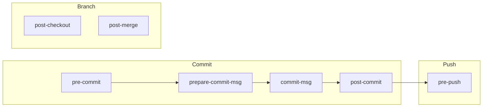

## Overview

Native git hooks are shell scripts that git executes at specific points in the development workflow.
Unlike the pre-commit framework, native hooks require no external dependencies and provide direct
control over the entire git lifecycle.

### Git Hook Lifecycle



### When to Use Native Hooks vs Pre-commit Framework

| **Criteria** | **Native Hooks** | **Pre-commit Framework** |
|---|---|---|
| Dependencies | None (bash only) | Requires Python/pip |
| Language support | Any executable | Plugin ecosystem |
| Configuration | Shell scripts | YAML configuration |
| Sharing | Manual or git templates | `.pre-commit-config.yaml` |
| Hook types | All git hooks | pre-commit, commit-msg, pre-push |
| Auto-updates | Manual | `pre-commit autoupdate` |
| Best for | Custom workflows, post-* hooks | Standardized linting/formatting |

### Hook Directory Structure

```text
.githooks/
├── pre-commit
├── commit-msg
├── pre-push
├── prepare-commit-msg
├── post-checkout
├── post-merge
├── post-commit
└── install.sh
```

---

## Hook Installation and Management

### Manual Installation

```bash
#!/bin/bash
## Copy a single hook to the git hooks directory
cp .githooks/pre-commit .git/hooks/pre-commit
chmod +x .git/hooks/pre-commit
```

### Using core.hooksPath (Recommended)

```bash
#!/bin/bash
## Point git to a shared hooks directory (Git 2.9+)
## This is the recommended approach for team distribution
git config core.hooksPath .githooks

## Verify the configuration
git config --get core.hooksPath
## Output: .githooks
```

### Git Template Directory

```bash
#!/bin/bash
## Set up a global template directory for all new repositories
## Hooks in this directory are copied to every new clone/init

## Create the template structure
mkdir -p ~/.git-templates/hooks

## Copy hooks to template directory
cp .githooks/* ~/.git-templates/hooks/
chmod +x ~/.git-templates/hooks/*

## Configure git to use the template
git config --global init.templateDir ~/.git-templates

## New repositories will now include these hooks automatically
git clone https://github.com/org/repo.git
## Hooks are automatically copied to repo/.git/hooks/
```

### Automated Installer Script

```bash
#!/bin/bash
## .githooks/install.sh
## Installs all git hooks for the project

set -euo pipefail

HOOKS_DIR=".githooks"
HOOK_NAMES=(
    "pre-commit"
    "commit-msg"
    "pre-push"
    "prepare-commit-msg"
    "post-checkout"
    "post-merge"
)

main() {
    echo "Installing git hooks..."

    ## Use core.hooksPath if available (Git 2.9+)
    git_version=$(git --version | grep -oE '[0-9]+\.[0-9]+')
    if awk "BEGIN{exit !($git_version >= 2.9)}"; then
        git config core.hooksPath "${HOOKS_DIR}"
        echo "Configured core.hooksPath to ${HOOKS_DIR}"
    else
        ## Fallback: symlink hooks individually
        for hook in "${HOOK_NAMES[@]}"; do
            if [[ -f "${HOOKS_DIR}/${hook}" ]]; then
                ln -sf "../../${HOOKS_DIR}/${hook}" ".git/hooks/${hook}"
                echo "Linked ${hook}"
            fi
        done
    fi

    ## Ensure hooks are executable
    chmod +x "${HOOKS_DIR}"/*

    echo "Git hooks installed successfully."
}

main "$@"
```

### Uninstaller Script

```bash
#!/bin/bash
## .githooks/uninstall.sh
## Removes all project git hooks

set -euo pipefail

main() {
    echo "Removing git hooks..."

    ## Remove core.hooksPath configuration
    git config --unset core.hooksPath 2>/dev/null || true

    ## Remove any symlinked hooks
    for hook in .git/hooks/*; do
        if [[ -L "${hook}" ]]; then
            rm "${hook}"
            echo "Removed $(basename "${hook}")"
        fi
    done

    echo "Git hooks removed successfully."
}

main "$@"
```

### Makefile Integration

```makefile
## Makefile targets for hook management

.PHONY: hooks hooks-install hooks-uninstall

## Install git hooks (run after cloning)
hooks: hooks-install

hooks-install:
    @bash .githooks/install.sh

hooks-uninstall:
    @bash .githooks/uninstall.sh

## Include hooks installation in project setup
setup: hooks-install
    uv sync
    @echo "Project setup complete."
```

---

## pre-commit Hook

### Linting and Formatting

```bash
#!/bin/bash
## .githooks/pre-commit
## Runs linting and formatting checks on staged files before commit

set -euo pipefail

## Colors for output
RED='\033[0;31m'
GREEN='\033[0;32m'
YELLOW='\033[0;33m'
NC='\033[0m'

## Get list of staged files
STAGED_FILES=$(git diff --cached --name-only --diff-filter=ACM)

if [[ -z "${STAGED_FILES}" ]]; then
    exit 0
fi

ERRORS=0

## Python linting
PYTHON_FILES=$(echo "${STAGED_FILES}" | grep '\.py$' || true)
if [[ -n "${PYTHON_FILES}" ]]; then
    echo -e "${YELLOW}Running Python checks...${NC}"

    ## Format check with black
    if command -v black &>/dev/null; then
        echo "${PYTHON_FILES}" | xargs black --check --quiet 2>/dev/null || {
            echo -e "${RED}Python formatting errors found. Run 'black .' to fix.${NC}"
            ERRORS=$((ERRORS + 1))
        }
    fi

    ## Lint with flake8
    if command -v flake8 &>/dev/null; then
        echo "${PYTHON_FILES}" | xargs flake8 --max-line-length=100 || {
            echo -e "${RED}Python linting errors found.${NC}"
            ERRORS=$((ERRORS + 1))
        }
    fi
fi

## Shell script linting
SHELL_FILES=$(echo "${STAGED_FILES}" | grep '\.sh$' || true)
if [[ -n "${SHELL_FILES}" ]]; then
    echo -e "${YELLOW}Running shell checks...${NC}"

    if command -v shellcheck &>/dev/null; then
        echo "${SHELL_FILES}" | xargs shellcheck || {
            echo -e "${RED}Shell linting errors found.${NC}"
            ERRORS=$((ERRORS + 1))
        }
    fi
fi

## YAML validation
YAML_FILES=$(echo "${STAGED_FILES}" | grep -E '\.(yml|yaml)$' || true)
if [[ -n "${YAML_FILES}" ]]; then
    echo -e "${YELLOW}Running YAML checks...${NC}"

    if command -v yamllint &>/dev/null; then
        echo "${YAML_FILES}" | xargs yamllint -c .yamllint.yml || {
            echo -e "${RED}YAML validation errors found.${NC}"
            ERRORS=$((ERRORS + 1))
        }
    fi
fi

## Terraform formatting
TF_FILES=$(echo "${STAGED_FILES}" | grep '\.tf$' || true)
if [[ -n "${TF_FILES}" ]]; then
    echo -e "${YELLOW}Running Terraform checks...${NC}"

    if command -v terraform &>/dev/null; then
        terraform fmt -check -recursive || {
            echo -e "${RED}Terraform formatting errors. Run 'terraform fmt -recursive'.${NC}"
            ERRORS=$((ERRORS + 1))
        }
    fi
fi

if [[ ${ERRORS} -gt 0 ]]; then
    echo -e "\n${RED}Pre-commit checks failed with ${ERRORS} error(s).${NC}"
    exit 1
fi

echo -e "${GREEN}All pre-commit checks passed.${NC}"
```

### Secret Detection

```bash
#!/bin/bash
## .githooks/pre-commit.d/check-secrets
## Detects secrets and sensitive data in staged files

set -euo pipefail

RED='\033[0;31m'
GREEN='\033[0;32m'
NC='\033[0m'

STAGED_FILES=$(git diff --cached --name-only --diff-filter=ACM)

if [[ -z "${STAGED_FILES}" ]]; then
    exit 0
fi

ERRORS=0

## Check for common secret patterns in staged content
PATTERNS=(
    'AKIA[0-9A-Z]{16}'                    ## AWS Access Key ID
    '[0-9a-zA-Z/+]{40}'                    ## AWS Secret Key (heuristic)
    'ghp_[0-9a-zA-Z]{36}'                  ## GitHub Personal Access Token
    'glpat-[0-9a-zA-Z\-]{20}'              ## GitLab Personal Access Token
    'sk-[0-9a-zA-Z]{48}'                   ## OpenAI API Key
    'xox[bpors]-[0-9a-zA-Z\-]+'            ## Slack Token
    '-----BEGIN (RSA |EC )?PRIVATE KEY-----' ## Private keys
)

for pattern in "${PATTERNS[@]}"; do
    matches=$(git diff --cached -G"${pattern}" --name-only || true)
    if [[ -n "${matches}" ]]; then
        echo -e "${RED}Potential secret detected matching pattern: ${pattern}${NC}"
        echo "${matches}" | while read -r file; do
            echo "  - ${file}"
        done
        ERRORS=$((ERRORS + 1))
    fi
done

## Check for sensitive file names
SENSITIVE_PATTERNS=(
    '\.env$'
    '\.env\.local$'
    'credentials\.json$'
    '\.pem$'
    '\.key$'
    'id_rsa$'
    'id_ed25519$'
    '\.tfvars$'
    'secret'
)

for pattern in "${SENSITIVE_PATTERNS[@]}"; do
    matches=$(echo "${STAGED_FILES}" | grep -E "${pattern}" || true)
    if [[ -n "${matches}" ]]; then
        echo -e "${RED}Sensitive file staged for commit:${NC}"
        echo "${matches}" | while read -r file; do
            echo "  - ${file}"
        done
        ERRORS=$((ERRORS + 1))
    fi
done

if [[ ${ERRORS} -gt 0 ]]; then
    echo -e "\n${RED}Secret detection found ${ERRORS} issue(s).${NC}"
    echo "If this is a false positive, use: git commit --no-verify"
    exit 1
fi

echo -e "${GREEN}No secrets detected.${NC}"
```

### Large File Check

```bash
#!/bin/bash
## .githooks/pre-commit.d/check-file-size
## Prevents committing files over a size threshold

set -euo pipefail

MAX_FILE_SIZE_KB=1000
RED='\033[0;31m'
GREEN='\033[0;32m'
NC='\033[0m'

STAGED_FILES=$(git diff --cached --name-only --diff-filter=ACM)

if [[ -z "${STAGED_FILES}" ]]; then
    exit 0
fi

OVERSIZED=0

while IFS= read -r file; do
    if [[ -f "${file}" ]]; then
        file_size_kb=$(du -k "${file}" | cut -f1)
        if [[ ${file_size_kb} -gt ${MAX_FILE_SIZE_KB} ]]; then
            echo -e "${RED}File exceeds ${MAX_FILE_SIZE_KB}KB limit: ${file} (${file_size_kb}KB)${NC}"
            OVERSIZED=$((OVERSIZED + 1))
        fi
    fi
done <<< "${STAGED_FILES}"

if [[ ${OVERSIZED} -gt 0 ]]; then
    echo -e "\n${RED}${OVERSIZED} file(s) exceed the size limit.${NC}"
    echo "Consider using Git LFS for large files: git lfs track '*.bin'"
    exit 1
fi

echo -e "${GREEN}File size check passed.${NC}"
```

### Composable pre-commit with Hook Runner

```bash
#!/bin/bash
## .githooks/pre-commit
## Runs all scripts in pre-commit.d/ directory

set -euo pipefail

HOOK_DIR="$(dirname "$0")/pre-commit.d"

if [[ ! -d "${HOOK_DIR}" ]]; then
    exit 0
fi

ERRORS=0

for hook in "${HOOK_DIR}"/*; do
    if [[ -x "${hook}" ]]; then
        echo "Running $(basename "${hook}")..."
        if ! "${hook}"; then
            ERRORS=$((ERRORS + 1))
        fi
    fi
done

if [[ ${ERRORS} -gt 0 ]]; then
    echo "pre-commit failed: ${ERRORS} hook(s) reported errors."
    exit 1
fi
```

---

## commit-msg Hook

### Conventional Commit Validation

```bash
#!/bin/bash
## .githooks/commit-msg
## Validates commit messages against conventional commit format
##
## Format: type(scope): subject
##
## Types: feat, fix, docs, style, refactor, test, chore, ci, perf, build, revert
## Scope: optional, lowercase
## Subject: lowercase start, no period, max 72 chars

set -euo pipefail

RED='\033[0;31m'
GREEN='\033[0;32m'
YELLOW='\033[0;33m'
NC='\033[0m'

COMMIT_MSG_FILE="$1"
COMMIT_MSG=$(head -1 "${COMMIT_MSG_FILE}")

## Skip merge commits
if echo "${COMMIT_MSG}" | grep -qE '^Merge '; then
    exit 0
fi

## Valid conventional commit types
VALID_TYPES="feat|fix|docs|style|refactor|test|chore|ci|perf|build|revert"

## Pattern: type(optional-scope): subject
## OR: type!: subject (breaking change)
PATTERN="^(${VALID_TYPES})(\([a-z0-9\-]+\))?!?: .+"

if ! echo "${COMMIT_MSG}" | grep -qE "${PATTERN}"; then
    echo -e "${RED}Invalid commit message format.${NC}"
    echo ""
    echo "Expected format: type(scope): subject"
    echo ""
    echo "Valid types: feat, fix, docs, style, refactor, test, chore, ci, perf, build, revert"
    echo ""
    echo "Examples:"
    echo "  feat(auth): add JWT token refresh"
    echo "  fix: resolve null pointer in user service"
    echo "  docs(readme): update installation instructions"
    echo "  refactor(api)!: restructure endpoint naming"
    echo ""
    echo -e "Your message: ${YELLOW}${COMMIT_MSG}${NC}"
    exit 1
fi

## Check subject line length (max 72 characters)
SUBJECT_LENGTH=${#COMMIT_MSG}
if [[ ${SUBJECT_LENGTH} -gt 72 ]]; then
    echo -e "${RED}Commit subject exceeds 72 characters (${SUBJECT_LENGTH}).${NC}"
    echo "Shorten the subject line and use the body for details."
    exit 1
fi

## Check subject does not end with period
if echo "${COMMIT_MSG}" | grep -qE '\.$'; then
    echo -e "${RED}Commit subject should not end with a period.${NC}"
    exit 1
fi

echo -e "${GREEN}Commit message is valid.${NC}"
```

### Ticket Reference Enforcement

```bash
#!/bin/bash
## .githooks/commit-msg.d/check-ticket-reference
## Ensures commit messages reference a ticket/issue number
##
## Accepts patterns:
##   - #123 (GitHub issue)
##   - JIRA-123 (Jira ticket)
##   - Closes #123, Fixes #123, Refs #123

set -euo pipefail

RED='\033[0;31m'
GREEN='\033[0;32m'
NC='\033[0m'

COMMIT_MSG_FILE="$1"
COMMIT_MSG=$(cat "${COMMIT_MSG_FILE}")

## Skip merge commits and fixup commits
if echo "${COMMIT_MSG}" | grep -qE '^(Merge|fixup!|squash!) '; then
    exit 0
fi

## Patterns that indicate a ticket reference
TICKET_PATTERNS=(
    '#[0-9]+'                              ## GitHub issue: #123
    '[A-Z]{2,10}-[0-9]+'                   ## Jira-style: PROJ-123
    '(Closes|Fixes|Refs|Resolves) #[0-9]+' ## GitHub keywords
)

FOUND=0
for pattern in "${TICKET_PATTERNS[@]}"; do
    if echo "${COMMIT_MSG}" | grep -qE "${pattern}"; then
        FOUND=1
        break
    fi
done

if [[ ${FOUND} -eq 0 ]]; then
    echo -e "${RED}Commit message must reference a ticket or issue.${NC}"
    echo ""
    echo "Accepted formats:"
    echo "  feat(auth): add login endpoint #123"
    echo "  fix: resolve timeout PROJ-456"
    echo "  docs: update API reference"
    echo ""
    echo "  Closes #123"
    echo "  Fixes #456"
    echo "  Refs JIRA-789"
    exit 1
fi

echo -e "${GREEN}Ticket reference found.${NC}"
```

### Spell Check on Commit Message

```bash
#!/bin/bash
## .githooks/commit-msg.d/check-spelling
## Basic spell check on commit message subject line

set -euo pipefail

COMMIT_MSG_FILE="$1"
SUBJECT=$(head -1 "${COMMIT_MSG_FILE}")

## Extract words from the subject (skip type prefix)
WORDS=$(echo "${SUBJECT}" | sed 's/^[a-z]*(\?[a-z\-]*)\?!*: //' | tr ' ' '\n')

## Common misspellings to catch
MISSPELLINGS=(
    "teh:the"
    "adn:and"
    "hte:the"
    "taht:that"
    "recieve:receive"
    "occured:occurred"
    "seperate:separate"
    "definately:definitely"
    "enviroment:environment"
    "dependancy:dependency"
)

ERRORS=0
for entry in "${MISSPELLINGS[@]}"; do
    wrong="${entry%%:*}"
    correct="${entry##*:}"
    if echo "${WORDS}" | grep -qiw "${wrong}"; then
        echo "Possible misspelling: '${wrong}' -> '${correct}'"
        ERRORS=$((ERRORS + 1))
    fi
done

if [[ ${ERRORS} -gt 0 ]]; then
    echo "Found ${ERRORS} possible misspelling(s) in commit message."
    echo "Fix the message or use 'git commit --no-verify' to skip."
    exit 1
fi
```

---

## pre-push Hook

### Run Tests Before Push

```bash
#!/bin/bash
## .githooks/pre-push
## Runs the test suite before allowing a push

set -euo pipefail

RED='\033[0;31m'
GREEN='\033[0;32m'
YELLOW='\033[0;33m'
NC='\033[0m'

echo -e "${YELLOW}Running pre-push checks...${NC}"

ERRORS=0

## Run Python tests if pytest is available
if [[ -f "pyproject.toml" ]] || [[ -f "setup.py" ]]; then
    if command -v pytest &>/dev/null; then
        echo "Running pytest..."
        pytest tests/ --quiet --tb=short || {
            echo -e "${RED}Python tests failed.${NC}"
            ERRORS=$((ERRORS + 1))
        }
    fi
fi

## Run JavaScript/TypeScript tests if package.json exists
if [[ -f "package.json" ]]; then
    if command -v npm &>/dev/null; then
        echo "Running npm test..."
        npm test --silent 2>/dev/null || {
            echo -e "${RED}JavaScript/TypeScript tests failed.${NC}"
            ERRORS=$((ERRORS + 1))
        }
    fi
fi

## Run Go tests if go.mod exists
if [[ -f "go.mod" ]]; then
    if command -v go &>/dev/null; then
        echo "Running go test..."
        go test ./... -count=1 -short || {
            echo -e "${RED}Go tests failed.${NC}"
            ERRORS=$((ERRORS + 1))
        }
    fi
fi

## Run Terraform validation if .tf files exist
if ls *.tf &>/dev/null 2>&1; then
    if command -v terraform &>/dev/null; then
        echo "Running terraform validate..."
        terraform validate || {
            echo -e "${RED}Terraform validation failed.${NC}"
            ERRORS=$((ERRORS + 1))
        }
    fi
fi

if [[ ${ERRORS} -gt 0 ]]; then
    echo -e "\n${RED}Pre-push checks failed. Push aborted.${NC}"
    echo "Fix the issues above or use 'git push --no-verify' to skip."
    exit 1
fi

echo -e "${GREEN}All pre-push checks passed.${NC}"
```

### Branch Protection

```bash
#!/bin/bash
## .githooks/pre-push.d/protect-branches
## Prevents direct pushes to protected branches

set -euo pipefail

RED='\033[0;31m'
GREEN='\033[0;32m'
NC='\033[0m'

CURRENT_BRANCH=$(git symbolic-ref --short HEAD 2>/dev/null)

## Protected branches that should not receive direct pushes
PROTECTED_BRANCHES=(
    "main"
    "master"
    "production"
    "release"
)

for branch in "${PROTECTED_BRANCHES[@]}"; do
    if [[ "${CURRENT_BRANCH}" == "${branch}" ]]; then
        echo -e "${RED}Direct push to '${branch}' is not allowed.${NC}"
        echo "Create a feature branch and open a pull request instead."
        echo ""
        echo "  git checkout -b feat/my-feature"
        echo "  git push -u origin feat/my-feature"
        echo "  gh pr create"
        exit 1
    fi
done

echo -e "${GREEN}Branch protection check passed.${NC}"
```

### Prevent Force Push

```bash
#!/bin/bash
## .githooks/pre-push.d/prevent-force-push
## Blocks force pushes to protected branches

set -euo pipefail

RED='\033[0;31m'
NC='\033[0m'

PROTECTED_BRANCHES=("main" "master" "production")

## Read push information from stdin
while read -r local_ref local_sha remote_ref remote_sha; do
    remote_branch=$(echo "${remote_ref}" | sed 's|refs/heads/||')

    for protected in "${PROTECTED_BRANCHES[@]}"; do
        if [[ "${remote_branch}" == "${protected}" ]]; then
            ## Check if this is a force push (remote_sha is not ancestor of local_sha)
            if [[ "${remote_sha}" != "0000000000000000000000000000000000000000" ]]; then
                if ! git merge-base --is-ancestor "${remote_sha}" "${local_sha}" 2>/dev/null; then
                    echo -e "${RED}Force push to '${protected}' is blocked.${NC}"
                    echo "This would rewrite history on a protected branch."
                    exit 1
                fi
            fi
        fi
    done
done
```

### WIP Commit Detection

```bash
#!/bin/bash
## .githooks/pre-push.d/check-wip
## Prevents pushing commits marked as work-in-progress

set -euo pipefail

RED='\033[0;31m'
GREEN='\033[0;32m'
NC='\033[0m'

## Read push information from stdin
while read -r local_ref local_sha remote_ref remote_sha; do
    if [[ "${local_sha}" == "0000000000000000000000000000000000000000" ]]; then
        ## Branch deletion, skip
        continue
    fi

    ## Determine commit range
    if [[ "${remote_sha}" == "0000000000000000000000000000000000000000" ]]; then
        ## New branch
        RANGE="${local_sha}"
    else
        RANGE="${remote_sha}..${local_sha}"
    fi

    ## Check for WIP markers in commit messages
    WIP_COMMITS=$(git log --oneline "${RANGE}" --grep="^WIP" --grep="^wip" --grep="^fixup!" \
        --grep="^squash!" --grep="^FIXME" 2>/dev/null || true)

    if [[ -n "${WIP_COMMITS}" ]]; then
        echo -e "${RED}Work-in-progress commits detected:${NC}"
        echo "${WIP_COMMITS}"
        echo ""
        echo "Squash or amend these commits before pushing."
        echo "Use 'git push --no-verify' to override."
        exit 1
    fi
done

echo -e "${GREEN}No WIP commits found.${NC}"
```

---

## post-checkout Hook

### Auto-install Dependencies

```bash
#!/bin/bash
## .githooks/post-checkout
## Automatically updates dependencies after branch switch or clone

set -euo pipefail

YELLOW='\033[0;33m'
GREEN='\033[0;32m'
NC='\033[0m'

PREV_HEAD="$1"
NEW_HEAD="$2"
BRANCH_CHECKOUT="$3"

## Only run on branch checkouts (not file checkouts)
if [[ "${BRANCH_CHECKOUT}" != "1" ]]; then
    exit 0
fi

## Skip if this is the initial clone (prev_head is all zeros)
if [[ "${PREV_HEAD}" == "0000000000000000000000000000000000000000" ]]; then
    exit 0
fi

## Check if dependency files changed between branches
check_file_changed() {
    local file="$1"
    git diff --name-only "${PREV_HEAD}" "${NEW_HEAD}" -- "${file}" | grep -q . 2>/dev/null
}

## Python (uv)
if check_file_changed "pyproject.toml" || check_file_changed "uv.lock"; then
    echo -e "${YELLOW}Python dependencies changed. Running 'uv sync'...${NC}"
    uv sync --quiet
    echo -e "${GREEN}Python dependencies updated.${NC}"
fi

## Python (pip)
if check_file_changed "requirements.txt"; then
    echo -e "${YELLOW}requirements.txt changed. Running 'pip install'...${NC}"
    pip install -r requirements.txt --quiet
    echo -e "${GREEN}Python dependencies updated.${NC}"
fi

## Node.js (npm)
if check_file_changed "package-lock.json" || check_file_changed "package.json"; then
    echo -e "${YELLOW}Node dependencies changed. Running 'npm install'...${NC}"
    npm install --silent
    echo -e "${GREEN}Node dependencies updated.${NC}"
fi

## Node.js (yarn)
if check_file_changed "yarn.lock"; then
    echo -e "${YELLOW}Yarn dependencies changed. Running 'yarn install'...${NC}"
    yarn install --silent
    echo -e "${GREEN}Yarn dependencies updated.${NC}"
fi

## Go
if check_file_changed "go.sum" || check_file_changed "go.mod"; then
    echo -e "${YELLOW}Go dependencies changed. Running 'go mod download'...${NC}"
    go mod download
    echo -e "${GREEN}Go dependencies updated.${NC}"
fi

## Ruby
if check_file_changed "Gemfile.lock"; then
    echo -e "${YELLOW}Ruby dependencies changed. Running 'bundle install'...${NC}"
    bundle install --quiet
    echo -e "${GREEN}Ruby dependencies updated.${NC}"
fi

## Terraform
if check_file_changed "*.tf"; then
    echo -e "${YELLOW}Terraform files changed. Running 'terraform init'...${NC}"
    terraform init -upgrade -input=false -no-color >/dev/null 2>&1
    echo -e "${GREEN}Terraform providers updated.${NC}"
fi
```

### Environment Configuration Check

```bash
#!/bin/bash
## .githooks/post-checkout.d/check-env
## Alerts when environment configuration files change between branches

set -euo pipefail

YELLOW='\033[0;33m'
NC='\033[0m'

PREV_HEAD="$1"
NEW_HEAD="$2"
BRANCH_CHECKOUT="$3"

if [[ "${BRANCH_CHECKOUT}" != "1" ]]; then
    exit 0
fi

## List of environment-related files to monitor
ENV_FILES=(
    ".env.example"
    "docker-compose.yml"
    "docker-compose.override.yml"
    "Dockerfile"
    ".editorconfig"
    "tsconfig.json"
    "pyproject.toml"
    "Makefile"
)

CHANGED_FILES=()

for file in "${ENV_FILES[@]}"; do
    if git diff --name-only "${PREV_HEAD}" "${NEW_HEAD}" -- "${file}" | grep -q . 2>/dev/null; then
        CHANGED_FILES+=("${file}")
    fi
done

if [[ ${#CHANGED_FILES[@]} -gt 0 ]]; then
    echo ""
    echo -e "${YELLOW}Environment configuration files changed:${NC}"
    for file in "${CHANGED_FILES[@]}"; do
        echo "  - ${file}"
    done
    echo ""
    echo "Review these changes and update your local environment if needed."
    echo ""
fi
```

---

## post-merge Hook

### Dependency Auto-update

```bash
#!/bin/bash
## .githooks/post-merge
## Runs dependency updates and migrations after pulling/merging changes

set -euo pipefail

YELLOW='\033[0;33m'
GREEN='\033[0;32m'
NC='\033[0m'

## Check if a file changed in the merge
file_changed() {
    local file="$1"
    git diff --name-only HEAD@{1} HEAD -- "${file}" 2>/dev/null | grep -q .
}

## Python dependencies
if file_changed "pyproject.toml" || file_changed "uv.lock"; then
    echo -e "${YELLOW}Python dependencies changed. Syncing...${NC}"
    uv sync --quiet
    echo -e "${GREEN}Python dependencies synced.${NC}"
fi

if file_changed "requirements.txt"; then
    echo -e "${YELLOW}requirements.txt changed. Installing...${NC}"
    pip install -r requirements.txt --quiet
    echo -e "${GREEN}Python dependencies installed.${NC}"
fi

## Node.js dependencies
if file_changed "package-lock.json" || file_changed "package.json"; then
    echo -e "${YELLOW}Node dependencies changed. Installing...${NC}"
    npm install --silent
    echo -e "${GREEN}Node dependencies installed.${NC}"
fi

## Go dependencies
if file_changed "go.sum" || file_changed "go.mod"; then
    echo -e "${YELLOW}Go dependencies changed. Downloading...${NC}"
    go mod download
    echo -e "${GREEN}Go dependencies downloaded.${NC}"
fi
```

### Database Migration Runner

```bash
#!/bin/bash
## .githooks/post-merge.d/run-migrations
## Detects and runs pending database migrations after merge

set -euo pipefail

YELLOW='\033[0;33m'
GREEN='\033[0;32m'
RED='\033[0;31m'
NC='\033[0m'

## Check if migration files were added or modified
MIGRATION_DIRS=(
    "migrations/"
    "db/migrate/"
    "alembic/versions/"
    "src/migrations/"
)

MIGRATIONS_CHANGED=0

for dir in "${MIGRATION_DIRS[@]}"; do
    changes=$(git diff --name-only HEAD@{1} HEAD -- "${dir}" 2>/dev/null || true)
    if [[ -n "${changes}" ]]; then
        MIGRATIONS_CHANGED=1
        echo -e "${YELLOW}New migrations detected in ${dir}:${NC}"
        echo "${changes}" | while read -r file; do
            echo "  - ${file}"
        done
    fi
done

if [[ ${MIGRATIONS_CHANGED} -eq 1 ]]; then
    echo ""
    echo -e "${YELLOW}Database migrations may need to be applied.${NC}"
    echo ""

    ## Auto-detect and suggest the migration command
    if [[ -f "alembic.ini" ]]; then
        echo "Run: alembic upgrade head"
    elif [[ -f "manage.py" ]]; then
        echo "Run: python manage.py migrate"
    elif [[ -f "Gemfile" ]] && [[ -d "db/migrate" ]]; then
        echo "Run: bundle exec rails db:migrate"
    elif [[ -f "package.json" ]]; then
        if grep -q "prisma" package.json 2>/dev/null; then
            echo "Run: npx prisma migrate deploy"
        elif grep -q "knex" package.json 2>/dev/null; then
            echo "Run: npx knex migrate:latest"
        fi
    fi

    echo ""
fi
```

### Lock File Drift Detection

```bash
#!/bin/bash
## .githooks/post-merge.d/check-lockfiles
## Warns when lock files change, indicating dependency updates are needed

set -euo pipefail

YELLOW='\033[0;33m'
NC='\033[0m'

LOCK_FILES=(
    "uv.lock"
    "package-lock.json"
    "yarn.lock"
    "pnpm-lock.yaml"
    "Gemfile.lock"
    "go.sum"
    "Cargo.lock"
    "composer.lock"
    "poetry.lock"
)

CHANGED_LOCKS=()

for lock_file in "${LOCK_FILES[@]}"; do
    if git diff --name-only HEAD@{1} HEAD -- "${lock_file}" 2>/dev/null | grep -q .; then
        CHANGED_LOCKS+=("${lock_file}")
    fi
done

if [[ ${#CHANGED_LOCKS[@]} -gt 0 ]]; then
    echo ""
    echo -e "${YELLOW}Lock files changed after merge:${NC}"
    for lock in "${CHANGED_LOCKS[@]}"; do
        echo "  - ${lock}"
    done
    echo ""
    echo "Run your package manager's install command to update local dependencies."
    echo ""
fi
```

---

## prepare-commit-msg Hook

### Auto-insert Branch Name as Ticket Reference

```bash
#!/bin/bash
## .githooks/prepare-commit-msg
## Automatically prefixes commit messages with ticket number from branch name
##
## Branch naming convention: type/TICKET-123-description
## Result: TICKET-123 original commit message

set -euo pipefail

COMMIT_MSG_FILE="$1"
COMMIT_SOURCE="${2:-}"

## Skip for merge commits, amends, and squashes
if [[ "${COMMIT_SOURCE}" == "merge" ]] || \
   [[ "${COMMIT_SOURCE}" == "squash" ]] || \
   [[ "${COMMIT_SOURCE}" == "commit" ]]; then
    exit 0
fi

BRANCH=$(git symbolic-ref --short HEAD 2>/dev/null || true)

if [[ -z "${BRANCH}" ]]; then
    exit 0
fi

## Extract ticket number from branch name
## Supports: feat/PROJ-123-description, fix/PROJ-123, PROJ-123-description
TICKET=$(echo "${BRANCH}" | grep -oE '[A-Z]{2,10}-[0-9]+' | head -1 || true)

if [[ -z "${TICKET}" ]]; then
    exit 0
fi

COMMIT_MSG=$(cat "${COMMIT_MSG_FILE}")

## Only add ticket if not already present in the message
if ! echo "${COMMIT_MSG}" | grep -q "${TICKET}"; then
    ## Append ticket reference to first line
    sed -i.bak "1s/$/ ${TICKET}/" "${COMMIT_MSG_FILE}"
    rm -f "${COMMIT_MSG_FILE}.bak"
fi
```

### Commit Message Template

```bash
#!/bin/bash
## .githooks/prepare-commit-msg.d/add-template
## Adds a commit message template when creating new commits

set -euo pipefail

COMMIT_MSG_FILE="$1"
COMMIT_SOURCE="${2:-}"

## Only add template for new commits (not amend, merge, squash)
if [[ -n "${COMMIT_SOURCE}" ]]; then
    exit 0
fi

## Check if the message is the default (empty or just comments)
if grep -qv '^#' "${COMMIT_MSG_FILE}" 2>/dev/null && \
   grep -qv '^$' "${COMMIT_MSG_FILE}" 2>/dev/null; then
    ## User already provided a message via -m flag
    exit 0
fi

BRANCH=$(git symbolic-ref --short HEAD 2>/dev/null || true)

cat > "${COMMIT_MSG_FILE}" << 'TEMPLATE'

# Conventional Commit Format:
#   type(scope): subject
#
# Types: feat, fix, docs, style, refactor, test, chore, ci, perf, build, revert
# Scope: optional, describes the section of the codebase
# Subject: imperative mood, no period, max 72 chars
#
# Body (optional): explain WHY, not WHAT
#
# Footer (optional):
#   BREAKING CHANGE: description
#   Closes #123
#   Refs PROJ-456
TEMPLATE
```

### Co-author Insertion

```bash
#!/bin/bash
## .githooks/prepare-commit-msg.d/add-coauthor
## Adds co-author trailer for pair programming sessions
##
## Set co-author: git config --local hooks.coauthor "Name <email>"
## Clear co-author: git config --local --unset hooks.coauthor

set -euo pipefail

COMMIT_MSG_FILE="$1"
COMMIT_SOURCE="${2:-}"

## Skip for merge and squash commits
if [[ "${COMMIT_SOURCE}" == "merge" ]] || [[ "${COMMIT_SOURCE}" == "squash" ]]; then
    exit 0
fi

COAUTHOR=$(git config --get hooks.coauthor 2>/dev/null || true)

if [[ -z "${COAUTHOR}" ]]; then
    exit 0
fi

COMMIT_MSG=$(cat "${COMMIT_MSG_FILE}")

## Only add if not already present
if ! echo "${COMMIT_MSG}" | grep -q "Co-authored-by: ${COAUTHOR}"; then
    echo "" >> "${COMMIT_MSG_FILE}"
    echo "Co-authored-by: ${COAUTHOR}" >> "${COMMIT_MSG_FILE}"
fi
```

---

## Hook Management Framework

### Complete Installer with Configuration

```bash
#!/bin/bash
## .githooks/install.sh
## Comprehensive hook installer with configuration options

set -euo pipefail

GREEN='\033[0;32m'
YELLOW='\033[0;33m'
BLUE='\033[0;34m'
NC='\033[0m'

HOOKS_DIR=".githooks"
CONFIG_FILE=".githooks.conf"

## Default configuration
ENABLE_PRE_COMMIT=true
ENABLE_COMMIT_MSG=true
ENABLE_PRE_PUSH=true
ENABLE_POST_CHECKOUT=true
ENABLE_POST_MERGE=true
ENABLE_PREPARE_COMMIT_MSG=true

## Load project configuration if it exists
if [[ -f "${CONFIG_FILE}" ]]; then
    # shellcheck source=/dev/null
    source "${CONFIG_FILE}"
fi

usage() {
    echo "Usage: $0 [OPTIONS]"
    echo ""
    echo "Options:"
    echo "  --all           Install all hooks (default)"
    echo "  --only HOOK     Install only the specified hook"
    echo "  --skip HOOK     Skip the specified hook"
    echo "  --global        Install to git template directory"
    echo "  -h, --help      Show this help message"
    echo ""
    echo "Available hooks:"
    echo "  pre-commit, commit-msg, pre-push,"
    echo "  post-checkout, post-merge, prepare-commit-msg"
}

install_hooks() {
    local target_dir="$1"

    echo -e "${BLUE}Installing git hooks...${NC}"

    ## Ensure hooks are executable
    chmod +x "${HOOKS_DIR}"/* 2>/dev/null || true
    if [[ -d "${HOOKS_DIR}/pre-commit.d" ]]; then
        chmod +x "${HOOKS_DIR}/pre-commit.d"/* 2>/dev/null || true
    fi
    if [[ -d "${HOOKS_DIR}/commit-msg.d" ]]; then
        chmod +x "${HOOKS_DIR}/commit-msg.d"/* 2>/dev/null || true
    fi
    if [[ -d "${HOOKS_DIR}/pre-push.d" ]]; then
        chmod +x "${HOOKS_DIR}/pre-push.d"/* 2>/dev/null || true
    fi
    if [[ -d "${HOOKS_DIR}/post-checkout.d" ]]; then
        chmod +x "${HOOKS_DIR}/post-checkout.d"/* 2>/dev/null || true
    fi
    if [[ -d "${HOOKS_DIR}/post-merge.d" ]]; then
        chmod +x "${HOOKS_DIR}/post-merge.d"/* 2>/dev/null || true
    fi

    ## Configure core.hooksPath
    git config core.hooksPath "${target_dir}"

    echo -e "${GREEN}Hooks installed successfully.${NC}"
    echo ""
    echo "Installed hooks:"
    for hook in "${target_dir}"/*; do
        if [[ -x "${hook}" ]] && [[ ! -d "${hook}" ]]; then
            echo -e "  ${GREEN}✓${NC} $(basename "${hook}")"
        fi
    done
}

install_global() {
    local template_dir="${HOME}/.git-templates/hooks"
    mkdir -p "${template_dir}"

    echo -e "${BLUE}Installing hooks globally to ${template_dir}...${NC}"
    cp "${HOOKS_DIR}"/* "${template_dir}/" 2>/dev/null || true
    chmod +x "${template_dir}"/* 2>/dev/null || true

    git config --global init.templateDir "${HOME}/.git-templates"

    echo -e "${GREEN}Global hooks installed.${NC}"
    echo "New repositories will include these hooks automatically."
}

## Parse arguments
GLOBAL=false
while [[ $# -gt 0 ]]; do
    case "$1" in
        --global) GLOBAL=true; shift ;;
        -h|--help) usage; exit 0 ;;
        *) echo "Unknown option: $1"; usage; exit 1 ;;
    esac
done

if [[ "${GLOBAL}" == true ]]; then
    install_global
else
    install_hooks "${HOOKS_DIR}"
fi
```

### Hook Configuration File

```bash
## .githooks.conf
## Configuration for git hooks
## Source this file to customize hook behavior

## Enable/disable specific hooks
ENABLE_PRE_COMMIT=true
ENABLE_COMMIT_MSG=true
ENABLE_PRE_PUSH=true
ENABLE_POST_CHECKOUT=true
ENABLE_POST_MERGE=true
ENABLE_PREPARE_COMMIT_MSG=true

## Pre-commit settings
MAX_FILE_SIZE_KB=1000
ENABLE_SECRET_DETECTION=true
ENABLE_LINT_PYTHON=true
ENABLE_LINT_SHELL=true
ENABLE_LINT_YAML=true
ENABLE_LINT_TERRAFORM=true

## Commit message settings
REQUIRE_CONVENTIONAL_COMMITS=true
REQUIRE_TICKET_REFERENCE=false
MAX_SUBJECT_LENGTH=72

## Pre-push settings
RUN_TESTS_BEFORE_PUSH=true
PROTECT_BRANCHES="main master production"
BLOCK_FORCE_PUSH=true
BLOCK_WIP_COMMITS=true
```

### Hook Runner Pattern

```bash
#!/bin/bash
## .githooks/lib/hook-runner.sh
## Shared hook runner that executes scripts from a .d directory
## Usage: source this file and call run_hook_dir

set -euo pipefail

RED='\033[0;31m'
GREEN='\033[0;32m'
YELLOW='\033[0;33m'
NC='\033[0m'

run_hook_dir() {
    local hook_name="$1"
    shift
    local hook_dir
    hook_dir="$(cd "$(dirname "${BASH_SOURCE[0]}")/.." && pwd)/${hook_name}.d"

    if [[ ! -d "${hook_dir}" ]]; then
        return 0
    fi

    local errors=0

    for script in "${hook_dir}"/*; do
        if [[ -x "${script}" ]] && [[ -f "${script}" ]]; then
            local script_name
            script_name=$(basename "${script}")
            echo -e "${YELLOW}Running ${hook_name}/${script_name}...${NC}"

            if "${script}" "$@"; then
                echo -e "${GREEN}  ✓ ${script_name} passed${NC}"
            else
                echo -e "${RED}  ✗ ${script_name} failed${NC}"
                errors=$((errors + 1))
            fi
        fi
    done

    if [[ ${errors} -gt 0 ]]; then
        echo -e "\n${RED}${hook_name}: ${errors} check(s) failed.${NC}"
        return 1
    fi

    return 0
}
```

### Using the Hook Runner

```bash
#!/bin/bash
## .githooks/pre-commit
## Delegates to scripts in pre-commit.d/ using the shared runner

SCRIPT_DIR="$(cd "$(dirname "$0")" && pwd)"

# shellcheck source=lib/hook-runner.sh
source "${SCRIPT_DIR}/lib/hook-runner.sh"

run_hook_dir "pre-commit" "$@"
```

```bash
#!/bin/bash
## .githooks/commit-msg
## Delegates to scripts in commit-msg.d/ using the shared runner

SCRIPT_DIR="$(cd "$(dirname "$0")" && pwd)"

# shellcheck source=lib/hook-runner.sh
source "${SCRIPT_DIR}/lib/hook-runner.sh"

run_hook_dir "commit-msg" "$@"
```

```bash
#!/bin/bash
## .githooks/pre-push
## Delegates to scripts in pre-push.d/ using the shared runner

SCRIPT_DIR="$(cd "$(dirname "$0")" && pwd)"

# shellcheck source=lib/hook-runner.sh
source "${SCRIPT_DIR}/lib/hook-runner.sh"

run_hook_dir "pre-push" "$@"
```

### Complete Directory Structure

```text
.githooks/
├── lib/
│   └── hook-runner.sh              # Shared hook runner
├── pre-commit                      # Delegates to pre-commit.d/
├── pre-commit.d/
│   ├── 01-lint                     # Linting and formatting
│   ├── 02-check-secrets            # Secret detection
│   └── 03-check-file-size          # Large file check
├── commit-msg                      # Delegates to commit-msg.d/
├── commit-msg.d/
│   ├── 01-conventional-commit      # Format validation
│   ├── 02-check-ticket             # Ticket reference
│   └── 03-check-spelling           # Spell check
├── pre-push                        # Delegates to pre-push.d/
├── pre-push.d/
│   ├── 01-run-tests                # Test suite
│   ├── 02-protect-branches         # Branch protection
│   ├── 03-prevent-force-push       # Force push guard
│   └── 04-check-wip                # WIP commit detection
├── prepare-commit-msg              # Branch-based ticket insertion
├── post-checkout                   # Dependency auto-install
├── post-checkout.d/
│   └── 01-check-env                # Environment change alerts
├── post-merge                      # Dependency sync
├── post-merge.d/
│   ├── 01-run-migrations           # Database migrations
│   └── 02-check-lockfiles          # Lock file drift
├── install.sh                      # Hook installer
├── uninstall.sh                    # Hook remover
└── .githooks.conf                  # Configuration
```

---

## Team Adoption and Best Practices

### Onboarding with Makefile

```makefile
## Makefile
## First command new developers run after cloning

.PHONY: setup hooks test

## Complete project setup including hooks
setup: hooks
    uv sync
    cp .env.example .env
    @echo ""
    @echo "Setup complete. Run 'make test' to verify."

## Install git hooks
hooks:
    @bash .githooks/install.sh

## Run the full test suite
test:
    pytest tests/ -v
```

```bash
## Developer onboarding flow
git clone https://github.com/org/repo.git
cd repo
make setup
## Git hooks are now installed automatically
```

### CI/CD as Backstop

```yaml
## .github/workflows/ci.yml
## CI enforces the same checks as local hooks
## This catches anything that bypasses hooks via --no-verify

name: CI
on:
  pull_request:
    branches: [main]

jobs:
  validate:
    runs-on: ubuntu-latest
    steps:
      - uses: actions/checkout@v4

      - name: Conventional commit check
        run: |
          ## Same validation as commit-msg hook
          COMMIT_MSG=$(git log -1 --pretty=%s)
          PATTERN="^(feat|fix|docs|style|refactor|test|chore|ci|perf|build|revert)(\([a-z0-9\-]+\))?!?: .+"
          if ! echo "${COMMIT_MSG}" | grep -qE "${PATTERN}"; then
            echo "::error::Commit message does not follow conventional format"
            exit 1
          fi

      - name: Secret detection
        run: |
          ## Same patterns as pre-commit secret detection hook
          if git diff --cached -G'AKIA[0-9A-Z]{16}' --name-only | grep -q .; then
            echo "::error::Potential AWS key detected"
            exit 1
          fi

      - name: Run tests
        run: pytest tests/ --tb=short
```

### Progressive Hook Adoption

```bash
#!/bin/bash
## .githooks/install.sh --progressive
## Install hooks in stages for gradual team adoption

set -euo pipefail

LEVEL="${1:-basic}"

case "${LEVEL}" in
    basic)
        ## Stage 1: Non-blocking, informational only
        echo "Installing basic hooks (informational)..."
        git config core.hooksPath .githooks
        ## Only install post-checkout and post-merge (non-blocking)
        ;;
    standard)
        ## Stage 2: Add commit message validation
        echo "Installing standard hooks..."
        git config core.hooksPath .githooks
        ## Adds commit-msg validation
        ;;
    strict)
        ## Stage 3: Full enforcement
        echo "Installing strict hooks (full enforcement)..."
        git config core.hooksPath .githooks
        ## All hooks enabled including pre-push tests
        ;;
    *)
        echo "Usage: $0 [basic|standard|strict]"
        exit 1
        ;;
esac

echo "Hooks installed at level: ${LEVEL}"
```

### Documenting Hooks in README

```markdown
## Git Hooks

This project uses native git hooks for development workflow automation.

### Quick Setup

    make setup

### What the Hooks Do

| Hook | Purpose | Blocking |
|------|---------|----------|
| pre-commit | Linting, formatting, secret detection | Yes |
| commit-msg | Conventional commit validation | Yes |
| pre-push | Runs tests, branch protection | Yes |
| post-checkout | Auto-installs dependencies | No |
| post-merge | Syncs dependencies, migration alerts | No |
| prepare-commit-msg | Auto-inserts ticket reference | No |

### Bypassing Hooks

    # Skip pre-commit and commit-msg hooks
    git commit --no-verify -m "emergency fix"

    # Skip pre-push hooks
    git push --no-verify

> **Note**: CI/CD enforces the same checks. Bypassing hooks locally
> does not bypass CI validation.
```

---

## Troubleshooting

### Hook Not Executing

```bash
## Check if hooks are executable
ls -la .githooks/
## Expected: -rwxr-xr-x for each hook file

## Fix permissions
chmod +x .githooks/*
chmod +x .githooks/**/*

## Verify core.hooksPath is set
git config --get core.hooksPath
## Expected: .githooks

## If not set, install hooks
bash .githooks/install.sh
```

### Hook Fails with "Permission Denied"

```bash
## Diagnose permission issues
file .githooks/pre-commit
## Expected: .githooks/pre-commit: Bourne-Again shell script, ASCII text executable

## Fix shebang line - ensure it starts with:
head -1 .githooks/pre-commit
## Expected: #!/bin/bash

## Fix line endings (Windows CRLF causes issues)
sed -i 's/\r$//' .githooks/pre-commit

## Alternative: use dos2unix
dos2unix .githooks/pre-commit
```

### Hook Path Issues

```bash
## Check if git can find the hooks
git rev-parse --git-dir
## Output: .git

## List active hooks
ls -la "$(git rev-parse --git-dir)/hooks/"

## If using core.hooksPath, check that path exists
HOOKS_PATH=$(git config --get core.hooksPath)
ls -la "${HOOKS_PATH}/"

## Reset to default hooks directory
git config --unset core.hooksPath
```

### Debugging Hook Execution

```bash
#!/bin/bash
## Add to any hook for debug output

## Enable verbose mode
set -x

## Log hook execution
echo "[$(date)] Running $(basename "$0")" >> /tmp/git-hooks.log

## Show environment variables available to hooks
env | grep GIT_ >> /tmp/git-hooks.log

## Show the arguments passed to the hook
echo "Args: $*" >> /tmp/git-hooks.log
```

```bash
## Run a hook manually for testing
bash -x .githooks/pre-commit

## Test commit-msg hook with a sample message
echo "feat: add login endpoint" > /tmp/test-msg
bash -x .githooks/commit-msg /tmp/test-msg

## Test pre-push hook (reads from stdin)
echo "refs/heads/main abc123 refs/heads/main def456" | bash -x .githooks/pre-push
```

### Conflicting with Pre-commit Framework

```bash
## If using both native hooks and pre-commit framework,
## the pre-commit framework installs its own hooks in .git/hooks/

## Option 1: Use pre-commit for pre-commit hook, native for others
## Let pre-commit manage .git/hooks/pre-commit
pre-commit install

## Manually install other native hooks
cp .githooks/pre-push .git/hooks/pre-push
cp .githooks/post-checkout .git/hooks/post-checkout
cp .githooks/post-merge .git/hooks/post-merge
chmod +x .git/hooks/pre-push .git/hooks/post-checkout .git/hooks/post-merge

## Option 2: Chain native hooks from pre-commit
## In .pre-commit-config.yaml:
## repos:
##   - repo: local
##     hooks:
##       - id: native-pre-commit
##         name: Native pre-commit checks
##         entry: bash .githooks/pre-commit.d/02-check-secrets
##         language: system
##         pass_filenames: false
```

---

## Resources

- [Git Hooks Documentation](https://git-scm.com/docs/githooks)
- [Pro Git - Customizing Git Hooks](https://git-scm.com/book/en/v2/Customizing-Git-Git-Hooks)
- [Pre-commit Framework](https://pre-commit.com/)
- [Pre-commit Hooks Guide](precommit_hooks_guide.md)
- [Conventional Commits Specification](https://www.conventionalcommits.org/)
- [GitHub Actions Guide](github_actions_guide.md)
