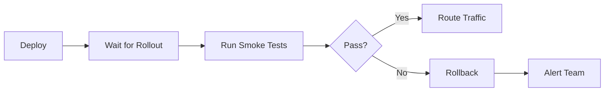

## Overview

Smoke tests are quick, essential tests that verify the most critical functionality works after
deployment. They serve as the first line of defense against deployment failures, providing
rapid feedback on system health before traffic reaches new deployments.

### Smoke Test Characteristics

| Characteristic | Requirement | Rationale |
|----------------|-------------|-----------|
| **Execution Time** | < 5 minutes total | Fast feedback for deployment decisions |
| **Scope** | Critical paths only | Focus on high-value verification |
| **Independence** | No test data dependencies | Run reliably in any environment |
| **Idempotency** | Safe to run repeatedly | Support retry and verification loops |
| **Parallelism** | Independent tests | Enable concurrent execution |

### When to Run Smoke Tests



---

## Smoke Test Checklist

### Required Verifications

```yaml
# smoke-test-checklist.yml
smoke_tests:
  critical:
    - name: "Application Health"
      endpoint: "/health"
      expected_status: 200
      timeout: 10s

    - name: "Database Connectivity"
      endpoint: "/health/db"
      expected_status: 200
      timeout: 15s

    - name: "Cache Connectivity"
      endpoint: "/health/cache"
      expected_status: 200
      timeout: 10s

    - name: "Authentication Service"
      endpoint: "/auth/validate"
      expected_status: 200
      timeout: 10s

  high_priority:
    - name: "Primary API Endpoint"
      endpoint: "/api/v1/status"
      expected_status: 200
      timeout: 10s

    - name: "Static Assets"
      endpoint: "/static/app.js"
      expected_status: 200
      timeout: 5s

    - name: "SSL Certificate Valid"
      check: "ssl_expiry"
      min_days: 7

  integrations:
    - name: "Message Queue"
      endpoint: "/health/mq"
      expected_status: 200
      timeout: 15s

    - name: "External API Gateway"
      endpoint: "/health/gateway"
      expected_status: 200
      timeout: 20s
```

---

## Python Smoke Tests

### pytest Implementation

```python
# tests/smoke/test_smoke.py
"""
Smoke test suite for post-deployment verification.

These tests verify critical functionality after deployment.
Run with: pytest tests/smoke/ --verbose --timeout=300
"""
import os
import pytest
import requests
from typing import Optional
from dataclasses import dataclass

# Configuration
BASE_URL = os.getenv('API_URL', 'https://api.example.com')
TIMEOUT = int(os.getenv('SMOKE_TEST_TIMEOUT', '10'))
AUTH_TOKEN = os.getenv('SMOKE_TEST_TOKEN')


@dataclass
class HealthCheckResult:
    """Result of a health check."""

    endpoint: str
    status_code: int
    response_time_ms: float
    healthy: bool
    message: Optional[str] = None


class TestCriticalHealth:
    """Critical health checks that must pass."""

    @pytest.fixture(autouse=True)
    def setup(self):
        """Set up test session."""
        self.session = requests.Session()
        self.session.headers.update({
            'User-Agent': 'SmokeTest/1.0',
            'Accept': 'application/json',
        })
        if AUTH_TOKEN:
            self.session.headers['Authorization'] = f'Bearer {AUTH_TOKEN}'

    def test_health_endpoint(self):
        """Verify main health endpoint responds."""
        response = self.session.get(
            f'{BASE_URL}/health',
            timeout=TIMEOUT
        )

        assert response.status_code == 200, (
            f"Health check failed: {response.status_code}"
        )

        data = response.json()
        assert data.get('status') == 'healthy', (
            f"Unhealthy status: {data.get('status')}"
        )

    def test_database_connectivity(self):
        """Verify database is accessible."""
        response = self.session.get(
            f'{BASE_URL}/health/db',
            timeout=TIMEOUT
        )

        assert response.status_code == 200

        data = response.json()
        assert data.get('database') == 'connected', (
            f"Database not connected: {data}"
        )

    def test_cache_connectivity(self):
        """Verify cache layer is operational."""
        response = self.session.get(
            f'{BASE_URL}/health/cache',
            timeout=TIMEOUT
        )

        assert response.status_code == 200

        data = response.json()
        assert data.get('cache') in ['connected', 'operational'], (
            f"Cache not operational: {data}"
        )

    def test_readiness_probe(self):
        """Verify application is ready to receive traffic."""
        response = self.session.get(
            f'{BASE_URL}/ready',
            timeout=TIMEOUT
        )

        assert response.status_code == 200, (
            f"Application not ready: {response.status_code}"
        )


class TestAuthenticationFlow:
    """Verify authentication system works."""

    @pytest.fixture(autouse=True)
    def setup(self):
        """Set up test session."""
        self.session = requests.Session()

    def test_login_endpoint_accessible(self):
        """Verify login endpoint is accessible."""
        response = self.session.options(
            f'{BASE_URL}/auth/login',
            timeout=TIMEOUT
        )

        # Accept 200, 204, or 405 (method not allowed but endpoint exists)
        assert response.status_code in [200, 204, 405], (
            f"Login endpoint not accessible: {response.status_code}"
        )

    def test_token_validation_endpoint(self):
        """Verify token validation works."""
        if not AUTH_TOKEN:
            pytest.skip("No auth token configured")

        response = self.session.get(
            f'{BASE_URL}/auth/validate',
            headers={'Authorization': f'Bearer {AUTH_TOKEN}'},
            timeout=TIMEOUT
        )

        assert response.status_code == 200, (
            f"Token validation failed: {response.status_code}"
        )

    def test_unauthorized_request_rejected(self):
        """Verify unauthorized requests are properly rejected."""
        response = self.session.get(
            f'{BASE_URL}/api/protected',
            timeout=TIMEOUT
        )

        assert response.status_code in [401, 403], (
            f"Expected 401/403, got: {response.status_code}"
        )


class TestCriticalAPIEndpoints:
    """Verify critical API endpoints function."""

    @pytest.fixture(autouse=True)
    def setup(self):
        """Set up test session with auth."""
        self.session = requests.Session()
        self.session.headers.update({
            'Content-Type': 'application/json',
            'Accept': 'application/json',
        })
        if AUTH_TOKEN:
            self.session.headers['Authorization'] = f'Bearer {AUTH_TOKEN}'

    def test_api_version_endpoint(self):
        """Verify API version endpoint responds."""
        response = self.session.get(
            f'{BASE_URL}/api/version',
            timeout=TIMEOUT
        )

        assert response.status_code == 200

        data = response.json()
        assert 'version' in data, "Version not in response"

    def test_primary_list_endpoint(self):
        """Verify primary listing endpoint works."""
        response = self.session.get(
            f'{BASE_URL}/api/v1/items',
            params={'limit': 1},
            timeout=TIMEOUT
        )

        # Accept 200 or 401 (needs auth)
        assert response.status_code in [200, 401], (
            f"Primary endpoint failed: {response.status_code}"
        )

    @pytest.mark.timeout(30)
    def test_search_endpoint(self):
        """Verify search functionality works."""
        response = self.session.get(
            f'{BASE_URL}/api/v1/search',
            params={'q': 'test', 'limit': 1},
            timeout=TIMEOUT * 2
        )

        assert response.status_code in [200, 401], (
            f"Search endpoint failed: {response.status_code}"
        )


class TestExternalIntegrations:
    """Verify external service integrations."""

    @pytest.fixture(autouse=True)
    def setup(self):
        """Set up test session."""
        self.session = requests.Session()
        if AUTH_TOKEN:
            self.session.headers['Authorization'] = f'Bearer {AUTH_TOKEN}'

    def test_message_queue_health(self):
        """Verify message queue connectivity."""
        response = self.session.get(
            f'{BASE_URL}/health/mq',
            timeout=TIMEOUT + 5
        )

        if response.status_code == 404:
            pytest.skip("Message queue health endpoint not configured")

        assert response.status_code == 200, (
            f"Message queue unhealthy: {response.status_code}"
        )

    def test_external_api_gateway(self):
        """Verify external API gateway connectivity."""
        response = self.session.get(
            f'{BASE_URL}/health/gateway',
            timeout=TIMEOUT + 10
        )

        if response.status_code == 404:
            pytest.skip("Gateway health endpoint not configured")

        assert response.status_code == 200


class TestStaticAssets:
    """Verify static assets are served correctly."""

    @pytest.fixture(autouse=True)
    def setup(self):
        """Set up test session."""
        self.session = requests.Session()

    def test_static_js_served(self):
        """Verify JavaScript assets are served."""
        response = self.session.head(
            f'{BASE_URL}/static/js/main.js',
            timeout=TIMEOUT
        )

        # Accept 200 or 404 (may not exist in all deployments)
        if response.status_code == 404:
            pytest.skip("Static JS not configured")

        assert response.status_code == 200

    def test_static_css_served(self):
        """Verify CSS assets are served."""
        response = self.session.head(
            f'{BASE_URL}/static/css/main.css',
            timeout=TIMEOUT
        )

        if response.status_code == 404:
            pytest.skip("Static CSS not configured")

        assert response.status_code == 200

    def test_favicon_served(self):
        """Verify favicon is served."""
        response = self.session.head(
            f'{BASE_URL}/favicon.ico',
            timeout=TIMEOUT
        )

        # Favicon is optional
        assert response.status_code in [200, 204, 404]
```

### pytest Configuration

```ini
# pytest.ini (smoke test section)
[pytest]
testpaths = tests/smoke
python_files = test_smoke*.py
python_classes = Test*
python_functions = test_*
timeout = 300
addopts =
    -v
    --strict-markers
    --tb=short
    -x
markers =
    smoke: smoke tests for post-deployment verification
    critical: critical tests that must pass
    integration: tests requiring external services
```

### Running Python Smoke Tests

```bash
# Run all smoke tests
pytest tests/smoke/ --verbose

# Run with timeout enforcement
pytest tests/smoke/ --timeout=300

# Run only critical tests
pytest tests/smoke/ -m critical

# Run with specific environment
API_URL=https://staging.example.com pytest tests/smoke/

# Run with JUnit output for CI
pytest tests/smoke/ --junitxml=smoke-results.xml

# Run with fail-fast (stop on first failure)
pytest tests/smoke/ -x --tb=short

# Run with parallel execution
pytest tests/smoke/ -n auto --dist=loadfile
```

---

## TypeScript/JavaScript Smoke Tests

### Playwright Implementation

```typescript
// tests/smoke/smoke.spec.ts
import { test, expect, APIRequestContext } from '@playwright/test';

const BASE_URL = process.env.API_URL || 'https://api.example.com';
const TIMEOUT = parseInt(process.env.SMOKE_TEST_TIMEOUT || '10000');

test.describe('Critical Health Checks', () => {
  let request: APIRequestContext;

  test.beforeAll(async ({ playwright }) => {
    request = await playwright.request.newContext({
      baseURL: BASE_URL,
      extraHTTPHeaders: {
        'Accept': 'application/json',
        'User-Agent': 'SmokeTest/1.0',
      },
    });
  });

  test.afterAll(async () => {
    await request.dispose();
  });

  test('health endpoint responds', async () => {
    const response = await request.get('/health', { timeout: TIMEOUT });

    expect(response.ok()).toBeTruthy();

    const data = await response.json();
    expect(data.status).toBe('healthy');
  });

  test('database connectivity', async () => {
    const response = await request.get('/health/db', { timeout: TIMEOUT });

    expect(response.ok()).toBeTruthy();

    const data = await response.json();
    expect(data.database).toBe('connected');
  });

  test('cache connectivity', async () => {
    const response = await request.get('/health/cache', { timeout: TIMEOUT });

    expect(response.ok()).toBeTruthy();

    const data = await response.json();
    expect(['connected', 'operational']).toContain(data.cache);
  });

  test('readiness probe', async () => {
    const response = await request.get('/ready', { timeout: TIMEOUT });

    expect(response.ok()).toBeTruthy();
  });
});

test.describe('Authentication Flow', () => {
  let request: APIRequestContext;

  test.beforeAll(async ({ playwright }) => {
    request = await playwright.request.newContext({
      baseURL: BASE_URL,
    });
  });

  test.afterAll(async () => {
    await request.dispose();
  });

  test('login endpoint accessible', async () => {
    const response = await request.fetch('/auth/login', {
      method: 'OPTIONS',
      timeout: TIMEOUT,
    });

    // Accept 200, 204, or 405 (method not allowed but endpoint exists)
    expect([200, 204, 405]).toContain(response.status());
  });

  test('unauthorized request rejected', async () => {
    const response = await request.get('/api/protected', {
      timeout: TIMEOUT,
    });

    expect([401, 403]).toContain(response.status());
  });
});

test.describe('Critical API Endpoints', () => {
  let request: APIRequestContext;

  test.beforeAll(async ({ playwright }) => {
    const token = process.env.SMOKE_TEST_TOKEN;

    request = await playwright.request.newContext({
      baseURL: BASE_URL,
      extraHTTPHeaders: {
        'Content-Type': 'application/json',
        'Accept': 'application/json',
        ...(token && { 'Authorization': `Bearer ${token}` }),
      },
    });
  });

  test.afterAll(async () => {
    await request.dispose();
  });

  test('API version endpoint', async () => {
    const response = await request.get('/api/version', { timeout: TIMEOUT });

    expect(response.ok()).toBeTruthy();

    const data = await response.json();
    expect(data).toHaveProperty('version');
  });

  test('primary list endpoint', async () => {
    const response = await request.get('/api/v1/items?limit=1', {
      timeout: TIMEOUT,
    });

    // Accept 200 or 401 (needs auth)
    expect([200, 401]).toContain(response.status());
  });

  test('search endpoint', async () => {
    const response = await request.get('/api/v1/search?q=test&limit=1', {
      timeout: TIMEOUT * 2,
    });

    expect([200, 401]).toContain(response.status());
  });
});

test.describe('UI Smoke Tests', () => {
  const WEB_URL = process.env.WEB_URL || 'https://app.example.com';

  test('homepage loads', async ({ page }) => {
    await page.goto(WEB_URL);

    await expect(page).toHaveTitle(/.+/);
  });

  test('login page accessible', async ({ page }) => {
    await page.goto(`${WEB_URL}/login`);

    await expect(page.locator('form')).toBeVisible();
  });

  test('navigation works', async ({ page }) => {
    await page.goto(WEB_URL);

    const navLinks = page.locator('nav a');
    const count = await navLinks.count();

    expect(count).toBeGreaterThan(0);
  });
});
```

### Jest API Smoke Tests

```typescript
// tests/smoke/api.smoke.test.ts
import axios, { AxiosInstance, AxiosError } from 'axios';

const BASE_URL = process.env.API_URL || 'https://api.example.com';
const TIMEOUT = parseInt(process.env.SMOKE_TEST_TIMEOUT || '10000');
const AUTH_TOKEN = process.env.SMOKE_TEST_TOKEN;

describe('Smoke Tests', () => {
  let client: AxiosInstance;

  beforeAll(() => {
    client = axios.create({
      baseURL: BASE_URL,
      timeout: TIMEOUT,
      headers: {
        'Accept': 'application/json',
        'User-Agent': 'SmokeTest/1.0',
        ...(AUTH_TOKEN && { 'Authorization': `Bearer ${AUTH_TOKEN}` }),
      },
    });
  });

  describe('Health Checks', () => {
    it('should return healthy status', async () => {
      const response = await client.get('/health');

      expect(response.status).toBe(200);
      expect(response.data.status).toBe('healthy');
    });

    it('should have database connectivity', async () => {
      const response = await client.get('/health/db');

      expect(response.status).toBe(200);
      expect(response.data.database).toBe('connected');
    });

    it('should have cache connectivity', async () => {
      const response = await client.get('/health/cache');

      expect(response.status).toBe(200);
      expect(['connected', 'operational']).toContain(response.data.cache);
    });
  });

  describe('API Endpoints', () => {
    it('should return API version', async () => {
      const response = await client.get('/api/version');

      expect(response.status).toBe(200);
      expect(response.data).toHaveProperty('version');
    });

    it('should handle authenticated requests', async () => {
      try {
        const response = await client.get('/api/v1/items', {
          params: { limit: 1 },
        });

        expect([200, 401]).toContain(response.status);
      } catch (error) {
        const axiosError = error as AxiosError;
        expect([401, 403]).toContain(axiosError.response?.status);
      }
    });
  });

  describe('Response Times', () => {
    it('should respond within acceptable time', async () => {
      const start = Date.now();

      await client.get('/health');

      const duration = Date.now() - start;
      expect(duration).toBeLessThan(1000);
    });
  });
});
```

### Playwright Configuration for Smoke Tests

```typescript
// playwright.smoke.config.ts
import { defineConfig } from '@playwright/test';

export default defineConfig({
  testDir: './tests/smoke',
  timeout: 60000,
  expect: {
    timeout: 10000,
  },
  fullyParallel: true,
  forbidOnly: !!process.env.CI,
  retries: process.env.CI ? 1 : 0,
  workers: process.env.CI ? 2 : undefined,
  reporter: [
    ['list'],
    ['junit', { outputFile: 'smoke-results.xml' }],
  ],
  use: {
    trace: 'retain-on-failure',
    screenshot: 'only-on-failure',
  },
  projects: [
    {
      name: 'api-smoke',
      testMatch: /.*\.spec\.ts/,
    },
  ],
});
```

### Running TypeScript Smoke Tests

```bash
# Run Playwright smoke tests
npx playwright test --config=playwright.smoke.config.ts

# Run Jest smoke tests
npm test -- tests/smoke/ --testTimeout=60000

# Run with specific environment
API_URL=https://staging.example.com npx playwright test --config=playwright.smoke.config.ts

# Run with verbose output
npx playwright test --config=playwright.smoke.config.ts --reporter=list

# Run in CI mode
CI=true npx playwright test --config=playwright.smoke.config.ts
```

---

## Bash Smoke Test Script

### Comprehensive Smoke Test Script

```bash
#!/usr/bin/env bash
# smoke-test.sh - Post-deployment smoke test suite
#
# Usage: ./smoke-test.sh [options]
#   -u, --url       Base URL to test (default: $API_URL or https://api.example.com)
#   -t, --timeout   Request timeout in seconds (default: 10)
#   -v, --verbose   Enable verbose output
#   -h, --help      Show this help message

set -euo pipefail

# Default configuration
API_URL="${API_URL:-https://api.example.com}"
TIMEOUT="${SMOKE_TEST_TIMEOUT:-10}"
VERBOSE="${VERBOSE:-false}"
AUTH_TOKEN="${SMOKE_TEST_TOKEN:-}"

# Colors for output
RED='\033[0;31m'
GREEN='\033[0;32m'
YELLOW='\033[1;33m'
NC='\033[0m' # No Color

# Counters
PASSED=0
FAILED=0
SKIPPED=0

# Parse arguments
while [[ $# -gt 0 ]]; do
    case $1 in
        -u|--url)
            API_URL="$2"
            shift 2
            ;;
        -t|--timeout)
            TIMEOUT="$2"
            shift 2
            ;;
        -v|--verbose)
            VERBOSE="true"
            shift
            ;;
        -h|--help)
            head -20 "$0" | tail -n +2 | sed 's/^# //'
            exit 0
            ;;
        *)
            echo "Unknown option: $1"
            exit 1
            ;;
    esac
done

# Logging functions
log_info() {
    echo -e "${GREEN}[INFO]${NC} $1"
}

log_error() {
    echo -e "${RED}[ERROR]${NC} $1"
}

log_warn() {
    echo -e "${YELLOW}[WARN]${NC} $1"
}

log_debug() {
    if [[ "$VERBOSE" == "true" ]]; then
        echo -e "[DEBUG] $1"
    fi
}

# Test result functions
test_pass() {
    echo -e "  ${GREEN}✓${NC} $1"
    ((PASSED++))
}

test_fail() {
    echo -e "  ${RED}✗${NC} $1"
    ((FAILED++))
}

test_skip() {
    echo -e "  ${YELLOW}○${NC} $1 (skipped)"
    ((SKIPPED++))
}

# HTTP request helper
http_get() {
    local endpoint="$1"
    local expected_status="${2:-200}"

    local url="${API_URL}${endpoint}"
    local auth_header=""

    if [[ -n "$AUTH_TOKEN" ]]; then
        auth_header="-H \"Authorization: Bearer ${AUTH_TOKEN}\""
    fi

    log_debug "GET $url (timeout: ${TIMEOUT}s)"

    local response
    local http_code

    response=$(curl -sf --max-time "$TIMEOUT" \
        -H "Accept: application/json" \
        -H "User-Agent: SmokeTest/1.0" \
        ${auth_header:+"$auth_header"} \
        -w "\n%{http_code}" \
        "$url" 2>/dev/null) || {
        echo "CURL_FAILED"
        return 1
    }

    http_code=$(echo "$response" | tail -n1)
    local body=$(echo "$response" | sed '$d')

    log_debug "Response: $http_code"

    if [[ "$http_code" == "$expected_status" ]]; then
        echo "$body"
        return 0
    else
        echo "HTTP_$http_code"
        return 1
    fi
}

# Health check tests
test_health_endpoint() {
    echo "Testing health endpoint..."

    local response
    response=$(http_get "/health" "200") || {
        test_fail "Health endpoint not responding"
        return 1
    }

    if echo "$response" | grep -q '"status".*"healthy"'; then
        test_pass "Health endpoint healthy"
        return 0
    else
        test_fail "Health endpoint unhealthy: $response"
        return 1
    fi
}

test_database_connectivity() {
    echo "Testing database connectivity..."

    local response
    response=$(http_get "/health/db" "200") || {
        if [[ "$response" == "HTTP_404" ]]; then
            test_skip "Database health endpoint not configured"
            return 0
        fi
        test_fail "Database health check failed"
        return 1
    }

    if echo "$response" | grep -q '"database".*"connected"'; then
        test_pass "Database connected"
        return 0
    else
        test_fail "Database not connected: $response"
        return 1
    fi
}

test_cache_connectivity() {
    echo "Testing cache connectivity..."

    local response
    response=$(http_get "/health/cache" "200") || {
        if [[ "$response" == "HTTP_404" ]]; then
            test_skip "Cache health endpoint not configured"
            return 0
        fi
        test_fail "Cache health check failed"
        return 1
    }

    if echo "$response" | grep -qE '"cache".*"(connected|operational)"'; then
        test_pass "Cache operational"
        return 0
    else
        test_fail "Cache not operational: $response"
        return 1
    fi
}

test_readiness_probe() {
    echo "Testing readiness probe..."

    local response
    response=$(http_get "/ready" "200") || {
        if [[ "$response" == "HTTP_404" ]]; then
            test_skip "Readiness endpoint not configured"
            return 0
        fi
        test_fail "Application not ready"
        return 1
    }

    test_pass "Application ready"
    return 0
}

# API tests
test_api_version() {
    echo "Testing API version endpoint..."

    local response
    response=$(http_get "/api/version" "200") || {
        test_fail "API version endpoint failed"
        return 1
    }

    if echo "$response" | grep -q '"version"'; then
        test_pass "API version endpoint working"
        return 0
    else
        test_fail "Version not in response"
        return 1
    fi
}

test_authentication_required() {
    echo "Testing authentication enforcement..."

    # Temporarily unset auth token
    local saved_token="$AUTH_TOKEN"
    AUTH_TOKEN=""

    local response
    response=$(http_get "/api/protected" "401") && {
        AUTH_TOKEN="$saved_token"
        test_fail "Protected endpoint accessible without auth"
        return 1
    }

    AUTH_TOKEN="$saved_token"

    if [[ "$response" == "HTTP_401" ]] || [[ "$response" == "HTTP_403" ]]; then
        test_pass "Authentication required for protected endpoints"
        return 0
    else
        test_fail "Unexpected response: $response"
        return 1
    fi
}

# SSL certificate check
test_ssl_certificate() {
    echo "Testing SSL certificate..."

    local host
    host=$(echo "$API_URL" | sed -E 's|https?://([^/]+).*|\1|')

    local expiry_date
    expiry_date=$(echo | openssl s_client -servername "$host" -connect "${host}:443" 2>/dev/null \
        | openssl x509 -noout -enddate 2>/dev/null \
        | cut -d= -f2) || {
        test_skip "Could not check SSL certificate"
        return 0
    }

    local expiry_epoch
    expiry_epoch=$(date -j -f "%b %d %T %Y %Z" "$expiry_date" "+%s" 2>/dev/null || \
                   date -d "$expiry_date" "+%s" 2>/dev/null) || {
        test_skip "Could not parse certificate date"
        return 0
    }

    local now_epoch
    now_epoch=$(date "+%s")

    local days_until_expiry
    days_until_expiry=$(( (expiry_epoch - now_epoch) / 86400 ))

    if [[ $days_until_expiry -lt 7 ]]; then
        test_fail "SSL certificate expires in $days_until_expiry days"
        return 1
    elif [[ $days_until_expiry -lt 30 ]]; then
        log_warn "SSL certificate expires in $days_until_expiry days"
        test_pass "SSL certificate valid ($days_until_expiry days remaining)"
        return 0
    else
        test_pass "SSL certificate valid ($days_until_expiry days remaining)"
        return 0
    fi
}

# Response time test
test_response_time() {
    echo "Testing response time..."

    local start_time
    start_time=$(date +%s%N)

    http_get "/health" "200" >/dev/null || {
        test_fail "Health endpoint not responding"
        return 1
    }

    local end_time
    end_time=$(date +%s%N)

    local duration_ms
    duration_ms=$(( (end_time - start_time) / 1000000 ))

    if [[ $duration_ms -lt 1000 ]]; then
        test_pass "Response time acceptable (${duration_ms}ms)"
        return 0
    else
        test_fail "Response time too slow (${duration_ms}ms)"
        return 1
    fi
}

# Main execution
main() {
    echo "========================================"
    echo "Smoke Test Suite"
    echo "========================================"
    echo "Target: $API_URL"
    echo "Timeout: ${TIMEOUT}s"
    echo "========================================"
    echo

    # Critical tests
    echo "[1/7] Critical Health Checks"
    test_health_endpoint || true
    echo

    echo "[2/7] Database Connectivity"
    test_database_connectivity || true
    echo

    echo "[3/7] Cache Connectivity"
    test_cache_connectivity || true
    echo

    echo "[4/7] Readiness Probe"
    test_readiness_probe || true
    echo

    echo "[5/7] API Version"
    test_api_version || true
    echo

    echo "[6/7] SSL Certificate"
    test_ssl_certificate || true
    echo

    echo "[7/7] Response Time"
    test_response_time || true
    echo

    # Summary
    echo "========================================"
    echo "Results"
    echo "========================================"
    echo -e "  ${GREEN}Passed:${NC}  $PASSED"
    echo -e "  ${RED}Failed:${NC}  $FAILED"
    echo -e "  ${YELLOW}Skipped:${NC} $SKIPPED"
    echo "========================================"

    if [[ $FAILED -gt 0 ]]; then
        log_error "Smoke tests failed!"
        exit 1
    fi

    log_info "All smoke tests passed!"
    exit 0
}

main "$@"
```

### Minimal Smoke Test Script

```bash
#!/usr/bin/env bash
# smoke-test-minimal.sh - Minimal smoke test for quick verification
set -euo pipefail

API_URL="${API_URL:-https://api.example.com}"
TIMEOUT=10

echo "Running smoke tests against ${API_URL}"

# Test 1: Health endpoint
echo "[1/4] Testing health endpoint..."
response=$(curl -sf --max-time $TIMEOUT "${API_URL}/health" || echo 'FAILED')
if [[ $response == *'"status"'*'"healthy"'* ]]; then
    echo "  ✓ Health check passed"
else
    echo "  ✗ Health check failed"
    exit 1
fi

# Test 2: Database connectivity
echo "[2/4] Testing database connectivity..."
response=$(curl -sf --max-time $TIMEOUT "${API_URL}/health/db" || echo 'FAILED')
if [[ $response == *'"connected"'* ]]; then
    echo "  ✓ Database connected"
else
    echo "  ✗ Database connection failed"
    exit 1
fi

# Test 3: API responds
echo "[3/4] Testing API endpoint..."
status=$(curl -sf -o /dev/null -w "%{http_code}" --max-time $TIMEOUT "${API_URL}/api/version" || echo '000')
if [[ $status == "200" ]]; then
    echo "  ✓ API responding"
else
    echo "  ✗ API not responding (status: $status)"
    exit 1
fi

# Test 4: Response time
echo "[4/4] Testing response time..."
time_total=$(curl -sf -o /dev/null -w "%{time_total}" --max-time $TIMEOUT "${API_URL}/health" || echo '999')
time_ms=$(echo "$time_total * 1000" | bc | cut -d. -f1)
if [[ $time_ms -lt 1000 ]]; then
    echo "  ✓ Response time acceptable (${time_ms}ms)"
else
    echo "  ✗ Response time too slow (${time_ms}ms)"
    exit 1
fi

echo ""
echo "All smoke tests passed!"
```

---

## CI/CD Integration

### GitHub Actions Workflow

```yaml
# .github/workflows/smoke-tests.yml
name: Smoke Tests

on:
  workflow_call:
    inputs:
      environment:
        description: 'Target environment'
        required: true
        type: string
      api_url:
        description: 'API URL to test'
        required: true
        type: string
    secrets:
      SMOKE_TEST_TOKEN:
        description: 'Authentication token for smoke tests'
        required: false
    outputs:
      passed:
        description: 'Whether smoke tests passed'
        value: ${{ jobs.smoke-test.outputs.passed }}

jobs:
  smoke-test:
    name: Run Smoke Tests
    runs-on: ubuntu-latest
    timeout-minutes: 10
    outputs:
      passed: ${{ steps.smoke.outcome == 'success' }}

    steps:
      - name: Checkout
        uses: actions/checkout@v4

      - name: Set up Python
        uses: actions/setup-python@v5
        with:
          python-version: '3.11'

      - name: Install dependencies
        run: |
          pip install pytest requests pytest-timeout

      - name: Run smoke tests
        id: smoke
        env:
          API_URL: ${{ inputs.api_url }}
          SMOKE_TEST_TOKEN: ${{ secrets.SMOKE_TEST_TOKEN }}
          SMOKE_TEST_TIMEOUT: '10'
        run: |
          pytest tests/smoke/ \
            --verbose \
            --timeout=300 \
            --junitxml=smoke-results.xml \
            -x

      - name: Upload test results
        if: always()
        uses: actions/upload-artifact@v4
        with:
          name: smoke-test-results-${{ inputs.environment }}
          path: smoke-results.xml
          retention-days: 7
```

### Deployment Pipeline with Smoke Tests

```yaml
# .github/workflows/deploy.yml
name: Deploy and Verify

on:
  push:
    branches: [main]

jobs:
  deploy:
    name: Deploy to Production
    runs-on: ubuntu-latest
    environment: production
    outputs:
      deployment_url: ${{ steps.deploy.outputs.url }}

    steps:
      - name: Checkout
        uses: actions/checkout@v4

      - name: Deploy application
        id: deploy
        run: |
          # Deploy to Kubernetes
          kubectl apply -f k8s/production/

          # Wait for rollout
          kubectl rollout status deployment/my-app -n production --timeout=300s

          # Output deployment URL
          echo "url=https://api.production.example.com" >> $GITHUB_OUTPUT

  smoke-tests:
    name: Verify Deployment
    needs: deploy
    uses: ./.github/workflows/smoke-tests.yml
    with:
      environment: production
      api_url: ${{ needs.deploy.outputs.deployment_url }}
    secrets:
      SMOKE_TEST_TOKEN: ${{ secrets.PRODUCTION_SMOKE_TOKEN }}

  rollback:
    name: Rollback on Failure
    needs: [deploy, smoke-tests]
    if: failure() && needs.smoke-tests.result == 'failure'
    runs-on: ubuntu-latest
    environment: production

    steps:
      - name: Rollback deployment
        run: |
          kubectl rollout undo deployment/my-app -n production

      - name: Notify team
        uses: slackapi/slack-github-action@v2
        with:
          webhook: ${{ secrets.SLACK_WEBHOOK }}
          payload: |
            {
              "text": "Production deployment rolled back due to smoke test failure",
              "attachments": [
                {
                  "color": "danger",
                  "fields": [
                    {"title": "Repository", "value": "${{ github.repository }}"},
                    {"title": "Commit", "value": "${{ github.sha }}"},
                    {"title": "Action", "value": "Automatic rollback triggered"}
                  ]
                }
              ]
            }

  notify-success:
    name: Notify Success
    needs: [deploy, smoke-tests]
    if: success()
    runs-on: ubuntu-latest

    steps:
      - name: Notify team
        uses: slackapi/slack-github-action@v2
        with:
          webhook: ${{ secrets.SLACK_WEBHOOK }}
          payload: |
            {
              "text": "Production deployment successful",
              "attachments": [
                {
                  "color": "good",
                  "fields": [
                    {"title": "Repository", "value": "${{ github.repository }}"},
                    {"title": "Commit", "value": "${{ github.sha }}"},
                    {"title": "Status", "value": "All smoke tests passed"}
                  ]
                }
              ]
            }
```

### GitLab CI Integration

```yaml
# .gitlab-ci.yml
stages:
  - deploy
  - verify
  - rollback

variables:
  SMOKE_TEST_TIMEOUT: "10"

deploy_production:
  stage: deploy
  environment:
    name: production
    url: https://api.production.example.com
  script:
    - kubectl apply -f k8s/production/
    - kubectl rollout status deployment/my-app -n production --timeout=300s
  only:
    - main

smoke_tests:
  stage: verify
  needs:
    - deploy_production
  variables:
    API_URL: "https://api.production.example.com"
  script:
    - pip install pytest requests pytest-timeout
    - pytest tests/smoke/ --verbose --timeout=300 --junitxml=smoke-results.xml -x
  artifacts:
    when: always
    reports:
      junit: smoke-results.xml
    expire_in: 7 days
  allow_failure: false

rollback_production:
  stage: rollback
  needs:
    - smoke_tests
  when: on_failure
  environment:
    name: production
  script:
    - kubectl rollout undo deployment/my-app -n production
    - |
      curl -X POST "$SLACK_WEBHOOK" \
        -H "Content-Type: application/json" \
        -d '{"text":"Production deployment rolled back due to smoke test failure"}'
  only:
    - main
```

### Kubernetes Deployment with Smoke Tests

```yaml
# k8s/deployment-with-smoke-tests.yaml
apiVersion: apps/v1
kind: Deployment
metadata:
  name: my-app
  namespace: production
spec:
  replicas: 3
  strategy:
    type: RollingUpdate
    rollingUpdate:
      maxUnavailable: 0
      maxSurge: 1
  selector:
    matchLabels:
      app: my-app
  template:
    metadata:
      labels:
        app: my-app
    spec:
      containers:
        - name: my-app
          image: my-registry/my-app:latest
          ports:
            - containerPort: 8080
          readinessProbe:
            httpGet:
              path: /ready
              port: 8080
            initialDelaySeconds: 5
            periodSeconds: 5
            failureThreshold: 3
          livenessProbe:
            httpGet:
              path: /health
              port: 8080
            initialDelaySeconds: 10
            periodSeconds: 10
            failureThreshold: 3
---
apiVersion: batch/v1
kind: Job
metadata:
  name: smoke-test-{{ .Release.Revision }}
  namespace: production
  annotations:
    helm.sh/hook: post-install,post-upgrade
    helm.sh/hook-weight: "1"
    helm.sh/hook-delete-policy: before-hook-creation
spec:
  backoffLimit: 2
  activeDeadlineSeconds: 300
  template:
    spec:
      restartPolicy: Never
      containers:
        - name: smoke-test
          image: my-registry/smoke-tests:latest
          env:
            - name: API_URL
              value: "http://my-app.production.svc.cluster.local:8080"
            - name: SMOKE_TEST_TIMEOUT
              value: "10"
          command:
            - pytest
            - tests/smoke/
            - --verbose
            - --timeout=300
            - -x
```

---

## Best Practices

### Test Selection Criteria

```yaml
# Good - Focused on critical paths
smoke_tests:
  - health_endpoint         # Application is running
  - database_connection     # Data store accessible
  - authentication_flow     # Users can log in
  - primary_api_endpoint    # Core functionality works

# Bad - Too comprehensive for smoke tests
smoke_tests:
  - all_api_endpoints       # Too many tests
  - full_user_journey       # Too slow
  - edge_case_validation    # Not critical path
  - performance_benchmarks  # Separate concern
```

### Timeout Configuration

```python
# Good - Appropriate timeouts per test type
TIMEOUTS = {
    'health_check': 10,      # Fast, local check
    'database_query': 15,    # Allow for connection pool
    'external_api': 20,      # Network latency
    'authentication': 15,    # Token validation
    'search': 30,            # Complex operation
}

# Bad - One size fits all
TIMEOUT = 60  # Too long for simple checks
```

### Error Handling

```python
# Good - Graceful degradation
def test_optional_feature():
    """Test optional feature with graceful skip."""
    response = requests.get(f'{BASE_URL}/optional-feature')

    if response.status_code == 404:
        pytest.skip("Optional feature not deployed")

    assert response.status_code == 200

# Bad - Fails on missing optional features
def test_optional_feature():
    """Test fails if feature not present."""
    response = requests.get(f'{BASE_URL}/optional-feature')
    assert response.status_code == 200  # Fails if not deployed
```

### Test Data Management

```python
# Good - No test data dependencies
def test_health_endpoint():
    """Health check requires no test data."""
    response = requests.get(f'{BASE_URL}/health')
    assert response.status_code == 200

# Good - Uses API to verify, not specific data
def test_list_endpoint():
    """List endpoint works without specific records."""
    response = requests.get(f'{BASE_URL}/api/items', params={'limit': 1})
    assert response.status_code in [200, 204]  # Empty is OK

# Bad - Depends on specific test data
def test_get_specific_user():
    """Fails if test user doesn't exist."""
    response = requests.get(f'{BASE_URL}/api/users/test-user-123')
    assert response.status_code == 200  # Fails if user deleted
```

### Notification and Alerting

```yaml
# Good - Structured notification with context
notification:
  on_failure:
    channels:
      - slack: "#deployments"
      - pagerduty: "production-team"
    message:
      title: "Smoke Test Failure"
      fields:
        - environment: production
        - commit: ${{ github.sha }}
        - failed_tests: ${{ steps.smoke.outputs.failed }}
        - action_required: "Review and rollback if necessary"

  on_success:
    channels:
      - slack: "#deployments"
    message:
      title: "Deployment Verified"
      fields:
        - environment: production
        - tests_passed: ${{ steps.smoke.outputs.passed }}
```

---

## Resources

- [Martin Fowler - Smoke Test](https://martinfowler.com/bliki/SmokeTest.html)
- [Pytest Documentation](https://docs.pytest.org/)
- [Playwright Documentation](https://playwright.dev/)
- [Kubernetes Probes](https://kubernetes.io/docs/tasks/configure-pod-container/configure-liveness-readiness-startup-probes/)
- [Testing Strategies Guide](testing_strategies.md)

---

**Next Steps:**

- Review the [Testing Strategies Guide](testing_strategies.md) for comprehensive testing approaches
- See [GitHub Actions Guide](github_actions_guide.md) for CI/CD integration
- Check [Environment Configuration](environment_configuration.md) for environment-specific settings
