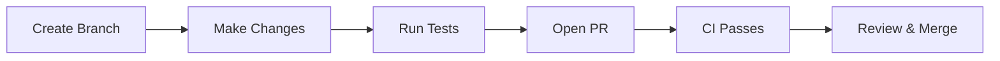
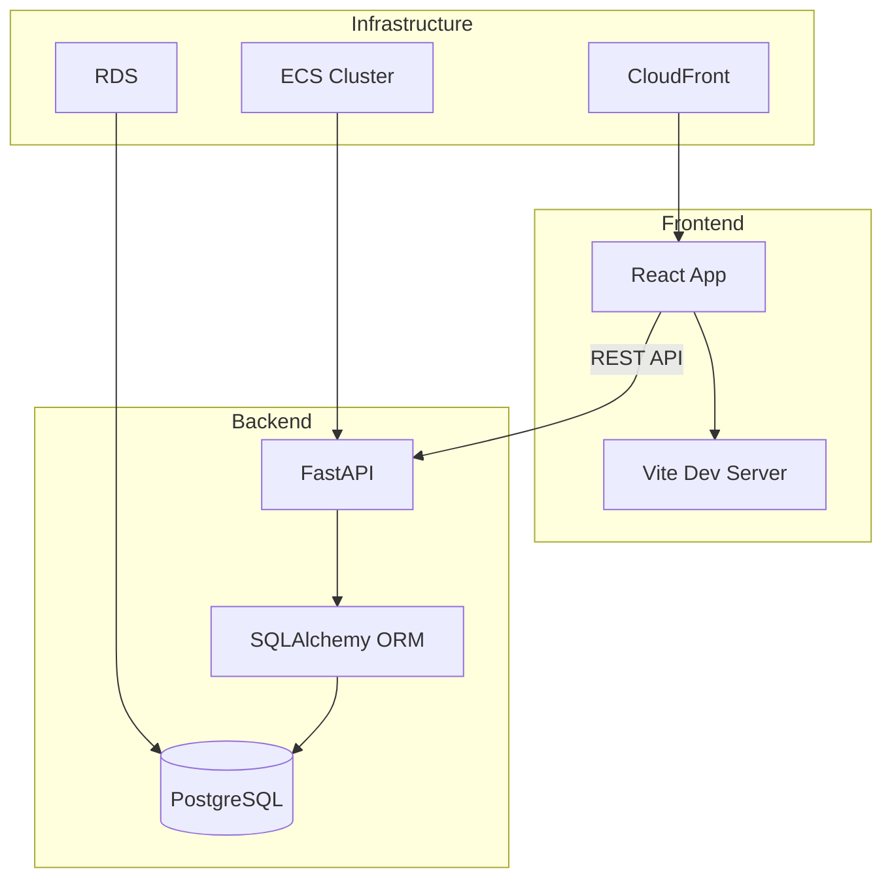
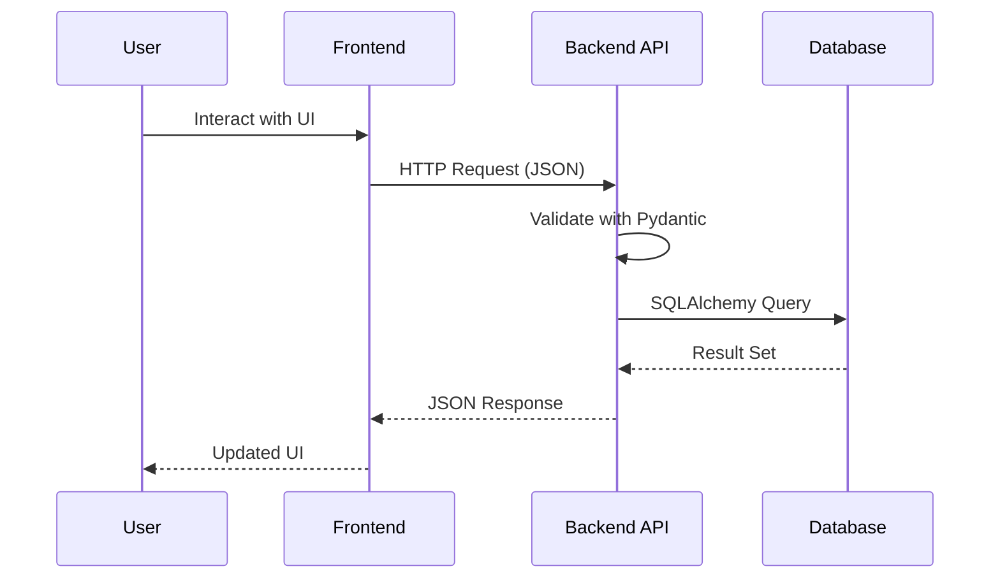

<!-- markdownlint-disable MD013 -->

## Overview

This is a complete, working example of a production-ready MkDocs documentation site called **acme-docs** - a
technical documentation portal for the ACME project. It demonstrates best practices for documentation sites
including Material for MkDocs theming, versioning with mike, search optimization, automated deployment to
GitHub Pages, and quality gates for link checking and spell checking.

**Project Purpose**: A documentation site template that teams can clone and customize for their own projects,
with automated deployment and validation built in.

---

## Project Structure

```text
acme-docs/
├── docs/
│   ├── index.md
│   ├── getting-started.md
│   ├── architecture.md
│   ├── api-reference.md
│   ├── contributing.md
│   ├── changelog.md
│   ├── assets/
│   │   └── logo.svg
│   └── stylesheets/
│       └── extra.css
├── .github/
│   └── workflows/
│       ├── deploy-docs.yml
│       └── link-check.yml
├── mkdocs.yml
├── pyproject.toml
├── .markdownlint.json
├── .pre-commit-config.yaml
├── Makefile
└── README.md
```

---

## pyproject.toml

```toml
[build-system]
requires = ["hatchling"]
build-backend = "hatchling.build"

[project]
name = "acme-docs"
version = "1.0.0"
description = "Technical documentation for the ACME project"
requires-python = ">=3.11"

dependencies = [
    "mkdocs>=1.6,<2",
    "mkdocs-material>=9.5,<10",
    "mkdocs-minify-plugin>=0.8,<1",
    "mkdocs-git-revision-date-localized-plugin>=1.3,<2",
    "mike>=2.1,<3",
    "pymdown-extensions>=10.12,<11",
]

[project.optional-dependencies]
dev = [
    "pre-commit>=4.0,<5",
]
```

---

## mkdocs.yml

```yaml
site_name: ACME Documentation
site_url: https://acme-org.github.io/acme-docs/
site_description: Technical documentation for the ACME project
site_author: ACME Engineering

repo_name: acme-org/acme-docs
repo_url: https://github.com/acme-org/acme-docs

theme:
  name: material
  custom_dir: docs/overrides
  logo: assets/logo.svg
  favicon: assets/logo.svg
  features:
    - navigation.tabs
    - navigation.sections
    - navigation.expand
    - navigation.top
    - navigation.footer
    - search.suggest
    - search.highlight
    - content.code.copy
    - content.code.annotate
    - content.tabs.link
    - toc.follow
  palette:
    - scheme: default
      primary: indigo
      accent: indigo
      toggle:
        icon: material/brightness-7
        name: Switch to dark mode
    - scheme: slate
      primary: indigo
      accent: indigo
      toggle:
        icon: material/brightness-4
        name: Switch to light mode
  font:
    text: Inter
    code: JetBrains Mono

plugins:
  - search
  - minify:
      minify_html: true
  - git-revision-date-localized:
      enable_creation_date: true
      type: timeago

markdown_extensions:
  - pymdownx.highlight:
      anchor_linenums: true
      line_spans: __span
      pygments_lang_class: true
  - pymdownx.inlinehilite
  - pymdownx.snippets
  - pymdownx.superfences:
      custom_fences:
        - name: mermaid
          class: mermaid
          format: !!python/name:pymdownx.superfences.fence_code_format
  - pymdownx.tabbed:
      alternate_style: true
  - pymdownx.details
  - pymdownx.tasklist:
      custom_checkbox: true
  - admonition
  - attr_list
  - md_in_html
  - tables
  - toc:
      permalink: true

extra:
  version:
    provider: mike
  social:
    - icon: fontawesome/brands/github
      link: https://github.com/acme-org

nav:
  - Home: index.md
  - Getting Started: getting-started.md
  - Architecture: architecture.md
  - API Reference: api-reference.md
  - Contributing: contributing.md
  - Changelog: changelog.md
```

---

## docs/index.md

```markdown
---
title: Home
description: Welcome to the ACME project documentation
---

# ACME Documentation

Welcome to the technical documentation for the **ACME Platform**.

## Quick Links

| Resource | Description |
|----------|-------------|
| Getting Started | Set up your development environment |
| Architecture | System design and component overview |
| API Reference | REST API endpoints and schemas |
| Contributing | How to contribute to the project |

## Project Overview

The ACME Platform is a task management system built with:

- **Backend**: Python (FastAPI)
- **Frontend**: TypeScript (React)
- **Infrastructure**: Terraform (AWS)

!!! tip "New to ACME?"
    Start with the Getting Started guide to set up your
    local development environment in under 5 minutes.
```

---

## docs/getting-started.md

````markdown
---
title: Getting Started
description: Set up your ACME development environment
---

# Getting Started

## Prerequisites

Before you begin, ensure you have the following installed:

| Tool | Version | Purpose |
|------|---------|---------|
| Python | >= 3.11 | Backend API |
| Node.js | >= 22 | Frontend app |
| Docker | >= 27 | Local services |
| Terraform | >= 1.9 | Infrastructure |

## Quick Start

### 1. Clone the Repository

```bash
git clone https://github.com/acme-org/acme-platform.git
cd acme-platform
```

### 2. Start Local Services

```bash
# Start all services with Docker Compose
make up

# Verify services are running
curl http://localhost:8000/health
curl http://localhost:3000
```

### 3. Run Tests

```bash
# Run all tests
make test

# Run backend tests only
make backend-test

# Run frontend tests only
make frontend-test
```

## Development Workflow



!!! note "Pre-commit Hooks"
    Install pre-commit hooks before your first commit:

    ```bash
    pre-commit install
    ```

## Next Steps

- Read the Architecture guide to understand the system design
- Check the API Reference for endpoint documentation
- See Contributing for coding standards

````

---

## docs/architecture.md

````markdown
---
title: Architecture
description: System architecture and component design
---

# Architecture

## System Overview



## Component Responsibilities

### Backend (Python FastAPI)

| Component | Responsibility |
|-----------|---------------|
| `main.py` | Application factory and middleware registration |
| `routes/` | HTTP endpoint handlers |
| `models.py` | SQLAlchemy ORM models |
| `schemas.py` | Pydantic request/response validation |
| `config.py` | Environment-based configuration |

### Frontend (TypeScript React)

| Component | Responsibility |
|-----------|---------------|
| `App.tsx` | Root component and routing |
| `components/` | Presentational and container components |
| `services/api.ts` | Typed HTTP client |
| `types/` | Shared TypeScript interfaces |

### Infrastructure (Terraform)

| Resource | Purpose |
|----------|---------|
| VPC | Network isolation with public/private subnets |
| RDS | Managed PostgreSQL with encryption |
| ECS | Container orchestration for the backend |
| CloudFront | CDN for frontend static assets |

## Data Flow



## Security Model

!!! warning "Production Checklist"
    Before deploying to production, ensure:

    - [ ] Database credentials in AWS Secrets Manager
    - [ ] CORS origins restricted to your domain
    - [ ] HTTPS enforced via CloudFront
    - [ ] WAF rules configured

````

---

## docs/api-reference.md

````markdown
---
title: API Reference
description: REST API endpoint documentation
---

# API Reference

## Base URL

| Environment | URL |
|-------------|-----|
| Development | `http://localhost:8000` |
| Production | `https://api.acme.example.com` |

## Endpoints

### Health Check

```bash
# Shallow health check
GET /health

# Response
{"status": "healthy", "service": "acme-api"}
```

### Tasks

#### List Tasks

```bash
GET /api/v1/tasks?status=pending&page=1&per_page=20
```

=== "Response 200"

    ```json
    {
      "tasks": [
        {
          "id": 1,
          "title": "Write documentation",
          "description": "Add API reference docs",
          "status": "pending",
          "priority": "high",
          "created_at": "2025-01-15T10:30:00Z",
          "updated_at": "2025-01-15T10:30:00Z"
        }
      ],
      "total": 1,
      "page": 1,
      "pages": 1
    }
    ```

#### Create Task

```bash
POST /api/v1/tasks
Content-Type: application/json

{
  "title": "New task",
  "description": "Optional description",
  "priority": "high"
}
```

=== "Response 201"

    ```json
    {
      "id": 2,
      "title": "New task",
      "description": "Optional description",
      "status": "pending",
      "priority": "high",
      "created_at": "2025-01-15T11:00:00Z",
      "updated_at": "2025-01-15T11:00:00Z"
    }
    ```

=== "Response 422"

    ```json
    {
      "detail": [
        {
          "loc": ["body", "title"],
          "msg": "field required",
          "type": "value_error.missing"
        }
      ]
    }
    ```

#### Update Task

```bash
PATCH /api/v1/tasks/{id}
Content-Type: application/json

{
  "status": "completed"
}
```

#### Delete Task

```bash
DELETE /api/v1/tasks/{id}
```

## Error Codes

| Status | Meaning |
|--------|---------|
| 200 | Success |
| 201 | Created |
| 204 | Deleted (no content) |
| 400 | Bad request |
| 404 | Resource not found |
| 422 | Validation error |
| 500 | Internal server error |

````

---

## docs/contributing.md

````markdown
---
title: Contributing
description: How to contribute to the ACME project
---

# Contributing

## Development Setup

```bash
# Clone and install
git clone https://github.com/acme-org/acme-platform.git
cd acme-platform

# Install pre-commit hooks
pre-commit install

# Start services
make up
```

## Branch Naming

```text
feat/description     # New features
fix/description      # Bug fixes
docs/description     # Documentation changes
refactor/description # Code refactoring
```

## Commit Messages

Follow [Conventional Commits](https://www.conventionalcommits.org/):

```text
feat(backend): add task filtering by priority
fix(frontend): correct date formatting in task card
docs: update API reference with new endpoints
chore(infra): upgrade AWS provider to 5.x
```

## Pull Request Process

1. Create a feature branch from `main`
2. Make changes and add tests
3. Ensure all CI checks pass
4. Request review from a maintainer
5. Squash and merge after approval

## Code Standards

| Language | Formatter | Linter |
|----------|-----------|--------|
| Python | Black (100 chars) | Flake8 |
| TypeScript | Prettier | ESLint |
| Terraform | terraform fmt | terraform validate |
| Markdown | markdownlint | cspell |

````

---

## docs/changelog.md

```markdown
---
title: Changelog
description: Release history for the ACME project
---

# Changelog

All notable changes to this project will be documented in this file.

The format is based on [Keep a Changelog](https://keepachangelog.com/).

## [1.0.0] - 2025-01-15

### Added

- Initial release of the ACME task management platform
- Backend API with FastAPI and SQLAlchemy
- Frontend dashboard with React and TypeScript
- Infrastructure as Code with Terraform
- CI/CD pipelines for all components
- Documentation site with MkDocs Material
```

---

## docs/stylesheets/extra.css

```css
/* Custom color overrides */
:root {
  --md-primary-fg-color: #3f51b5;
  --md-primary-fg-color--light: #5c6bc0;
  --md-primary-fg-color--dark: #303f9f;
  --md-accent-fg-color: #536dfe;
}

/* Code block styling */
.md-typeset code {
  font-size: 0.85em;
}

/* Admonition customization */
.md-typeset .admonition.tip {
  border-color: #4caf50;
}

/* Table styling */
.md-typeset table:not([class]) th {
  background-color: var(--md-primary-fg-color);
  color: var(--md-primary-bg-color);
}

/* Footer links */
.md-footer-meta__inner {
  display: flex;
  justify-content: space-between;
}
```

---

## .markdownlint.json

```json
{
  "MD013": {
    "line_length": 120,
    "code_block_line_length": 200,
    "code_blocks": true,
    "tables": false,
    "headings": true
  },
  "MD033": {
    "allowed_elements": ["details", "summary"]
  },
  "MD041": false
}
```

---

## .pre-commit-config.yaml

```yaml
repos:
  - repo: https://github.com/pre-commit/pre-commit-hooks
    rev: v5.0.0
    hooks:
      - id: trailing-whitespace
      - id: end-of-file-fixer
      - id: check-yaml
      - id: check-json
      - id: check-added-large-files
        args: [--maxkb=500]

  - repo: https://github.com/igorshubovych/markdownlint-cli
    rev: v0.43.0
    hooks:
      - id: markdownlint
        args: [--fix, --config, .markdownlint.json]

  - repo: https://github.com/adrienverge/yamllint
    rev: v1.35.1
    hooks:
      - id: yamllint
        args: [-d, "{extends: default, rules: {line-length: {max: 120}, document-start: disable}}"]
```

---

## Makefile

```makefile
.PHONY: help install serve build deploy clean link-check spell-check

help: ## Show available targets
 @grep -E '^[a-zA-Z_-]+:.*?## .*$$' $(MAKEFILE_LIST) | sort | \
  awk 'BEGIN {FS = ":.*?## "}; {printf "  \033[36m%-15s\033[0m %s\n", $$1, $$2}'

install: ## Install dependencies
 pip install -e ".[dev]"
 pre-commit install

serve: ## Start local development server
 mkdocs serve

build: ## Build documentation site
 mkdocs build --strict

deploy: ## Deploy to GitHub Pages (latest version)
 mike deploy --push --update-aliases $(VERSION) latest

clean: ## Remove build artifacts
 rm -rf site/ .cache/

link-check: ## Check for broken links
 npx markdown-link-check docs/**/*.md --config .github/markdown-link-check-config.json

spell-check: ## Check spelling
 npx cspell "docs/**/*.md"
```

---

## .github/workflows/deploy-docs.yml

```yaml
name: Deploy Documentation

on:
  push:
    branches: [main]
    paths:
      - "docs/**"
      - "mkdocs.yml"

permissions:
  contents: write
  pages: write
  id-token: write

jobs:
  deploy:
    runs-on: ubuntu-latest
    steps:
      - uses: actions/checkout@v4
        with:
          fetch-depth: 0

      - name: Set up Python
        uses: actions/setup-python@v5
        with:
          python-version: "3.12"

      - name: Install dependencies
        run: pip install -e ".[dev]"

      - name: Configure git
        run: |
          git config user.name "github-actions[bot]"
          git config user.email "github-actions[bot]@users.noreply.github.com"

      - name: Deploy with mike
        run: |
          mike deploy --push --update-aliases \
            "$(python -c 'import tomllib; print(tomllib.load(open("pyproject.toml","rb"))["project"]["version"])')" \
            latest
```

---

## .github/workflows/link-check.yml

```yaml
name: Link Check

on:
  push:
    branches: [main]
    paths: ["docs/**"]
  schedule:
    - cron: "0 9 * * 1"

permissions:
  contents: read
  issues: write

jobs:
  check-links:
    runs-on: ubuntu-latest
    steps:
      - uses: actions/checkout@v4

      - name: Check links
        uses: gaurav-nelson/github-action-markdown-link-check@v1
        with:
          use-quiet-mode: "yes"
          config-file: ".github/markdown-link-check-config.json"
          folder-path: "docs/"

      - name: Create issue on failure
        if: failure()
        uses: actions/github-script@v7
        with:
          script: |
            await github.rest.issues.create({
              owner: context.repo.owner,
              repo: context.repo.repo,
              title: 'Broken links detected in documentation',
              labels: ['documentation', 'broken-links'],
              body: `Broken links were detected during the weekly link check.\n\nSee [workflow run](${context.serverUrl}/${context.repo.owner}/${context.repo.repo}/actions/runs/${context.runId}) for details.`
            });
```

---

## Key Takeaways

This complete MkDocs documentation site example demonstrates:

1. **Material for MkDocs**: Full theme configuration with dark/light toggle, navigation tabs, and code copy
2. **Search Optimization**: Built-in search with suggestion and highlighting enabled
3. **Content Tabs and Admonitions**: Rich content formatting with tabbed code blocks and callout boxes
4. **Mermaid Diagrams**: Architecture diagrams and sequence diagrams rendered inline
5. **Git Revision Dates**: Automatic "last updated" timestamps from git history
6. **Versioned Documentation**: mike integration for maintaining multiple documentation versions
7. **Automated Deployment**: GitHub Actions workflow deploys only when docs or config change
8. **Link Checking**: Weekly automated link validation with auto-issue creation on failures
9. **Pre-commit Hooks**: markdownlint and yamllint enforce formatting on every commit
10. **Custom Styling**: CSS overrides for brand colors, code blocks, and table headers

The documentation site is production-ready and follows best practices for technical documentation
authoring, theming, and automated deployment.

---

**Status**: Active
