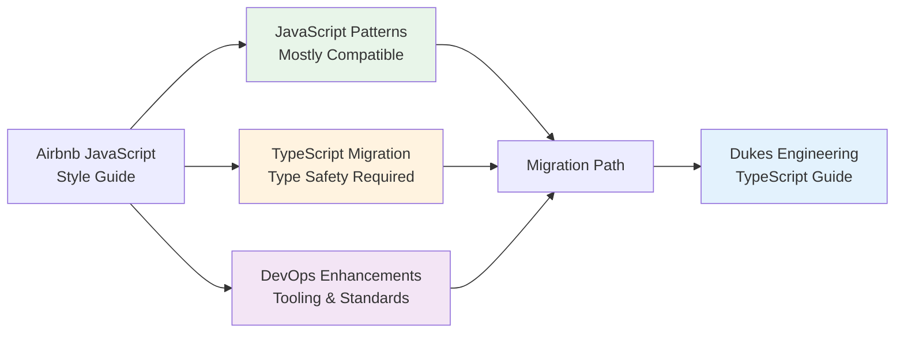

## Overview

This guide helps JavaScript and React developers transition from the **Airbnb JavaScript Style Guide** to
the **Dukes Engineering Style Guide** with a focus on **TypeScript adoption**. While Airbnb's guide is
excellent for JavaScript, our guide adds TypeScript type safety, DevOps-oriented enhancements, and
infrastructure automation requirements.

### What This Guide Covers

- JavaScript → TypeScript migration path
- Airbnb conventions vs. Dukes Engineering standards
- Type safety and static analysis requirements
- Modern tooling updates (ESLint, Prettier, TypeScript)
- React best practices alignment
- Step-by-step migration checklist

### Who Should Use This Guide

- Teams currently following Airbnb JavaScript/React Style Guide
- JavaScript projects adopting TypeScript
- React applications transitioning to type-safe development
- Organizations standardizing on TypeScript for DevOps tooling

## Quick Compatibility Summary



## What Stays the Same

Both Airbnb and Dukes Engineering guides share these JavaScript best practices:

### Core Principles ✅

| Aspect | Airbnb | Our Guide |
|--------|--------|-----------|
| **Prefer const** | ✅ | ✅ Same |
| **No var** | ✅ | ✅ Same |
| **Arrow functions** | ✅ | ✅ Same |
| **Template literals** | ✅ | ✅ Same |
| **Destructuring** | ✅ | ✅ Same |
| **Spread operator** | ✅ | ✅ Same |
| **Object shorthand** | ✅ | ✅ Same |
| **Array methods** | ✅ | ✅ Same (map, filter, reduce) |
| **Async/await** | ✅ | ✅ Same (preferred over promises) |
| **Module imports** | ✅ | ✅ Same (ES6 modules) |

### Naming Conventions ✅

| Element | Convention | Airbnb | Our Guide |
|---------|-----------|--------|-----------|
| Variables | `camelCase` | ✅ | ✅ Same |
| Constants | `UPPER_SNAKE_CASE` | ✅ | ✅ Same |
| Functions | `camelCase` | ✅ | ✅ Same |
| Classes | `PascalCase` | ✅ | ✅ Same |
| React Components | `PascalCase` | ✅ | ✅ Same |
| Private (convention) | `_leadingUnderscore` | ✅ | ✅ Same |
| Files | `camelCase` or `PascalCase` | ✅ | ✅ Same |

### Code Style ✅

- **Indentation**: 2 spaces (both guides)
- **Semicolons**: Required (both guides)
- **Quotes**: Single quotes for strings (both guides)
- **Trailing commas**: Encouraged (both guides)
- **Max line length**: 100 characters (both guides)

## What Changes: JavaScript → TypeScript

### 1. Type Annotations: Optional → Required

**Airbnb (JavaScript)**: No type system (relies on JSDoc comments)
**Our Guide (TypeScript)**: Type annotations required for all functions, variables, and parameters

**Why**: TypeScript provides compile-time type checking, prevents runtime errors, improves IDE
support, and serves as inline documentation for DevOps automation code.

**Migration**:

```javascript
// Airbnb JavaScript - JSDoc for types
/**
 * Calculate total price with tax
 * @param {number} price - Base price
 * @param {number} taxRate - Tax rate (0-1)
 * @returns {number} Total price
 */
function calculateTotal(price, taxRate) {
  return price * (1 + taxRate);
}

// Our Guide TypeScript - Type annotations
function calculateTotal(price: number, taxRate: number): number {
  return price * (1 + taxRate);
}
```

**Action Required**:

- Add TypeScript type annotations to all functions
- Replace JSDoc types with TypeScript types
- Define interfaces for complex objects
- Use type aliases for union types

### 2. Interface Definitions: None → Required

**Airbnb (JavaScript)**: PropTypes for React, no formal interfaces
**Our Guide (TypeScript)**: Interfaces/types required for all data structures

**Migration**:

```javascript
// Airbnb JavaScript with PropTypes
import PropTypes from 'prop-types';

function UserCard({ user }) {
  return <div>{user.name}</div>;
}

UserCard.propTypes = {
  user: PropTypes.shape({
    id: PropTypes.number.isRequired,
    name: PropTypes.string.isRequired,
    email: PropTypes.string.isRequired
  }).isRequired
};

// Our Guide TypeScript with interfaces
interface User {
  id: number;
  name: string;
  email: string;
}

interface UserCardProps {
  user: User;
}

function UserCard({ user }: UserCardProps): JSX.Element {
  return <div>{user.name}</div>;
}
```

**Action Required**:

- Convert PropTypes to TypeScript interfaces
- Define interfaces for all data structures
- Use type inference where obvious
- Export interfaces for shared types

### 3. React Component Types: Implicit → Explicit

**Airbnb (JavaScript)**: Functional components, PropTypes validation
**Our Guide (TypeScript)**: Typed functional components with React.FC or explicit types

**Migration**:

```javascript
// Airbnb JavaScript
const Button = ({ onClick, children, disabled = false }) => (
  <button onClick={onClick} disabled={disabled}>
    {children}
  </button>
);

Button.propTypes = {
  onClick: PropTypes.func.isRequired,
  children: PropTypes.node.isRequired,
  disabled: PropTypes.bool
};

// Our Guide TypeScript - Option 1: Explicit types (recommended)
interface ButtonProps {
  onClick: () => void;
  children: React.ReactNode;
  disabled?: boolean;
}

const Button = ({ onClick, children, disabled = false }: ButtonProps): JSX.Element => (
  <button onClick={onClick} disabled={disabled}>
    {children}
  </button>
);

// Our Guide TypeScript - Option 2: React.FC (acceptable)
const Button: React.FC<ButtonProps> = ({ onClick, children, disabled = false }) => (
  <button onClick={onClick} disabled={disabled}>
    {children}
  </button>
);
```

**Action Required**:

- Define prop interfaces for all components
- Remove PropTypes dependencies
- Add return type annotations
- Use optional properties (`?`) for optional props

### 4. Enum Usage: None → Recommended

**Airbnb (JavaScript)**: Object constants or string literals
**Our Guide (TypeScript)**: Enums or const enums for fixed sets of values

**Migration**:

```javascript
// Airbnb JavaScript - Object constants
const UserRole = {
  ADMIN: 'admin',
  USER: 'user',
  GUEST: 'guest'
};

function checkPermission(role) {
  return role === UserRole.ADMIN;
}

// Our Guide TypeScript - Enums
enum UserRole {
  Admin = 'admin',
  User = 'user',
  Guest = 'guest'
}

function checkPermission(role: UserRole): boolean {
  return role === UserRole.Admin;
}

// Or const enum for better tree-shaking
const enum UserRole {
  Admin = 'admin',
  User = 'user',
  Guest = 'guest'
}
```

**Action Required**:

- Convert object constants to enums
- Use const enums for better performance
- Define enum types for fixed value sets

### 5. Null/Undefined Handling: Loose → Strict

**Airbnb (JavaScript)**: Loose equality, runtime checks
**Our Guide (TypeScript)**: Strict null checks, union types with null/undefined

**Migration**:

```javascript
// Airbnb JavaScript
function getUserName(user) {
  if (!user || !user.name) {
    return 'Anonymous';
  }
  return user.name;
}

// Our Guide TypeScript
interface User {
  name: string;
}

function getUserName(user: User | null | undefined): string {
  if (!user?.name) {
    return 'Anonymous';
  }
  return user.name;
}

// Or with optional chaining and nullish coalescing
function getUserName(user?: User): string {
  return user?.name ?? 'Anonymous';
}
```

**Action Required**:

- Enable `strictNullChecks` in tsconfig.json
- Use optional chaining (`?.`) and nullish coalescing (`??`)
- Explicitly type nullable values with `| null | undefined`
- Handle null/undefined cases explicitly

### 6. Generic Types: None → Used Extensively

**Airbnb (JavaScript)**: No generics concept
**Our Guide (TypeScript)**: Generics for reusable, type-safe functions

**Migration**:

```javascript
// Airbnb JavaScript
function getFirstItem(array) {
  return array.length > 0 ? array[0] : null;
}

// Our Guide TypeScript - Generics
function getFirstItem<T>(array: T[]): T | null {
  return array.length > 0 ? array[0] : null;
}

// Usage with type inference
const firstNumber = getFirstItem([1, 2, 3]); // Type: number | null
const firstName = getFirstItem(['a', 'b']); // Type: string | null
```

**Action Required**:

- Add generic type parameters to reusable functions
- Use generics for containers (arrays, maps, sets)
- Define generic interfaces for flexible data structures

## Tool Configuration Migration

### From JavaScript to TypeScript Build Tools

#### Remove JavaScript-only Tools

```bash
# Uninstall PropTypes (replaced by TypeScript)
npm uninstall prop-types

# Remove Babel if only used for type checking
npm uninstall @babel/preset-typescript
```

#### Install TypeScript Tooling

```bash
# Install TypeScript and related tools
npm install --save-dev typescript
npm install --save-dev @types/react @types/react-dom @types/node
npm install --save-dev ts-node tsx
```

#### TypeScript Configuration

Create `tsconfig.json`:

```json
{
  "compilerOptions": {
    "target": "ES2020",
    "lib": ["ES2020", "DOM", "DOM.Iterable"],
    "jsx": "react-jsx",
    "module": "ESNext",
    "moduleResolution": "node",
    "resolveJsonModule": true,
    "allowJs": true,
    "checkJs": false,
    "outDir": "./dist",
    "rootDir": "./src",
    "strict": true,
    "strictNullChecks": true,
    "strictFunctionTypes": true,
    "strictBindCallApply": true,
    "strictPropertyInitialization": true,
    "noImplicitThis": true,
    "noUnusedLocals": true,
    "noUnusedParameters": true,
    "noImplicitReturns": true,
    "noFallthroughCasesInSwitch": true,
    "esModuleInterop": true,
    "skipLibCheck": true,
    "forceConsistentCasingInFileNames": true
  },
  "include": ["src"],
  "exclude": ["node_modules", "dist"]
}
```

### ESLint Configuration Updates

#### Update ESLint for TypeScript

```bash
# Install TypeScript ESLint
npm install --save-dev @typescript-eslint/parser @typescript-eslint/eslint-plugin
```

#### Update `.eslintrc.json`

```json
{
  "extends": [
    "airbnb",
    "airbnb/hooks",
    "plugin:@typescript-eslint/recommended",
    "plugin:@typescript-eslint/recommended-requiring-type-checking",
    "prettier"
  ],
  "parser": "@typescript-eslint/parser",
  "parserOptions": {
    "ecmaVersion": 2020,
    "sourceType": "module",
    "ecmaFeatures": {
      "jsx": true
    },
    "project": "./tsconfig.json"
  },
  "plugins": ["@typescript-eslint", "react", "react-hooks"],
  "rules": {
    "react/jsx-filename-extension": [1, { "extensions": [".tsx"] }],
    "react/prop-types": "off",
    "@typescript-eslint/explicit-function-return-type": "warn",
    "@typescript-eslint/no-unused-vars": "error",
    "@typescript-eslint/no-explicit-any": "error",
    "import/extensions": [
      "error",
      "ignorePackages",
      {
        "ts": "never",
        "tsx": "never"
      }
    ]
  },
  "settings": {
    "import/resolver": {
      "typescript": {}
    }
  }
}
```

### Prettier Configuration

Both Airbnb and our guide work well with Prettier. Update `.prettierrc`:

```json
{
  "semi": true,
  "singleQuote": true,
  "tabWidth": 2,
  "trailingComma": "es5",
  "printWidth": 100,
  "arrowParens": "always",
  "endOfLine": "lf"
}
```

## Migration Checklist

### Phase 1: Setup TypeScript Infrastructure

- [ ] **Install TypeScript and dependencies**

  ```bash
  npm install --save-dev typescript
  npm install --save-dev @types/react @types/react-dom @types/node
  ```

- [ ] **Create `tsconfig.json`**
  - Enable strict mode
  - Configure module resolution
  - Set target to ES2020+

- [ ] **Update build scripts in `package.json`**

  ```json
  {
    "scripts": {
      "build": "tsc",
      "dev": "tsx src/index.ts",
      "type-check": "tsc --noEmit"
    }
  }
  ```

- [ ] **Install TypeScript ESLint**

  ```bash
  npm install --save-dev @typescript-eslint/parser @typescript-eslint/eslint-plugin
  ```

- [ ] **Update ESLint configuration**
  - Add TypeScript parser
  - Add TypeScript plugin
  - Update rules for TypeScript

### Phase 2: Incremental File Migration

- [ ] **Rename files from .js/.jsx to .ts/.tsx**
  - Start with utility functions (`.js` → `.ts`)
  - Then components (`.jsx` → `.tsx`)
  - Work from leaf modules to entry points

- [ ] **Enable `allowJs` in tsconfig.json**
  - Allows gradual migration
  - TypeScript and JavaScript can coexist

- [ ] **Address type errors incrementally**
  - Fix one module at a time
  - Use `// @ts-ignore` sparingly for tough cases
  - Create issue tracking for remaining `@ts-ignore`

### Phase 3: Add Type Definitions

- [ ] **Convert PropTypes to TypeScript interfaces**

  ```typescript
  // Before
  Component.propTypes = {
    user: PropTypes.shape({
      id: PropTypes.number,
      name: PropTypes.string
    })
  };

  // After
  interface User {
    id: number;
    name: string;
  }

  interface ComponentProps {
    user: User;
  }
  ```

- [ ] **Add explicit return types to functions**

  ```typescript
  function calculateTotal(price: number, tax: number): number {
    return price * (1 + tax);
  }
  ```

- [ ] **Define interfaces for API responses**

  ```typescript
  interface ApiResponse<T> {
    data: T;
    status: number;
    message: string;
  }
  ```

- [ ] **Create type definitions for external libraries**
  - Install `@types/*` packages
  - Create custom `.d.ts` files if needed

### Phase 4: React Component Migration

- [ ] **Update functional components with types**

  ```typescript
  const Button: React.FC<ButtonProps> = ({ onClick, children }) => (
    <button onClick={onClick}>{children}</button>
  );
  ```

- [ ] **Add types to hooks**

  ```typescript
  const [count, setCount] = useState<number>(0);
  const ref = useRef<HTMLDivElement>(null);
  const context = useContext<AuthContextType>(AuthContext);
  ```

- [ ] **Type event handlers**

  ```typescript
  const handleClick = (event: React.MouseEvent<HTMLButtonElement>): void => {
    console.log(event.currentTarget);
  };
  ```

- [ ] **Remove PropTypes dependencies**

  ```bash
  npm uninstall prop-types
  ```

### Phase 5: Advanced TypeScript Features

- [ ] **Use generics for reusable components**

  ```typescript
  interface ListProps<T> {
    items: T[];
    renderItem: (item: T) => React.ReactNode;
  }

  function List<T>({ items, renderItem }: ListProps<T>) {
    return <>{items.map(renderItem)}</>;
  }
  ```

- [ ] **Add discriminated unions for state**

  ```typescript
  type LoadingState =
    | { status: 'idle' }
    | { status: 'loading' }
    | { status: 'success'; data: User[] }
    | { status: 'error'; error: string };
  ```

- [ ] **Use utility types**

  ```typescript
  type PartialUser = Partial<User>;
  type ReadonlyUser = Readonly<User>;
  type UserKeys = keyof User;
  type UserName = Pick<User, 'name'>;
  ```

### Phase 6: Testing Updates

- [ ] **Install TypeScript testing types**

  ```bash
  npm install --save-dev @types/jest @types/testing-library__react
  ```

- [ ] **Update test files to `.test.ts` or `.test.tsx`**

- [ ] **Add types to test utilities**

  ```typescript
  const renderWithProviders = (
    ui: React.ReactElement,
    options?: RenderOptions
  ): RenderResult => {
    return render(ui, { wrapper: AllTheProviders, ...options });
  };
  ```

### Phase 7: CI/CD Integration

- [ ] **Add TypeScript check to CI pipeline**

  ```yaml
  - name: Type check
    run: npm run type-check
  ```

- [ ] **Configure TypeScript strict mode gradually**
  - Start with `strictNullChecks: true`
  - Enable `noImplicitAny: true`
  - Eventually enable all strict flags

- [ ] **Add type coverage tracking**

  ```bash
  npx type-coverage --at-least 95
  ```

### Phase 8: Documentation and Training

- [ ] **Update README with TypeScript instructions**
  - Document type-checking commands
  - Explain tsconfig.json settings

- [ ] **Create TypeScript coding guidelines**
  - When to use interfaces vs types
  - Generic type naming conventions
  - Any vs unknown usage

- [ ] **Team training on TypeScript**
  - Share this migration guide
  - Conduct TypeScript workshop
  - Set up pair programming for migration

## Common Migration Pitfalls

### 1. Overuse of `any` Type

**Problem**: Using `any` everywhere defeats the purpose of TypeScript.

**Solution**: Use specific types or `unknown` for truly dynamic values.

```typescript
// Avoid
function processData(data: any): any {
  return data.value;
}

// Better - use generics or specific types
function processData<T extends { value: string }>(data: T): string {
  return data.value;
}

// Or for truly unknown data
function processData(data: unknown): string {
  if (typeof data === 'object' && data !== null && 'value' in data) {
    return String((data as { value: unknown }).value);
  }
  throw new Error('Invalid data structure');
}
```

### 2. Ignoring Null/Undefined

**Problem**: Not handling null/undefined cases explicitly.

**Solution**: Enable strict null checks and handle edge cases.

```typescript
// Risky
function getUserEmail(user: User): string {
  return user.email; // What if user.email is undefined?
}

// Safe
function getUserEmail(user: User): string | undefined {
  return user.email;
}

// Or with default
function getUserEmail(user: User): string {
  return user.email ?? 'no-email@example.com';
}
```

### 3. Type Assertion Abuse

**Problem**: Using `as` type assertions to bypass type checking.

**Solution**: Fix the underlying type issue instead of asserting.

```typescript
// Risky
const button = document.getElementById('btn') as HTMLButtonElement;
button.click(); // What if it's not a button?

// Safer
const element = document.getElementById('btn');
if (element instanceof HTMLButtonElement) {
  element.click();
}
```

### 4. Missing Generic Constraints

**Problem**: Generics without constraints allow any type.

**Solution**: Add constraints to generics for type safety.

```typescript
// Too permissive
function getProperty<T>(obj: T, key: string) {
  return obj[key]; // Type error: key not constrained
}

// Better - constrain the key
function getProperty<T, K extends keyof T>(obj: T, key: K): T[K] {
  return obj[key];
}
```

### 5. PropTypes Not Fully Converted

**Problem**: Leaving PropTypes alongside TypeScript types.

**Solution**: Remove PropTypes after adding TypeScript interfaces.

```typescript
// Redundant
interface ButtonProps {
  onClick: () => void;
  label: string;
}

const Button: React.FC<ButtonProps> = ({ onClick, label }) => (
  <button onClick={onClick}>{label}</button>
);

// Don't do this - remove PropTypes
Button.propTypes = {
  onClick: PropTypes.func.isRequired,
  label: PropTypes.string.isRequired
};
```

## Gradual Adoption Strategy

### Week 1-2: Foundation

- Set up TypeScript compiler and configuration
- Install type definitions for dependencies
- Configure ESLint for TypeScript
- Update build pipeline to include type checking

### Week 3-4: Core Utilities

- Migrate utility functions (`.js` → `.ts`)
- Add type definitions for common data structures
- Create shared type definition files
- No React component migration yet

### Week 5-6: React Components (Phase 1)

- Start with leaf components (no dependencies)
- Convert PropTypes to TypeScript interfaces
- Add prop type definitions
- Update component signatures

### Week 7-8: React Components (Phase 2)

- Migrate higher-level components
- Add context provider types
- Type custom hooks
- Add event handler types

### Week 9-10: State Management

- Type Redux/Zustand/Context stores
- Add action and reducer types
- Type selectors and middleware
- Ensure type safety in state updates

### Week 11-12: API & Async Code

- Add types for API responses
- Type async functions and promises
- Add types for fetch/axios calls
- Create API client interfaces

### Month 4+: Polish and Strictness

- Enable all strict TypeScript flags
- Remove all `// @ts-ignore` comments
- Achieve 95%+ type coverage
- Zero TypeScript errors project-wide

## Success Metrics

| Metric | Target | Measurement |
|--------|--------|-------------|
| Type Coverage | 95%+ | `npx type-coverage` |
| TypeScript Errors | 0 | `tsc --noEmit` |
| `any` Usage | <1% | ESLint rule |
| Strict Mode | Enabled | `tsconfig.json` |
| PropTypes Removed | 100% | No `prop-types` in deps |
| Test Coverage | 80%+ | Jest with types |

## Side-by-Side Comparison: Airbnb vs. Dukes Engineering

| Aspect | Airbnb JavaScript | Dukes Engineering TypeScript |
|--------|------------------|------------------------------|
| **Language** | JavaScript (ES6+) | **TypeScript** |
| **Type System** | None (JSDoc comments) | **Static types required** |
| **Type Checking** | Runtime (PropTypes) | **Compile-time** |
| **React Prop Validation** | PropTypes | **TypeScript interfaces** |
| **Null Safety** | Runtime checks | **Compile-time strictNullChecks** |
| **IDE Support** | Good | **Excellent (autocomplete, refactoring)** |
| **Error Detection** | Runtime | **Compile-time** |
| **Generics** | Not available | **Used extensively** |
| **Interfaces** | Not available | **Required for data structures** |
| **Enum Support** | Object constants | **Native enums** |
| **Build Step** | Babel | **TypeScript compiler** |
| **File Extensions** | `.js`, `.jsx` | **`.ts`, `.tsx`** |
| **Linter** | ESLint (JavaScript) | **ESLint + TypeScript plugin** |

## Support and Resources

### Documentation References

- [TypeScript Style Guide](../02_language_guides/typescript.md) - Full Dukes Engineering TypeScript standards
- [Testing Strategies](../05_ci_cd/testing_strategies.md) - TypeScript testing patterns
- [IDE Integration Guide](../05_ci_cd/ide_integration_guide.md) - VS Code TypeScript setup
- [GitHub Actions Guide](../05_ci_cd/github_actions_guide.md) - TypeScript CI/CD workflows

### Tool Documentation

- [TypeScript Handbook](https://www.typescriptlang.org/docs/handbook/intro.html) - Official TypeScript docs
- [TypeScript ESLint](https://typescript-eslint.io/) - ESLint for TypeScript
- [React TypeScript Cheatsheet](https://react-typescript-cheatsheet.netlify.app/) - React with TypeScript
- [@types packages](https://github.com/DefinitelyTyped/DefinitelyTyped) - Type definitions

### External References

- [Airbnb JavaScript Style Guide](https://github.com/airbnb/javascript) - Original Airbnb guide
- [Airbnb React Style Guide](https://github.com/airbnb/javascript/tree/master/react) - React conventions
- [TypeScript Migration Guide](https://www.typescriptlang.org/docs/handbook/migrating-from-javascript.html) -
Official migration docs

## Conclusion

Migrating from Airbnb JavaScript Style Guide to Dukes Engineering TypeScript Style Guide brings:

✅ **Type Safety** - Catch errors at compile-time instead of runtime
✅ **Better IDE Support** - Enhanced autocomplete, refactoring, and navigation
✅ **Self-Documenting Code** - Types serve as inline documentation
✅ **Refactoring Confidence** - Type system ensures changes don't break contracts
✅ **DevOps Ready** - Type safety essential for infrastructure automation
✅ **Modern Tooling** - Latest TypeScript features and ecosystem
✅ **Scalability** - Type system scales with codebase growth

While Airbnb's JavaScript guide is excellent, TypeScript adds critical type safety and developer
experience improvements essential for modern DevOps workflows, infrastructure automation, and large-scale
applications.

**Questions or need help?** Open an issue or consult the
[Getting Started Guide](../01_overview/getting_started.md).
