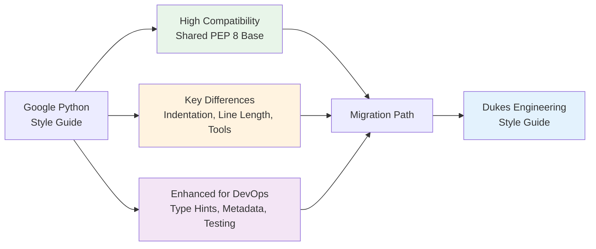

## Overview

This guide helps Python developers transition from the **Google Python Style Guide** to the **Dukes Engineering
Style Guide**. While both guides share many similarities and are both based on PEP 8, the Dukes Engineering guide
adds DevOps-focused enhancements and modern tooling requirements for infrastructure automation.

### What This Guide Covers

- Compatibility assessment between Google and Dukes Engineering guides
- Key differences in formatting and conventions
- Enhanced requirements for DevOps workflows
- Tool migration (Pylint → Black + mypy + pytest)
- Step-by-step migration checklist
- Before/after code examples

### Who Should Use This Guide

- Google-style Python projects transitioning to Dukes Engineering standards
- Teams familiar with Google's conventions adopting DevOps best practices
- Projects adding infrastructure automation requirements
- Organizations standardizing on Black, mypy, and modern Python tooling

## Quick Compatibility Summary



## What Stays the Same

Both Google and Dukes Engineering guides share these core PEP 8 conventions:

### Naming Conventions ✅

| Element | Convention | Google | Our Guide |
|---------|-----------|--------|-----------|
| Modules | `snake_case` | ✅ | ✅ Same |
| Packages | `snake_case` | ✅ | ✅ Same |
| Classes | `PascalCase` | ✅ | ✅ Same |
| Exceptions | `Error` suffix | ✅ | ✅ Same |
| Functions | `snake_case` | ✅ | ✅ Same |
| Global/Class Constants | `UPPER_SNAKE_CASE` | ✅ | ✅ Same |
| Global/Class Variables | `snake_case` | ✅ | ✅ Same |
| Instance Variables | `snake_case` | ✅ | ✅ Same |
| Private | `_leading_underscore` | ✅ | ✅ Same |

### Import Organization ✅

Both guides require:

- Standard library imports first
- Third-party library imports second
- Local application imports last
- Alphabetical ordering within each group
- Absolute imports preferred over relative

### String Quotes ✅

Both allow single and double quotes (prefer consistency within a file)

### Docstring Format ✅

Both use Google-style docstrings with `Args:`, `Returns:`, `Raises:` sections

## What Changes: Key Differences

### 1. Indentation: 2 Spaces → 4 Spaces

**Google**: 2 spaces per indentation level
**Our Guide**: 4 spaces per indentation level (PEP 8 standard)

**Why**: PEP 8 specifies 4 spaces as the standard. Most Python tooling and IDEs default to 4 spaces.
Consistency with the broader Python ecosystem improves code readability across projects.

**Migration**:

```python
## Google - 2 spaces
def calculate_total(items):
  total = 0
  for item in items:
    if item.is_valid:
      total += item.price
  return total

## Our Guide - 4 spaces
def calculate_total(items):
    total = 0
    for item in items:
        if item.is_valid:
            total += item.price
    return total
```

**Action Required**:

- Configure editor to use 4 spaces for indentation
- Run Black formatter to automatically convert indentation
- Update `.editorconfig` if present:

  ```ini
  [*.py]
  indent_style = space
  indent_size = 4
  ```

### 2. Line Length: 80 Characters → 88 Characters

**Google**: Maximum 80 characters (strict)
**Our Guide**: Maximum 88 characters (Black default)

**Why**: Black's 88-character limit provides a better balance between line length and code density,
reducing unnecessary line breaks while maintaining readability on modern displays.

**Migration**:

```python
## Google - 80 chars, requires breaking
result = database.query(User).filter(
    User.is_active == True
).order_by(User.created_at).all()

## Our Guide - 88 chars, more natural
result = database.query(User).filter(User.is_active == True).order_by(
    User.created_at
).all()
```

**Action Required**:

- Update editor rulers from 80 to 88 characters
- Configure Black with default 88 character line length
- Update Pylint/Flake8 to allow 88 characters

### 3. Type Hints: Recommended → Required

**Google**: Type annotations encouraged but optional
**Our Guide**: Type hints required for all function signatures

**Why**: Infrastructure automation and DevOps code benefits significantly from type safety.
Type hints enable static analysis, prevent runtime errors, and serve as inline documentation.

**Migration**:

```python
## Google - optional type hints
def get_user(user_id):
    """Retrieve user by ID.

    Args:
        user_id: The user ID to retrieve.

    Returns:
        User object if found, None otherwise.
    """
    return database.query(User).filter(User.id == user_id).first()

## Our Guide - required type hints
from typing import Optional

def get_user(user_id: int) -> Optional[User]:
    """
    Retrieve user by ID.

    Args:
        user_id: The user ID to retrieve

    Returns:
        User object if found, None otherwise
    """
    return database.query(User).filter(User.id == user_id).first()
```

**Action Required**:

- Add type hints to all function signatures
- Import from `typing` module: `List`, `Dict`, `Optional`, `Union`, `Tuple`
- Run `mypy` for type validation
- Remove redundant type information from docstrings (types now in hints)

### 4. Documentation: Google Docstrings → Enhanced Metadata

**Google**: Standard Google-style docstrings
**Our Guide**: Google-style docstrings + structured module metadata

**Why**: Enhanced metadata enables automated documentation generation, dependency tracking,
version management, and AI-assisted code analysis for DevOps workflows.

**Migration**:

```python
## Google - basic module docstring
"""User authentication and session management."""

import jwt
from fastapi import HTTPException

## Our Guide - enhanced module metadata
"""
@module user_authentication
@description Handles user authentication, session management, and JWT token generation
@dependencies fastapi, pyjwt, passlib, python-dotenv
@version 1.2.0
@author Tyler Dukes
@last_updated 2025-12-07
@status stable
@security_classification internal
@python_version >= 3.9
"""

import jwt
from fastapi import HTTPException
```

**Action Required**:

- Add structured metadata to all module docstrings
- Document all dependencies explicitly
- Add version, author, and status information
- Specify security classification for sensitive modules
- Document minimum Python version requirements

### 5. Formatters: Pylint + YAPF → Black + mypy + Flake8

**Google**: Pylint for linting, YAPF for formatting
**Our Guide**: Black (formatting) + mypy (type checking) + Flake8 (linting)

**Why**: Black is opinionated and eliminates formatting debates. mypy provides comprehensive
type checking. Flake8 catches style and logical errors.

**Google Tool Stack**:

```bash
## Google typical setup
pip install pylint yapf
pylint --rcfile=.pylintrc src/
yapf -i -r src/
```

**Our Tool Stack**:

```bash
## Dukes Engineering setup
pip install black mypy flake8 isort
black .
isort .
mypy src/
flake8 .
```

**Action Required**:

- Remove YAPF and Pylint configurations
- Install Black, mypy, Flake8, isort
- Configure tools in `pyproject.toml`
- Set up pre-commit hooks
- Update CI/CD pipelines

### 6. Testing: Flexible → Required 80%+ Coverage

**Google**: Testing encouraged, no specific coverage requirement
**Our Guide**: 80%+ test coverage required, specific naming conventions

**Why**: DevOps and infrastructure code requires high reliability. Automated testing with strong
coverage prevents production incidents.

**Migration**:

```python
## Google - flexible test naming and structure
def test_user_creation():
    user = create_user("john@example.com")
    assert user.email == "john@example.com"

## Our Guide - structured naming and Arrange-Act-Assert
def test_should_create_user_when_valid_email_provided():
    """Test create_user creates user with valid email."""
    # Arrange
    email = "john@example.com"

    # Act
    user = create_user(email)

    # Assert
    assert user.email == email
    assert user.id is not None
```

**Action Required**:

- Adopt test naming: `test_should_<behavior>_when_<condition>`
- Structure tests with Arrange-Act-Assert pattern
- Set up pytest with coverage reporting (target 80%+)
- Configure coverage enforcement in CI/CD
- Add coverage badges to README

### 7. Security: Best Practices → Explicit Requirements

**Google**: Security best practices mentioned generally
**Our Guide**: Explicit security requirements with tooling

**Why**: Infrastructure automation handles sensitive credentials, cloud resources, and production
systems. Security must be enforced, not just recommended.

**Migration - Input Validation**:

```python
## Google - manual validation
def get_user_by_email(email):
    if not email or '@' not in email:
        raise ValueError("Invalid email")
    return database.query(email)

## Our Guide - schema validation with Pydantic
from pydantic import BaseModel, EmailStr

class UserQuery(BaseModel):
    """Validated user query request."""
    email: EmailStr

def get_user_by_email(email: str) -> Optional[User]:
    """Get user by email with validated input."""
    query_data = UserQuery(email=email)
    return database.query(query_data.email)
```

**Migration - Secret Management**:

```python
## Google - configuration flexibility
API_KEY = "sk_live_abc123"  # Not ideal but allowed

## Our Guide - environment variables required
import os

API_KEY = os.getenv("API_KEY")
if not API_KEY:
    raise EnvironmentError("API_KEY environment variable required")
```

**Action Required**:

- Add input validation with Pydantic or similar
- Move all secrets to environment variables
- Add `.env` to `.gitignore`
- Run Bandit security scanner in CI/CD
- Use parameterized queries (never string concatenation for SQL)

### 8. Error Handling: Flexible → Fail-Fast with Specific Exceptions

**Google**: Standard exception handling
**Our Guide**: Fail-fast with custom exception hierarchies

**Why**: Infrastructure code should fail explicitly and early with clear error messages.
Custom exceptions improve error handling and debugging.

**Migration**:

```python
## Google - standard exceptions
def fetch_data(url):
    try:
        response = requests.get(url)
        return response.json()
    except Exception as e:
        print(f"Error: {e}")
        return None

## Our Guide - custom exceptions and proper logging
class APIError(Exception):
    """Base exception for API-related errors."""
    pass

class APITimeoutError(APIError):
    """Raised when API request times out."""
    pass

def fetch_data(url: str) -> Dict:
    """Fetch data from remote API with proper error handling."""
    try:
        response = requests.get(url, timeout=10)
        response.raise_for_status()
        return response.json()
    except requests.Timeout:
        logger.error(f"Timeout fetching data from {url}")
        raise APITimeoutError(f"Request to {url} timed out")
    except requests.HTTPError as e:
        logger.error(f"HTTP error {e.response.status_code}: {url}")
        raise APIError(f"Failed to fetch data: {e}")
```

**Action Required**:

- Create custom exception hierarchies for your domain
- Replace generic `except Exception` with specific exceptions
- Add structured logging before raising exceptions
- Never silently catch exceptions
- Use context managers for resource cleanup

## Tool Configuration Migration

### From Pylint to Black + Flake8 + mypy

#### Remove Pylint Configuration

Delete or comment out in `setup.cfg` or `.pylintrc`:

```ini
## [pylint]
## max-line-length = 80
## disable = ...
```

#### Add Black Configuration

In `pyproject.toml`:

```toml
[tool.black]
line-length = 88
target-version = ['py39', 'py310', 'py311']
include = '\.pyi?$'
```

#### Add mypy Configuration

In `pyproject.toml`:

```toml
[tool.mypy]
python_version = "3.9"
warn_return_any = true
warn_unused_configs = true
disallow_untyped_defs = true
disallow_any_unimported = true
no_implicit_optional = true
warn_redundant_casts = true
warn_unused_ignores = true
warn_no_return = true
check_untyped_defs = true
strict_equality = true
```

#### Add Flake8 Configuration

In `.flake8` or `setup.cfg`:

```ini
[flake8]
max-line-length = 88
extend-ignore = E203, E266, E501, W503
exclude = .git,__pycache__,.venv,venv,migrations
max-complexity = 10
```

#### Add isort Configuration

In `pyproject.toml`:

```toml
[tool.isort]
profile = "black"
line_length = 88
multi_line_output = 3
include_trailing_comma = true
force_grid_wrap = 0
use_parentheses = true
ensure_newline_before_comments = true
```

### From YAPF to Black

YAPF and Black both format code, but Black is non-configurable (opinionated).

**Remove YAPF**:

```bash
## Uninstall YAPF
pip uninstall yapf

## Remove .style.yapf or [yapf] sections in setup.cfg
rm .style.yapf
```

**Install and Configure Black**:

```bash
## Install Black
pip install black

## Format entire codebase
black .

## Check formatting without changes
black --check .
```

### Pre-commit Hooks Setup

Replace Google's pre-commit configuration with Dukes Engineering stack:

```yaml
## .pre-commit-config.yaml
repos:
  - repo: https://github.com/psf/black
    rev: 24.10.0
    hooks:
      - id: black
        language_version: python3.11

  - repo: https://github.com/pycqa/isort
    rev: 5.13.2
    hooks:
      - id: isort
        args: ["--profile", "black"]

  - repo: https://github.com/pycqa/flake8
    rev: 7.1.1
    hooks:
      - id: flake8
        args: ["--max-line-length=88", "--extend-ignore=E203"]

  - repo: https://github.com/pre-commit/mirrors-mypy
    rev: v1.11.2
    hooks:
      - id: mypy
        additional_dependencies: [types-requests]

  - repo: https://github.com/PyCQA/bandit
    rev: 1.7.9
    hooks:
      - id: bandit
        args: ["-c", "pyproject.toml"]

  - repo: https://github.com/pre-commit/pre-commit-hooks
    rev: v4.6.0
    hooks:
      - id: trailing-whitespace
      - id: end-of-file-fixer
      - id: check-yaml
      - id: check-added-large-files
      - id: detect-private-key
```

**Install and Activate**:

```bash
pip install pre-commit
pre-commit install
pre-commit run --all-files
```

## Migration Checklist

### Phase 1: Tool Setup and Configuration

- [ ] **Install new tooling**

  ```bash
  pip install black isort mypy flake8 pytest pytest-cov pre-commit bandit
  ```

- [ ] **Remove old tooling**

  ```bash
  pip uninstall yapf pylint
  rm .pylintrc .style.yapf
  ```

- [ ] **Create `pyproject.toml` configuration**
  - Add Black configuration (88 char line length)
  - Add isort configuration (Black-compatible profile)
  - Add mypy strict configuration
  - Add pytest configuration (80% coverage minimum)

- [ ] **Create `.flake8` configuration**
  - Set max-line-length to 88
  - Configure ignore rules for Black compatibility

- [ ] **Create `.pre-commit-config.yaml`**
  - Add Black, isort, Flake8, mypy hooks
  - Add Bandit security scanner
  - Run `pre-commit install`

- [ ] **Update `.editorconfig`**

  ```ini
  [*.py]
  indent_style = space
  indent_size = 4
  max_line_length = 88
  ```

### Phase 2: Code Reformatting

- [ ] **Convert indentation from 2 to 4 spaces**

  ```bash
  # Black will handle this automatically
  black .
  ```

- [ ] **Organize imports**

  ```bash
  isort .
  ```

- [ ] **Verify formatting**

  ```bash
  black --check .
  isort --check .
  flake8 .
  ```

- [ ] **Commit formatted code**
  - Separate commit for formatting changes
  - Makes review easier

### Phase 3: Add Type Hints

- [ ] **Audit existing type annotations**
  - Identify functions missing type hints
  - Use `mypy --disallow-untyped-defs` to find gaps

- [ ] **Add type hints incrementally**
  - Start with public APIs and exported functions
  - Work through modules systematically
  - Use `from typing import` for complex types

- [ ] **Run mypy validation**

  ```bash
  mypy src/
  ```

- [ ] **Fix type errors**
  - Address all mypy errors and warnings
  - Use `# type: ignore` sparingly for edge cases

- [ ] **Remove redundant type info from docstrings**
  - Types are now in annotations
  - Docstrings focus on descriptions

### Phase 4: Enhance Documentation

- [ ] **Add module metadata to docstrings**

  ```python
  """
  @module module_name
  @description Clear description
  @dependencies package1, package2
  @version 1.0.0
  @author Your Name
  @last_updated 2025-12-07
  @status stable
  """
  ```

- [ ] **Verify Google-style docstrings**
  - Ensure all functions have `Args:`, `Returns:`, `Raises:` sections
  - Add usage examples for complex functions

- [ ] **Document security classification**
  - Add `@security_classification` to sensitive modules

- [ ] **Specify Python version requirements**
  - Add `@python_version >= 3.9` metadata

### Phase 5: Add Comprehensive Testing

- [ ] **Create test directory structure**

  ```bash
  mkdir -p tests/
  # Mirror src/ structure in tests/
  ```

- [ ] **Migrate existing tests to new naming**
  - Pattern: `test_should_<behavior>_when_<condition>`
  - Add clear docstrings to tests

- [ ] **Write missing tests**
  - Target 80%+ coverage for business logic
  - Focus on critical paths first

- [ ] **Configure pytest**

  ```toml
  [tool.pytest.ini_options]
  minversion = "7.0"
  addopts = "-ra -q --cov=src --cov-report=term-missing --cov-fail-under=80"
  testpaths = ["tests"]
  ```

- [ ] **Run tests and verify coverage**

  ```bash
  pytest --cov=src --cov-report=html tests/
  ```

### Phase 6: Security Enhancements

- [ ] **Move all secrets to environment variables**
  - Create `.env.example` template
  - Add `.env` to `.gitignore`
  - Use `python-dotenv` or `os.getenv()`

- [ ] **Add input validation**
  - Use Pydantic for request/response models
  - Validate all external inputs

- [ ] **Replace SQL string concatenation**
  - Use parameterized queries
  - Use ORM query builders

- [ ] **Run security scans**

  ```bash
  bandit -r src/
  safety check
  ```

- [ ] **Fix security vulnerabilities**
  - Address all high/critical Bandit findings
  - Update vulnerable dependencies

### Phase 7: Error Handling

- [ ] **Create custom exception hierarchies**

  ```python
  class ServiceError(Exception):
      """Base exception for service errors."""
      pass

  class ValidationError(ServiceError):
      """Input validation failed."""
      pass
  ```

- [ ] **Replace generic exception handling**
  - Use specific exceptions
  - Add structured logging

- [ ] **Implement context managers**
  - For database sessions
  - For file operations
  - For API connections

### Phase 8: CI/CD Integration

- [ ] **Update CI/CD pipeline**

  ```yaml
  # Example GitHub Actions
  - name: Format check
    run: black --check .

  - name: Import check
    run: isort --check .

  - name: Lint
    run: flake8 .

  - name: Type check
    run: mypy src/

  - name: Test
    run: pytest --cov=src tests/
  ```

- [ ] **Add branch protection rules**
  - Require all checks to pass
  - Require code review

- [ ] **Add status badges**
  - Test status
  - Coverage percentage
  - Code quality score

### Phase 9: Documentation and Training

- [ ] **Update README**
  - Document new tooling requirements
  - Provide setup instructions

- [ ] **Create CONTRIBUTING guide**
  - Reference Dukes Engineering Style Guide
  - Explain pre-commit hooks
  - Provide testing guidelines

- [ ] **Team training**
  - Share this migration guide
  - Review key changes
  - Set up developer environments

## Common Migration Pitfalls

### 1. Indentation Inconsistency During Transition

**Problem**: Mixing 2-space and 4-space indentation during gradual migration.

**Solution**: Run Black on the entire codebase at once. Create a dedicated "Reformat with Black" commit.

```bash
## Do this in one commit
black .
git add .
git commit -m "refactor: convert to 4-space indentation with Black"
```

### 2. Type Hint Complexity Overload

**Problem**: Trying to add perfect type hints to complex legacy code immediately.

**Solution**: Migrate incrementally. Start with new code and recently modified modules.

```python
## Acceptable during migration
result = legacy_function()  # type: ignore

## Target state after refactoring
result: Dict[str, List[User]] = legacy_function()
```

### 3. Over-Reliance on `# type: ignore`

**Problem**: Using `# type: ignore` to bypass mypy without fixing root causes.

**Solution**: Use specific ignores and track them. Create issues to fix them later.

```python
## Avoid - too broad
result = complex_function()  # type: ignore

## Better - specific and tracked
result = complex_function()  # type: ignore[arg-type]  # TODO: Fix in #123
```

### 4. Breaking CI/CD During Formatter Migration

**Problem**: CI/CD fails after switching from YAPF to Black.

**Solution**: Update CI/CD configuration before reformatting code.

```yaml
## Update this FIRST
- name: Format check
  run: black --check .  # Changed from yapf

## THEN run black on codebase
```

### 5. Test Naming Confusion

**Problem**: Inconsistent test naming makes intent unclear.

**Solution**: Follow pattern strictly: `test_should_<behavior>_when_<condition>`

```python
## Inconsistent
def test_user_creation():
    pass

def test_email_validation():
    pass

## Consistent and clear
def test_should_create_user_when_valid_data_provided():
    pass

def test_should_raise_error_when_invalid_email_provided():
    pass
```

### 6. Secrets Exposure During Migration

**Problem**: Accidentally committing hardcoded secrets while refactoring.

**Solution**: Add `.env` to `.gitignore` FIRST, then migrate secrets.

```bash
## Do this FIRST
echo ".env" >> .gitignore
echo ".env.local" >> .gitignore
git add .gitignore
git commit -m "chore: ignore environment files"

## THEN migrate secrets
## Create .env.example (safe to commit)
## Move actual secrets to .env (never commit)
```

## Gradual Adoption Strategy

If immediate full migration is not feasible, adopt incrementally:

### Weeks 1-2: Tooling Foundation

- Install Black, mypy, pytest, pre-commit
- Configure `pyproject.toml` and `.flake8`
- Run Black to reformat entire codebase (single commit)
- Set up pre-commit hooks

### Weeks 3-4: CI/CD and Testing

- Update CI/CD to use new tools
- Configure pytest with coverage reporting
- Write tests for new code (require 80% coverage for new modules)
- Add coverage tracking

### Weeks 5-6: Type Hints for New Code

- Require type hints for all new functions
- Add type hints to recently modified modules
- Start mypy checking on new modules only
- Gradually expand mypy coverage

### Weeks 7-8: Documentation Enhancement

- Add structured metadata to new module docstrings
- Enhance docstrings for public APIs
- Add usage examples to key functions
- Document security classifications

### Weeks 9-12: Legacy Code Migration

- Systematically add type hints to legacy modules
- Write tests for critical legacy code
- Achieve 80%+ coverage across codebase
- Enable strict mypy checking project-wide

### Month 4+: Complete Transition

- All code follows Dukes Engineering standards
- 100% type hint coverage
- 80%+ test coverage
- Zero mypy errors
- All security scans passing

## Success Metrics

Track these metrics to measure migration progress:

| Metric | Target | Measurement |
|--------|--------|-------------|
| Type Hint Coverage | 100% | % functions with type hints |
| mypy Pass Rate | 100% | % modules passing strict mypy |
| Test Coverage | 80%+ | % code covered by tests |
| Security Scan | 0 high/critical | Bandit/Safety findings |
| Pre-commit Pass | 100% | % commits passing all hooks |
| Docstring Completeness | 100% | % functions with structured docs |
| Formatting Compliance | 100% | % files passing Black check |

## Side-by-Side Comparison: Google vs. Dukes Engineering

| Aspect | Google Python Style Guide | Dukes Engineering Style Guide |
|--------|--------------------------|------------------------------|
| **Base Standard** | PEP 8 | PEP 8 |
| **Indentation** | 2 spaces | 4 spaces (PEP 8 standard) |
| **Line Length** | 80 characters | 88 characters (Black default) |
| **Type Hints** | Recommended | **Required** |
| **Docstrings** | Google style | Google style + **metadata** |
| **Formatter** | YAPF | **Black** |
| **Type Checker** | Pytype (optional) | **mypy** (required) |
| **Linter** | Pylint | **Flake8** |
| **Import Sorter** | Manual/YAPF | **isort** |
| **Test Coverage** | Encouraged | **Required 80%+** |
| **Test Framework** | Flexible | **pytest** with coverage |
| **Test Naming** | Flexible | **Structured pattern** |
| **Security** | Best practices | **Explicit requirements** |
| **Secret Management** | Flexible | **Environment variables** |
| **Input Validation** | Manual | **Pydantic schemas** |
| **Pre-commit Hooks** | Optional | **Required** |
| **CI/CD Integration** | Recommended | **Required** |

## Support and Resources

### Documentation References

- [Python Style Guide](../02_language_guides/python.md) - Full Dukes Engineering Python standards
- [Testing Strategies](../05_ci_cd/testing_strategies.md) - pytest patterns
- [Security Scanning Guide](../05_ci_cd/security_scanning_guide.md) - Bandit, Safety
- [GitHub Actions Guide](../05_ci_cd/github_actions_guide.md) - Python CI/CD
- [IDE Integration Guide](../05_ci_cd/ide_integration_guide.md) - VS Code, PyCharm

### Tool Documentation

- [Black](https://black.readthedocs.io/) - Code formatter
- [mypy](https://mypy.readthedocs.io/) - Static type checker
- [pytest](https://docs.pytest.org/) - Testing framework
- [isort](https://pycqa.github.io/isort/) - Import sorter
- [Flake8](https://flake8.pycqa.org/) - Linter
- [Bandit](https://bandit.readthedocs.io/) - Security scanner

### External References

- [Google Python Style Guide](https://google.github.io/styleguide/pyguide.html) - Original Google guide
- [PEP 8](https://peps.python.org/pep-0008/) - Python style guide
- [PEP 484](https://peps.python.org/pep-0484/) - Type hints

## Conclusion

Migrating from Google Python Style Guide to Dukes Engineering Style Guide brings:

✅ **PEP 8 Alignment** - 4-space indentation matches Python ecosystem standard
✅ **Modern Tooling** - Black, mypy, pytest provide superior developer experience
✅ **Type Safety** - Required type hints prevent runtime errors
✅ **Quality Assurance** - 80%+ test coverage ensures reliability
✅ **Security First** - Explicit security requirements protect infrastructure
✅ **Automation** - Pre-commit hooks and CI/CD integration catch issues early
✅ **DevOps Ready** - Enhanced metadata and documentation support automation

While Google's guide is excellent for general Python development, Dukes Engineering guide adds
the DevOps-focused enhancements essential for infrastructure automation, cloud deployments,
and production reliability.

**Questions or need help?** Open an issue or consult the
[Getting Started Guide](../01_overview/getting_started.md).
