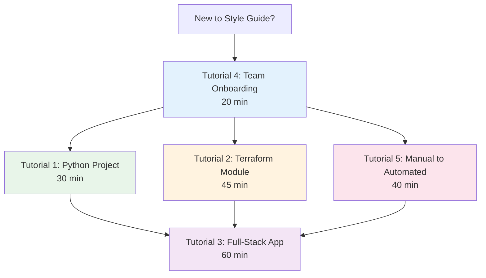

<!-- markdownlint-disable MD013 -->

## Overview

This tutorial series provides hands-on, step-by-step walkthroughs for the most common real-world
scenarios you will encounter when adopting the DevOps Engineering Style Guide. Each tutorial builds a
complete, working example from scratch.

---

## Tutorial Map



---

## Tutorials

| # | Tutorial | Time | Difficulty | Languages |
|---|----------|------|------------|-----------|
| 1 | [Zero to Validated Python Project](python_project.md) | 30 min | Beginner | Python, YAML |
| 2 | [Migrating Existing Terraform Module](terraform_migration.md) | 45 min | Intermediate | Terraform, HCL, Go |
| 3 | [Full-Stack App with Multiple Languages](fullstack_app.md) | 60 min | Advanced | Python, TypeScript, Terraform |
| 4 | [Team Onboarding](team_onboarding.md) | 20 min | Beginner | All |
| 5 | [From Manual to Automated](manual_to_automated.md) | 40 min | Intermediate | Bash, YAML, Python |

---

## Prerequisites

All tutorials assume the following baseline tools are installed:

```bash
# Verify prerequisites
python3 --version   # Python 3.10+
git --version       # Git 2.30+
docker --version    # Docker 20.10+
code --version      # VS Code (recommended)
```

```bash
# Install uv (Python package manager)
curl -LsSf https://astral.sh/uv/install.sh | sh

# Install pre-commit
pip install pre-commit

# Install terraform (for tutorials 2 and 3)
# macOS
brew install terraform

# Linux
sudo apt-get install -y terraform
```

Additional prerequisites are listed at the start of each tutorial.

---

## How to Use These Tutorials

Each tutorial follows a consistent format:

```text
Tutorial Structure
==================
1. Prerequisites          - Tools and knowledge required
2. What You Will Build    - End-state description
3. Step-by-Step Guide     - Numbered, sequential instructions
4. Checkpoints            - Verification steps after each section
5. Common Troubleshooting - Solutions for frequent issues
6. Next Steps             - Where to go after completing
```

**Checkpoints** appear throughout each tutorial as verification steps:

```bash
# Example checkpoint - verify your project structure
ls -la
# Expected output:
# .pre-commit-config.yaml
# pyproject.toml
# src/
# tests/
```

**Troubleshooting** sections address the most common issues:

```text
Problem: pre-commit hooks fail on first run
Solution: Run `pre-commit install --install-hooks` to download hook environments
```

---

## Recommended Learning Paths

### Path 1: Python Developer

```text
Tutorial 4 (Team Onboarding)
    └── Tutorial 1 (Python Project)
        └── Tutorial 5 (Manual to Automated)
            └── Tutorial 3 (Full-Stack App)
```

### Path 2: Infrastructure Engineer

```text
Tutorial 4 (Team Onboarding)
    └── Tutorial 2 (Terraform Module)
        └── Tutorial 5 (Manual to Automated)
            └── Tutorial 3 (Full-Stack App)
```

### Path 3: Team Lead / Manager

```text
Tutorial 4 (Team Onboarding)
    └── Tutorial 5 (Manual to Automated)
```

### Path 4: Full-Stack Developer

```text
Tutorial 4 (Team Onboarding)
    └── Tutorial 1 (Python Project)
        └── Tutorial 2 (Terraform Module)
            └── Tutorial 3 (Full-Stack App)
```
